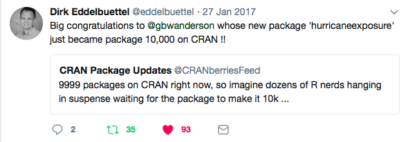

---
output:
  html_document: default
  pdf_document: default
---
# The R Programming Environment {#rprog1}

```{r ch2-pkgs, echo=FALSE}
library(knitr)
library(bookdown)
library(rmarkdown)
```

## Ch. 2 Objectives

This chapter is designed around the following learning objectives. Upon
completing this chapter, you should be able to:  

- Define free and open source software and list some of its advantages over proprietary software
- Recognize the difference between R and RStudio
- Describe the differences between base R code that you initially download and
"package" code that you use to expand base R
- Use RStudio to download and install a package from the Comprehensive R Archive Network (CRAN) to your computer
- Use RStudio to load a package that you have installed within an R session
- Demonstrate how to access help documentation including vignettes and helpfiles for a package and its functions
- Demonstrate how to submit R expressions at the console
- Define the general syntax for calling a function and for specifying both required and optional arguments for that function
- Describe what an R object is and how to assign an R object a name to reference it in later code
- Describe how to create vector objects of numeric and character classes
- Describe how to explore and extract elements from vector objects
- Describe how to create dataframe objects
- Describe how to explore and extract elements from dataframe objects
- Compare the key differences between running R code from the console versus writing and running R code in an R script

## R and R Studio

### What is R?

R in an open-source programming language that evolved from the S language. The
S language was developed at Bell Labs in the 1970s, which is the same place
(and about the same time) that the C programming language was developed.

R itself was developed in the 1990s-2000s at the University of Auckland. It is
open-source software, freely and openly distributed under the GNU General
Public License (GPL). The base version of R that you download when you install
R on your computer includes the critical code for running R, but you can also
install and run "packages" that people all over the world have developed to
extend R.

With new developments, R is becoming more and more useful for a variety of
programming tasks. It really shines in working with data and doing statistical
analysis. R is currently popular in a number of fields, including statistics,
machine learning, and data analysis.

R is an **interpreted language**. That means that you can communicate with it 
interactively from a command line. Other common interpreted languages include
Python and Perl.

```{r interpreted-language, echo=FALSE, out.width="600pt", fig.align="center", fig.cap="Broad types of software programs. R is an interpreted language. 'Point-and-click' programs, like Excel and Word, are often easiest for a new user to get started with, but are slower for the computer and are restricted in the functionality they offer. By contrast, compiled languages (like C and Java), assembly languages, and machine code are faster for the computer and allow you to create a wider range of things, but can take longer to code and take longer for a new user to learn to work with."}

```

Compared to Python, R has some of the same strengths (e.g., quick and easy to
code, interfaces well with other languages, easy to work interactively) and
weaknesses (e.g., slower than compiled languages). For data-related tasks, R
and Python are fairly neck-and-neck, with Julia an up-and-coming option.
Nonetheless, R is still the first choice of statisticians in most fields, so I
would argue that R has a an advantage, if you want to have access to
cutting-edge statistical methods.

> <span style="color: blue;"> "The best thing about R is that it was developed by statisticians. The worst thing about R is that...it was developed by statisticians." -- Bo Cowgill, Google, at the Bay Area R Users Group </span>

### Free and open-source software

> <span style="color: blue;"> "Life is too short to run proprietary software." -- Bdale Garbee </span>

R is **free and open-source software**. Conversely, many other popular
statistical programming languages such as SAS and SPSS are proprietary. It's
useful to know what it means for software to be "open-source", both
conceptually and in terms of how you will be able to use and add to R in your
own work.

R is free, and it's tempting to think of open-source software just as "free
software". It is a little more subtle than that. It helps to consider some
different meanings of the word "free". "Free" can mean:

- *Gratis*: Free as in free beer
- *Libre*: Free as in free speech

```{r open-source-overview, echo=FALSE, out.width="500pt", fig.align="center", fig.cap="An overview of how software can be each type of free (beer and speech). For software programs developed using a compiled programming language, the final product that you open on your computer is run by machine-readable binary code. A developer can give you this code for free (as in beer) without sharing any of the original source code with you. This means you can't dig in to figure out how the software works and how you can extend it. By contrast, open-source software (free as in speech) is software for which you have access to the human-readable code that was used as in input in creating the software binaries. With open-source code, you can figure out exactly how the program is coded."}

```

Open-source software is the *libre* type of free (Figure \@ref(fig:open-source-overview)). This means that, with software that is
open-source, you can:

- Access all of the code that makes up the software
- Change the code as you'd like for your own applications
- Build on the code with your own extensions
- Share the software and its code, as well as your extensions, with others

Often, open-source software is also free, making it "free and open-source
software", or "FOSS".

Popular open source licenses for R and R packages include the GPL and MIT
licenses.

> <span style="color: blue;"> “Making Linux GPL'd was definitely the best thing I ever did.” -- Linus Torvalds </span>

In practice, this means that, once you are familiar with the software, you can
dig deeply into the code to figure out exactly how it's performing certain
tasks. This can be useful for finding and eliminating bugs and can help
researchers figure out if there are any limitations in how the code works
for their specific research.

It also means that you can build your own software on top of existing R
software and its extensions. I explain a bit more about R packages a bit later,
but this open-source nature of R has created a large community of people
worldwide who develop and share extensions to R. As a result, you can pull in
packages that let you do all kinds of things in R, like visualizing Tweets,
cleaning up accelerometer data, analyzing complex surveys, fitting machine
learning models, and a wealth of other cool things.

> <span style="color: blue;"> "Despite its name, open-source software is less vulnerable to hacking than the secret, black box systems like those being used in polling places now. That’s because anyone can see how open-source systems operate. Bugs can be spotted and remedied, deterring those who would attempt attacks. This makes them much more secure than closed-source models like Microsoft’s, which only Microsoft employees can get into to fix." -- [Woolsey and Fox. *To Protect Voting, Use Open-Source Software.* New York Times. August 3, 2017.](https://www.nytimes.com/2017/08/03/opinion/open-source-software-hacker-voting.html?mcubz=3){target="_blank"} </span>

You can download the latest version of R from
[CRAN](https://cran.r-project.org){target="_blank"}. Be sure to select the 
distribution for your
type of computer system. R is updated occasionally; you should plan to
re-install R at least once a year to make sure you're working with one of the
newer versions. Check your current R version (e.g., by running `sessionInfo()`
at the R console) to make sure you're not using an outdated version of R. 

> <span style="color: blue;"> "The R engine ...is pretty well uniformly excellent code but you
have to take my word for that. Actually, you don't. The whole engine is open source so, if you wish, you can check every line of it. If people were out to push dodgy software, this is not the way they'd go about it." -- Bill Venables, R-help (January 2004) </span>

> <span style="color: blue;">  “Talk is cheap. Show me the code.” -- Linus Torvalds </span>

### What is RStudio?

To get the R software, you'll 
[download R](https://www.r-project.org){target="_blank"} from the
R Project for Statistical Computing. This is enough for you to use R on your
own computer. But, for a more user-friendly experience, you should also
download RStudio, an integrated development environment (IDE) for R. It
provides you an interface for using R, with a lot of nice extras like R
Projects that will make your life easier. All of the code chunks shown in this
book were produced using RStudio.

As Chapter 1 outlined, you should download R first, then the RStudio IDE. 

[RStudio, PBC](https://blog.rstudio.com/2020/01/29/rstudio-pbc/){target="_blank"}
is a leader in the R community. Currently, the company:

- Develops and freely provides the RStudio IDE
- Provides excellent resources for learning and using R (e.g., cheat sheets, free online books)
- Is producing some of the popular R packages
- Employs some of the top people in R development
- Is a key member of The R Consortium in addition to others such as Microsoft, IBM, and Google

R has been advancing by leaps and bounds in terms of what it can do and the
elegance with which it does it, in large part because of the enormous
contributions of people involved with RStudio.

## Communicating with R

Because R is an interpreted language, you can communicate with it
interactively. You do this using the following general steps: 

1. Open an **R session**
2. At the **prompt** in the **console**, enter an **R expression**
3. Read R's "response" (i.e., **output**)
4. Repeat 2 and 3
5. Close the R session

### R sessions, console, and command prompt

An **R session** is an "instance" of you using R. To open an R session,
double-click on the icon for the RStudio IDE on you computer. When RStudio
opens, you will be in a "fresh" R session, unless you restore a saved session,
which is not best practice. To avoid saving work sessions, you should change
the defaults in RStudio's Preferences menu, such that RStudio never saves the
workspace to .RData on exit. A "fresh" R session means that, once you open
RStudio, you will need to "set up" your session, including loading packages and
importing data (discussed later).

In RStudio, the screen is divided into several "panes". We'll start with the
pane called "Console". The **console** lets you "talk" to R. This is where you
can "talk" to R by typing an **expression** at the **prompt** (the caret
symbol, ">"). You press the "Return" key to send this message to R.

```{r r-console, echo=FALSE, out.width="500pt", fig.align="center", fig.cap="Finding the 'Console' pane and the command prompt in RStudio."}
knitr::include_graphics("figures/r_console.jpg")
```

Once you press "Return", R will respond in one of three ways:

1. R does whatever you asked it to do with the expression and prints the
output, if any, of doing that, as well as a new prompt so you can ask it
something new.
2. R doesn't think you've finished asking for something, and instead of giving
you a new prompt (">") it gives you a "+". This means that R is still
listening, waiting for you to finish asking it something. 
3. R tries to do what you asked it to, but it can't. It gives you an 
**error message**, as well as a new prompt so you can try again or ask it
something new. 

### R expressions, function calls, and objects

To "talk" with R, you need to know how to give it a complete **expression**. 
Most expressions you'll want to give R will be some combination of two
elements: 

1. **Function calls**
2. **Object assignments**

We'll go through both these pieces and also look at how you can combine them 
together for some expressions.

According to John Chambers, one of the creators of the S language (precursor to
R):

1. Everything that exists in R is an **object**
2. Everything that happens in R is a **call to a function**

In general, function calls in R take the following structure: 

```{r generic-funx, eval=FALSE}
# generic code (this won't run)
function_name(formal_argument_1 = named_argument_1, 
              formal_argument_2 = named_argument_2,
              [etc.])
```

```{block, type="rmdwarning"}
Sometimes, we'll show "generic" code in a code block, that doesn't actually
work if you put it in R, but instead shows the generic structure of an R call.
We'll try to always include a comment with any generic code, so you'll know not
to try to run it in R.
```

A function call forms a complete R expression, and the output will be the
result of running `print()` or `show()` on the object that is output by the
function call. Here is an example of this structure: 

```{r hello-world}
print(x = "Hello, world!")
```

Figure \@ref(fig:function-call) shows an example of the typical elements of a
function call. In this example, we're **calling** a function with the **name**
`print`. It has one **argument**, with a **formal argument** of `x`, which in
this call we've provided the **named argument**: "Hello, world!".

```{r function-call, echo=FALSE, out.width="500pt", fig.align="center", fig.cap="Main parts of a function call. This example is calling a function with the name 'print'. The function call has one argument, with a formal argument of 'x', which in this call is provided the named argument 'Hello world'."}

```

The **arguments** are how you customize the call to an R function. For example,
you can use change the named argument value to print different messages with
the `print()` function. Note that the formal argument never changes.

```{r hello-fc}
print(x = "Hello, world!")
print(x = "Hi, Fort Collins!")
```

Some functions do not require any arguments. For example, the `getRversion()`
function will print out the version of R you are using.

```{r get-r-ver}
getRversion()
```

Some functions will accept multiple arguments. For example, the `print()`
function allows you to specify whether the output should include quotation
marks, using the `quote` formal argument: 

```{r hello-quote}
print(x = "Hello world", quote = TRUE)
print(x = "Hello world", quote = FALSE)
```

Arguments can be **required** or **optional**. 

For a required argument, if you don't provide a value for the argument when you
call the function, R will respond with an error. For example, `x` is a
**required argument** for the `print()` function, so if you try to call the
function without it, you'll get an error: 

```{r hello4, eval=FALSE}
print()
```

```
Error in print.default() : argument "x" is 
  missing, with no default
```

For an **optional argument** on the other hand, R knows a **default value** for
that argument, so if you don't give it a value for that argument, it will just
use the default value provided by the R developer who wrote the function. 

For example, for the `print()` function, the `quote` argument has the default
value `TRUE`. So if you don't specify a value for that argument, R will assume
it should use `quote = TRUE`. That's why the following two calls give the same
result: 

```{r hello-comp}
print(x = "Hello, world!", quote = TRUE)
print(x = "Hello, world!")
```

Often, you'll want to find out more about a function, including:

- Examples of how to use the function
- Which arguments you can include for the function
- Which arguments are required versus optional
- What the default values are for optional arguments 

You can find out all this information in the function's **helpfile**, which you
can access using the function `?`. For example, the `mean()` function will let
you calculate the mean (average) of a group of numbers. To find out more about
this function, at the console type:

```{r mean, eval=FALSE}
?mean
```

This will open a helpfile in the "Help" pane in RStudio. Figure \@ref(fig:helpfile) shows some of the key elements of an example helpfile, the
helpfile for the `mean()` function. In particular, the "Usage" section helps
you figure out which arguments are **required** and which are **optional** in
the Usage section of the helpfile.

```{r helpfile, echo=FALSE, out.width="700pt", fig.align="center", fig.cap="Navigating a helpfile. This example shows some key parts of the helpfile for the 'mean' function."}
knitr::include_graphics("figures/helpfile_arguments.jpg")
```

There's one class of functions that looks a bit different from others. These
are the infix **operator** functions. Instead using parentheses after the
function name, they usually go *between* two arguments. One common example is
the `+` operator:

```{r add}
2 + 3
```

There are operators for several mathematical functions: `+`, `-`, `*`, `/`.
There are also other operators, including **logical operators** and
**assignment operators**, which we'll cover later.

In R, a variety of different types and structures of data can be saved in
**objects**. For right now, you can just think of an R object as a discrete
container of data in R.

Function calls will produce an object. If you just call a function, as we've
been doing, then R will respond by printing out that object. But, we often want
to use that object more. For example, we might want to use it as an argument
later in our "conversation" with R, when we call another function later. If you
want to re-use the results of a function call later, you can **assign** that
**object** to an **object name**. This kind of expression is called an
**assignment expression**.

Once you do this, you can use that *object name* to refer to the object. This
means that you don't need to re-create the object each time you need
it---instead, you can create it once, and then just reference it by name each
time you need it after that. For example, you can read in data from an external
file as a dataframe object and assign it an object name. Then, when you need
that data later, you won't need to read it in again from the external file.

The **"gets arrow"** (`<-`) is R's assignment operator. It takes whatever
you've created on the right hand side of the `<-` and saves it as an object
with the name you put on the left hand side of the `<-`:

```{r generic-obj, eval=FALSE}
# generic code-- this will not work
[object name] <- [object]
```

For example, if I just type `"Hello, world!"`, R will print it back to me, but
it won't save it anywhere for me to use later:

```{r hello-world-2}
"Hello, world!"
```

If I assign it to an object, I can "refer" to that object in a later
expression. For example, the code below assigns the **object** 
`"Hello, world!"` the **object name** `message`. Later, I can just refer to
this object using the name `message`, for example in a function call to the
`print()` function:

```{r hello-print}
message <- "Hello, world!"
print(x = message)
```

When you enter an **assignment expression** like this at the R console, if
everything goes right, then R will "respond" by giving you a new prompt,
without any kind of message. There are three ways you can check to make sure
that the object was successfully assigned to the object name: 

1. Enter the object's name at the prompt and press return. The default if you
do this is for R to "respond" by calling the `print()` function with that
object as the `x` argument.
2. Call the `ls()` function, which doesn't require any arguments. This will
list all the object names that have been assigned in the current R session.
3. Look in the "Environment" pane in RStudio. This also lists all the object
names that have been assigned in the current R session.

Here are examples of these strategies:

1. Enter the object's name at the prompt and press return:

```{r hello-call}
message
```

2. Call the `ls()` function:

```{r hello-ls}
ls()
```

3. Look in the "Environment" pane in RStudio (see Figure \@ref(fig:environment)).

```{r environment, echo=FALSE, out.width="500pt", fig.align="center", fig.cap="'Environment' pane in RStudio. This shows the names and first few values of all objects that have been assigned to object names in the global environment."}
knitr::include_graphics("figures/environment_pane.jpg")
```

You can make assignments in R using either the "gets arrow" (`<-`) or `=`. When
you read other people's code, you'll see both. R gurus advise using `<-` rather
than `=` when coding in R, because as you move to doing more complex things,
some subtle problems might crop up if you use `=`. You can tell the age of a
programmer by whether he or she uses the "gets arrow" or `=`, with `=` more
common among the young and hip. For this course, however, I am asking you to
code according to 
[Hadley Wickham's R style guide](http://adv-r.had.co.nz/Style.html){target="_blank"},
which specifies using the "gets
arrow" for object assignment.

While the "gets arrow" takes two key strokes, you can somewhat get around this
limitation by using RStudio's keyboard shortcut for the "gets arrow". This
shortcut is Alt + - on Windows and Option + - on Macs. To see a full list of
RStudio keyboard shortcuts, go to the "Help" tab in RStudio and select
"Keyboard Shortcuts".

There are some absolute **rules** for the names you can use for an object name:

- Use only letters, numbers, and underscores 
- Don't start with anything but a letter

If you try to assign an object to a name that doesn't follow the "hard" rules,
you'll get an error. For example, all of these expressions will give you an
error:

```{r hello-mess, eval=FALSE}
1message <- "Hello world"
_message <- "Hello world"
message! <- "Hello world"
```

In addition to these fixed rules, there are also some guidelines for naming
objects that you should adopt now, since they will make your life easier as you
advance to writing more complex code in R. The following three guidelines for
naming objects are from [Hadley Wickham's R style guide](http://adv-r.had.co.nz/Style.html){target="_blank"}:

- Use lower case for variable names (`message`, not `Message`)
- Use an underscore as a separator (`message_one`, not `messageOne`)
- Avoid using names that are already defined in R (e.g., don't name an object
`mean`, because a `mean()` function exists)

> <span style="color: blue;"> "Don't call your matrix 'matrix'. Would you call your dog 'dog'? Anyway, it
might clash with the function 'matrix'." -- Barry Rowlingson, R-help (October 2004) </span>

Another good practice is to name objects after nouns (e.g., `message`) and
later, when you start writing functions, name those after verbs (e.g.,
`print_message`). You'll want your object names to be short enough that they
don't take forever to type as you're coding, but not so short that you can't
remember to what they refer.

```{block, type="rmdtip"}
Sometimes, you'll want to create an object that you won't want to keep for very
long. For example, you might want to create a small object to test some code,
but you plan to not need the object again once you've done that. You may want
to come up with some short, generic object names that you use for these kinds
of objects, so that you'll know that you can delete them without problems when
you want to clean up your R session.

There are all kinds of traditions for these placeholder variable names in
computer science. `foo` and `bar` are two popular choices, as are, evidently,
`xyzzy`, `spam`, `ham`, and `norf`. There are different placeholder names in
different languages: for example, `toto`, `truc`, and `azerty` (French); and
`pippo`, `pluto`, `paperino` (Disney character names in Italian). See the
Wikipedia page on [metasyntactic
variables](https://en.wikipedia.org/wiki/Metasyntactic_variable) to find out
more.
```

What if you want to "compose" a call from more than one function call? One way
to do it is to assign the output from the first function call to a name and
then use that name for the next call. For example:

```{r hello-paste}
message <- paste("Hello", "world")
print(x = message)
```

If you give two objects the same name, the most recent definition will be used;
objects can be overwritten by assigning new content to the same object name.
For example: 

```{r names}
a <- 1:10
b <- LETTERS [1:3]
a
b
a <- b
a
```

To create an R expression you can "nest" one function call inside another
function call. For example:

```{r hello-print-paste}
print(x = paste("Hello", "world"))
```

Just like with math, the order that the functions are evaluated moves from the
inner set of parentheses to the outer one (Figure \@ref(fig:composing-functions)). There's one more way we'll look at later
called "piping".

```{r composing-functions, echo=FALSE, out.width="500pt", fig.align="center", fig.cap="'Environment' pane in RStudio. This shows the names and first few values of all objects that have been assigned to object names in the global environment."}
knitr::include_graphics("figures/composing_function_calls.jpg")
```

## R scripts

This is a good point in learning R for you to start putting your code in R
scripts, rather than entering commands at the console.

An R script is a plain text file where you can save a series of R commands. You
can save the script and open it up later to see or re-do what you did earlier,
just like you could with something like a Word document when you're writing a
paper.

To open a new R script in RStudio, go to the menu bar and select "File" -> "New
File" -> "R Script". Alternatively, you can use the keyboard shortcut
Command-Shift-N. Figure \@ref(fig:rscript) gives an example of an R script file
opened in RStudio and points out some interesting elements.

```{r rscript, echo=FALSE, fig.align="center", fig.cap="Example of an R script in RStudio.", out.width="600pt"}
knitr::include_graphics("figures/ExampleOfRScript.jpg")
```

To save a script you're working on, you can click on the "Save" button, which
looks like a floppy disk, at the top of your R script window in RStudio or use
the keyboard shortcut Command-S. You should save R scripts using a ".R" file
extension.

Within the R script, you'll usually want to type your code so there's one
command per line. If your command runs long, you can write a single call over
multiple lines. It's unusual to put more than one command on a single line of a
script file, but you can if you separate the commands with semicolons (`;`).
These rules all correspond to how you can enter commands at the console.

Running R code from a script file is very easy in RStudio. You can use either
the "Run" button or Command-Return, and any code that is selected (i.e., that
you've highlighted with your cursor) will run at the console. You can use this
functionality to run a single line of code, multiple lines of code, or even
just part of a specific line of code. If no code is highlighted, then R will
instead run all the code on the line with the cursor and then move the cursor
down to the next line in the script.

You can also run all of the code in a script. To do this, use the "Source"
button at the top of the script window. You can also run the entire script
either from the console or from within another script by using the `source()`
function, with the filename of the script you want to run as the argument. For
example, to run all of the code in a file named "MyFile.R" that is saved in
your current working directory, run:

```{r source, eval=FALSE}
source("MyFile.R")
```

While it's generally best to write your R code in a script and run it from
there rather than entering it interactively at the R console, there are some
exceptions. A main example is when you're initially checking out a dataset to
make sure you've imported it correctly. It often makes more sense to run
commands for this task, like `str()`, `head()`, `tail()`, and `summary()`, at
the console. These are all examples of commands where you're trying to look at
something about your data **right now**, rather than code that builds toward
your analysis, or helps you import or wrangle your data.

### Commenting code

Sometimes, you'll want to include notes in your code. You can do this in all
programming languages by using a *comment character* to start the line with
your comment. In R, the comment character is the hash symbol, `#`. You can add
comments into an R script to let others know (and remind yourself) what you're
doing and why. Any line on a script line that starts with `#` will not be read
by R. You can also take advantage of commenting to comment out certain parts of
code that you don't want to run at the moment. But, make sure to finalize your
R scripts with *only functional code and useful comments.* R will skip any line
that starts with `#` in a script. For example, if you run the following code:

`# Don't print this.`

`"But print this"`

R will only print the second, uncommented line. 

You can also use a comment in the middle of a line, to add a note on what
you're doing in that line of the code. R will skip any part of the code from
the hash symbol on. For example:

```{r comment}
"Print this" # But not this, it's a comment.
```

There's usually no reason to use code comments when running commands at the R
console; however, it's very important to get in the practice of including
meaningful comments in R scripts. This helps you remember what you did when you
revisit your code later.

> <span style="color: blue;"> “You know you're brilliant, but maybe you'd like to understand what you did 2 weeks from now.” -- Linus Torvalds </span>

## The "package" system

### R packages

> <span style="color: blue;"> "Any doubts about R's big-league status should be put to rest, now that we have a Sudoku Puzzle Solver. Take that, SAS!" -- David Brahm (announcing the `sudoku` package), R-packages (January 2006) </span>

Your original download of R is only a starting point. You can expand
functionality of R with what are called *packages*, or extensions with new code
and functionality that add to the basic "base R" environment. To me, this is a
bit like this toy train set. You first buy a very basic set that looks
something like Figure \@ref(fig:toy-train-basic).

```{r toy-train-basic, echo=FALSE, out.width="400pt", fig.align="center", fig.cap="The toy version of base R."}

```

To take full advantage of R, you'll want to add on packages. In the case of the
train set, at this point, a doting grandparent adds on extensively through
birthday presents, so you end up with something that looks like Figure \@ref(fig:toy-train-fancy).

```{r toy-train-fancy, echo=FALSE, out.width="400pt", fig.align="center", fig.cap="The toy version of what your R set-up will look like once you find cool packages to use for your research."}
knitr::include_graphics("figures/TrainComplex.JPG")
```

Each package is basically a bundle of extra R functions. They may also include
help documentation, datasets, and some other objects, but typically the heart
of an R package is the new functions it provides.

You can get these "add-on" packages in a number of ways. The main source for
installing packages for R remains the Comprehensive R Archive Network, or
[CRAN](https://cran.r-project.org){target="_blank"}. 
However, [GitHub](https://github.com){target="_blank"} is
growing in popularity, especially for packages that are still in active
development. You can also create and share packages among your collaborators or
co-workers, without ever posting them publicly. 

### Installing from CRAN

```{r cran10000, echo=FALSE, out.width="600pt", fig.align="center", fig.cap="Celebrating CRAN's 10,000th package, which was developed by Dr. Brooke Anderson."}

```

The most popular place from which to download packages is currently CRAN, which
has over 10,000 R packages available (Figure \@ref(fig:cran10000)). You can
install packages from CRAN using R code, with the `install.packages()`
function. For example, telephone keypads include letters for each number
(Figure \@ref(fig:phone-keypad)), which allow companies to have "named" phone
numbers that are easier for people to remember, like 1-800-GO-FEDEX and
1-800-FLOWERS.

```{r phone-keypad, echo=FALSE, out.width="150pt", fig.align="center", fig.cap="Telephone keypad with letters corresponding to each number."}
knitr::include_graphics("figures/telephone_keypad.png")
```

The `phonenumber` package is a cool little package that will convert between
numbers and letters based on the telephone keypad. Since this package is on
CRAN, you can install the package to your computer using the
`install.packages()` function:

```{r phone-install, eval=FALSE, messages=FALSE, warnings=FALSE, results=FALSE}
install.packages(pkgs = "phonenumber")
```

This downloads the package from CRAN and saves it in a special location on your
computer where R can load it when you're ready to use it. Once you've installed
a package to your computer this way, you don't need to re-run this
`install.packages()` for the package ever again, unless the package maintainer
posts an updated version.

Just like R itself, packages often evolve and are updated by their maintainers.
You should update your packages as new versions come out. Typically, you have
to reinstall packages when you update your version of R, so this is a good
chance to get the most up-to-date version of the packages you use.

### Loading an installed package

Once you have installed a package, it will be saved to your computer. But, you
won't be able to access its functions within an R session until you *load* it
in that R session. Loading a package essentially makes all of the package's
functions available to you. 

You can load a package in an R session using the `library()` function, with the
package name inside the parentheses.

```{r phone-load, messages=FALSE, warnings=FALSE, results=FALSE}
library(package = "phonenumber")
```

Figure \@ref(fig:install-vs-load) provides a conceptual picture of the
different steps of installing and loading a package.

```{r install-vs-load, echo=FALSE, out.width="400pt", fig.align="center", fig.cap="Install a package (with `install.packages()`) to get it onto your computer. Load it (with `library()`) to get it into your R session."}
knitr::include_graphics("figures/install_vs_library.jpg")
```

Once a package is loaded, you can use all its exported (i.e., public) functions
by calling them directly. For example, the `phonenumber` package has a function
called `letterToNumber()` that converts a character string to a number. If you
have not loaded the `phonenumber` package in your current R session and try to
use this function, you will get an error. Once you've loaded `phonenumber`
using the `library()` function, you can use this function in your R session:

```{r phone-fedex}
fedex_number <- "GoFedEx"
letterToNumber(value = fedex_number)
```

```{block, type="rmdnote"}
R vectors can have several different *classes*. One common class is the
character class, which is the class of the character string we're using here
("GoFedEx"). You'll always put character strings in quotation marks. Another
key class is numeric (numbers). Later in the course, we'll introduce other
classes that vectors can have, including factors and dates. For the simplest
vector classes, these classes are determined by the type of data that the
vector stores.
```

When you open RStudio, unless you reload the history of a previous R session
(which I strongly **do not** recommend), you will start your work in a "fresh"
R session. This means that, once you open RStudio, you will need to run the
code to load any packages, define any objects, and read in any data that you
will need for analysis in that session.

If you are using a package in academic research, you should cite it, especially
if it implements a nonstandard algorithm or method. You can use the
`citation()` function to get the information you need about how to cite a
package:

```{r phone-cite}
citation(package = "phonenumber")
```

```{block, type="rmdnote"}
We've talked here about loading packages using the `library()` function to
access their functions. This is not the only way to access the package's
functions. The syntax `[package name]::[function name]` will allow you to use a
function from a package you have installed on your computer, even if its
package has not been loaded in the current R session. Typically, this syntax is
not used much in data analysis scripts, in part because it makes the code much
longer. You will occasionally see it in learning contexts to build familiarity
with the package::function connection and in which package a function exists.
It is also used to distinguish between two functions from different packages
that have the same name, as this format makes the desired function unambiguous.
One example where this syntax often is needed is when both `plyr` and `dplyr`
packages are loaded in an R session, since these share functions with the same
name.
```

Packages typically include some documentation to help users. These include: 

- **Package vignettes**: Longer, tutorial-style documents that walk the user through the basics of how to use the package and often give some helpful example cases of the package in use.
- **Function helpfiles**: Files for each user-facing function within the package, following an established structure. These include information about what inputs are required and optional for the function, what output will be created, and what options can be selected by the user. In many cases, these also include examples of using the function.

To determine which vignettes are available for a package, you can use the
`vignette()` function, with the package's name specified for the `package`
option:

```{r phone-vig-pkg, eval=FALSE}
vignette(package = "phonenumber")
```

From the output of this, you can call any of the package's vignettes directly.
For example, the previous call tells you that this package only has one
vignette, and that vignette has the same name as the package ("phonenumber").
Once you know the name of the vignette you would like to open, you can also use
`vignette()` to open it:

```{r phone-vig-topic, eval=FALSE}
vignette(topic = "phonenumber")
```

To access the helpfile for any function within a package you've loaded, you can
use `?` followed by the function's name, but note the lack of `()`:

```{r phone-help, eval=FALSE}
?letterToNumber
```

## R's most basic object types

An R object stores some type of data that you want to use later in your R code,
without fully recreating it. The content of R objects can vary from very simple
(e.g., `"GoFedEx"` string in the example code above) to very complex objects
with lots of elements (e.g., machine learning model).

Objects can be structured in different ways, in terms of how they "hold" data.
These difference structures are called **object classes**. One class of objects
can be a subtype of a more general object class.

There are a variety of different object types in R, shaped to fit different
types of objects, from the simple to complex. In this section, we'll start by
describing two object types that you will use most often in basic data
analysis: **vectors** (one-dimensional objects) and **dataframes**
(two-dimensional objects).

For these two object classes (vectors and dataframes), we'll look at: 

1. How that class is structured
2. How to make a new object with that class
3. How to extract values from objects with that class

### Vectors

To get an initial grasp of the *vector* object type in R, think of it as a
one-dimensional object, or a string of values. Figure \@ref(fig:vector-example)
provides an example of the structure for a very simple vector, one that holds
the names of the three main characters in the *Harry Potter* book series.

```{r vector-example, echo=FALSE, out.width="400pt", fig.align="center", fig.cap="An example of the structure of an R object with the vector class. This object class contains data as a string of values, all with the same data type."}

```

All values in a vector must be of the same data type (i.e., all numbers, all
characters, or all dates). If you try to create a vector with elements from
different types (e.g., vector of "FedEx", which is a character, and 3, a
number), R will coerce all of the elements to the most generic class of the
included elements (e.g., "FedEx" and "3" will both become characters, since "3"
can be changed to a character, but "FedEx" can't be changed to a number).
Figure \@ref(fig:vector-example-classes) gives some examples of different
classes of vectors.

```{r vector-example-classes, echo=FALSE, out.width="400pt", fig.align="center", fig.cap="Examples of vectors of different classes. All the values in a vector must be of the same type (e.g., all numbers or all characters). There are different classes of vectors depending on the type of data they store."}
knitr::include_graphics("figures/vector_class_examples.jpg")
```

To create a vector from different elements, you'll use the `concatenate`
function, `c()` to join them together, with commas between the elements;
*concatenate* is a fancy word that means "to link together". For example, to
create the vector shown in Figure \@ref(fig:vector-example), you 
can run:

```{r hp-char-vec}
c("Harry", "Ron", "Hermione")
```

If you want to use that object later, you can assign it an object name in the
expression: 

```{r hp-main-print}
main_characters <- c("Harry", "Ron", "Hermione")
print(x = main_characters)
```

This **assignment expression**, for assigning a vector an object name, follows
the structure we covered earlier for function calls and assignment expressions
(Figure \@ref(fig:vector-assignment)).

```{r vector-assignment, echo=FALSE, out.width="400pt", fig.align="center", fig.cap="Elements of the assignment expression for creating a vector and assigning it an object name."}
knitr::include_graphics("figures/vector_class_examples.jpg")
```

If you create a numeric vector, you should not put the values in quotation
marks:

```{r kids-num-vec}
n_kids <- c(1, 7, 1)
```

If you mix classes when you create the vector, R will coerce all the elements
to most generic class of the included elements:

```{r mixed-vec}
mixed_classes <- c(1, 3, "five")
mixed_classes
```

Notice that the two integers, 1 and 3, are now in quotation marks because they
were put in a vector with a value with the character data type. You can use the
`class()` function to determine the class of an object: 

```{r mixed-class}
class(x = mixed_classes)
```

A vector's *length* is the number of elements in the vector. You can use the
`length()` function to determine a vector's length:

```{r mixed-length}
length(x = mixed_classes)
```

Once you create an object, you will often want to reference the whole object in
future code. Nonetheless, there will be some times when you'll want to
reference only certain elements of the object. You can pull out certain values
from a vector by using indexing with square brackets (`[...]`) to identify the
locations of the element you want to extract. For example, to extract the
second element of the `main_characters` vector, you can run:

```{r hp-main-sec}
main_characters[2] # Get the second value
```

You can use this same method to extract more than one value. You just need to
create a numeric vector with the position of each element you want to extract
and pass that in the square brackets. For example, to extract the first and
third elements of the `main_characters` vector, you can run:

```{r hp-main-subset}
main_characters[c(1, 3)] # Get first and third values
```

The `:` operator can be very helpful with extracting values from a vector. 
This operator creates a sequence of values from the value before the `:` to the
value after `:`, going by units of 1. For example, if you want to create a list
of the numbers between 1 and 10, you can run: 

```{r num-seq}
1:10
```

If you want to extract the first two values from the `main_characters` vector,
you can use the `:` operator: 

```{r hp-brack}
main_characters[1:2] # Get the first two values
```

You can also use logic to pull out some values of a vector. For example, you
might only want to pull out even values from the `fibonacci` vector. 

```{block, type='rmdtip'}
One thing that people often find confusing when they start using R is knowing
when to use and not use quotation marks. The general rule is that you use
quotation marks when you want to refer to a character string literally, but no
quotation marks when you want to refer to the value in a previously-defined
object. 

For example, if you saved the string `"Volckens"` as the object `my_name`
(`my_name <- "Volckens"`), then in later code, if you type `my_name` (no
quotation marks), you'll get `"Volckens"`, while if you type out `"my_name"`
(with quotation marks), you'll get `"my_name"` (what you typed). 

One thing that makes this rule confusing is that there are a few cases in R
where you really should, following this rule, use quotation marks, but the
function is coded to let you be lazy and get away without them. One example is
the `library()` function. In the code earlier in this section to load the
"phonenumber" package, you want to load the package "phonenumber" (with
quotation marks), rather than load whatever character string is saved in the
object named `phonenumber`. But, `library()` is one of the functions where you
can be lazy and skip the quotation marks, and it will still load the package.
Therefore, this function works if you do or do not use quotation marks around
the package name. 
```

### Dataframes

A dataframe is a two-dimensional object made of one or more vectors of the same
length stuck together side-by-side. It is the closest R has to an Excel
spreadsheet-type structure. Figure \@ref(fig:example-dataframe) gives a
conceptual example of a dataframe created from several of the vector examples
in Figure \@ref(fig:vector-example-classes).

```{r example-dataframe, echo=FALSE, out.width="400pt", fig.align="center", fig.cap="An example dataframe created from several vectors of the same length and with observations aligned across vector positions. For example, the first value in each vector provides a value for Harry, the second for Ron."}
knitr::include_graphics("figures/example_dataframe.jpg")
```

Here's how the dataframe in Figure \@ref(fig:example-dataframe) will look in R:

```{r hp-tibble-build, echo=FALSE, message=FALSE, results=TRUE}
library(package = "tibble")
hp_data <- tibble(first_name = c("Harry", "Ron", "Hermione"),
                  last_name = c("Potter", "Weasley", "Granger"),
                  n_kids = c(1, 7, 1),
                  survived = c(TRUE, TRUE, TRUE))
hp_data
```

This dataframe is arranged in rows and columns, with names for each column
(Figure \@ref(fig:annotated-dataframe)). Note that each row of this dataframe
gives a different observation. In this case, our unit of observation is a Harry
Potter character. Each column gives a different type of information, including
first name, last name, birth year, and whether they're still alive for each of
the observations (i.e., book characters). Notice that the number of elements in
each of the columns must be the same in this dataframe, but that the different
columns can have different classes of data (e.g., character vectors for
`first_name` and `last_name`; logical value of TRUE or FALSE for `alive`).

```{r annotated-dataframe, echo=FALSE, out.width="400pt", fig.align="center", fig.cap="The elements of a dataframe: columns, rows, and column names."}
knitr::include_graphics("figures/example_dataframe_labeled.jpg")
```

We will be working with a specific class of dataframe called a **tibble**. You
can create tibble dataframes using the `tibble()` function from the `tibble`
package. Most often you will create a dataframe by reading in data from a file,
using something like `read_csv()` from the `readr` package.

```{block, type="rmdnote"}
There are base R functions for both of these tasks (i.e., `data.frame()` and
`read.csv()`, respectively), eliminating the need to load additional packages
with a `library()` call. The series of packages that make up what's called the
"tidyverse" have brought a huge improvement in the ease and speed of working
with data in R. We will be teaching these tools in this course, and that's why
we're going directly to `tibble()` and `read_csv()` from the start, rather than
base R equivalents. Later in the course, we'll talk more about this "tidyverse"
and what makes it so great.
```

To create a dataframe, you can use the `tibble()` function from the `tibble`
package. The general format for using `tibble()` is:

```{r generic-tibble, eval=FALSE}
## generic code; will not run
[name of object] <- tibble([1st column name] = [1st column content],
                           [2nd column name] = [2nd column content])
```

with an equals sign between the column name and column content for each column,
and commas between each of the columns. Here is an example of the code used to
create the *Harry Potter* `tibble` dataframe shown above:

```{r hp-tibble}
library(package = "tibble")
hp_data <- tibble(first_name = c("Harry", "Ron", "Hermione"),
                  last_name = c("Potter", "Weasley", "Granger"),
                  n_kids = c(1, 7, 1),
                  survived = c(TRUE, TRUE, TRUE))
hp_data
```

You can also create a dataframe by sticking together vectors you already have
saved as R objects. For example:

```{r hp-tibble-vec}
hp_data <- tibble(first_name = main_characters,
                  last_name = c("Potter", "Weasley", "Granger"),
                  n_kids = n_kids,
                  survived = c(TRUE, TRUE, TRUE))
hp_data
```

Note that this call requires the `main_characters` and `n_kids` vectors to be
the same *length*. They don't have to be, and, in this case, are not, the same
*class* of objects. Specifically, `main_characters` is a character class, and
`n_kids` is numeric.

```{block, type="rmdnote"}
You can put more than one function call in a single line of R code, as in this
example. The `c()` creates a vector, while the `tibble()` creates a dataframe,
using the vectors created by the calls to `c()`. When you use multiple
functions within a single R call, R will evaluate starting from the inner-most
parentheses outward, much like the order of mathematical operations.
```

So far, we've only seen how to create dataframes from scratch within an R
session. Usually, however, you'll create R dataframes by reading in data from
an outside file using the `read_csv()` from the `readr` package or other
related functions. For example, you might want to analyze data on all the
guests that came on the *Daily Show*, *circa* Jon Stewart. If you have this
data in a comma-separated (csv) file on your computer called
"daily_show_guests.csv", you can read it into your R session with the following
code:

```{r read-daily-true, echo=FALSE, message=FALSE}
library(package = "readr")
daily_show <- read_csv(file = "data/daily_show_guests.csv",
                       skip = 4)
```

```{r read-daily-echo, eval=FALSE}
library(package = "readr")
daily_show <- read_csv(file = "daily_show_guests.csv",
                       skip = 4)
```

In this code, the `read_csv()` function is reading in the data from the file
"daily_show_guests.csv", while the "gets arrow" (`<-`) assigns that data to the
object `daily_show`, which you can then reference in later code to explore and
plot the data.

You can use the functions `dim()`, `nrow()`, and `ncol()` to figure out the
dimensions (i.e., number of rows and columns) of a dataframe:

```{r daily-dims}
dim(x = daily_show)
nrow(x = daily_show)
ncol(x = daily_show)
```

Base R also has some useful functions for quickly exploring dataframes:

- `str()`: Show the structure of an R object, including a dataframe
- `summary()`: Give summaries of each column of a dataframe.

For example, you can explore the data we just pulled in on the *Daily Show* 
with: 

```{r daily-str-sum}
str(object = daily_show)
summary(object = daily_show)
```

To extract data from a dataframe, you can use some functions from the `dplyr`
package, including `select()` and `slice()`. The `select()` function will pull
out columns, while the `slice()` function will extract rows. In this chapter,
we'll talk about  how to extract certain rows or columns of a dataframe by
their *position* (i.e., based on row or column number). For example, if you
wanted to get the first two rows of the `hp_data` dataframe, you could run:

```{r hp-slice, message=FALSE, warning=FALSE}
library(package = "dplyr")
slice(.data = hp_data, c(1:2))
```

If you wanted to get the first and fourth columns, you could run: 

```{r hp-select}
select(.data = hp_data, c(1, 4))
```

You can compose calls from both functions. For example, you could extract the
values in the first and fourth columns of the first two rows with: 

```{r hp-select-slice}
select(.data = slice(.data = hp_data, c(1:2)), c(1, 4))
```

You can use square-bracket indexing (`[..., ...]`) for dataframes, too, but you
will need to manage two dimensions: rows and columns. Put the rows you want
before the comma and the columns after; if you want all rows or all columns,
leave the corresponding spot blank. Here are two examples of using
square-bracket indexing to pull a subset of the `hp_data` dataframe:

```{r hp-brackets}
hp_data[1:2, 2] # First two rows, second column
hp_data[3, ] # Last row, all columns
```

```{block type="rmdnote"}
If you forget to put the comma in the indexing for a dataframe (e.g.,
`fibonacci_seq[1:2]`), you will index out the *columns* that fall at that
position or positions. To avoid confusion, I suggest that you always use
indexing with a comma when working with dataframes. 
```

## Chapter 2 Exercises

### Set 1: Session, helpfiles, scripts, and objects

0. Within your R project for this course, open a "fresh" R session (Session > Restart R, if RStudio is already open). Using `getwd()` in the console, confirm the working directory is your R project.

1. Type `sessionInfo()` into the console. What R version are you using? What base R packages were loaded automatically in your R session?

2. Still in the console and using `?`, open and examine the helpfile for one of the base R packages named above. Use the function listed in the "Details" section of the helpfile to call the full package documentation, including a list of functions. Call and examine the helpfile for one of these functions.

3. Go to File > New File > R Script to open a new R script. Add your name to the top of the R script as a comment. Call `mtcars` (dataset about cars in base R) in the console. Then, using the `gets arrow`, save `mtcars` as an object named `mtcars_data` in your R script. Saving the relevant commands in the R script, examine the structure of `mtcars_data` and determine its dimensions and variable class types (e.g., numeric, logical). Save your R script with an informative file name (e.g., "class-activity-DATE") in the `/code` folder of your R project and commit your changes to GitHub with a meaningful commit message and push the changes.

#### Example Code

0. Working directory

```{r, eval=FALSE}
# confirm working directory is in high-level folder of R project
base::getwd()
```

1. Session information 

```{r, eval=FALSE}
# identify R version and base R packages
utils::sessionInfo()
```

2. Helpfiles

```{r, eval=FALSE}
# call main helpfile for whole base R package
?stats
# use function from Details section to call list of functions
base::library(help = "stats")
# call helpfile for one function
?lm
```

3. Object assignment

```{r, eval=FALSE}
# load and view mtcars data
mtcars
# assign data as object in environment
mtcars_data <- mtcars
# view structure of mtcars_data
str(mtcars_data)
# a tidyverse alternative to `str()` 
## extra: https://stackoverflow.com/questions/23660094/whats-the-difference-between-integer-class-and-numeric-class-in-r
tibble::glimpse(mtcars_data)
# assess dimensions of mtcars_data
dim(mtcars_data)
# determine variable class types (by individual variable)
class(mtcars_data$mpg)
```

There are 32 observations (vehicle models) and 11 variables, all of which are 
numeric.

### Set 2: Loading and using packages

4. Reopen the R script from the above set of exercises. Install `dplyr`, a popular R package for data wrangling, from your console. In your R script, load `dplyr`. Using `dplyr::filter()`, determine the number of cars in `mtcars_data` with an average miles per gallon (`mpg`) above 25. Save the R script and commit the changes to GitHub with a meaningful commit message; push the changes.

5. Navigate to the "Tutorial" tab in your environment panel. Complete the "Data Basics" tutorial via `learnr`.

#### Example Code

4. Data wrangling

```{r, eval=FALSE}
# install.packages("dplyr") if needed in the console
# load `dplyr`, saving the command in your R script
library(dplyr)
# filter to vehicles with mpg above 25
dplyr::filter(mtcars_data, mpg > 25.0)
```

There are six vehicles in `mtcars_data` with MPG above 25.

## Chapter 2 Homework

During the next few class periods and for homework, you will complete ten
lessons in [`swirl`](https://swirlstats.com/){target="_blank"}, an R package for learning R
**in** R, written by Roger Peng, Brooke Anderson, and Sean Kross. Each lesson
might take 10-15 minutes.

In a text file, record the lesson names and a very brief description of what
you learned from each. Save this file in your local R Project in the 
appropriate directory (e.g., `/homework`) and commit/push the file with regular
updates to your private GitHub repository. 

Follow the steps [here](https://swirlstats.com/students.html){target="_blank"}
to install, load,
and start `swirl`. When you are prompted to install a course, you can load "R
Programming," which covers material related to the recent class lectures. If
you are already familiar with this content, feel free to select a different
course such as "Exploratory Data Analysis."

Please complete the following `swirl` lessons: 

- Module 1: Basic Building Blocks
- Module 2: Workspace and Files
- Module 3: Sequences of Numbers
- Module 4: Vectors
- Module 5: Missing Values
- Module 6: Subsetting Vectors
- Module 7: Matrices and Data Frames
- Module 8: Logic
- Module 9: Functions
- Module 12: Looking at Data

`swirl` lessons have a mix of base R and `tidyverse` approaches, so don't be 
alarmed or discouraged if you see some unfamiliar techniques or concepts. If
you are interested in learning more about something from `swirl`, Google is a
great place to start. We will cover a lot of the material later in the class.

### Special `swirl` commands

In the `swirl` environment, knowing about the following commands will be
helpful:

- The prompt `...` indicates you should press enter to continue in the lesson.
- `skip()`: skip current question
- `play()`: temporarily exit `swirl`
- `nxt()`: return to `swirl` after `play()`ing around in the console
- `main()`: return to `swirl`'s main menu
- `bye()` or "escape" key: exit `swirl`
