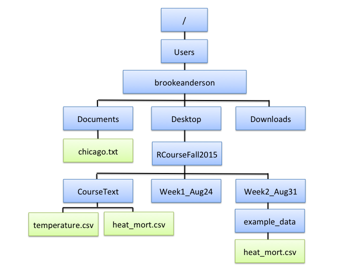
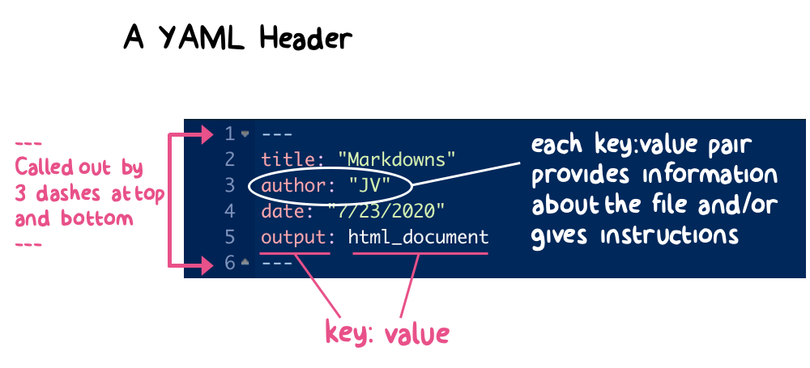
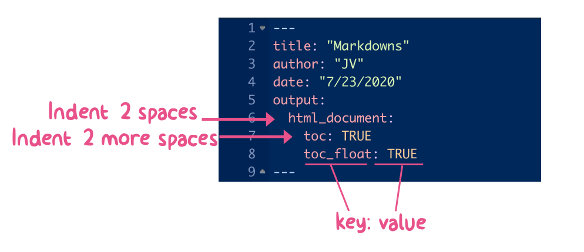
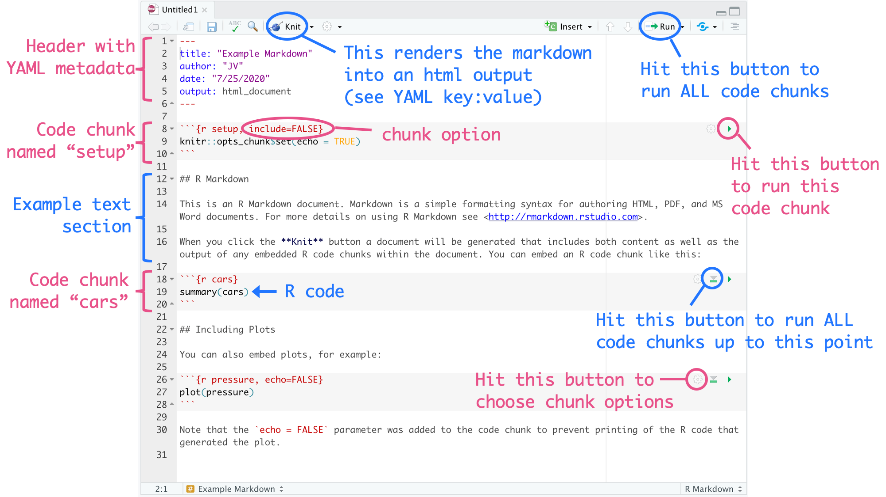
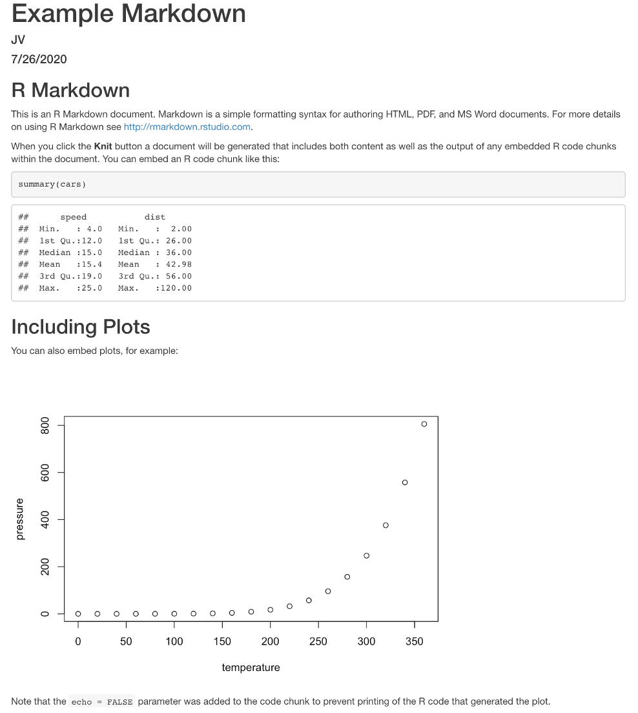

# Getting and Cleaning Data {#rprog2}

``` {r ch3-pkgs, echo=FALSE, message=FALSE}
library(tidyverse)
```

## Ch. 3 Objectives

This chapter is designed around the following learning objectives. Upon
completing this chapter, you should be able to:  

- Recognize what a flat file is and how it differs from data stored in a binary
file format
- Distinguish between delimited and fixed width formats for flat files
- Identify the delimiter in a delimited file
- Describe a working directory
- Demonstrate how to read in different types of flat files
- Demonstrate how to read in a few types of binary files (e.g., Matlab, Excel)
- Recognize the difference between relative and absolute file pathnames
- Describe the basics of your computer's directory structure
- Reference files in different locations in your directory structure using
relative and absolute pathnames
- Apply the basic `dplyr` functions (e.g., `rename()`, `select()`, `mutate()`,
`slice()`, `filter()`, and `arrange()`) to work with data in a dataframe object
- Define a logical operator and know the R syntax for common logical operators
- Apply logical operators in conjunction with `dplyr`'s `filter()` function to
create subsets of a dataframe based on logical conditions 
- Apply a sequence of `dplyr` functions to a dataframe using piping (`%>%`)

## Overview

There are four basic steps you will often repeat as you prepare to analyze data
in R:

1. Identify the location of the data. If it's on your computer, which
directory? If it's online, what's the link?
2. Read data into R (e.g., using a function like `read_delim()` or `read_csv()`
from the `readr` package) using the file path you figured out in step 1
3. Check to make sure the data came in correctly using `dim`, `head`, `tail`,
`str`)
4. Clean the data up 

In this chapter, I'll go over the basics for each of these steps and dive a bit
deeper into some related topics you should learn now to make your life easier
as you get started using R for data analysis.

## Reading data into R

Data comes in files of all shapes and sizes. R has the capability to import
data from many of these, even proprietary files for other software. Here are
some of the types of data files that R can read and work with:

- Flat files (much more about these in just a minute)
- Files from other software packages such as MATLAB or Excel
- Tables on webpages (e.g., the table on Ebola outbreaks near the end of [this
Wikipedia
page](http://en.wikipedia.org/wiki/Ebola_virus_epidemic_in_West_Africa))
- Data in a database (e.g., MySQL, Oracle)
- Data in JSON and XML formats
- Really crazy data formats used in other disciplines (e.g., netCDF files from
climate research, MRI data stored in Analyze, NIfTI, and DICOM formats)
- Geographic shapefiles
- Data through Application Programming Interfaces (APIs; most websites use APIs
to ask you for input and then use that input to direct new information back to
you)

Often, it is possible to import and wrangle extremely messy data by using
functions like `scan()` and `readLines()` to read the data in a line at a time,
and then using regular expressions to clean up the data.

### Reading local flat files

Much of the data that you will want to read in will be in **flat files**.
Basically, these are files that you can open using a text editor. The most
common type you'll work with are probably comma-separated files, often with a
`.csv` or `.txt` file extension. Most flat files come in two general
categories:

1. Fixed width files, and

2. Delimited files, which include: 

- ".csv": Comma-separated values
- ".tab", ".tsv": Tab-separated values
- Other possible delimiters: colon, semicolon, pipe ("|")

*Fixed-width files* are files where a column always has the same width, for all
the rows in the column. These tend to look very neat and easy-to-read when you
open them in a text editor. For example, the first few rows of a fixed-width
file might look like this:

```
Course                            Number          Day          Time
Thermodynamics                    337             M/W/F        9:00-9:50
Aerosol Physics and Technology    577             M/W/F        10:00-10:50
```

Fixed-width files used to be very popular, and they make it easier to look at
data when you open the file in a text editor. Now, it's rare to just use a text
editor to open a file and check out the data. Also, these files can be a bit of
a pain to read into R and other programs because you sometimes have to specify
the length of each column. You may come across a fixed-width file every now and
then, particularly when working with older data, so it's useful to be able to
recognize one and to know how to import it.

*Delimited files* use some **delimiter** such as a comma or tab to separate
each column value within a row. The first few rows of a delimited file might
look like this:

```
Course, Number, Day, Time
"Thermodynamics", 337, "M/W/F", "9:00-9:50"
"Aerosol Physics and Technology", 577, "M/W/F", "10:00-10:50"
```

Delimited files are very easy to read into R. You just need to be able to
figure out what character is used as a delimiter and specify that to R in the
function call to read in the data.

These flat files can have a number of different file extensions. The most
generic is `.txt`, but they will also have ones more specific to their format,
like `.csv` for a comma-delimited file (.csv stands for 
**"comma-separated values"**), or `.fwf` for a fixed-width file.

R can read in data from both fixed-width and delimited flat files. The only
catch is that you need to tell R a bit more about the format of the flat file,
including whether it is fixed-width or delimited. If the file is fixed-width,
you will usually have to tell R the width of each column. If the file is
delimited, you'll need to tell R which delimiter, such as comma or tab, is
being used.

If the file is delimited, you can use the `read_delim()` family of functions
from the `readr` package to import the data. This family of functions includes
several specialized functions. All members of the `read_delim()` family are
doing the same basic thing. The only difference is what defaults each function
has for the delimiter (`delim`). Members of the `read_delim()` family include:

Function        | Delimiter
--------------- | ------------
`read_csv()`    |  comma     
`read_csv2()`   | semi-colon 
`read_table2()` | whitespace
`read_tsv()`    | tab

You can use `read_delim()` to read in any delimited file, regardless of the
delimiter; however, you will need to specify the type of delimiter using the
`delim` argument. If you remember the more specialized function call (e.g.,
`read_csv()` for a comma-delimited file), you can save yourself some typing. 

For example, to read in the Ebola data, which is comma-delimited, you could
either use `read_table()` with a `delim` argument specified or use
`read_csv()`, in which case you don't have to specify `delim`:

```{r ebola-delim, message=FALSE}
library(package = "readr")
# The following two calls do the same thing
ebola <- readr::read_delim(file = "data/country_timeseries.csv", delim = ",")
```

```{r ebola-csv}
ebola <- readr::read_csv(file = "data/country_timeseries.csv")
```

```{block, type='rmdtip'}
The message that R prints after this call ("Parsed with column specification:
... ") lets you know what classes were used for each column. This function
tries to guess the appropriate class and typically gets it right. You can
suppress the message using the `cols_types = cols()` argument, or by adjusting
the code chunk options in an R Markdown. If `readr` doesn't correctly assign
some of the columns classes, you can use the `type_convert()` function for R to
guess again after you've tweaked the formats of the rogue columns.
```

This family of functions has a few other helpful options you can specify. For
example, if you want to skip the first few lines of a file before you start
reading in the data, you can use `skip()` to set the number of lines to skip.
If you only want to read in a few lines of the data, you can use the `n_max()`
option. For example, if you have a really large file, and you want to save time
by only reading in the first ten lines, as you figure out what other optional
arguments to use in `read_delim()` for that file, you could include the option
`n_max = 10`. Here is a table of some of the most useful options common to the
`read_delim()` family of functions: 

Option  | Description
------- | -----------
`skip()`    | How many lines of the start of the file should you skip?
`col_names()`  | What would you like to use as the column names?
`col_types()`   | What would you like to use as the column types?
`n_max()`   | How many rows do you want to read in?
`na()` | How are missing values coded?


```{block, type='rmdnote'}
Remember that you can always find out more about a function by looking at its
help file. For example, check out `?read_delim` and `?read_fwf` (note the lack
of parentheses). You can also use the help files to determine the default
values of arguments for each function.
```

So far, we've only looked at functions from the `readr` package for reading in
data files. There is a similar family of functions available in base R, the
`read.table()` family of functions. The `readr` family of functions is very
similar to the base R `read.table()` functions, but have some more sensible
defaults. Compared to the `read.table()` function family, the `readr`
functions: 

- Faster; show progress bar of data import
- Work better with large datasets
- Have more sensible defaults (e.g., characters default to characters, not
factors)

I recommend that you always use the `readr` functions rather than their base R
alternatives, given these advantages; however, you are likely to come across
code with these base R functions, so it is helpful to be aware of them.
Functions in the `read.table` family include:

- `read.csv()`
- `read.delim()`
- `read.table()` 
- `read.fwf()`

```{block, type='rmdnote'}
The `readr` package is a member of the `tidyverse` suite of R packages. The
*tidyverse* describes an evolving collection of R packages with a common
philosophy and approach, and they are unquestionably changing the way people
code in R. Many of these R packages were developed in part or full by Hadley
Wickham and others at RStudio. Many of these packages are less than ten years
old but have been rapidly adapted by the R community. As a result, newer
examples of R code will often look very different from the code in older R
scripts, including examples in books that are more than a few years old. In
this course, I'll focus on `tidyverse` functions when possible, but I do put in
details about base R equivalent functions or processes at some points. This
will help you interpret older code. You can download all the `tidyverse`
packages at the same time with `install.packages("tidyverse")` and make all the
`tidyverse` functions available for use with`library("tidyverse")`.
```

### Reading in other file types

Later in the course, we'll talk about how to open a variety of other file types
in R. You might find it immediately useful to be able to read in files from
other statistical programs.

There are two "tidyverse" packages, `readxl` and `haven`, that help with this.
They allow you to read in files from the following formats:

```{r read-table, echo=FALSE}
read_funcs <- data.frame(file_type = c("Excel",
                                       "SAS",
                                       "SPSS",
                                       "Stata"),
                         func = c("`read_excel()`",
                                  "`read_sas()`",
                                  "`read_spss()`",
                                  "`read_stata()`"),
                         pkg = c("`readxl`",
                                 "`haven`",
                                 "`haven`",
                                 "`haven`"))
knitr::kable(read_funcs, col.names = c("File type", "Function", "Package"))
```

## Directories and pathnames

The following video covers this section on "Directories and pathnames" 

### Directory structure

So far, we've only looked at reading in files that are located in your current
working directory. For example, if you're working in an R Project, by default
the project will open with that directory as the working directory, so you can
read files that are saved in that project's main directory using only the file
name as a reference.

You will often want to read in files that are located somewhere else on
your computer, or even files that are saved on another computer or posted
online. Doing this is very similar to reading in a file that is in your current
working directory; the only difference is that you need to give R some
directions so it can find the file.

The most common case will be reading in files in a subdirectory of your current
working directory. For example, you may have created a "data" subdirectory in
one of your R Projects directories to keep all the project's data files in the
same place while keeping the structure of the main directory fairly clean. In
this case, you'll need to direct R into that subdirectory when you want to read
one of those files.

To understand how to give R these directions, you need to have some
understanding of the directory structure of your computer. It seems a bit of a
pain and a bit complex to have to think about computer directory structure in
the "basics" part of this class, but this structure is not terribly complex
once you get the idea of it. There are a couple of very good reasons why it's
worth learning now.

First, many of the most frustrating errors you get when you start using R
traceback to understanding directories and filepaths. For example, when you try
to read a file into R using only the filename, and that file is not in your 
current working directory, you will get an error like:

```
Error in file(file, "rt") : cannot open the connection
In addition: Warning message:
In file(file, "rt") : cannot open file 'Ex.csv': No such file or directory
```

This error is especially frustrating when you're new to R because it happens at
the very beginning of your analysis---you can't even import the data. Also, if
you don't understand a bit about working directories and how R looks for the
file you're asking it to find, you'd have no idea where to start to fix this
error. Second, once you understand how to use pathnames, especially relative
pathnames, to tell R how to find a file that is in a directory other than your
working directory, you will be able to organize all of your files for a project
in a much cleaner way. For example, you can create a directory for your
project, then create one subdirectory to store all of your R scripts, and
another to store all of your data, and so on. This can help you keep very
complex projects more structured and easier to navigate. 

Your computer organizes files through a collection of directories. Chances are,
you are fairly used to working with these in your daily life already, although
you may call them "folders" rather than "directories". For example, you've
probably created new directories to store data files and Word documents for a
specific project.

Figure \@ref(fig:filedirstructure) gives an example file directory structure
for a hypothetical computer. Directories are shown in blue, and files in green.

```{r filedirstructure, echo=FALSE, out.width="600pt", fig.align="center", fig.cap="An example of file directory structure."}

```

Notice a few interesting things from Figure \@ref(fig:filedirstructure). First,
you might notice the structure includes a few of the directories that you use a
lot on your own computer, like `Desktop`, `Documents`, and `Downloads`. Next,
the directory at the very top is the computer's root directory, `/`. For a PC,
the root directory might something like `C:`. For Unix and Macs, it's usually
`/`. Finally, if you look closely, you'll notice that it's possible to have
different files in different locations of the directory structure with the same
file name. For example, in the figure, there are files names `heat_mort.csv` in
both the `CourseText` directory and in the `example_data` directory. These are
two different files with different contents, but they can have the same name as
long as they're in different directories. This fact---that you can have files
with the same name in different places---should help you appreciate how useful
it is that R requires you to give very clear directions to describe exactly
which file you want R to read in, if you aren't importing something in your
current working directory.

You will have a home directory somewhere near the top of your structure,
although it's likely not your root directory. In the hypothetical computer in
Figure \@ref(fig:filedirstructure), the home directory is
`/Users/brookeanderson`. I'll describe just a bit later how you can figure out
what your own home directory is on your own computer.

### Working directory

When you run R, it's always running from within some working directory, which
will be one of the directories somewhere in your computer's directory 
structure. At any time, you can figure out which directory R is working in by
running the command `getwd()` (short for "get working directory"). For example,
my R session is currently running in the following directory:

```{r getwd}
getwd()
```

This means that, for my current R session, R is working in the
`edar_coursebook` subdirectory of my `johnvolckens` directory (home directory).

There are a few general rules for which working directory R selects when
you open an R session. These are not absolute rules, but they're generally 
true. If you have R closed, and you open it by double-clicking on an R script,
then R will generally open with, as its working directory, the directory in
which that script is stored. This is often a very convenient convention,
because often any of the data you'll import for that script is somewhere
near where the script file is saved in the directory structure. If you open R
by double-clicking on the R icon in "Applications" (or the start menu on a
PC), R will start in its default working directory. You can find out what this
is, or change it, in RStudio's "Preferences". Finally, if you open an R
Project, R will start in that project's working directory---where the `.Rproj`
file for the project is stored.

### File and directory pathnames

Once you get a picture of how your directories and files are organized, you can
use pathnames, either absolute or relative, to read in files from different
directories outside your current working directory. Pathnames are the
directions for getting to a directory or file stored on your computer.

When you want to reference a directory or file, you can use one of two types of
pathnames:

- *Relative pathname*: How to get to the file or directory from your current working directory
- *Absolute pathname*: How to get to the file or directory from anywhere on the computer

Absolute pathnames are a bit more straightforward conceptually because they
don't depend on your current working directory; however, they're also a lot
longer to write and very inconvenient if you'll be sharing some of your code
with other people who might try to run it on their own computers. I'll explain
this second point a bit more later in this section.

I **strongly advise against the use of absolute pathnames** because of the
aforementioned collaborative issue, but I will include some details here
nonetheless. *Absolute pathnames* give the full directions to a directory or
file, starting all the way at the root directory. For example, the
`heat_mort.csv` file in the `CourseText` directory has the absolute pathname:

```
"/Users/brookeanderson/Desktop/RCourseFall2015/CourseText/heat_mort.csv"
```

You can use this absolute pathname to read this file in using any of the
`readr` functions to read in data. This absolute pathname will *always* work,
regardless of your current working directory, because it gives directions from
the root. In other words, it will always be clear to R exactly what file you're
talking about. Here's the code to use to read that file in using the
`read.csv()` function with the file's absolute pathname:

```{r heat-abs, eval=FALSE}
heat_mort <- readr::read_csv(file = "/Users/brookeanderson/Desktop/RCourseFall2015/CourseText/heat_mort.csv")
```

The *relative pathname*, on the other hand, gives R the directions for how to
get to a directory or file from the current working directory. If the file or
directory you're looking for is pretty close to your current working directory
in your directory structure, then a relative pathname can be a much shorter way
to tell R how to get to the file than an absolute pathname. But, the relative
pathname depends on your current working directory---the relative pathname that
works perfectly when you're working in one directory will not work at all once
you move into a different working directory.

As an example of a relative pathname, say you're working in the directory
`RCourseFall2015` within the file structure shown in Figure \@ref(fig:filedirstructure), and you want to read in the `heat_mort.csv` file
in the `CourseText` directory. To get from `RCourseFall2015` to that file,
you'd need to look in the subdirectory `CourseText`, where you could find
`heat_mort.csv`. Therefore, the relative pathname from your working directory
would be:

```
"CourseText/heat_mort.csv"
```

You can use this relative pathname to tell R where to find and read in the
file:

```{r heat-rel, eval=FALSE}
heat_mort <- readr::read_csv("CourseText/heat_mort.csv")
```

While this pathname is much shorter than the absolute pathname, it is important
to remember that if you are working in a different working directory, this
relative pathname would no longer work.

There are a few abbreviations that can be really useful for pathnames:

```{r paths, echo=FALSE}
dirpath_shortcuts <- data.frame(abbr = c("`~`", "`.`", "`..`", "`../..`"),
                                meaning = c("Home directory",
                                            "Current working directory",
                                            "One directory up from current working directory",
                                            "Two directories up from current working directory"))
knitr::kable(dirpath_shortcuts, col.names = c("Shorthand", "Meaning"))
```

These can help you keep pathnames shorter and also help you move "up-and-over"
to get to a file or directory that's not on the direct path below your current
working directory.

For example, my home directory is `/Users/johnvolckens`. You can use the
`list.files()` function to list all the files in a directory. If I wanted to
list all the files in my `Downloads` directory, which is a direct sub-directory
of my home directory, I could use:

```
list.files("~/Downloads")
```

As a second example, say I was working in the working directory `CourseText`,
but I wanted to read in the `heat_mort.csv` file that's in the `example_data`
directory, rather than the one in the `CourseText` directory. I can use the 
`..` abbreviation to tell R to look up one directory from the current working
directory, and then down within a subdirectory of that. The relative pathname
in this case is:

```
"../Week2_Aug31/example_data/heat_mort.csv"
```

This tells R to look one directory up from the working directory (`..`) (this
is also known as the **parent directory** of the current directory), which in
this case is to `RCourseFall2015`, and then down within that directory to
`Week2_Aug31`, then to `example_data`, and then to look there for the file
`heat_mort.csv`.

The relative pathname to read this file while R is working in the `CourseTest`
directory would be:

```
heat_mort <- read_csv("../Week2_Aug31/example_data/heat_mort.csv")
```

Relative pathnames "break" as soon as you tried them from a different working
directory---this fact might make it seem like you would never want to use
relative pathnames, and would always want to use absolute ones instead, even if
they're longer. If that were the only consideration (length of the pathname),
then perhaps that would be true. However, as you do more and more in R, there
will likely be many occasions when you want to use relative pathnames instead.
They are particularly useful if you ever want to share a whole directory, with
all subdirectories, with a collaborator. In that case, if you've used relative
pathnames, all the code should work fine for the person you share with, even
though they're running it on their own computer. Conversely, if you'd used
absolute pathnames, none of them would work on another computer, because the
"top" of the directory structure (i.e., for me, `/Users/johnvolckens/`)
will definitely be different for your collaborator's computer than it is
for yours.

If you're getting errors reading in files, and you think it's related to the
relative pathname you're using, it's often helpful to use `list.files()` to
make sure the file you're trying to load is in the directory guided by the
relative pathname.

### Tangent: `paste`

This is a good opportunity to explain how to use some functions that can be
very helpful when you're using relative or absolute pathnames: `paste()` and
`paste0()`. It's important that you understand that you can save a pathname
(absolute or relative) as an R object and then use that R object in calls to
later functions like `list.files()` and `read_csv()`. For example, to use the
absolute pathname to read the `heat_mort.csv` file in the `CourseText`
directory, you could run:

```
my_file <- "/Users/brookeanderson/Desktop/RCourseFall2015/CourseText/heat_mort.csv"
heat_mort <- read_csv(file = my_file)
```

You'll notice from this code that the pathname to get to a directory or file
can sometimes become ungainly and long. To keep your code cleaner, you can
address this by using the `paste` or `paste0` functions. These functions come
in handy in a lot of other applications, too, but this is a good place to
introduce them.

The `paste()` function is very straightforward. It takes, as inputs, a series
of different character strings you want to join together, and it pastes them
together in a single character string. (As a note, this means that your
resulting vector will only be one element long for basic uses of `paste()`,
while the inputs will be several different character stings.) You separate all
the different things you want to paste together using with commas in the
function call. For example:

```{r paste-days}
paste("Sunday", "Monday", "Tuesday")

length(x = c("Sunday", "Monday", "Tuesday"))
length(x = paste("Sunday", "Monday", "Tuesday"))
```

The `paste()` function has an option called `sep = `. This tells R what you
want to use to separate the values you're pasting together in the output. The
default is for R to use a space, as shown in the example above. To change the
separator, you can change this option, and you can put in just about anything
you want. For example, if you wanted to paste all the values together without
spaces, you could use `sep = ""`:

```{r paste-days-sep}
paste("Sunday", "Monday", "Tuesday", sep = "")
```

As a shortcut, instead of using the `sep = ""` option, you could achieve the
same thing using the `paste0` function. This function is almost exactly like
`paste`, but it defaults to `""` (i.e., no space) as the separator between
values by default:

```{r paste0-days}
paste0("Sunday", "Monday", "Tuesday")
```

With pathnames, you will usually not want spaces. Therefore, you could think
about using `paste0()` to write an object with the pathname you want to
ultimately use in commands like `list.files()` and `setwd()`. This will allow
you to keep your code cleaner, since you can now divide long pathnames over
multiple lines:

```
my_file <- paste0("/Users/brookeanderson/Desktop/",
                  "RCourseFall2015/CourseText/heat_mort.csv")
heat_mort <- read_csv(file = my_file)
```

You will end up using `paste()` and `paste0()` for many other applications, but
this is a good example of how you can start using these functions to start to
get a feel for them.

### Reading online flat files

So far, I've only shown you how to import data from files that are saved to
your computer. R can also read in data directly from the web. If a flat file is
posted online, you can read it into R in almost exactly the same way that you
would read in a local file. The only difference is that you will use the file's
URL instead of a local file path for the `file` argument.

With the `read_*` family of functions, you can do this both for flat files from
a non-secure webpage (i.e., one that starts with `http`) and for files from a
secure webpage (i.e., one that starts with `https`), including GitHub and
Dropbox.

For example, to read in data from this [GitHub repository of Ebola data](https://raw.githubusercontent.com/cmrivers/ebola/master/country_timeseries.csv), you can run:

```{r ebola-url, message=FALSE}
url <- paste0("https://raw.githubusercontent.com/cmrivers/",
              "ebola/master/country_timeseries.csv")
ebola <- readr::read_csv(file = url)
slice(.data = (dplyr::select(.data = ebola, 1:3)), 1:3)
```

## Data cleaning

The following video covers the section on "Data Cleaning" from 2018:

<iframe width="560" height="315" src="https://www.youtube.com/embed/EUJcgIU8xmY" frameborder="0" allow="autoplay; encrypted-media" allowfullscreen></iframe>

Once you have loaded data into R, you'll likely need to clean it up a little
before you're ready to analyze it. Here, I'll go over the first steps of how to
do that with functions from `dplyr`, another package in the tidyverse. Here are
some of the most common data-cleaning tasks, along with the corresponding
`dplyr` function for each:

```{r dplyr-verbs, echo=FALSE}
library(package = "tibble")
dc_func <- tibble(task = c("Renaming columns",
                           "Filtering to certain rows",
                           "Selecting certain columns",
                           "Adding or changing columns"),
                  func = c("`rename()`",
                           "`filter()`",
                           "`select()`",
                           "`mutate()`"))
knitr::kable(dc_func, col.names = c("Task", "`dplyr` function"))
```

In this section, I describe how to do each of these four tasks. For the
examples in this section, I use example data listing guests to the Daily Show.
To follow along with these examples, you'll want to load that data, as well as
load the `dplyr` package. Install it using `install.packages()` if you have not
done so already.

```{r daily-load, message=FALSE}
library("dplyr")
daily_show <- readr::read_csv(file = "data/daily_show_guests.csv", skip = 4)
```

I've used this data in previous examples, but as a reminder, here's what it 
looks like: 

```{r daily-head}
head(x = daily_show)
```

### Renaming columns 

A first step is often renaming the columns of the dataframe. It can be hard to
work with a column name that:

- is long
- includes spaces or other special characters
- includes uppercase letters

You can check out the column names for a dataframe using the `colnames()`
function, with the dataframe object as the argument. Several of the column
names in `daily_show` have some of these issues:

```{r daily-col}
colnames(x = daily_show)
```

To rename these columns, use `rename()`. The basic syntax is:

```{r rename-generic, eval=FALSE}
## generic code; will not run
dplyr::rename(.data = dataframe,
              new_column_name_1 = old_column_name_1,
              new_column_name_2 = old_column_name_2)
```

The first argument is the dataframe for which you'd like to rename columns.
Then you list each pair of new and old column names (in that order) for each
of the columns you want to rename. To rename columns in the `daily_show` data
using `rename()`, for example, you would run:

```{r daily-rename}
daily_show <- dplyr::rename(.data = daily_show,
                            year = YEAR,
                            job = GoogleKnowlege_Occupation,
                            date = Show,
                            category = Group,
                            guest_name = Raw_Guest_List)
head(x = daily_show, 3)
```

```{block, type='rmdwarning'}
Many of the functions in tidyverse packages, including those in `dplyr`,
provide exceptions to the general rule about quotation marks. Unfortunately,
this may make it a bit hard to learn when to use quotation marks. One way to
think about this, which is a bit of an oversimplification but can help as
you're learning, is to assume that anytime you're using a `dplyr` function,
every column in the dataframe you're working with has been loaded to your R
session as its own object, which means you don't need to use parentheses---most
of the time.
```

### Selecting columns

Next, you may want to select only some columns of the dataframe. You can use
the `select()` function from `dplyr` to subset the dataframe to certain
columns. The basic structure of this command is:

```{r select-generic, eval=FALSE}
## generic code; will not run
dplyr::select(.data = dataframe, column_name_1, column_name_2, ...)
```

In this call, you first specify the dataframe to use and then list all of the
column names to include in the output dataframe, with commas between each
column name. For example, to select all columns in `daily_show` except `year`
(since that information is already included in `date`), run:

```{r select-daily}
dplyr::select(.data = daily_show, job, date, category, guest_name)
```

```{block, type='rmdwarning'}
Don't forget that, if you want to change column names in the saved object, you
must reassign the object to be the output of `rename()`. If you run one of
these cleaning functions without reassigning the object, R will print out the
result, but the object itself won't change. You can take advantage of this, as
I've done in this example, to look at the result of applying a function to a
dataframe without changing the original dataframe. This can be helpful as
you're figuring out how to write your code.
```

The `select()` function also provides some time-saving tools. In the last
example, we wanted all the columns except one. Instead of writing out all the
columns we want, we can use `-` with only the columns we don't want to
save time (notice the object reassignment/override):

```{r select-inverse-daily}
daily_show <- dplyr::select(.data = daily_show, -year)
head(x = daily_show, n = 3)
```

### Add or change columns

You can change a column or add a new column using the `mutate()` function from
the `dplyr` package. That function has the syntax:

```{r mutate-generic, eval=FALSE}
# generic code; will not run
dplyr::mutate(.data = dataframe,
              changed_column = function(changed_column),
              new_column = function(other arguments))
```

For example, the `job` column in `daily_show` sometimes uses upper case and
sometimes does not. This call uses the `unique()` function to list only unique
values in this column:

```{r unique-job-daily}
head(x = unique(x = daily_show$job), n = 10)
```

To make all the observations in the `job` column lowercase, use the 
`str_to_lower()` function from the `stringr` package within a `mutate()`
function: 

```{r mutate-str-daily}
library(package = "stringr")
mutate(.data = daily_show, 
       job = str_to_lower(string = job))
```

### Base R equivalents to `dplyr` functions

Just so you know, all of these `dplyr` functions have alternatives, either
functions or processes, in base R:

```{r dplyr-vs-base, echo=FALSE}
dplyr_vs_base <- data.frame(dplyr = c("`rename()`",
                                      "`select()`",
                                      "`filter()`",
                                      "`mutate()`"),
                            base = c("Reassign `colnames`",
                                     "Square bracket indexing",
                                     "`subset()`",
                                     "Use `$` to change or create columns"))
knitr::kable(dplyr_vs_base, col.names = c("`dplyr`", 
                                          "Base R equivalent"))
```

You will see these alternatives used in older code examples.

### Filtering to certain rows

Next, you might want to filter the dataset to certain rows. For example, you
might want to get a dataset with only the guests from 2015, or only guests who
are scientists.

You can use the `filter()` function from `dplyr` to filter a dataframe down to
a subset of rows. The syntax is:

```{r filter-generic, eval=FALSE}
## generic code; will not run
filter(.data = dataframe, logical expression)
```

The `logical expression` in this call gives the condition that a row must meet
to be included in the output data frame. For example, if you want to create a
data frame that only includes guests who were scientists, you can run:

```{r filter-daily}
scientists <- filter(.data = daily_show, 
                     category == "Science")
head(x = scientists)
```

To build a logical expression to use in `filter`, you'll need to know some of
R's logical operators. Some commonly used ones are:

Operator  | Meaning | Example
--------- | ------- | ---------------------------------
`==`      | equals  | `category == "Acting"`
`!=`      | does not equal | `category != "Comedy`
`%in%`    | is in | `category %in% c("Academic", "Science")`
`is.na()` | is missing | `is.na(job)`
`!is.na()`| is not missing | `!is.na(job)`
`&`       | and | `year == 2015 & category == "Academic"`
`|`       | or | `year == 2015 | category == "Academic"`

We'll use these logical operators and expressions a lot more as the course
continues, so they're worth memorizing.

```{block, type='rmdwarning'}
Two common errors with logical operators are: (1) Using `=` instead of `==` to
check if two values are equal; and (2) Using `== NA` instead of `is.na` to
check for missing observations.
```

## Piping

So far, I've shown how to use these `dplyr` functions one at a time to clean up
the data, reassigning the dataframe object at each step; however, there's a
trick called "piping" (with `%>%`) that will let you complete multiple data
wrangling steps at once.

If you look at the format of these `dplyr` functions, you'll notice that they
all take a dataframe as their first argument:

```{r dplyr-generic, eval=FALSE}
# generic code; will not run
rename(.data = dataframe, 
       new_column_name_1 = old_column_name_1,
       new_column_name_2 = old_column_name_2)
select(.data = dataframe, 
       column_name_1, column_name_2)
filter(.data = dataframe, 
       logical expression)
mutate(.data = dataframe,
       changed_column = function(changed_column),
       new_column = function(other arguments))
```

Without piping, you have to reassign the dataframe object at each step of this
cleaning if you want the changes saved in the object:

```{r daily-sep-clean, eval=FALSE, message=FALSE}
daily_show <-read_csv(file = "data/daily_show_guests.csv",
                      skip = 4)
daily_show <- rename(.data = daily_show, 
                     job = GoogleKnowlege_Occupation,
                     date = Show,
                     category = Group,
                     guest_name = Raw_Guest_List)
daily_show <- select(.data = daily_show, 
                     -YEAR) 
daily_show <- mutate(.data = daily_show, 
                     job = str_to_lower(job))
daily_show <- filter(.data = daily_show, 
                     category == "Science")
```

Piping lets you streamline this process. It can be used with any function that
inputs a dataframe as its first argument. It *pipes* the dataframe created
right before the pipe (`%>%`) into the function right after the pipe. With
piping, therefore, the above data cleaning looks like:

```{r daily-pipe-clean, message=FALSE}
daily_show <- readr::read_csv(file = "data/daily_show_guests.csv",
                              skip = 4) %>%
  dplyr::rename(job = GoogleKnowlege_Occupation,
                date = Show,
                category = Group,
                guest_name = Raw_Guest_List) %>%
  dplyr::select(-YEAR) %>%
  dplyr::mutate(job = str_to_lower(job)) %>%
  dplyr::filter(category == "Science")
```

Notice that, when piping, the first argument (name of the dataframe) is
excluded from all function calls that follow a pipe. This is because piping
sends the dataframe from the last step into each of the following functions as
the dataframe argument. Remember: Order matters in a data wrangling pipeline.
For example, if you removea column in an early line of code in the pipeline but
then reference that column name later, R will throw an error. You can use
selective highlighting to run one line at a time to see how the dataframe
changes in real-time.

## Markdowns

A ***markdown*** is a file format designed for the internet. Markdown files allow you to write plain text into a file, format that text, and embed code/images/data into the file  (everything you are reading in this coursebook was written and created with markdown files).  Markdown files are versatile because:  

  * Markdowns can be rendered into html, pdf, and doc files easily. Thus, markdown files can be turned into websites, email messages, reports, blogs, textbooks, and other forms of media without worry;
  * Markdowns are independent of the operating system (Mac, PC, Linux, Android, and iOS devices can read them);
  * Markdowns can be opened by almost any application (the file format is non-proprietary), so you don't need to worry about having special software to read them. 

### R Markdowns
The R Studio IDE can create ***"R Markdowns"*** (file extension .Rmd) specifically for the R programming environment. An R markdown file allows you do lots of things; we will use them to create assignments and homework reports that display R code, the outputs of that code, and plain text. To use the R markdown format, you need to install the `rmarkdown` package: `install.packages("rmarkdown")`. 

**Going forward, all of your homework and coding assignments will be created and submitted in the R Markdown format using either html or pdf outputs.  This may seem uncomfortable at first but you will get accustomed to this format quickly.**

Each R markdown file contains three basic elements: header, text, and code chunks.  I will explain each of these elements below, but I recommend a visit to the [R Markdown  section](https://rmarkdown.rstudio.com/docs/articles/rmarkdown.html) on the RStudio website. A detailed guide on many of the R markdown output styles (beyond just html and pdf files) is provided [here](https://bookdown.org/yihui/rmarkdown/).

### Header
The R Markdown "header" section is where you specify details about the file being created.  A markdown header contains **YAML** metadata, which stands for [*"YAML Ain't Markup Language"*](https://yaml.org/spec/1.2/spec.html#Introduction). The YAML (pronounced like “camel") header is essentially a list of directives (referred to as "key:value" pairs) that help application software read and interpret the file. A YAML header can act simultaneously as a "configuration file", a "log file", and "translator file" - allowing one software program to read the output of another program.  An example header with YAML metadata is shown below.

```{r YAML-1, echo=FALSE, fig.align='center', fig.cap="Example of a YAML header to render an R Markdown into an html file."}

```
The header is delineated at the top of the file by a section that begins and ends with three dashes, "---". Within the header are YAML metadata representing key:value pairs; **what are "key:value" pairs?** The **"key:"** is a directive that you want to give to the file and the **"value"** represents the level of detail or information that you want to associate with that directive. Key:value pairs provide instructions on how the file should be read, interpreted, and output. In Figure \@ref(fig:YAML-1), the keys are *"title:"*, *"author:"*, *"date:"*, and *"output:"* and the corresponding values are *"Markdowns"*, *"JV"*, *"7/23/2020"*, and *"html_document"*. You can learn more about key:value pairs in the R Markdown Style Guide for [html](https://bookdown.org/yihui/rmarkdown/html-document.html) and [pdf](https://bookdown.org/yihui/rmarkdown/pdf-document.html).

```{block, type="rmdnote"}
The YAML header is optional in an R Markdown and default key:value pairs will be implemented if none are supplied.  That said, I would encourage you to specify key directives like "author:", "date:" and "output:" in your YAML headers.
```

Sometimes, you will want to provide nested formatting directives in your markdown header.  For example, you can specify the addition of a ***"table of contents"*** to your html output file that ***"floats"*** alongside the text. In that case, your YAML metadata would look like this: 

```{r YAML-2, echo=FALSE, fig.align='center', fig.cap="Example R Markdown header with nested YAML directives to render an html file with a floating table of contents."}

```
An important detail to remember with nested YAML metadata is that each nested command **must be indented by 2 spaces** to be interpreted properly.

### Text
The default space within an R markdown is a plain text editor, similar to a normal word processing file. Formatting text is more tedious in markdown files (a small price to pay given their versatility).  Some basic formatting operations are shown below.  

| **Format Desired** |    **Typeset in Markdown **   |    **Example Output**     |
|:------------------:|:-----------------------------:|:-------------------------:|
| Italics            |  \*one star on each side\*    |  *one star each side*     |
| Bold               | \*\*two stars on each side\*\*| **two stars on each side**|
| Superscript        | superscript\^2\^              | superscript^2^            |
| Subscript          | subscript\~2\~                | subscript~2~              |

To start a new paragraph in a markdown text section, end a line with two spaces (followed by a return).  

To see a more complete set of formatting options see the [R Markdown CheatSheet](https://github.com/rstudio/cheatsheets/raw/master/rmarkdown-2.0.pdf).

### Code Chunks
Code chunks are the places where you write and execute R code.  A code chunk is initiated with 3 back ticks \`\`\`, followed by a set of *braces* \{\} (aka curly brackets) where you can name the chunk and specify `chunk options`.  The chunk options tell the `knitr` package (the package that renders an R markdown into an output style) how you want that chunk to run and what to do with the output. A list of chunk options can be found [here](https://yihui.org/knitr/options/).  An example markdown is shown below:

```{r markdown-1, echo=FALSE, fig.align='center', fig.cap="Example R Markdown showing header, text, and code chunks.", out.width=1000}

```
Once your markdown is complete, you can *render* it into an output file (e.g., html, pdf, doc, rtf) using the `knitr` package, which interprets your YAML header and "knits" the markdown sections into the desired format.  Here is the same markdown rendered into an html document using the `knit` button.

```{r markdown-2, echo=FALSE, fig.align='center', fig.cap="Example R Markdown when \"rendered\" into an html document.", out.width=700}

```

## Ch-3 Exercises

- Import local and/or online data file and assign to object name
- Examine object structure
- Think about what kind of data wrangling needs to be done and sketch out the desired dataframe result
- Practice a few `dplyr` verbs within pipe to clean up dataframe

## Ch-3 Homework

- Change data to something related to engineering (pollution/air quality in Fort Collins)
- Use Brooke's structure below to create homework assignment
- Provide R Markdown template.

### Downloading and checking out the example data

Download the whole directory for this week from Github
(https://github.com/geanders/week_2_data). To do that, go the the [GitHub page
with data for this week's exercise](https://github.com/geanders/week_2_data)
and, in the top right, choose "Clone or Download" and then choose "Download
ZIP". This will download a compressed file with the full directory of data,
probably to your computer's "Downloads" folder. Then move the directory into
your course Project directory and "unzip" it (try double-clicking the file, or
right click on the file and see if there's a "decompress" or "unzip" option).
All the files will be in a subdirectory---move them into the main Project
directory (don't do this in R, just use whatever technique you usually use on
your computer to move files between directories).

- Look through the structure of the "data" directory. What files are in the
directory? Which files are **flat files**? Which are **delimited** (one
category of flat files), and what are their delimiters?
- Create a new R script to put all the code you use for this exercise. Create a
subdirectory in your course directory called "R" and save this script there
using a `.R` extension (e.g., "week_2.R").

### Reading in different types of files

Now you'll try reading in data from a variety of types of file formats.  

Try the following tasks:

- What type of flat file do you think the "ld\_genetics.txt" file is? See if 
you can read it in and save it as the R object `ld_genetics`. Use the `summary`
function to check out basic statistics on the data.
- Check out the file "measles\_data/02-09-2015.txt". What type of flat file do
you think it is? Since it's in a subdirectory, you'll need to tell R how to get
to it from the project directory, using something called a 
**relative pathname** (we'll talk about this a lot more in the next section of the lecture). Read this file into R as an object named `ca_measles`, using the relative pathname ("measles\_data/02-09-2015.txt") in place of the file name in the `read_tsv` function call. Use the `col_names` option to name the columns "city" and "count". What would the default column names be if you didn't use this option (try this out by running `read_csv()` without the `col_names` option)?
- Read in the Excel file "icd-10.xls" and assign it to the object name `idc10`.
Use the [`readxl` package to do that](https://github.com/hadley/readxl)
(examples are at the bottom of the linked page).
- Read in the SAS file `icu.sas7bdat`. To do this, use the [`haven`
package](https://github.com/hadley/haven). Read the file into the R object
`icu`.

Example R code:

```{r message = FALSE}
# Load the `readr` package
library(package = "readr")
```

```{r eval = FALSE}
# Use `read_tsv` to read this file. 
ld_genetics <- read_tsv(file = "data/ld_genetics.txt")
```
```{r echo = FALSE}
# Use `read_tsv` to read this file. 
ld_genetics <- read_tsv(file = "data/ld_genetics.txt")
```

```{r}
summary(object = ld_genetics)
```

```{r eval = FALSE}
# Use `read_tsv` to read this file. Because the first line
# of the file is *not* the column names, you need to specify what the column
# names should be with the `col_names` parameter. 
ca_measles <- read_tsv(file = "data/measles_data/02-09-2015.txt",
                       col_names = c("city", "count"))
```
```{r echo = FALSE}
ca_measles <- read_tsv(file = "data/measles_data/02-09-2015.txt",
                       col_names = c("city", "count"))
```

```{r}
head(x = ca_measles)
```

```{r}
# You'll need the `readxl` package to read in the Excel file. Load that. 
library(package = "readxl")
```

```{r eval = FALSE}
# Use the `read_excel` function to read in the file. 
icd10 <- read_excel(path = "data/icd-10.xls")
```
```{r echo = FALSE}
# Use the `read_excel` function to read in the file. 
icd10 <- read_excel(path = "data/icd-10.xls")
```

```{r}
head(x = icd10)
```

```{r}
# You'll need the `haven` function to read in the SAS file. Load that.
library(package = "haven")
```

```{r eval = FALSE}
# Use the `read_sas` function to read in this file.
icu <- read_sas(data_file = "data/icu.sas7bdat")
```
```{r echo = FALSE}
# Use the `read_sas` function to read in this file.
icu <- read_sas(data_file = "data/icu.sas7bdat")
```

```{r}
library(package = "dplyr")
slice(.data = select(.data = icu, 1:5), 1:5)
```

### Directory structure 

Once you have the data, I'd like you to try using `getwd()` to figure out your
current working directory and `list.files()` to figure out which files you have
in the directories near that current working directory.

Start by creating a new subdirectory called "data" in your R Project directory
for this class (if you don't already have that subdirectory). Move the data you
downloaded in the start of this In-Course Exercise into that "data"
subdirectory. (For this, use whatever tools you would normally use on your
computer to move files from one directory to another---you don't have to do
this part in R.) Keep the "measles" data in its own subdirectory (so, the
"data" subdirectory of your project will have its own "measles" subdirectory,
which will have those files).

Check that you are, in fact, in the working directory you think you're in. Run:

```{r eval = FALSE}
getwd()
```

Does it agree with the R project name in the top right hand corner of your R
Studio window?

Now, use the `list.files` function to print out which files or subdirectories
you have in your current working directory:

```{r eval = FALSE}
list.files()
```

Try the following tasks: 

* Read in the ebola data in `country_timeseries.csv` from your current working
directory. This will require you to use a relative filename to direct R to how
to find that file in the "data" subdirectory of your current working directory.
* Assign the data you read in to an R object named `ebola`. How many rows and
columns does it have? What are the names of the columns?
* While staying in the same working directory, used `list.files()` to print the
names of the available files in the "data" subdirectory using the `path`
argument. How about in the "R" subdirectory (if you have one)?
* Try to list the files in your "data" subdirectory using:
    + A relative pathname
    + An absolute pathname
* Now use a relative pathname along with `list.files()` to list all the files
in the "measles_data" subdirectory.
* Then try to read in the Ebola data using the appropriate `readr` function and
a relative pathname.
* Which method (absolute or relative pathnames) always used the same code,
regardless of your current working directory? Which method used different code,
depending on the starting working directory?

Read in the Ebola data in `country_timeseries.csv` from your current working
directory. This will require you to use a relative filename to direct R to how
to find that file in the "data" subdirectory of your current working directory.

```{r eval = FALSE}
ebola <- read_csv(file = "data/country_timeseries.csv")
```

How many rows and columns does it have? What are the names of the columns?

```{r, eval = FALSE}
dim(x = ebola)    # Get the dimensions of the data (`nrow` and `ncol` would also work)
colnames(x = ebola) # Get the column names (you can also just print the object: `ebola`)
```

While staying in the same working directory, used `list.files()` to print the
names of the available files in the "data" subdirectory by using the `path`
argument. How about in the "R" subdirectory (if you have one)?

```{r eval = FALSE}
list.files(path = "data")
list.files(path = "R")
```

Try to list the files in your "data" subdirectory using:
    + A relative pathname
    + An absolute pathname
    
```{r eval = FALSE}
list.files(path = "data") # This is using a relative pathname
list.files(path = "/Users/brookeanderson/Documents/r_course_2018/data") # Absolute pathname
     # (Yours will be different and will depend on how your computer file
     # structure is set up.)
```

Now use a relative pathname along with `list.files()` to list all the files in
the "measles_data" subdirectory.

```{r eval = FALSE} 
list.files(path = "data/measles_data")
```

Then try to read in the Ebola data using the appropriate `readr` function and a
relative pathname

```{r eval = FALSE}
ebola <- read_csv(file = "data/country_timeseries.csv")
```

If you have extra time: 

- Find out some more about this Ebola dataset by checking out [Caitlin Rivers'
Ebola data GitHub repository](https://github.com/cmrivers/ebola). Who is 
Caitlin
Rivers? How did she put this dataset together?
- Search for R code related to Ebola research on GitHub. Go to the [GitHub home
page](https://github.com) and use the search bar to search for "ebola". On the
results page, scroll down and use the "Language" sidebar on the left to choose
repositories with R code. Did you find any interesting projects?
- When you `list.files()` for the "data" subdirectory, almost everything listed
has a file extension, like `.csv`, `.xls`, `.sas7bdat`. One thing does not.
Which one? Why does this listing not have a file extension?

### Cleaning up data #1

Try out the following tasks:

- Copy the following code into an R script. Figure out what each line does, and
add comments to each line of code describing what the code is doing. Use the 
helpfiles for functions as needed to figure out functions we haven't covered 
yet.

```{r eval = FALSE}
# Copy this code to an R script and add comments describing what each line is doing
# Install any packages that the code loads but that you don't have.
library(package = "haven")
library(package = "forcats")
library(package = "stringr")

icu <- read_sas(data_file = "data/icu.sas7bdat")

icu <- select(.data = icu, ID, AGE, GENDER)

icu <- rename(.data = icu, 
              id = ID,
              age = AGE,
              gender = GENDER)

icu <- mutate(.data = icu,
              gender = as_factor(x = gender),
              gender = fct_recode(.f = gender,
                                  Male = "0",
                                  Female = "1"),
              id = str_c(id)) 

icu
```

- Following previous parts of the in-course exercise, you have an R object
called `ebola` (if you need to, use some code from earlier in this in-course
exercise to read in the data and create that object). Create an object called
`ebola_liberia` that only has the columns with the date and the number of cases
and deaths in Liberia. How many columns does this new dataframe have? How many
observations?
- Change the column names to `date`, `cases`, and `deaths`.
- Add a column called `ratio` that has the ratio of deaths to cases for each
observation (i.e., death counts divided by case counts).

Example R code:

```{r}
# Load the dplyr package
library(package = "dplyr")

## Create a subset with just the Liberia columns and Date
ebola_liberia <- select(.data = ebola, 
                        Date, Cases_Liberia, Deaths_Liberia)
head(x = ebola_liberia)

## How many colums and rows does the whole dataset have (could also use `dim`)?
ncol(x = ebola_liberia)
nrow(x = ebola_liberia)

## Rename the columns
ebola_liberia <- rename(.data = ebola_liberia,
                        date = Date,
                        cases = Cases_Liberia,
                        deaths = Deaths_Liberia)
head(ebola_liberia)

## Add a `ratio` column
ebola_liberia <- mutate(.data = ebola_liberia, 
                        ratio = deaths / cases)
head(x = ebola_liberia)
```

### Cleaning up data #2

- Filter out all rows from the `ebola_liberia` dataframe that are missing death
counts for Liberia. How many rows are in the dataframe now?
- Create a new object called `first_five` that has only the five observations
with the highest death counts in Liberia. What date in this dataset had the
most deaths?

Example R code:

```{r}
## Filter out the rows that are missing death counts for Liberia
ebola_liberia <- filter(.data = ebola_liberia, 
                        !is.na(deaths))
head(x = ebola_liberia)
nrow(x = ebola_liberia)

## Create an object with just the top five observations in terms of death counts
first_five <- arrange(.data = ebola_liberia, 
                      desc(deaths)) # First, rearrange the rows by deaths
first_five <- slice(.data = first_five, 
                    1:5) # Limit the dataframe to the first five rows
first_five # Two days tied for the highest deaths counts (Jan. 2 and 3, 2015).
```

### Piping

Try the following tasks: 

- Copy the following "piped" code into an R script. Figure out what each line
does, and add comments to each line of code describing what the code is doing.

```{r eval = FALSE}
# Copy this code to an R script and add comments describing what each line is doing
library(package = "haven")
icu <- read_sas(data_file = "data/icu.sas7bdat") %>% 
  select(ID, AGE, GENDER) %>% 
  rename(id = ID,
         age = AGE, 
         gender = GENDER) %>% 
  mutate(gender = as_factor(x = gender),
         gender = fct_recode(.f = gender, 
                             Male = "0",
                             Female = "1"),
         id = str_c(id)) %>% 
  arrange(age) %>% 
  slice(1:10)

icu
```

- In previous sections of the in-course exercise, you have created code to read
in and clean the Ebola dataset to create `ebola_liberia`. This included the
following cleaning steps: (1) selecting certain columns, (2) renaming those
columns, (3) adding a `ratio` column, and (4)
removing observations for which the count of deaths in Liberia is missing.
Re-write this code to create and clean `ebola_liberia` as "piped" code. Start
from reading in the raw data.

Example R code:

```{r message = FALSE}
ebola_liberia <- read_csv(file = "data/country_timeseries.csv") %>% 
  select(Date, Cases_Liberia, Deaths_Liberia) %>%  
  rename(date = Date, 
         cases = Cases_Liberia, 
         deaths = Deaths_Liberia) %>% 
  mutate(ratio = deaths / cases) %>% 
  filter(!is.na(x = cases))

head(x = ebola_liberia)
```
