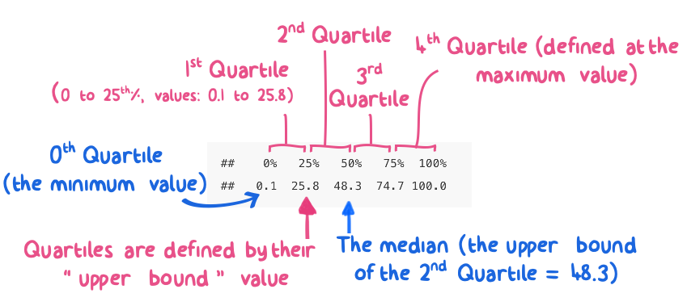

# Univariate Data Exploration {#eda1}

```{r eda1, include=FALSE}
knitr::opts_chunk$set(echo = TRUE, fig.align = 'center')
library(tidyverse)
library(knitr)
library(bookdown)
library(scales)
library(kableExtra)
library(lubridate)
```

> *<span style="color: blue;"> Exploratory data analysis is graphical detective work - John Tukey </span>*

Exploratory Data Analysis (also known as EDA) is largely a visual technique based on the human trait of *"pattern recognition"*. The purpose of EDA is simple: learn about your data through diagnostic visualization.

**Why is Exploratory Data Analysis (EDA) useful?**
Because getting to know a dataset is a key step towards making sense of it, and EDA is a great way to familiarize oneself with a dataset. As a result, you can use EDA to do many powerful things in a short span of time.

Think of the word **"Exploratory"** in terms of **"Hypothesis Building"**.

- In other words, **modeling** and **statistical inference testing** should come *after* EDA.  
- In other, other words: You can use EDA to jump start ideas on *"what do I do with my data?"*!  

> *<span style="color: blue;"> Perfect data is boring. Flawed data, on the other hand, is interesting and mysterious. Perfect data doesn't get asked out on a second date.  - me </span> *

## Objectives
This Chapter is designed around the following learning objectives. Upon completing this Chapter, you should be able to:  

- Define and interpret the location, dispersion, and shape of univariate data distributions
- Calculate quantiles and basic descriptive statistics for univariate data
- Create a cumulative distribution plot and extract quantile information from it
- Create and interpret data from a histogtam
- Define skewness (and its effect on measures of spread and central tendency) in qualitative terms
- Create a time-series plot and identify shifts in location and dispersion
- Define autocorrelation (quantitatively and qualitatively) 
- Identidy time lags where autocorrelation is significant using an autocorrelation (and partial autocorrelation) plot

## Univariate Data

*Univartiate* means "only one variable" being considered (like medical doctors, statisticians enjoy the use fancy words to describe things...).  

*Univariate data analyses* describe ways to discover features about a single variable or quantity. While simple, univariate analyses are a great starting point for EDA because they allow us to isolate a variable for inspection. The variation in diameter of a mass-produced component, or pollutant concentration in the atmosphere, or the rate of a beating heart are all examples of things we might examine in a univariate sense. This is, of course, a potentially risky procedure because, as engineers, we are taught about *mechanisms* and *dependencies* that imply that variable A is inextricably linked to variable B through some physical process. That's OK to admit.  Univariate analyses are still useful. Trust me for now or just skip ahead to multivariate analyses...your choice.

### Location, Dispersion, and Shape
Univariate EDA often begins with an attempy to discover three important properties about an observed variable: its location, dispersion, and shape. Once you define these properties (the "what"), you can begin to probe the underlying causes for these properties (the "how" and "why"). Discovering "how" and "why" of a variable's location, dispersion, and shape might sound simple, and yet, answering such questions often represents the pinnacle of scientific discovery (read: they give out nobel prizes for that stuff).  Let's start with "what" (location, dispersion, and shape) and build from there.

The **location** of univariate data means: where do most of the values/observations fall? Do they tend to be large or small, based on what you know about the variable?

The **dispersion** of the data refers to its variability.  Are the values tightly bound in a small range or do they vary widely from one observation to the next? Note that the phrase "varies widely" is contextual.  The variation in the cost of an ice cream cone from one location to the next might look small to you but could mean the difference between joy and sorrow to a 10-year-old with only a $1.50 in their pocket... 

The **shape** of the distribution is actually a combination of location and dispersion but with some mathematical nuance. Knowing the shape of your data distribution means that you have insight into its *probability density function*. One wishes to know the "shape" of the populaiton distribution they are attempting to observe because once you know a distribution's shape, you can model it.  And if you can model the distribution, you can begin to make inferences about it (read: make extrapolations, predictions, or other types of inference). 

The shape of a distribution of data is often categorized based on whether it looks similar to one of many ***[reference distributions](#dist)***.  You can think of reference distributions like species of living organisms; there are lots out there but once you categorize one you can likely predict its behavior.  In other words, if the shape of your data matches a reference distribution, most of your modeling work is already done! Examples of reference distributions include the normal distribution, the  lognormal distribution, the uniform distribution etc. More on different types of *reference distributions* [here](#dist). 

### Example: Location and Dispersion  

Let's plan a camping trip.  Our trip is purely theotrical...so let's not worry  about costs, logistics, or other important factors. For this exercise we only care about *comfort* while outdoors.  When I think of being comfortable outdoors, the first thing that comes to mind is ***temperature***.  Did I bring the proper clothing?

We will consider going camping in two lovely spots: the first is the forest preserves along the Na Pali coast in Kauai, Hawaii and the second is the sunny hiking/climbing regoin around Jack's Canyon in southwest Colorado. Let's examine the location and dispersion of hourly temperatures in these two regions for the month of July, 2010  We can download such data from the <NOAA Climate Data Center>[https://www.ncdc.noaa.gov/cdo-web/search] that provides  daily average, minimum, and maximum temperature readings for these two regions.  Once we know the **location** and **dispersion** of these data, we can decide what clothes to bring!

We create a simple plot \@ref(fig:NOAA-temps-2) that summarizes the various temperatures measured at these two regions.  

``` {r NOAA_temps_1, echo=FALSE, warning=FALSE, message=FALSE}

tempdata <- read_csv("./data/NOAA_temps2.csv")
NOAA_temps <- tempdata %>%
  #mutate(time = str_extract(DATE, "(?<=T).+"), date = str_extract(DATE, ".+(?=T)")) %>%
  #select(STATION, NAME, time, date, `HLY-TEMP-NORMAL`) %>%
  rename(station = STATION, 
         name = NAME, 
         temp_hr_f = `HLY-TEMP-NORMAL`) %>%
  #mutate(mdt = strftime(date, "%m-%dT%T"))
  mutate(date = parse_date_time(DATE, orders = "mdhms")) %>%
  mutate(location = case_when(
    str_detect(station, "23066") ~ "Colorado",
    str_detect(station, "22536") ~ "Hawaii")) %>%
  select(station, location, date, temp_hr_f)

year(NOAA_temps$date) <- 2010 #NOAA data export fails to include year value

NOAA_temps %>% 
  group_by(location) %>%
  summarise(T_averages = mean(temp_hr_f)) -> tmeans

co_hi_temps <- ggplot(NOAA_temps, aes(y = location, 
                       x = temp_hr_f)) +
  geom_jitter(aes(color = location),
              height = 0.15,
              size = 1.5,
              shape = 1) +
    labs(y = "Region", 
       x = "Temperature, °F") +
  theme_bw() +
ggsave("./images/NOAA_temps.png", dpi = 150)
```

``` {r NOAA-temps-2, echo = FALSE, out.width = "700pt", fig.align = "center", fig.cap = "Hourly temperature levels in Colorado and Hawaii for the month of July, 2010."}
knitr::include_graphics("./images/NOAA_temps.png")
```

First, if we are picking spots to go camping, both locations have daily averaage temperatures that seem very pleasant (the average is about `r round(tmeans[[1,2]], digits = 1)` $^\circ$F in Colorado and `r round(tmeans[[2,2]], digits = 1)` $^\circ$F in Hawaii). When we calculate an average value we are creating an indicator of a variable's **location**.  However, if we look at the **dispersion** of temperature observations (how the readings vary across the month), we can make an important distiction: the range of observed temperature values in Hawaii is fairly narrow, whereas the range in Colorado spans from `r min(NOAA_temps$temp_hr_f)` to 
`r max(NOAA_temps$temp_hr_f)` $^\circ$F!  

The conclusion to be drawn here is that the ***central tendencies*** of hourly temperature are nearly identical between Hawaii and Colorado but the ***dispersion*** of the temperature data suggests that you might want to pack more gear if you want to be comfortable in Colorado (see \@ref(fig:NOAA-temps-annotate). 

You will discover that there are many ways to communicate location (e.g., mode, mean, median) and dispersion (e.g., range, IQR, standard deviation); we will touch upon several such descriptors in this course.

```{r NOAA-temps-annotate, echo = FALSE, out.width = "700pt", fig.align = "center", fig.cap = "The Hawaii and Colorado temperature data have similar locations (or central tendencies) but differing dispersion (or spread)."}
knitr::include_graphics("images/NOAA_temps_annotate.png")
```


## Quantiles

Let's assume you have a sample of univariate data.  A good starting point for exploring these data is to break them into *quantiles* and extract some basic information.  Quantiles allow you to see things like the start, middle, and end rather quickly, because the first step of quantile calculation is to sort your data from smallest to largest value.

```{block, type = "rmdtip"}
A Quantile represents a fractional portion of an ordered, univariate distribution.
```

In other words, quantiles break a set of observations into similarly sized 'chunks' where each chunk represents an equal fraction of the total distribution from start to finish. If you line your data up from smallest to largest and then slice that list into sections, you have created a set of quantiles. For example, when a distribition is broken into 10 equal chunks, or *deciles*, the first quantile (the 10^th^ % or the 0.1 fraction) represents the value that bounds the lower 10 % of the observed data. The second quantile (0.2 fraction) represents the 20^th^% value for the observed data. The 0.3 quantile represents the 30^th^%, and so on. There are two important aspects to remember about quantiles: (1) Each quantile is defined only by its upper-end value; (2) quantiles are defined after the data have been *rank ordered* from lowest to highest value.  

Quantiles are often used to communicate ***descriptive statistics*** for univariate data:

The two most extreme quantiles define the ***Range***:  

- `Min`: the 0% or lowest value; the zeroth quantile 
- `Max`: the 100^th^ percentile (or 1.0 in fractional  terms); the highest value observed; the n^th^ quantile   

If you break a distribution into quarters, you have created *Quartiles*.  Let's generate a sample of random numbers between 0 and 100 and break the resulting data into quartiles. A random number generator (`runif`) will create a **[uniform distribution](#unif_dist)** across the sample range since all values have equal probability of being chosen.  With that in mind, you can probably guess what the quartiles will look like, given a sufficiently large sample...

``` {r quantiles-1, results='hide'}
set.seed(1)
univar1 <- runif(n = 1000, min = 0, max = 100)
univar1_quartiles <- quantile(univar1, probs = seq(0, 1, 0.25)) %>% round(1)
```

``` {r quantiles-2, echo = FALSE, out.width = "700pt", fig.align = "center", fig.cap = "Quartiles estimated from n=1000 samples of a uniform distribution between 0 and 100"}

```
As expected, the 1^st^, 2^nd^, 3^rd^, and 4^th^ quartiles from a uniform distribnution between 0 and 100 fall into predictable chunks: 25, 50, 75, and 100.

- The first, or lower quartile, contains the lower 25% of the distribution. In quantile terms, we define this quartile by its upper value, which occurs at the 25^th^ percentile (or the 0.25 quantile).   
- The second quartile is defined at the 50^th^ percentile value. Because this quantile ends at 0.5 (the 50^th^ percentile) it also represents the ***median*** of the distriution.  *Note: to define the data that falls into the second quartile, you actually need to know the 1^st^ and 2^nd^ quartile values, since you want the range of values that start at the 25^th^ percentile and end at the 50^th^ percentile. 
- the third quartile contains data for the 0.5 to 0.75 quantiles (50^th^ to the 75^th^%) 
- the fourth quartile contains the upper 25% of the distribution: 0.75 to 1.0 

### Quantiles and Descriptive Statistics

Quantiles allow us to calculate several important **descriptive statistics** for univariate data. For example, the quartile output above allows us to report the following descritptives:

``` {r quant_desc, echo=FALSE}

quant_desc <- data.frame(a = c("0", 
                               "1", 
                               "0.5", 
                               "0.25", 
                               "0.75", 
                               "0.75 - 0.25"),
                           b = c("minimum", 
                               "maximum", 
                               "median", 
                               "25^th^%", 
                               "75^th^%",
                               "IQR"),
                         c = c(univar1_quartiles[[1]],
                               univar1_quartiles[[5]],
                               univar1_quartiles[[3]],
                               univar1_quartiles[[2]],
                               univar1_quartiles[[4]],
                               univar1_quartiles[[4]] - univar1_quartiles[[2]]
                         )
)
                       
```

``` {r, echo = FALSE}
knitr::kable(quant_desc, 
             caption = "Quantiles and descriptive stats 
             for n=1000 samples from a uniform distribution, 0-100",
             booktabs = TRUE,
             col.names = c("Quantile", "Descriptor", "Example Values"),
             align = "c") %>%
             kable_styling(bootstrap_options = "striped", full_width = F)
```

A couple notes.  You might wonder why I didn't include *summary statistics* (like the mean and standard deviation) in this list of descriptive statistics.  The reason is not because I don't like using summary statistics, but because their use implies that you know the type/shape of the distribution you are describing (i.e., is it normally distributed, log-normal, bi-modal, etc.).  Use of descriptors like `mean()` and `sd()` are very useful when properly applied, but can be misleading when the distribution is skewed (**more on that later**).  Quantile descirptors, on the other hand, are agnostic to the type of distribution they describe (i.e,. the median is ALWAYS the 50% value, regarless of the shape of the distribution). 

The last descriptor in the list is the *"Inter-Quartile Rage"* or IQR for short; the IQR describes the spread of the data and communicates the range of values needed to go from the 25^th^% to the 75^th^% of the distribution. The IQR is siad to span the bulk, or "middle part" of the distribution.  The IQR is *similar* in concept to a standard deviation but makes no assumptions about the shape/type of the distribution being considered.  

Let's now create quantiles from a *normal distribution* of data (mean = 50, standard deviation = 15).  We'll start by randomly sampling 1000 values (using `rnorm`) and then arranging them with the `quanitle` function (the code chunk also shows how to calculate quantiles manually).
``` {r quantiles_2}
normal1 <- rnorm(1000, mean = 50, sd = 15)
quantile(normal1, probs = seq(0, 1, 0.1)) %>%
  round(0)

#manual method for calculating quantiles
normal_data_2 <- tibble(
  sample_data = normal1,  #start with raw sample data
  sorted_data = sort(normal1),   #sort the data
  cum_frac = seq.int(from = 1/length(normal1),   #calculate cumulative fraction for each entry
                     to = 1,
                     by = 1/length(normal1)))


deciles <- seq.int(from = 0, to = 1, by = 0.1)

#take only the quantiles that match the decile values created above
normal_data_deciles <- filter(normal_data_2, cum_frac %in% deciles)
```
Normal distributions are more complicated than uniform distributions, and it's hard to get a lot out of the decile summary when shown in tabular format.  This brings us to my favorite part of exploratory data analysis: ***data visualization***.

## Univariate Data Visualization

Data visualization is a powerful technique for exploring data. Visualizaing univariate data is the **first step** in getting to know your data, once they have been read into R and cleaned.f

Below I introduce formal approaches to visualizing the location, dispersion, and shape of univariate data.  Later on we will explore relationships between variables in [multivariate data analyses](#eda2). The techniques shown below are simple, yet I am surprised how often they are underemployed.

### Summary vs. Enumerative Plots
Univariate data visualizations can be broken down into two categories: ***summary plots*** and ***enumerative plots***. A *summary plot* is called such because it shows you the data *summarized* in some way. Thus, some analysis or manipulation happens to the data prior to the generation of a summary plot. *Enumerative* is a fancy word that means: to name or show ***ALL*** of the data without modificaiton. *Enumerative plots* show the *raw data* and *all the data* in a single plot. There are strengths and weakensses to both these types of plots.   

* **Enumerative plots:**    
  * Strengths: They show you *all* the data without manipulation. This is considered a strength because many analysts like to see raw data; they believe that *"The data don't lie"*.  
  * Weaknesses: Enumerative plots can take more "looking at" in order to comprehend. Sometimes more data = more work for your brain.  
* **Summary plots:**  
  * Strengths: Summary plots are easy to read and easy to see the "main points".
  * Weaknesses: Summary plots don't show you all the data; they only show you a summary of the data.  You are more likely to miss a special feature of a dataset when looking at just a single summary plot.

## Cumulative Distribution Plot

A **cumulative distribution plot** is an *enumerative plot* that lays out the raw quantiles (typically on the y-axis) against the observed data (x-axis). Bevause these plots show all the data, each observation gets assigned a unit quantile (i.e., if there are 100 data points in a sample, each datum represents 1% of the total or a quantile of 0.01) . Thus, quatiles are shown on the y-axis and the x-axis shows the observed data, ordered from smallest to largest value.   

```{block, type = 'rmdnote'}
The cumulative distribution plot shows the rolling fraction (or percent) of data (y-axis) that are "less than or equal to" the (x-axis) values of that data. 
```

An annotated cumulative distribution plot is shown below for a sample of temperature data that follow a normal distribution:  

``` {r create-cd-plot, warning=FALSE, include=FALSE}
#randomly sample two variables from normal distributions (defined below)
normal_data <- tibble(a = rnorm(n=1000, mean = 15, sd = 5),
                   b = rnorm(n=1000, mean = 10, sd = 3))

#create quantile values for the normal_data
normal_data %>%
  select(a) %>%
  arrange(a) %>%
  mutate(cum_frac = seq.int(from = 1/length(a),
                            to = 1,
                            by = 1/length(a))) -> normal_data_cdf
  
#plot cumulative distribution
normal_data_cdf <- ggplot(data = normal_data_cdf, aes(x = a, y = cum_frac)) +
  geom_point(shape = 21,
             fill = "black",
             alpha = 0.25) +
  labs(x = "Average Temperature (\u00B0C)",
       y = "Cumulative Fraction") +
  theme_minimal() +
  scale_x_continuous(breaks = seq(0, 35, by = 5)) +
  scale_y_continuous(breaks = seq(0, 1, by = 0.1)) +
  theme(text = element_text(size=15),
        axis.title.y = element_text(margin = unit(c(0, 5, 0, 0), "mm")),
        axis.title.x = element_text(margin = unit(c(5, 0, 0, 0), "mm")),
        aspect.ratio=3/4) 
ggsave("./images/normal_cum_dist.png", dpi = 150)
```

``` {r norm-cdf-plot, echo = FALSE, out.width = "700pt", fig.align = "center", fig.cap = "Annotated Cumulative Distribution Plot for Normally-Distributed Temperature Data"}
knitr::include_graphics("./images/normal_cum_dist_anno.png")
```

As you can see, there is a lot of information contained in a cumulative distribution plot!  We can see the range (min, max), the median (the 0.5 quantile), and any other percentile values for the distribution.  We can quickly pick out any value to and find out what fraction of the data are below it.  For example, picking out the quantile of 0.9 on the y-axis shows that 90% of the observed temperature values are below a level of 21 $^\circ$C. In fact, most of the basic descriptive statistics can be accessed on a cumulative distribution plot:  

* **median**: x-axis value at quantile 0.5  
* **25^th^ and 75^th^ percentiles** (or quartiles): x-axis values at quantile 0.25 and 0.75, respectively  
* **interquartile range** (IQR): x-axis distance between quantiles 0.25 and 0.75  
* **range**: min, max values at quantile 0 and 1.0, respectively  
  
Cumulative distribution plots also reveal details about the dispersion of the observed data (and, more subtly, about the shape/nature of underlying data distribution). For example, in the temperature example above (Fig. \@ref(fig:norm-cdf-plot)), the curve has geometric symmetry about the median - this symmetry indicates that the dispersion of the data is equal as you move away from the median in either direction. 

### Cumulative Distribution Plot Example

In the example below, we create a cumulative distribition plot of annual salaries reported by individuals with a degree in Mechanical Engineering in the US. These data come from the [NSF Survey of College Gradautes](https://www.nsf.gov/statistics/srvygrads/). I've also taken the liberty of identifying the max, min, and quartile values on the plot.

``` {r create-cdf-me-salaries}
#load data
raw_salaries <- read_csv("./data/ME_salaries.csv", 
                 col_types = "iif", 
                 col_names = c("salary", "age","gender"),
                 skip = 1)

#create cumulative fractions 
ordered_salaries <- raw_salaries %>%
  select(salary) %>%
  filter(salary < 500000) %>% #to remove numeric identifiers like '989961'
  arrange(salary) %>%
  mutate(cum_pct = seq.int(
    from = 1/length(salary), 
    to = 1, 
    by = 1/length(salary))) 
  
  #alternate method if you don't want to calculate cumulative fractions
  cdf_ME_salaries <- ggplot(data = ordered_salaries, aes(x = salary)) +
  geom_step(stat = "ecdf") + #ecdf = 'empiricial cumulative distribution function'
  theme_bw() +
  labs(x = "Salaries of ME Graduates", y = "Cumulative Fraction") +
  scale_y_continuous(limits=c(-0.05, 1.03), expand = c(0,0),
                     breaks = seq(from = 0,
                                        to = 1,
                                        by = 0.1)) +
  scale_x_continuous(labels = scales::label_dollar(scale = 0.001, 
                                                   prefix = '$', 
                                                   suffix = 'k'),
                     minor_breaks = seq(from = 0,
                                  to = 450000,
                                  by = 10000))+
  geom_segment(data = data.frame(x=quantile(ordered_salaries$salary),
                                 y=rep.int(-.05, 5),
                                 xend=quantile(ordered_salaries$salary),
                                 yend=seq(from = 0, to = 1, by = 0.25)),
               aes(x=x, y=y, xend=xend, yend=yend), 
               color = "red",
               linetype = "dashed")
ggsave("./images/cdf_me_salaries.png", dpi = 150)

```

``` {r cdf-me-salaries, echo = FALSE, out.width = "700pt", fig.align = "center", fig.cap = "Annual Salaries Reported by US Graduates (all ages) with a Mechanical Engineering Degree"}
knitr::include_graphics("./images/cdf_me_salaries.png")
```
The good news is that if you can survive the undergraduate grind in Mechanical Engineering, you have a good chance of making a great living wage.  The median salary is $
`r format(quantile(ordered_salaries$salary, probs = 0.5), scientific = F, big.mark=",")` - note this is for graduates of all ages across the country in the year 2017.  Don't expect that paycheck on your first day on the job!

One interesting thing you may notice in Figure \@ref(fig:cdf-me-salaries) is that the 'tails' of the plot (the shape of the curves about the median value) are not symmetrical. One tail looks longer than the other.  This lack of symmetry implies a degree of *skewness* in the data.  Why is that?  We will explore skewness at several points in this course (and discuss some of the mechanisms that cause data to be skewed later on).

## Histogram {#hist}

A **histogram** is a *summary* plot of counts (or frequency of observations) as a function of magnitude (or levels). Histograms are useful because they allow you to visualize the spread and shape of your data as distribution. A histogram can tell you several important things about a variable:

* The location or central tendency (what's the most common value?)  
* The approximate range of the data (what are the max, min values?)  
* The dispersion (how spread out are the data?)  
* The nature of the distribution (i.e., do the data appear normally distributed or skewed?)  
* The presence (or absence) of outliers in the data (what are those observations doing way out there?)  

Below is a basic histogram that I've annotated to show some key features.  This histogram was created by sampling a normal distribution `rnorm()` and plotted using `ggplot::geom_histogram`.  Examination of this histogram quickly reveals a lot about the underlying data.  For example, the central tendency is located around a value of ~30 and the majority of the data appear to fall between a range of 20 - 40.  
``` {r norm-hist, warning=FALSE, include=FALSE}
#create a simple tibble of 1000 observations from a normal distribution
x<-tibble(data = rnorm(10000, mean = 30, sd = 3))

#plot the histrogram
ggplot2::ggplot(data = x) + 
  geom_histogram(aes(data),
                 bins = 30,
                 fill = "white",
                 color = "darkgrey") +
  theme_minimal() +
  theme(text = element_text(size=20))
ggsave("./images/hist_norm.png", dpi = 150)
```

``` {r hist-anno-1, echo = FALSE, out.width = "700pt", fig.align = "center", fig.cap = "A histogram is a plot of counts (or frequency of observations) as a function of magnitude (or levels) of univariate data"}
knitr::include_graphics("./images/hist_anno_1.png")
```
  
### Histogram: what to look for?
In addition to being able to "see" key data descriptors (e.g., mean, range, spread), a histogram also allows one (a) to get a feel for ***skewness*** (whether the distribution is symmetric about the central tendency), (b) to see ***outliers***, and (c) to visualize other potential interesting features in the dataset.  

``` {r skew_hist_out, warning=FALSE, include=FALSE}
set.seed(2)
x1 <- tibble(data = round(rlnorm(5000, meanlog = log(50), sdlog = 1), 0))
outliers <- tibble(data = rep(195, 75))
x2 <- bind_rows(x1, outliers)
  
skew_hist_out <- ggplot2::ggplot(data = x2) + 
  geom_histogram(aes(data),
                 bins = 50,
                 fill = "white",
                 color = "darkgrey") +
  xlim(1,400) +
  theme_minimal() +
  theme(text = element_text(size=28))
ggsave("./images/skew_hist_2.png", dpi = 150, width = 9, height = 6, units = "in")
```

``` {r skew-hist-out-plot, echo = FALSE, out.width = "700pt", fig.align = "center", fig.cap = "A histogram depicting a skewed distribution"}
knitr::include_graphics("./images/hist_anno_2.png")
```
Figure \@ref(fig:skew-hist-out-plot) depicts just such a skewed distribution. Examination of Figure \@ref(fig:skew-hist-out-plot) also reveals the presence of potential ***outliers*** in the data: the apparent spike in observations around x = 200. Outliers are interesting features and should neither be ignored nor deleted outright. Outliers exist for some reason, and oftentimes only through detective-work or mechanistic knowledge can you elucidate their source (we will delve into the handling of outliers later on; for now it's enough to know that they exist).  

In Figure \@ref(fig:skew-hist-out-plot) the central tendency is evident, but the spread of the data are not symmetrical about that central tendency.  One outcome of skewed data is that traditional location measures of  central tendency (mode, median, mean) do not agree with each other:  

Figure \@ref(fig:skew-hist-out-plot) central tendency calculations:  

* mode: `r names(table(x2)[which.max(table(x2))])`  
* median: `r median(x2$data)`  
* mean: `r round(mean(x2$data), 0)`  

``` {r skew-hist-out-plot-2, echo = FALSE, out.width = "700pt", fig.align = "center", fig.cap = "Describing the spread of skewed data with a \"standard deviation\" can lead to confusion and trouble: in this case the existence of physically impossible values."}
knitr::include_graphics("./images/hist_anno_3.png")
```

Another, potentially more troubling, outcome of skewed data is that certain measures of the spread of the data (such as the standard deviation) can lead to misleading conclusions.  For example, if we calculate and extend "one standard deviation" to the mean of the data in Figure \@ref(fig:skew-hist-out-plot-2), we would imply the existence of negative values (87 - 113 = -26), which is often impossible in the case of physical measurements. This is a common mistake in data analysis: the application of "normal" descriptors like `mean` and `sd` to "non-normal" data. 
Skewed distributions can be more challenging to handle because they are *less predictable* than normal distributions (*that said, statisticians have figured out how to model just about any type of distribution, so don't fret*). In any case, we can always rely on quantile calculations for descriptors (median and IQR) since those descriptors do not make assumptions about the shape of the distribution in question.

### What causes skewed histograms?
I want to spend some time thinking about mechanisms that cause variability in an observation. These mechanisms are often responsible for whether a set of observations appears normally distributed or skewed. We will focus on two types of distributions for now: [normal](#normal_dist) and [log-normal](#log_normal_dist) data. Many other types of data distributions exist in the real world.  

A general "rule of thumb" is that *additive* variability tends to produce normally distributed data, whereas mechanisms that cause *multiplicative* variability tend to produce skewed data (log-normal, in the case of Figure \@ref(fig:skew-hist-out-plot)).  By *additive*, I mean that variable x tends to vary in a "plus/minus" sense about its central tendency.  Examples of additive variability include the distribution of heights measured in a sample of 3^rd^ graders or the variability in the mass of a 3D-printed part produced 100 times by the same machine.  

*Multiplicative* (or log-normal) variability arises when the mechanism(s) controlling the variation of "x" are multipliers (or divisors) of x. Many real-world phenomena create multiplicative variability in observed data: the strength of a WiFi signal at different locations within a building, the magnitude of earthquakes measured at a given position on the Earth's surface, the size of rocks found in a section of a riverbed, or the size of particles found in air. All of these phenomena tend to be governed by multiplicative factors. In other words, all of these observations are controlled by mechanisms that suggest x = a*b*c not x = a+b+c. Explicit examples of *multiplicative* variability (and how it leads to log-normal data) are provided [here](#log_normal_dist). 

## Boxplot {#box}
The boxplot is *summary plot* that allows one to view a distribution by its quartiles (Figure \@ref(fig:boxplot-1-anno)). The "box" in a boxplot consists of three parallel lines (usually oriented vertically) connected on their sides to form a box. The outer box lines (also called the *"hinges"*) represent the 0.25 and 0.75 quantiles and the inner line represents the 0.5 quantile, or median.  Thus, the height of the box depicts the inter-quartile range of the data.  Boxplots are often drawn with lines extending out from each end of the box (these lines are called *"whiskers"*). These whisker lines vary in their representation.  For some plots, the whiskers represent either: the max/min values, respectively, OR a distance of 1.5xIQR if the either the max or min value are larger than 1.5xIQR.  Other times the whiskers represent the 0.9 or 0.95 quantiles or 1.58xIQR/sqrt(2). Because of these variations, it's best to define the whiskers for the viewer (either in the text or the Figure caption).  Here is the R definition from the helpfile `?geom_boxplot`:

> The upper whisker extends from the hinge to the largest value no further than 1.5 * IQR from the hinge (where IQR is the inter-quartile range, or distance between the first and third quartiles). The lower whisker extends from the hinge to the smallest value at most 1.5 * IQR of the hinge. Data beyond the end of the whiskers are called "outlying" points and are plotted individually.

``` {r boxplot-1, echo = FALSE, include = FALSE, warning = FALSE, message = FALSE, fig.width = 2, fig.height = 4, units = "cm"}
ggplot(data = normal_data) +
  geom_boxplot(aes(y = b, x = 1),
               outlier.shape = NA,
               width = 0.25) +
  xlab("Data Name") +
  ylab("Data Values") +
  xlim(c(0.5, 1.5)) +
theme_classic() +
  theme(text = element_text(size=15),
        axis.text.x=element_blank(),
        axis.ticks.x=element_blank())

ggsave("./images/boxplot_1.png")
```

``` {r boxplot-1-anno, echo = FALSE, out.width = "700pt", fig.align = "center", fig.cap = "A generic boxplot The box lines represent the lower, middle, and upper quartiles, respectively; the whiskers represent 1.5*IQR in each direction."}
knitr::include_graphics("./images/boxplot_1_anno.png")
```

Boxplots *can be created* for a single univariate distribution (as shown in Figure \@ref(fig:boxplot-1-anno)), but the strength of the boxplot really comes from drawing several together, so that one univariate distribution can be compared to another.  In my opnion, single boxplots are quite boring by themselves (and the same information presented by a boxplot is just as easy to get from a cumulative distribution plot).  However, I do think it's faster to view quartiles (and the IQR) on the boxplot, so a plot with multiple boxplots has its advantages.  For example, let's look at the data from Figure \@ref(fig:NOAA-temps-2) as two boxplots.

``` {r boxplot-2, echo = FALSE, out.width = "700pt", fig.align = "center", fig.cap = "Boxplots of hourly temperatures in Colorado and Hawaii for July, 2010. Whiskers represent 1.5*IQR"}
names <- as.list(c("Colorado", "Hawaii"))

ggplot(data = NOAA_temps, aes(y = temp_hr_f, x = location, group = location)) +
  geom_boxplot(aes(fill = location),
               width = 0.5) +
  ylab("Temperature, °F") +
  xlab(NULL) +
  theme_classic() +
  theme(text = element_text(size=15),
        legend.position = "none")
  

```
Examination of the boxplots in Figure \@ref(fig:boxplot-2) conveys much the same information as what is seen for the raw data originally plotted in Figure \@ref(fig:NOAA-temps-2): both distributions have same central tendencies but the Colorado distribution has considerably more variation.


## Time-Series  {#time_series}
The **time-series plot** plot (also called a **"run sequence"** plot) is something you have undoubtedly seen before. This plot (typically shown as an *enumerative plot*) depicts the value of a variable (y-axis) plotted in the sequence that the observations were made (x-axis, often shown as units of time). A time-series plot allows you to do several things:  

* Identify shifts in "location" of the variable (when and by how much do values change over time?)  
* Identify shifts in "variation" of the variable (does the data get more/less noisy over time?) 
* Identify (potential) outliers and when they occurred 
* Identify the ***timing*** of events!

Let's plot the same temperature data from Hawaii as shown in \@ref(fig:NOAA-temps-2) as a time series.
```{r NOAA-time-series, warning=FALSE, message=FALSE}
# plot Temp vs Time for Colorado data
NOAA_HI_time_series<- ggplot(data = filter(NOAA_temps, location == "Hawaii"), 
       aes(x = date, y = temp_hr_f)) +
  geom_line(linejoin = "round",
            color = "purple") +
  geom_point(size = 1,
             shape = 1,
             color = "purple") +
  labs(x = "Date",
       y = "Temperature, °F") +
  theme_bw()
ggsave("./images/NOAA_HI_time_series.png", dpi = 150)
```

``` {r NOAA-HI-time-series, echo = FALSE, out.width = "700pt", fig.align = "center", fig.cap = "Time series of hourly temperature measurements in Kauai, Hawaii for July 2010."}
knitr::include_graphics("./images/NOAA_HI_time_series.png")
```

**What can we see in these data?**  Here are some quick conclusions:  
  
1. The temperature appears to rise and fall in a predictable pattern each day (duh).
2. Over the course of the month, we can see a gradual increase in daily mean temperature taking place.  

Neither of these conclusions are groundbreaking, but they both allude to an important outcome: there are patterns to be seen in these data!  None of those patterns were evident in the cumulative distribution or histogram plots.  If we zoom in on just the first 5 days of the month, we see the daily temperature patterns in more detail. 
    
```{r NOAA-time-series-2, warning=FALSE, message=FALSE}
# plot Temp vs Time for Colorado data
NOAA_HI_time_series<- ggplot(data = filter(NOAA_temps, location == "Hawaii", date <= "2010-07-05"), 
       aes(x = date, y = temp_hr_f)) +
  geom_line(linejoin = "round",
            color = "purple") +
  geom_point(size = 1,
             shape = 1,
             color = "purple") +
  labs(x = "Date",
       y = "Temperature, °F") +
  theme_bw()
ggsave("./images/NOAA_HI_time_series-2.png", dpi = 150)
``` 

``` {r NOAA-HI-time-series-2, echo = FALSE, out.width = "700pt", fig.align = "center", fig.cap = "Time series of hourly temperature measurements in Kauai, Hawaii for July 1-5, 2010."}
knitr::include_graphics("./images/NOAA_HI_time_series-2.png")
```


## Autocorrelation {#autocorr}

Autocorrelation, or serial correlation, means *correlated with oneself across time*.  Autocorrelation is a concept that suggests *"whatever is happening in this moment is still likely to be happening in the next moment."* Lots of things are autocorrelated: your mood right now is likely related to your mood 15 minutes from now (or 15 minutes ago).  The weather outside at 08:00 on a given day is a good predictor of the weather outside an hour later at 09:00, or two hours later at 10:00, and so on, but less so in fourteen days hence. 

Almost all physical phenomona have a degree of autocorrelation and that's important because if a datapoint at time 'i' is correlated with time 'i + 1' then those two datapoints are NOT independent. Yet, many statistical tests assume that the underlying data ARE independent from one another!  Thus, autocorrelation can pose a problem when we want to make inferences using data collected over a span of time.  Fortunately, we have ways of detecting the presence (and relative strength) of autocorrelation with a simple exploratory plot. 

The **autocorrelation plot** is a *summary plot* that gives the Pearson correlation coefficient (r) between all measurements (x~i~) and their lags (x~i+n~), where *x* represents an observation and *i* represents a point in time.  

This plot can help answer the following questions:  

* Are the data correlated with each other over time?  
    - Note: if the answer is *yes* then your data are *not necessarily independent measures*  
* Are there patterns (periodicity) to discover?  
    - hourly?  
    - daily?  
    - weekly?  
    - seasonally?  
    
Let's examine the Hawaii temperature data shown in Figures \@ref(fig:NOAA-temps-2) and \@ref(fig:NOAA-HI-time-series) using an autocorrelation plot. 

The `stats` package in R has a function to calculate autocorrelation and plot it through time (as a function of lags). Here, the y-axis represents the Pearson correlation coefficient and the x-axis represents time lags (for the basic unit of time in which the data are arranged). 

```{r acf, warning=FALSE, message=FALSE}
#subset the datafile to contain only measures from Colorado
NOAA_temps_HI <- NOAA_temps %>% 
  dplyr::filter(location == "Hawaii")

#call the autocorrelation plot
acf(NOAA_temps_HI$temp_hr_f,       
    main = " " ,
    xlab = "Lag (hours)",
    ylab = "Correlation coefficient") 
```

The plot suggests a fairly **strong level of autocorrelation in these temperature data**.  We should not be surprised, especially after seeing the time series shown in Figures \@ref(fig:NOAA-HI-time-series) and \@ref(fig:NOAA-HI-time-series-2).  Can you explain why the Pearson correlation coefficient is negative at a 12-hr lag?  Why does the coefficient trend back upwards to nearly perfect correlation at 24-hr lags?

Other notes about autocorrelation plots:
* Bars above the blue horizontal lines indicate that autocorrelation is worth attention.  
* One important implication of autocorrelated data is that the data wihtin a given lag duration are **not independent.**  
* This *lack of independence* violates the assumptions of many modeling approaches (that's potentially bad).  

### Partial Autocorrelation  
The **partial autocorrelation plot** is a *summary plot* that gives the correlation coefficient (r) between all timepoints (x~i~) and their lags (x~i+n~) *after accounting for autocorrelation for all previous lags*.  

The partial autocorrelation plot can help you decide: *how far out in time should I go in order to assume that measurment (x~i~) is independent from (x~i+n~)?*  
```{r pacf, warning=FALSE, message=FALSE}
pacf(NOAA_temps_HI$temp_hr_f,      #call the partial autocorrelation plot
     main = " ", 
     xlab = "Lag (hours)",
     ylab = "Partial Correlation Coefficient") 
```

In this case, after a 2-hr lag, the data loses most autocorrelation, except for some periodicity around 12- and 24-hr lags. 

## In-course Exercises

Visualizing a bi-modal distribution (hist, cum dist)

List which plot types discussed in this chapter are *enumerative* vs. *summary*.


