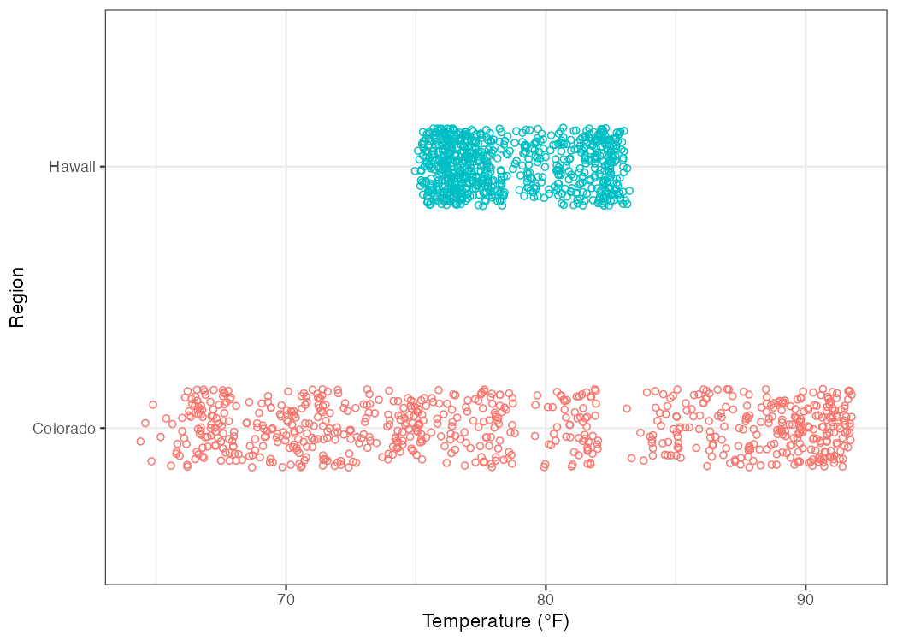

# Univariate Data Exploration {#eda1}

```{r ch5-pkgs, include=FALSE}
library(tidyverse)
library(lubridate)
library(knitr)
library(kableExtra)
library(scales)
library(gridExtra)
```

> <span style="color: blue;"> "Exploratory data analysis is graphical detective work." - John Tukey </span>

Exploratory Data Analysis (also known as EDA) is largely a visual technique
based on the human trait of **pattern recognition**. The purpose of EDA is
simple: learn about your data by visualizing it.

*Why is Exploratory Data Analysis (EDA) useful?* Because getting to know a
dataset is a key step towards making sense of it, and EDA is a great way to
familiarize oneself with a data set. EDA is fast, efficient, and intuitive.

Think of the word **"Exploratory"** in terms of **"Hypothesis-Building"**. In
other words, modeling and statistical inference testing should come *after*
EDA. You can use EDA to jump-start ideas on *"what do I do with my data?"*!  

> <span style="color: blue;"> "Perfect data are boring. Flawed data, on the other hand, are interesting and mysterious. Perfect data don't get asked out on a second date."  - John Volckens </span> 

## Ch. 5 Objectives

This chapter is designed around the following learning objectives. Upon
completing this Chapter, you should be able to:  

- Define and interpret the location, dispersion, and shape of univariate data distributions
- Calculate quantiles and basic descriptive statistics for univariate data
- Create a cumulative distribution plot and extract quantile information from it
- Create and interpret data from a histogram
- Create and interpret data from a boxplot
- Describe the differences between and the strengths/weaknesess of 
summary and enumerative plots
- Define skewness and its effect on measures of spread and central tendency in qualitative terms
- Create a time-series plot and identify shifts in location and dispersion
- Define autocorrelation, quantitatively and qualitatively 
- Identify time lags where autocorrelation is significant, using autocorrelation and partial autocorrelation plots

## Univariate Data

*Univariate* means that "only one variable" is being considered. Just like medical
doctors, statisticians enjoy the use fancy words to describe basic things.  

*Univariate data analyses* describe ways to discover features about a single
variable or quantity. While simple, univariate analyses are a great starting
point for EDA because they allow us to isolate a variable for inspection. The
variation in diameter of a mass-produced component, pollutant concentration in
the atmosphere, or the rate of a beating heart are all examples of things we
might examine in a univariate sense. This is, of course, a potentially risky
procedure because, as engineers, we are taught about *mechanisms* and
*dependencies* that imply that variable A is inextricably linked to variable B
through some physical process. That's OK to admit. Univariate analyses are
still useful. Trust me for now, or skip ahead to [multivariate analyses](#eda2) or [modeling](#model)---your
choice.

### Location, Dispersion, and Shape

Univariate EDA often begins with an attempt to discover three important
properties about an observed variable: its location, dispersion, and shape.
Once you define these properties (the "what"), you can begin to probe the
underlying causes for these properties (the "how" and "why"). Discovering "how"
and "why" of a variable's location, dispersion, and shape might sound simple,
and yet, answering such questions often represents the pinnacle of scientific
discovery; they give out Nobel Prizes for that stuff! Let's start with "what"
(location, dispersion, and shape) and build from there.

#### Location

The location of univariate data means: where do the values or
observations fall? Do the values tend to be large or small, based on what you
know about the variable? Do the observations have a *central tendency* - a 
region where values are more likely to show up?

#### Dispersion

The dispersion of the data refers to its variability. Are the values tightly
bound in a small range, or do they vary widely from one observation to the
next? Note that the phrase "varies widely" is contextual. The variation in the
cost of an ice cream cone from one location to the next might look small to
you, but could mean the difference between joy and sorrow for a 10-year-old
with only $1.50 in their pocket. 

#### Shape

The shape of the distribution is actually a combination of location and
dispersion but with some mathematical nuance. Knowing the shape of your data
distribution means that you have insight into its 
*probability density function*. Once you know a distribution's shape, you can 
model it. And if you can model the distribution, you can begin to make 
inferences about it (e.g., extrapolations, predictions). More on this later in
[Modeling](#model).

The shape of a distribution of data is often categorized based on whether it
follows that of a [reference distribution](#dist), of which there are
many types. You can think of reference distributions like species of living
organisms; there are lots out there, but once you categorize one, you can
likely predict its behavior. In other words, if the shape of your data matches
a reference distribution, most of your modeling work is already done! Examples
of reference distributions include the uniform distribution, normal
distribution, and the lognormal distribution. More on different types of
reference distributions [here](#dist). 

##### Example: Location and Dispersion  

Let's plan a camping trip. Our trip is purely hypothetical, so let's not worry
about costs, logistics, or other important factors. For this exercise, we only
care about comfort while outdoors. When I think of being comfortable
outdoors, the first thing that comes to mind is **temperature**: Did I bring
the proper clothing?

We will consider going camping in two lovely spots: the forest preserves along
the Na Pali coast in Kauai, Hawaii or the sunny hiking and climbing region
around Jack's Canyon in southwest Colorado. Let's examine the location and
dispersion of hourly temperatures in these two regions for the month of July,
2010. We can access this information from the
[NOAA Climate Data Center](https://www.ncdc.noaa.gov/cdo-web/search) 
that provides weather data for these two regions. Once we know the *location*
and *dispersion* of these data, we can decide what clothes to bring.

In Figure \@ref(fig:noaa-temp-plot), I use `geom_jitter()` to plot the hourly
temperatures measured at these two regions for July 2010. For this plot, we
define three aesthetics:  

* `y =` location
* `x =` temperature
* `color =` location (not necessary for the plot, but the color between
variables can be helpful)

``` {r noaa-temp-import, include=FALSE, message=FALSE}
# import and wrangle noaa temperature data from CO & HI July 2010
noaa_temp <- readr::read_csv("data/NOAA_temps2.csv") %>% 
  dplyr::rename(station = STATION,
                name = NAME,
                temp_hr_f = `HLY-TEMP-NORMAL`) %>%
  dplyr::mutate(date = lubridate::parse_date_time(DATE, orders = "mdhms")) %>%
  dplyr::mutate(location = dplyr::case_when(
    stringr::str_detect(station, "23066") ~ "Colorado",
    stringr::str_detect(station, "22536") ~ "Hawaii")) %>%
  dplyr::select(station, location, date, temp_hr_f) # year missing from date

readr::write_csv("/data/NOAA_temps_cleaned.csv")
```

``` {r noaa-temp-ggplot, message=FALSE, include=FALSE}
# plot temperature by location 
ggplot2::ggplot(data = noaa_temp, 
                mapping = aes(x = temp_hr_f,
                              y = location,
                              color = location)) +
  geom_jitter(height = 0.15,
              size = 1.5,
              shape = 1) +
  labs(y = "Region",
       x = "Temperature (°F)") +
  theme_bw() +
  theme(legend.position = "none") +
  ggsave("./images/NOAA_temps.png", dpi = 150)
```

``` {r noaa-temp-plot, echo=FALSE, out.width="700pt", fig.align="center", fig.cap="Hourly temperature levels in Colorado and Hawaii for the month of July, 2010."}

```

```{r noaa-temp-avg, include=FALSE}
# create average temperature by location 
noaa_temp_avg <- noaa_temp %>% 
  dplyr::group_by(location) %>% 
  dplyr::summarize(temp_avg = mean(temp_hr_f))
```

First, if we are picking spots to go camping, both locations have daily average
temperatures that seem very pleasant. The average is about 
`r round(noaa_temp_avg$temp_avg[1], digits = 1)` $^\circ$F in Colorado and 
`r round(noaa_temp_avg$temp_avg[2], digits = 1)` $^\circ$F in Hawaii. When we
calculate an average value, we are creating an indicator of a variable's
*location* (in this case the *central tendency*). But if we look at the 
*dispersion* of temperature observations
(i.e., how the temperatures vary across the month), we can make an important
distinction: the range of observed temperature values in Hawaii is fairly
narrow, whereas the range in Colorado spans from `r min(noaa_temp$temp_hr_f)`
to `r max(noaa_temp$temp_hr_f)` $^\circ$F! 

The conclusion to be drawn here is that the ***central tendencies*** of hourly
temperature are nearly identical between Hawaii and Colorado, but the
***dispersion*** of the temperature data suggests that you might want to pack
more layers to be comfortable in Colorado. See Figure
\@ref(fig:noaa-temp-anno).

You will discover that there are many ways to communicate location (e.g., 
`mode()`, `mean()`, `median()`) and dispersion (e.g., `range()`, interquartile 
range `IQR()`, and standard deviation `sd()`). We will discuss several such 
descriptors in this course.

```{r noaa-temp-anno, echo=FALSE, out.width="700pt", fig.align="center", fig.cap="The temperature data from Hawaii and Colorado have similar locations (central tendencies) but differing dispersion (spread)."}
knitr::include_graphics("./images/NOAA_temps_annotate.png")
```

## Quantiles

Let's assume you have a sample of univariate data. A good starting point for
exploring these data is to break them into *quantiles* and extract some basic
information. Quantiles allow you to see things like the start, middle, and end
rather quickly because the first step of quantile calculation is to sort your
data from smallest to largest value.

```{block, type = "rmdtip"}
A "quantile" represents a fractional portion of an ordered, univariate
distribution.
```

Quantiles break a set of observations into similarly sized
"chunks", wherein each chunk represents an equal fraction of the total
distribution, from start to finish. If you line your data up from smallest to
largest and then slice that list into sections, you have created a set of
quantiles. For example, when a distribution is broken into 10 equal chunks, or
*deciles*, the first quantile (the 10^th^% or the 0.1 fraction) represents the
value that bounds the lower 10% of the observed data; the second quantile (0.2
fraction) represents the 20^th^% value for the observed data, and so on. 

There are two important aspects about quantiles to remember: 
(1) **each quantile is defined only by its upper-end value**; 
and (2) **quantiles are defined after**
**the data have been rank-ordered from lowest to highest value**.

Quantiles are often used to communicate **descriptive statistics** for
univariate data.  

The two most extreme quantiles define the ***range***:  

- Minimum,`min()`: the 0% or lowest value; the zeroth quantile

- Maximum,`max()`: the 100^th^ percentile (or 1.0 in fractional terms); the highest value observed; the n^th^ quantile

If you break a distribution into quarters, you have created *quartiles*.  We 
calculate quantiles using `stats::quantile()`, which comes loaded with 
base R.  This function takes a numeric vector `x =` as a formal argument and, by
default, returns quartiles (including min and max) for the data.  If you want to
extract specific quantile values, you can specify them with the optional 
`probs =` argument (default: `probs = seq(from = 0, to = 1, by = 0.25)`).

Let's
generate a sample of random numbers between 0 and 100 and break the resulting
data into ***quartiles***. A random number generator, using the R function `runif()`,
will create a [uniform distribution](#unif_dist) across the sample range
provided because all values within that range have equal probability of being
chosen. With that in mind, you can probably guess what the quartiles will look
like, given a sufficiently large sample...

``` {r gen-unif-quartiles}
# "set seed" to generate the same results each time
set.seed(1)
# create uniform distribution
univar <- runif(n = 1000, 
                min = 0, 
                max = 100) 
# split uniform distribution into quantiles
univar_quart <- quantile(univar, 
                         probs = seq(0, 1, 0.25)) %>%
  round(1) 
```

``` {r unif-quartiles, echo=FALSE, out.width="700pt", fig.align="center", fig.cap="Quartiles estimated from n=1000 samples of a uniform distribution between 0 and 100."}
knitr::include_graphics("./images/quantile_1.png")
```

As expected, the 1^st^, 2^nd^, 3^rd^, and 4^th^ quartiles from a uniform
distribution between 0 and 100 fall into predictable chunks of approximately
25, 50, 75, and 100.

- The first, or lower, quartile contains the lower 25% of the distribution. In quantile terms, we define this quartile by its upper value, which occurs at the 25^th^ percentile (or the 0.25 quantile).   

- The second quartile contains the 25^th^ to the 50^th^ percentile values of the data. But, remember, that we define this quartile at the upper end of that range: the 0.5 quantile. Note the 0.5 quantile also represents the ***median*** of the distribution.

- The third quartile contains data for the 50^th^ to the 75^th^ percentile values (0.5 to 0.75 quantiles). 

- The fourth quartile contains the upper 25% of the distribution: 0.75 to 1.0 quantiles.

### Descriptive Statistics

Quantiles allow us to calculate several important descriptive statistics for
univariate data. For example, quartile calculations for highway fuel 
effeciencies from the `mpg` dataset allows us to report the
following descriptive statistics:

``` {r quant-desc-df, echo=FALSE}
# create df of quantiles
quant_mpg_hwy <- tibble::tibble(
  a = c("0", "1", "0.5", "0.25",
        "0.75", "0.75 - 0.25"),
  b = c("minimum", "maximum", "median",
        "25^th^%", "75^th^%", "IQR"),
  c = c(quantile(mpg$hwy, probs = 0),
        quantile(mpg$hwy, probs = 1),
        quantile(mpg$hwy, probs = 0.5),
        quantile(mpg$hwy, probs = 0.25),
        quantile(mpg$hwy, probs = 0.75),
        quantile(mpg$hwy, probs = 0.75) - quantile(mpg$hwy, probs = 0.25)
        )
  )
```

``` {r quant-desc-table, echo=FALSE}
quant_mpg_hwy %>% 
  knitr::kable(caption = "Quantiles and descriptive statistics for `hwy` fuel efficiency from ggplot::mpg$hwy",
               booktabs = TRUE,
               col.names = c("Quantile", "Descriptor", "Example Values"),
               align = "c") %>%
  kableExtra::kable_styling(bootstrap_options = "striped", full_width = F)
```

A couple notes: You might wonder why I didn't include *summary statistics* like
the `mean()` or standard deviation, `sd()`, in this list. I like using these
descriptors, but their use implies that one knows the type or "shape" of the 
distribution being described (e.g., normal, log-normal, bi-modal). 
Use of descriptors like mean and standard deviation are very useful when applied 
properly but can be misleading when the distribution is skewed 
(more on that later). 

Quantile descriptors, on the other hand, are agnostic to the type of
distribution they describe. For example, the median is ALWAYS at the 0.5
quantile, or 50^th^ percentile, regardless of the shape of the distribution.

The last descriptor in Table \@ref(tab:quant-desc-table)  is the 
*interquartile range*, or IQR for short.
The IQR describes the spread of the data and communicates the range of values
needed to go from the 25^th^% to the 75^th^% of the distribution. The IQR spans
the "middle part" of the distribution. The IQR is similar in concept to a
standard deviation but makes no assumptions about the type or shape of the
distribution in question.  You can calculate an IQR by subtracting the 0.75
quantile from the 0.25 quantile, or by using `stats::IQR()`.

Now let's create quantiles from a [*normal distribution*](#normal_dist) of data
with a mean of 50 and standard deviation of 15. We'll start by randomly sampling
1000 values, using `rnorm()`, and then arranging them with the `quanitle()` 
function. Note that the second half of the code chunk below shows how to 
calculate quantiles manually.  

``` {r gen-norm-quantiles}
# "set seed" to generate the same results each time
set.seed(2) 
# create normal distribution
norm_dist <- rnorm(1000, mean = 50, sd = 15)
# split normal distribution into quantiles and output tabular result
quantile(norm_dist, probs = seq(0, 1, 0.1)) %>% round(0)

# manual method for calculating quantiles; start with norms_dist values
norm_manual <- tibble::tibble(
  sample_data = norm_dist) %>%
  # sort the data using
  dplyr::arrange(sample_data) %>%  
  # calculate cumulative fraction for each entry
  dplyr::mutate(cum_frac = seq.int(from = 1 / length(norm_dist), 
                     to = 1,
                     by = 1 / length(norm_dist)))

# create a quantile sequence corresponding to deciles
deciles <- seq.int(from = 0, to = 1, by = 0.1)

# extract quantiles that match the decile values created above 
normal_data_deciles <- norm_manual %>% 
  dplyr::filter(cum_frac %in% deciles) 
# %in% means: return whatever "matches" between these two vectors
```

Normal distributions are more complicated than uniform distributions, and it's
hard to get a lot out of the decile summary when shown in tabular format. This
brings us to my favorite part of exploratory data analysis: data visualization.

## Univariate Data Visualization

Data visualization is a powerful technique for exploring data. Visualizing
univariate data is the **first step** in getting to know your data, once they
have been imported and wrangled.

Below, I introduce formal approaches to visualizing the location, dispersion,
and shape of univariate data. Later, we will explore relationships between two
or more variables in [multivariate data analyses](#eda2). The techniques shown
below are simple, powerful, and often underutilized.

### Summary vs. Enumerative Plots

Univariate data visualizations can be broken down into two categories:
summary plots and enumerative plots. A **summary plot** shows you the data
summarized in some way; a data analysis or manipulation happens prior
generating a summary plot. **Enumerative** is a fancy word meaning "to name or
show" all of the data without modification. Enumerative plots visualize all the
data in a single plot. There are strengths and weaknesses to both:

* Summary plots  
  * Strengths: Easy to read; easy to see the "main points".
  * Weaknesses: Don't show all of the data; only show you a summary. 
  You are more likely to miss nuances or special features when looking at 
  a summary plot.
* Enumerative plots
  * Strengths: Show *all* of the data without manipulation. This is considered 
  a strength because many analysts like to see raw data; *"the data don't lie!"*
  * Weaknesses: Can take more time and energy to understand. Sometimes more data 
  mean more work for your brain.  

### Cumulative Distribution Plot

A cumulative distribution plot is an enumerative plot that lays out the raw
quantiles, typically on the y-axis, against the observed data on the x-axis.
Because these plots show all the data, each observation gets assigned a unit
quantile; if there are 100 data points in a sample, each datum represents 1% of
the total, or a quantile of 0.01 . Thus, quantiles are shown on the y-axis, and
the x-axis shows the observed data, ordered from smallest to largest value.   

```{block, type = 'rmdnote'}
The cumulative distribution plot shows the rolling fraction (or percent) of
data on the y-axis that are "less than or equal to" the x-axis values of that
data. 
```

An annotated cumulative distribution plot is shown below for a sample of
temperature data that follow a normal distribution. For this plot, I calculated
the `unit_quantiles` manually to show you how this can be done:  

```{r norm-cd}
# randomly sample two variables from normal distributions with `rnorm()`
normal_data <- tibble::tibble(a = rnorm(n=1000, mean = 15, sd = 5),
                              b = rnorm(n=1000, mean = 10, sd = 3))
# create unit quantile values for the `normal_data`
normal_data_cdf <- normal_data %>%
  dplyr::select(a) %>%
  dplyr::arrange(a) %>%
  dplyr::mutate(unit_quantiles = seq.int(from = 1/length(a), 
                                         to = 1,
                                         by = 1/length(a)))
```

``` {r create-cd-plot, include=FALSE}
# plot cumulative distribution
normal_data_cdf %>% 
  ggplot2::ggplot(mapping = aes(x = a, 
                                y = unit_quantiles)) +
  geom_point(shape = 21,
             fill = "black",
             alpha = 0.25) +
  labs(x = "Average Temperature (\u00B0C)",
       y = "Cumulative Fraction") +
  theme_minimal() +
  scale_x_continuous(breaks = seq(0, 35, by = 5)) +
  scale_y_continuous(breaks = seq(0, 1, by = 0.1)) +
  theme(text = element_text(size=15),
        axis.title.y = element_text(margin = unit(c(0, 5, 0, 0), "mm")),
        axis.title.x = element_text(margin = unit(c(5, 0, 0, 0), "mm")),
        aspect.ratio=3/4) +
  ggsave("./images/normal_cum_dist.png", dpi = 150)
```

``` {r norm-cdf-plot, echo=FALSE, out.width="700pt", fig.align="center", fig.cap="Annotated Cumulative Distribution Plot for Normally-Distributed Temperature Data"}

```

As you can see, there is a lot of information contained in a cumulative
distribution plot! We can see the range (minimum to maximum), median (0.5
quantile), and any other percentile values for the distribution. We can quickly
pick out any value and find out what fraction of the data are below it.  For
example, picking out the quantile of 0.9 on the y-axis shows that 90% of the
observed temperature values are below 21 $^\circ$C. In fact, most of the basic
descriptive statistics can be accessed on a cumulative distribution plot:  

* **range**: minimum and maximum values at quantile 0 and 1.0, respectively  
* **median**: x-axis value at quantile 0.5  
* **25^th^ and 75^th^ percentiles** (or quartiles): x-axis values at quantile 0.25 and 0.75, respectively  
* **interquartile range** (IQR): x-axis distance between quantiles 0.25 and 0.75  

Cumulative distribution plots also reveal details about the dispersion of the
observed data, and, more subtly, about the nature or shape of underlying data
distribution. For example, in the temperature example above (Figure
\@ref(fig:norm-cdf-plot)), the curve has geometric *symmetry* about the median;
this symmetry indicates that the dispersion of the data is equal as you move
away from the median in either direction. 

#### Example: Cumulative Distribution Plot 

The `ggplot2` package can create cumulative distribution plots with different
`geom` options:

* `geom_step(aes(x = your_univariate_data), stat = "ecdf")`  
* `stat_ecdf(aes(x = your_univariate_data))`

In the example below, we create a cumulative distribution plot of annual
salaries reported by individuals with a degree in Mechanical Engineering in the
United States. These data come from the 
[NSF Survey of College Graduates](https://www.nsf.gov/statistics/srvygrads/).
I've also taken the liberty of identifying the minimum, maximum, and quartile
values on the plot.

```{r me-salary-data, include=FALSE}
# import data; fix column names
raw_salaries <- readr::read_csv("data/ME_salaries.csv",
                                col_types = "iif",
                                col_names = c("salary", "age","gender"),
                                skip = 1)
```

```{r me-cum-frac}
# create cumulative fractions 
ordered_salaries <- raw_salaries %>%
  dplyr::select(salary) %>%
  dplyr::filter(salary < 500000) %>% # to remove numeric identifiers 
  dplyr::arrange(salary) %>%
  dplyr::mutate(cum_pct = seq.int(from = 1/length(salary),
                                  to = 1, 
                                  by = 1/length(salary))) 
```

``` {r me-salary-plot, eval=FALSE, message=FALSE}
# alternate method if you don't want to calculate cumulative fractions
ordered_salaries %>% 
  ggplot2::ggplot(mapping = aes(x = salary)) +
  geom_step(stat = "ecdf") + # "empirical cumulative distribution function"
  labs(x = "Salaries of ME Graduates", y = "Cumulative Fraction") +
  scale_y_continuous(limits = c(-0.05, 1.03), 
                     expand = c(0,0),
                     breaks = seq(from = 0, 
                                  to = 1, 
                                  by = 0.1)) +
  scale_x_continuous(labels = scales::label_dollar(scale = 0.001, 
                                                   prefix = '$', 
                                                   suffix = 'k'),
                     minor_breaks = seq(from = 0,
                                        to = 450000,
                                        by = 10000))+
  geom_segment(data = data.frame(x = quantile(ordered_salaries$salary),
                                 y = rep.int(-.05, 5),
                                 xend = quantile(ordered_salaries$salary),
                                 yend = seq(from = 0, to = 1, by = 0.25)),
               aes(x = x, y = y, xend = xend, yend = yend),
               color = "red",
               linetype = "dashed") +
  theme_bw()
  ggsave("./images/cdf_me_salaries.png", dpi = 150)
```

``` {r cdf-me-salaries, echo=FALSE, out.width="700pt", fig.align="center", fig.cap="Annual Salaries (2017) for US Graduates (all ages) with a Mechanical Engineering Degree", out.width="500"}
knitr::include_graphics("./images/cdf_me_salaries.png")
```

The good news is that if you can survive the undergraduate grind in Mechanical
Engineering, you have a reasonable chance of making a great living wage. 
The median salary is $
`r format(quantile(ordered_salaries$salary, probs = 0.5), scientific = FALSE, big.mark = ",")`. Note this is for graduates of all ages across the country in
the year 2017. Don't expect that kind of paycheck on your first day on the job!

Look at the "tails" of the curve in Figure \@ref(fig:cdf-me-salaries); the shape
of the curves on either side of the median are not symmetrical. One tail looks longer than the other. This *lack of symmetry* means that the data are *skewed*. Why is that? We will
explore skewed data at several points in this course and discuss some of the
mechanisms that cause data to be skewed.

### Histogram {#hist}

A histogram is a summary plot of counts, or frequency of observations,  as a
function of magnitude, or levels. Histograms are useful because they allow you
to visualize the spread and shape of your data as a distribution. A histogram
can tell you several important things about a variable:

* The location or central tendency: *what's the most common value?* 
* The approximate range of the data: *what are the maximum and minimum values?*
* The dispersion: *how spread out are the data?*
* The nature of the distribution: *do the data appear normally distributed or skewed?*
* The presence or absence of outliers in the data: *what are those observations doing way out there?*

Below is a basic histogram that I've annotated to show some key features. This
histogram was created by sampling a normal distribution `rnorm()`. I created
the plot using `geom_histogram()`, which requires only an `x =` aesthetic to
run.

Examination of this histogram quickly reveals a lot about the underlying data.
For example, the central tendency is located around a value of ~30 and the
majority of the data appear to fall between a range of 20 - 40. 

``` {r gen-norm-hist, warning=FALSE, include=FALSE}
# set seed to generate same results each time
set.seed(3)
# create df of 1000 observations from a normal distribution
sample_norm <- tibble::tibble(data = rnorm(10000,
                                           mean = 30,
                                           sd = 3))
# create histogram
sample_norm %>% 
  ggplot2::ggplot(mapping = aes(x = data)) +
  geom_histogram(bins = 30,
                 fill = "white",
                 color = "darkgrey") +
  theme_minimal() +
  theme(text = element_text(size=20)) + 
  ggsave("./images/hist_norm.png", dpi = 150)
```

``` {r hist-anno-1, echo=FALSE, out.width="700pt", fig.align="center", fig.cap="A histogram is a plot of counts, or frequency of observations, as a function of magnitude, or levels, of univariate data."}

```

#### What to look for in a histogram?

In addition to being able to "see" key data descriptors such as mean, range,
and spread, a histogram also allows one (a) to get a feel for ***skewness***,
that is whether the distribution is symmetric about the central tendency, (b)
to see ***outliers***, and (c) to visualize other potential interesting
features in the dataset.

``` {r skew-hist, warning=FALSE, include=FALSE}
# set seed to generate same results each time
set.seed(4)
# create df of values from log-normal distribution
sample_lognorm <- tibble::tibble(data = round(rlnorm(5000,
                                                     meanlog = log(50),
                                                     sdlog = 1), 
                                              0))
# generate outliers
outliers <- tibble::tibble(data = rep(195, 75))
# bind lognorm and outliers in one df
skew_norm <- dplyr::bind_rows(sample_lognorm, outliers)
# plot and save skewed normal distribution
skew_norm %>% 
  ggplot2::ggplot(mapping = aes(x = data)) +
  geom_histogram(bins = 50,
                 fill = "white",
                 color = "darkgrey") +
  xlim(1, 400) +
  theme_minimal() +
  theme(text = element_text(size = 28)) +
  ggsave("images/skew_hist_2.png",
         dpi = 150, width = 9, height = 6, units = "in")
```

``` {r skew-hist-anno, echo=FALSE, out.width="700pt", fig.align="center", fig.cap="A histogram depicting a skewed distribution."}
knitr::include_graphics("./images/hist_anno_2.png")
```

Figure \@ref(fig:skew-hist-anno) depicts just such a skewed distribution.
Examination of Figure \@ref(fig:skew-hist-anno) also reveals the presence of
potential outliers in the data: the apparent spike in observations around `x =`
200. Outliers are interesting features and should neither be ignored nor
deleted outright. Outliers exist for some reason, and usually only through
detective work or mechanistic knowledge can you elucidate their source. We will
delve into managing outliers in [Chapter 9](#outliers); for now, it's enough to know that they exist and may warrant attention. 

In Figure \@ref(fig:skew-hist-anno), the central tendency is evident, but the
spread of the data is not symmetrical about that central tendency. One outcome
of skewed data is that traditional location measures of central tendency such
as mode, median, and mean do not agree with each other. According to Figure
\@ref(fig:skew-hist-anno), the central tendency calculations differ based on
type of location measure.

``` {r skew-hist-anno-2, echo=FALSE, out.width="700pt", fig.align="center", fig.cap="Describing the spread of skewed data with a \"standard deviation\" can lead to confusion and trouble: in this case, the existence of physically impossible values."}
knitr::include_graphics("./images/hist_anno_3.png")
```

Another, potentially more troubling, outcome of skewed data is that certain
measures of the spread of the data such as the standard deviation can lead to
misleading conclusions. For example, if we calculate and extend "one standard
deviation" to the mean of the data in Figure \@ref(fig:skew-hist-anno-2), this
would imply the existence of negative values (87 - 113 = -26), which is often
impossible in the case of physical measurements. This is a common mistake in
data analysis: the application of "normal" descriptors like mean and standard
deviation to "non-normal" data. 

Skewed distributions can be more challenging to handle because they are less
predictable than normal distributions. That said, statisticians have figured
out how to model just about any type of distribution, so don't fret. In any
case, we can always rely on quantile calculations for descriptors such as
median and IQR because those descriptors do not make assumptions about the
shape of the distribution.

#### What causes skewed histograms?

I want to spend some time thinking about mechanisms that cause variability in
an observation. These mechanisms are often responsible for whether a set of
observations appears normally distributed or skewed. We will focus on two types
of distributions for now: [normal](#normal_dist) and
[log-normal](#log_normal_dist) data. Many other types of data distributions
exist in the real world.  

A general "rule of thumb" is that *additive* variability tends to produce
normally distributed data, whereas mechanisms that cause *multiplicative*
variability tend to produce skewed data---often log-normal, as seen in Figure
\@ref(fig:skew-hist-anno-2)). By "additive", I mean that variable `x` tends to
vary in a "plus/minus" sense about its central tendency. Examples of additive
variability include the distribution of heights measured in a sample of 3^rd^
graders or the variability in the mass of a 3D-printed part produced 100 times
by the same machine.  

Multiplicative (or log-normal) variability arises when the mechanism(s)
controlling the variation of `x` are multipliers (or divisors) of `x`. Many
real-world phenomena create multiplicative variability in observed data: the
strength of a WiFi signal at different locations within a building, the
magnitude of earthquakes measured at a given position on the Earth's surface,
the size of rocks found in a section of a riverbed, or the size of particles
found in air. All of these phenomena tend to be governed by multiplicative
factors. In other words, all of these observations are controlled by mechanisms
that suggest $x = a * b * c$ not $x = a\cdot b\cdot c$. Explicit examples of
multiplicative variability and how it leads to log-normal data are provided
[here](#log_normal_dist). 

#### Probability Density Function {#pdf}  
The histogram is really an attempt to visualize the **probability density function** 
(pdf) for a distribution of univariate data.  The pdf is a mathematical 
representation of the likelihood of sampling a given value from the distribution, 
assuming a random draw.  Unlike the histogram (which bins data into groups), the 
pdf is a continuous function that can be solved at any datum.  A pdf can be 
expressed empirically (as a numeric approximation) or as an exact analytic 
equation (in the case normal, lognormal, and other *known* distributional forms). 

### Boxplot {#box}

The boxplot is summary plot that allows one to view a distribution by its
quartiles (Figure \@ref(fig:boxplot-anno)). The "box" in a boxplot consists of
three parallel lines, usually oriented vertically, connected on their sides to
form a box. The outer box lines, also called the "hinges", represent the 0.25
and 0.75 quantiles, and the inner line represents the 0.5 quantile, or median.
Thus, the height of the box depicts the inter-quartile range of the data. 

Boxplots are often drawn with lines extending out from each end of the box
called "whiskers". These whisker lines vary in their representation. For some
plots, the whiskers represent either the maximum and minimum values,
respectively, or a distance of $1.5\cdot IQR$ if either the maximum or minimum 
value are larger than $1.5\cdot IQR$.  Other times the whiskers represent the 0.9
or 0.95 quantiles or $\frac{1.58\cdot IQR}{\sqrt(2)}$. Because of these variations,
it's best to define the whiskers for the viewer either in the text or the
Figure caption.  

Here is the R definition from the help file when you type `?geom_boxplot` into
the console:

> The upper whisker extends from the hinge to the largest value no further than 1.5 * IQR from the hinge (where IQR is the inter-quartile range, or distance between the first and third quartiles). The lower whisker extends from the hinge to the smallest value at most 1.5 * IQR of the hinge. Data beyond the end of the whiskers are called "outlying" points and are plotted individually.

``` {r boxplot, echo=FALSE, include=FALSE, warning=FALSE, message=FALSE, fig.width=2, fig.height=4, units="cm"}
normal_data %>% 
  ggplot2::ggplot(mapping = aes(y = b, x = 1)) + 
  geom_boxplot(outlier.shape = NA, width = 0.25) +
  xlab("Data Name") +
  ylab("Data Values") +
  xlim(c(0.5, 1.5)) +
  theme_classic() +
  theme(text = element_text(size=15),
        axis.text.x=element_blank(),
        axis.ticks.x=element_blank()) +
  ggsave("./images/boxplot_1.png")
```

``` {r boxplot-anno, echo=FALSE, out.width="700pt", fig.align="center", fig.cap="A generic boxplot. The box lines represent the lower, middle, and upper quartiles, respectively. The whiskers represent 1.5*IQR in each direction."}
knitr::include_graphics("./images/boxplot_1_anno.png")
```

Boxplots *can be created* for a single univariate distribution, as shown in
Figure \@ref(fig:boxplot-anno), but the strength of the boxplot really comes
from drawing several together, so that one univariate distribution can be
compared to another. In my opinion, single boxplots are quite boring by
themselves, and the same information presented by a boxplot is just as easy to
get from a cumulative distribution plot.  Nonetheless, I think it's faster to
view quartiles and the IQR on the boxplot, so a plot with multiple boxplots has
advantages. For example, let's look at the data from Figure \@ref(fig:noaa-temp-plot) as two boxplots.

``` {r temp-boxplot, echo=FALSE, out.width="700pt", fig.align="center", fig.cap="Boxplots of hourly temperatures in CO and HI for July, 2010. Whiskers represent 1.5*IQR.", out.width="500"}
# boxplots to compare temperature in CO and HI
noaa_temp %>% 
  ggplot2::ggplot(mapping = aes(y = temp_hr_f,
                                 x = location,
                                 group = location)) +
  geom_boxplot(mapping = aes(fill = location),
               width = 0.5) +
  ylab("Temperature, °F") +
  xlab(NULL) +
  theme_classic() +
  theme(text = element_text(size=15),
        legend.position = "none")
```

Sometimes, it's helpful to combine enumerative and summary plots together. For 
example, we can add a Boxplot layer to Figure \@ref(fig:noaa-temp-plot) so that 
we can visualize quartiles in addition to the location, dispersion, and shape 
of the raw data. The ability to layer geoms is one of the many strengths of the
`ggplot2` package.

``` {r noaa-box-2, fig.cap="Boxplots of hourly temperatures in CO and HI for July, 2010"}
ggplot(data = noaa_temp,
       mapping = aes(x = temp_hr_f, 
                     y = location, 
                     fill = location)) +
  geom_boxplot() +
  geom_jitter(height = 0.25,
              alpha = 0.2,
              shape = "circle filled",
              color = "black") +
  labs(y = "Region",
       x = "Temperature (°F)") +
  theme_bw() 
```

### Time-Series Plot {#time_series}

The time-series plot (also called a "run sequence" plot) is something you have
undoubtedly seen before. This plot, typically shown as an enumerative plot,
depicts the value of a variable on the y-axis plotted in the sequence that the
observations were made on the x-axis, often shown as units of time. A
time-series plot allows you to do several things:  

* Identify shifts in "location" of the variable: *when and by how much do values change over time?*
* Identify shifts in "variation" of the variable: *does the data get more/less noisy over time?*
* Identify (potential) outliers and when they occurred
* Identify the **timing** of events!

Let's plot the same temperature data from Hawaii as shown in Figure
\@ref(fig:noaa-temp-plot) as a time series. We will use  `geom_point()` 
to add the data and `geom_line()` to connect the dots for this plot.

```{r noaa-time-series, include=FALSE, message=FALSE}
# plot temperature (y) vs time (y) for Hawaii data
noaa_temp %>% 
  dplyr::filter(location == "Hawaii") %>% 
  ggplot2::ggplot(mapping = aes(x = date,
                                y = temp_hr_f)) +
  geom_line(linejoin = "round",
            color = "purple") +
  geom_point(size = 1,
             shape = 1,
             color = "purple") +
  labs(x = "Date",
       y = "Temperature, °F") +
  theme_bw() + 
  ggsave("./images/noaa_hi_time.png", dpi = 150)
```

``` {r noaa-hi-time, echo = FALSE, out.width = "700pt", fig.align = "center", fig.cap = "Time series of hourly temperature measurements in Kauai, Hawaii for July 2010."}
knitr::include_graphics("./images/noaa_hi_time.png")
```

**What can we see in these data?** Here are some quick conclusions:  

1. The temperature appears to rise and fall in a predictable pattern each day---duh!

2. Over the course of the month, we can see a gradual increase in daily mean temperature.

Neither of these conclusions are groundbreaking, but they both allude to an
important outcome: there are patterns to be seen in these data! None of those
patterns were evident in the cumulative distribution or histogram plots. If we
zoom in on just the first 5 days of the month, we see the daily temperature
patterns in more detail.
    
```{r noaa-hi-week-plot, include=FALSE, message=FALSE}
# plot temperature (y) vs time (y) for Hawaii data for one week
noaa_temp %>% 
  dplyr::filter(location == "Hawaii",
                date <= "0000-07-05") %>% 
  ggplot2::ggplot(mapping = aes(x = date, 
                                y = temp_hr_f)) + 
  geom_line(linejoin = "round",
            color = "purple") +
  geom_point(size = 1,
             shape = 1,
             color = "purple") +
  labs(x = "Date",
       y = "Temperature, °F") +
  theme_bw() + 
  ggsave("./images/noaa_hi_week.png", dpi = 150)
``` 

``` {r noaa-hi-week, echo=FALSE, out.width="700pt", fig.align="center", fig.cap="Time series of hourly temperature measurements in Kauai, Hawaii for July 1-5, 2010."}

```

### Autocorrelation Plot {#autocorr}

Autocorrelation, or serial correlation, means *correlated with oneself across
time*. Autocorrelation is a concept that suggests "whatever is happening in
this moment is still likely to be happening in the next moment." Lots of things
are autocorrelated: your mood right now is likely related to your mood 15
minutes from now (or 15 minutes ago). The weather outside at 08:00 on a given
day is a good predictor of the weather outside an hour later at 09:00, or two
hours later at 10:00, and so on, but less so in fourteen days hence. 

Almost all physical phenomena have a degree of autocorrelation and that's
important because if a datapoint at time $i$ is correlated with time $i + 1$,
then those two datapoints are NOT independent. Yet, many statistical tests
assume that the underlying data ARE independent from one another! Thus,
autocorrelation can pose a problem when we want to make inferences using data
collected over a span of time. Fortunately, we have ways of detecting the
presence and relative strength of autocorrelation with a simple exploratory
plot. 

The autocorrelation plot is a summary plot that gives the Pearson
correlation coefficient (*r*) between all measurements (x~i~) and their lags
(x~i+n~), where *x* represents an observation and *i* represents a point in
time. You can learn more about correlation coefficients (and how to calculate
them) from the `cor()` function: type `?cor` into the console.

An autocorrelation plot can help answer the following questions:

* Are the data correlated with each other over time?  
    - Note: if the answer is *yes*, then your data are *not necessarily independent measures*.
* Are there patterns (periodicity) to discover?  
    - hourly?  
    - daily?  
    - weekly?  
    - seasonally?  
    
Let's examine the Hawaii temperature data shown in Figures
\@ref(fig:noaa-temp-plot) and \@ref(fig:noaa-hi-time) using an autocorrelation
plot. The `ggplot2` package doesn't have explicit geoms for autocorrelation
plots (*sigh*), but there are simple alternatives.

* The `acf()` function from the `stats` package (base R)
* The `ggAcf()` function in the `forecast` package (requires a time-series object `ts`)

Both of these functions calculate autocorrelation lags and plot them through
time, wherein each unit of time represents the duration of a single lag. Here,
the y-axis represents the Pearson correlation coefficient and the x-axis
represents time lags for the basic unit of time in which the data are arranged.

```{r acf-plot, warning=FALSE, message=FALSE}
# subset data to contain only measures from Hawaii
noaa_temp_hi <- noaa_temp %>% 
  dplyr::filter(location == "Hawaii")

# call the autocorrelation plot from base R `stats` package
stats::acf(noaa_temp_hi$temp_hr_f,
           main = " " ,
           xlab = "Lag (hours)",
           ylab = "Correlation coefficient") 
```

The plot suggests a **fairly strong level of autocorrelation** in these
temperature data. We should not be surprised, especially after seeing the time
series shown in Figures \@ref(fig:noaa-hi-time) and \@ref(fig:noaa-hi-week). 
Can you explain why the Pearson correlation coefficient is negative at a 12-hr
lag? Why does the coefficient trend back upwards to nearly perfect correlation
at 24-hr lags?

Other notes about autocorrelation plots:  

* Bars above the blue horizontal lines indicate that autocorrelation is worth attention.
* One important implication of autocorrelated data is that the data wihtin a given lag duration are not independent.  
* This *lack of independence* violates the assumptions of many modeling approaches. This is potentially bad.  

### Partial Autocorrelation Plot

The partial autocorrelation plot is a summary plot that gives the correlation
coefficient (*r*) between all timepoints (x~i~) and their lags (x~i+n~) after
accounting for autocorrelation for all previous lags.  

The partial autocorrelation plot can help you decide: *how far out in time should I go in order to assume that measurement (x~i~) is independent from (x~i+n~)?*

```{r pacf-plot, warning=FALSE, message=FALSE}
# create partial autocorrelation plot
stats::pacf(noaa_temp_hi$temp_hr_f,
            main = " ",
            xlab = "Lag (hours)",
            ylab = "Partial Correlation Coefficient") 
```

In this case, after a 2-hr lag, the data loses most autocorrelation, except for
some periodicity around 12- and 24-hr lags.

## Exploring Data

The whole point of this chapter comes down to this: when you have new,
unfamiliar data, the best thing to do is to explore that data graphically. 
Create a panel of plots from available candidates: histogram, cumulative distribution, time-series, boxplot, autocorrelation. 
Together, these plots allow you to see basic
features and extract important descriptors such as central tendency, spread,
shape, and quantiles. EDA plots also frequently lead to more questions; the
answers to which will bring you even closer to understanding what the data are
trying to tell you. Let your eyes do the listening at first.

For example, here is a "3-plot" for the ME Salary data originally shown in Figure \@ref(fig:cdf-me-salaries):

``` {r 3-plot-noaa, echo=FALSE, fig.cap="EDA Plots of Annual Salaries among Mech Eng Graduates"}
plot.1<-ordered_salaries %>% 
  ggplot2::ggplot(mapping = aes(x = salary)) +
  geom_step(stat = "ecdf") + # "empirical cumulative distribution function"
  labs(x = "Salaries of ME Graduates", y = "Cumulative Fraction") +
  scale_y_continuous(limits = c(-0.05, 1.03), 
                     expand = c(0,0),
                     breaks = seq(from = 0, 
                                  to = 1, 
                                  by = 0.1)) +
  scale_x_continuous(labels = scales::label_dollar(scale = 0.001, 
                                                   prefix = '$', 
                                                   suffix = 'k'),
                     minor_breaks = seq(from = 0,
                                        to = 450000,
                                        by = 10000))+
  geom_segment(data = data.frame(x = quantile(ordered_salaries$salary),
                                 y = rep.int(-.05, 5),
                                 xend = quantile(ordered_salaries$salary),
                                 yend = seq(from = 0, to = 1, by = 0.25)),
               aes(x = x, y = y, xend = xend, yend = yend),
               color = "red",
               linetype = "dashed") +
  theme_bw()

plot.2 <- ggplot(data = ordered_salaries,
                mapping = aes(x = salary, y = "ME Grads")) +
  geom_boxplot(alpha = 0.15,
               fill = "blue") +
  ylab("") +
  xlab("") +
  scale_x_continuous(labels = scales::label_dollar(scale = 0.001, 
                                                   prefix = '$', 
                                                   suffix = 'k'),
                     minor_breaks = seq(from = 0,
                                        to = 450000,
                                        by = 10000))+
  theme_bw() +
  theme(axis.text.y = element_text(angle = 90, hjust = 0.5))

plot.3 <- ggplot(data = ordered_salaries,
                mapping = aes(x = salary)) +
  geom_histogram(alpha = 0.15,
               fill = "blue",
               bins = 40,
               color = "black") +
  scale_x_continuous(labels = scales::label_dollar(scale = 0.001, 
                                                   prefix = '$', 
                                                   suffix = 'k'),
                     minor_breaks = seq(from = 0,
                                        to = 450000,
                                        by = 10000))+
  ylab("Counts") +
  xlab("") +
  theme_bw()

grid.arrange(plot.2, plot.3, plot.1, ncol = 1, respect=TRUE, heights = c(0.4, 0.5, 0.65))
```

## Chapter 5 Homework 

You will continue to work with the ozone measurement data introduced in the 
previous chapters. Download the R Markdown template from Canvas. This homework
assignment is due at the start of the class when we begin Chapter 6. Your work
will be considered late if the latest knit occurs after the deadline.
