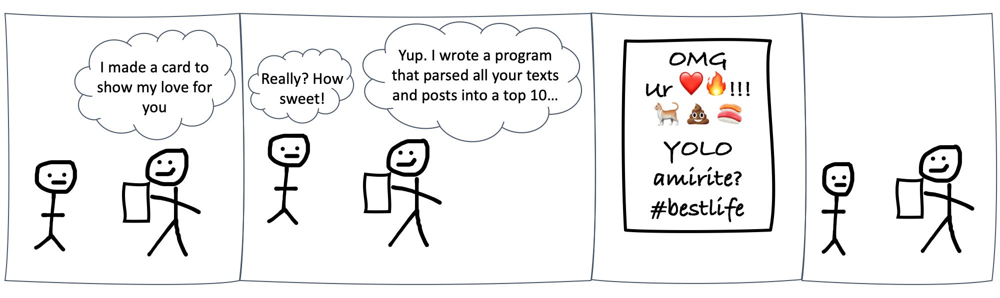

# Strings, Dates, and Tidying {#rprog3}

```{r rprog2-1, include=FALSE}
knitr::opts_chunk$set(echo = TRUE, fig.align = 'center')
library(tidyverse)
library(lubridate)
library(knitr)
library(kableExtra)
library(bookdown)
```

```{r load_daily_show, echo = FALSE, message = FALSE}
daily_show <- read_csv(file = "data/daily_show_guests.csv", skip = 4)
daily_show <- rename(.data = daily_show,
                     year = YEAR,
                     job = GoogleKnowlege_Occupation, 
                     date = Show, 
                     category = Group,
                     guest_name = Raw_Guest_List)
```

## Ch. 6 Objectives

This Chapter is designed around the following learning objectives. Upon completing this Chapter, you should be able to:  

- Define the meaning of "strings" and "date time" objects in R
- Manipulate character strings using the `stringr` and `tidyr` packages of functions
- Parse strings using regular expressions (regex)
- Describe how R stores the POSIXct date and time object internally
- Convert a column to a date format using functions from the `lubridate` package
- Extract information from a date object (e.g., month, year, day of week) using `lubridate` functions
- Search, organize, and visualize data that are linked to date objects
- Apply functions from the `dplyr` and `tidyr` packages to make data frames "tidy"

## Strings {#strings}
A ***string*** is a character variable like "John", or "blue", or "John's sample 8021A turned blue". 

**String variables are defined in R using quotes `" "`** and stored as a `character` class; they often show up in data analysis in one of two ways:  

  1. As ***metadata***. Metadata means: "data that describe other data".  A *readme.txt* file is metadata; notes and code comments are metadata - all of these types of data usually come in the form of strings and are included **with the data your are analyzing** but not **in the data set** itself.  
  
  2. As ***vectorized data***.  In R programming, *"vectorized"* means: stored as a     column of data.  Examples of vectorized string variables you might find include things like: "participant names", or "survey responses to question 1", or "mode of failure".  The examples below show how string variables are created in R. 
    
``` {r strings-1}
# examples of vectorized string data
names_respond <- c("Ahmed", 
                   "Josh", 
                   "Mateo", 
                   "William", 
                   "Ali", 
                   "Wei", 
                   "Steve-O",
                   "John")
q1_responses <- c("Because you told me to do it.",
                  "It seemed like the right thing to do at the time.",
                  "Because I had been over-served.",
                  "I don't know. I just did it.",
                  "I got caught up in the heat of the moment.",
                  "I was given an opportunity. I took my shot.",
                  "I plead the 5th.",
                  "I could ask you the same question.")
failure_mode <- c("fracture",
                  "yielding", 
                  "deflection", 
                  "fatigue", 
                  "creep")

#proof
class(names_respond)
```
    
The first step in analyzing a string is to parse it. **To parse means to examine the individual components.** For example, when you read this sentence you parse out the words and then assign meaning to those words based on your memory, your understanding of grammar, and the context in which those words occur (i.e., whether you are reading an instruction manual, a text message, a novel, or a warrant for your arrest). Strings can be challenging to analyze because computers are built on logical operations and mathematics; strings are neither of those. Computers have fantastic memory, are OK at grammar, and are comically poor at contextualization. Taken together, this means that strings can be challenging (but not impossible) to analyze using computers. 

``` {block, type="rmdnote"}
Are you active on social media platforms like Instagram or Twitter?  You can bet that a computer program has downloaded and parsed all of your posts, each one as a string. You can learn a lot about a person (and their buying habits) from what they post online!
```

In this chapter, we will introduce a few simple string functions from `{base}` R and the `stringr` package. We will also introduce the concept of **regular expressions** as a means to perform more advanced string manipulation.

``` {r parse-comic, echo=FALSE}

```

### String detect, match, subset
One of the simplest string operations is to search whether a string contains a pattern of interest. The `stringr` package (part of the [Tidyverse](https://stringr.tidyverse.org/)) was developed to simplify the analysis of strings. Most of the functions in `stringr` begin with `str_` and end with a specific function name. A full list of functions is provided [here](https://stringr.tidyverse.org/reference/index.html). Some examples:  

  **`str_detect()`** returns a vector of logical values (TRUE/FALSE) indicating whether the pattern was detected within each string searched. The function takes two arguments, the `string` to be searched and the `pattern` to search for.  Let's search for the pattern `"Josh"` in the character vector of strings, `names_respond`, that we created above:
  
``` {r string-2}
str_detect(string = names_respond, pattern = "Josh")
```
As expected, only one string in the vector produced a match.  

An added benefit of logical functions like `str_detect()` is that return values of `TRUE` are coded as 1 and `FALSE` as 0.  Thus, if we `sum()` the result of the `str_detect()` search, we will get the cumulative number of matches to `"Josh"` from within our data.

``` {r string-2a}
str_detect(string = names_respond, pattern = "Josh") %>%
  sum()
  
```
In other words, logical functions like `str_detect()` allow us to do math on string data! For example, we can now calculate the proportion of `"Josh"` entries within our sample:

``` {r string-2b}
str_detect(string = names_respond, pattern = "Josh") %>%
  sum() / length(names_respond)
  
```

  **`str_extract()`** takes the same arguments as `str_detect()` but returns a vector of the matched values (by string index). By *"matched values"*, I mean only the portion of the string for which the search created a match.
  
``` {r string-3}
str_extract(string = names_respond, pattern = "Jo")
```

  **`str_subset()`** returns only the entries that were matched (i.e., if a match was detected, then the entire string that was matched is returned).  If we subset our short list of names to the pattern of letters `"li"`, we get:
  
``` {r string-4}
str_subset(string = names_respond, pattern = "li")
```
  
To note, there are `{base}` R versions of all these stringr functions.  Most are performed with the `grep` family of functions. The term *"grep"* is an acronym for **<u>G</u>lobal <u>R</u>egular <u>E</u>xpression <u>P</u>attern** (more on *regular expressions* below).  Many of "old-school" coders use this family of functions (meaning: you will encounter them in the wild), so it's worth mentioning them.

``` {r string-table, echo=FALSE}
string_table <- tibble(
  stringr_funcs = c("str_detect(x, pattern)", 
                    "str_match(x, pattern)",
                    "str_subset(x, pattern)"),
  base_funcs = c("grepl(pattern, x)",
                 "regexec(pattern, x) + regmatches()", 
                 "grep(pattern, x, value = TRUE)")
)

knitr::kable(string_table)
```
### Regular Expressions
Before going much farther, we should spend some time discussing ***regular expressions*** or **regex** for short. When we pass a `pattern` argument to a function like `str_detect()`, the function treats that argument like a "regex". Up until this point, I have only passed simple character strings as `pattern` arguments (i.e., `pattern = "Josh"`).  In reality, we can create much more advanced search criteria using **regex** syntax within our search patterns. 

``` {block, type="rmdnote"}
A **regular expression** is a sequence of characters that define a search pattern to be implemented on a string. 
```

Regex sequences allow for pattern searching with logical and conditional relations, for example, the following text search patterns can be coded as regex:  

  * "any letter followed by the numbers 3, 4, or 5" ...  [:alpha:][345]
* "strings beginning with the letters 'ID' and followed by four numbers" ... ^ID[:digit:]{4}

In the R programming language, regular expressions follow the POSIX 1003.2 standard (regex can have different syntax based on the underlying standard). Regex are created by including search syntax (i.e., symbols that communicate search parameters) within your quoted string. For example, square brackets around a string `[]` indicate a search for *any* of the characters within the brackets (conversely, to match *all* the characters you simply include them in quotes). To search for any digit or whitespace, you would add a `\d` or a `\s` to the regex, respectively.

One challenging aspect of string searching in R, however, is that certain "special characters" like the quote `"` and the backslash `\` symbol must be explicitly identified within string in order to be interpreted by R correctly. To identify these *special characters* in a string, you need to ***"escape"*** that character using a backslash `\`. Thus, if you want to search for a quote symbol, you would type in `\"`.  Whenever a regex requires the use of a `\`, you have to identify it within a string as `\\`.   The table below shows some basic regex syntax and how they would be implemented in an R string.


``` {r regex-1, echo=FALSE}
table_regex <- tibble(
  regex_symbols = c("\\\\d", 
                    "[abc]", 
                    "[a-z]", 
                    "[^abc]", 
                    "(abc)",
                    "^b",
                    "$b",
                    "a|b"),
  match_examples = c("Any digit", 
                     "matches a, b, or c", 
                     "matches every character between a and z",
                     "matches anything except a, b, or c",
                     "creates a \"capture group\" whereby abc must occur together",
                     "look for \"b\" at the start of a string",
                     "look for \"b\" at the end of a string",
                     "match a or b"),
  example_code = c("\"\\\\\\\\d\"", 
                   "\"[abc]\"", 
                   "\"[a-z]\"", 
                   "\"[^abc]\"",
                   "\"(abc)\"",
                   "\"\\^b\"",
                   "\"\\$b\"",
                   "\"a|b\"")
)
knitr::kable(table_regex, 
             align = "c", 
             col.names = c("Regex syntax","String to be matched", "Example in R"),
             caption = "Basic Regex Search Syntax and Example Implementation in R")
```
**Regex** sequences have seemingly no end of sophistication and nuance; you could spend dozens of hours learning to use them and hundreds more learning to master them.  We will only introduce basic concepts here.  More in-depth introductions to regex syntax and usage can be found on [H. Wickham's R course](http://r4ds.had.co.nz/strings.html), on the `stringr` [cheatsheet](https://github.com/rstudio/cheatsheets/raw/master/strings.pdf) developed by RStudio, and through practice with, my personal favorite, a game of [Regex Golf](https://alf.nu/RegexGolf).

### String split, replace
  
  `str_split()` will split a string into two (or more) pieces when a match is detected. The string will always be split at the first match and again at each additional match location, unless you specify that only a finite number of `n` matches should occur.  Note, the string is split on each side of the match, which itself is not included in the output.
  
``` {r string-5}
str_split(string = names_respond, pattern = "t")
```
  
  `str_replace()` searches for a match and then replaces the matched value with a new string of your choosing.  The function takes three arguments: the `string` to be searched, the `pattern` to match, and the `replacement` string to be inserted. Let's replace the first period detected in each of hte `q1_responses` strings with a question marks.  Both `.` and `?` are *special characters* so we need to *"escape"* each of these symbols with two backslashes `\\`.
  
``` {r string-6}
str_replace(string = q1_responses, 
            pattern = "\\.", 
            replacement = "\\?")

```

Note that `str_replace()` 

## Dates and Date-times

To begin, we discuss how `{base}` R code  handles dates and times, since there is a ton of code out there that utilizes these older functions. We will then quickly transition to the `lubridate` family of functions (part of the Tidyverse) because of their versatility and ease-of-use.  

### Dates and Times in base R

Dates and times in base R all proceed from an *"epoch"* or *time origin*.  In R, the *epoch* or "dawn of time" occurred at midnight on January 1^st^, 1970.  For the sake of the R programming world, the concept of time started at that precise moment and has moved forward ever since.  To note: R can handle date-times before 1/1/1970; it just treats them as negative values!  

To see a date-time object, you can tell R to give you the current "System Time" by calling the `Sys.time()` function.

``` {r sys-time}
Sys.time()
```
As you can see, we got back the date, time, and current timezone used by my computer.  If you want to see how this time is stored in R internally, you can use `unclass()`, which returns an object value with its class attributes removed.  When we wrap `unclass()` around `Sys.time()`, we will see the number of seconds that have occurred between the epoch of 1/1/1970 and right now:

``` {r unclass-time}
unclass(Sys.time())
```

That's a lot of seconds.  How many years is that?  
Just divide that number by [60s/min $\cdot$ 60min/hr $\cdot$ 24hr/d $\cdot$ 365d/yr] ~ `r unclass(Sys.time())/60/60/24/365` years.  
This calculation ignores leap years but you get the point...

### Date-time formats
Note that the `Sys.time()` function provided the date in a ***"year-month-day"*** format and the time in an ***"hour-minute-second"*** format: `r Sys.time()`

Not everyone uses this exact ordering when they record dates and times, which is one of the reasons working with dates and times can be tricky.  You probably have little difficulty recognizing the following date-time objects as equivalent but not-so-much for some computer programs:

``` {r date-times-1, echo = FALSE}
date_time <- tibble(examples = c("12/1/99 8:46 PM",
                                 "1-Dec-1999 20: UTC",
                                 "December 1st, 1999, 20:46:00"))

knitr::kable(date_time, col.names = NULL, 
             caption = "Date-time objects come in different forms") %>%
  kable_styling(full_width = F,  bootstrap_options = "striped")

```

``` {block, type="rmdnote"}
You will often see time referenced with a **"UTC"**, which stands for *"Universal Time, Coordinated"*.  UTC is preferred by programmers because it doesn't have a timezone and it doesn't follow *Daylight Savings Time* conventions (daylight savings is the bane of many coders).

In practice, UTC is the same time as GMT (Greenwich Mean Time, pronounced "gren-itch") but with an important distinction.  GMT is one of the many [time-zones](https://wikipedia.org/wiki/List_of_tz_database_time_zones) laid out across Earth's longitude, whereas, **UTC has no time zone**.
```

### Date-time classes in R

R has several classes of date-time objects, none of which are easy to remember:  

1. **`POSIXct`** - stored as the time, in seconds, between the `epoch` of 1970-01-01 00:00:00 UTC and the date-time object in question.  
    * the 'ct' stands for *"continuous time"* to represent "continuous seconds from origin";
    * A `POSIXct` object is a single numeric vector (and so provides for efficient computing).
2. **`POSIXlt`** - stored as a list of date-time objects.  
    * the 'lt' stands for *"list time"*.
    * A `POSIXlt` list contains the following elements:
      * *sec* as 0–61 seconds
      * *min* as 0–59 minutes
      * *hour* as 0–23 hours
      * *mday* as 1–31 day of the month
      * *mon* as 0–11 months after the first of the year
      * *year* as Years since 1900
      * *wday* as 0–6 day of the week, starting on Sunday
      * *yday* as 0–365 days of the year.
      * *isdst* as a flag for Daylight savings time.  Positive if in force, zero if not, negative if unknown.
3. **`POSIXt`** - this is a virtual class.  `POSIXt` (without the "l") is an internal way for R to convert between `POSIXct` and `POSIXlt` date-time objects.  
    * Think of the `POSIXt` as a way for R to perform operations/conversions between a `POSIXct` and `POSIXlt` object without throwing an error your way.

As a reminder, here are some of the most common **vector classes** in R:

``` {r vect-classes, echo=FALSE, warning=FALSE}

vect_classes <- tibble(classes = c("`character`",
                                   "`numeric`",
                                   "`factor`",
                                   "`Date`",
                                   "`logical`",
                                   "`date-time`"),
                       examples = c("\"Chemistry\", \"Physics\", \"Mathematics\"",
                                    "10, 20, 30, 40",
                                    "Male [underlying number: 1], Female [2]",
                                    "\"2010-01-01\" [underlying number: 14,610]",
                                    "TRUE, FALSE",
                                    "\"2020-06-23 11:05:20 MDT\""))
knitr::kable(vect_classes, col.names = c("Class", "Example")) %>%
  kable_styling(full_width = F,  bootstrap_options = "basic")
```

To discover the class of a vector (including a column in a dataframe -- remember
each column can be thought of as a vector), you can use `class()`:

```{r date-1, warning = FALSE}
class(Sys.time())
```

Both the `POSIXct` and `POSIXlt` class of objects return the same value to the user; the difference is really in how these classes store date-time objects internally.  To examine them, you can coerce `Sys.time()` into each of the two classes using `as.POSIXct` and `as.POSIXlt` functions and then examine their attributes.

``` {r ct_attr}
time_now_ct <- as.POSIXct(Sys.time())
unclass(time_now_ct)
```

``` {r lt_attr}
time_now_lt <- as.POSIXlt(Sys.time())
str(unclass(time_now_lt)) # the `str()` function makes the output more compact
```
It's easy to see why the `POSIXct` object class is more computationally efficient; but it's also nice to see all the date-time information packed into the `POSIXlt`.  This is why R keeps a key to unlock both using `POSIXt`.  As my father used to say: clear as mud?

### Reading and classifying date-times
Oftentimes, when data is read into R, there are column elements that contain date and time information.  These dates and times are often interpreted by R as *character* vectors, which means they have lost their relational attributes (i.e., you cannot subtract "Monday 08:00" from "Wednesday 12:00" and get "2 days 4 hours"). If we want to analyze dates and times in a relational way, we need to instruct R to recognize these as date-time objects (i.e., as either the `POSIXct` or `POSIXlt` class). Thus, to convert a character vector into date or date-time object requires a change of that vector's ***class***.

Date-time elements can be tricky to work with for a few reasons:  

1. Different programs store and handle dates and times in different ways  
2. The existence of time zones means that date-time values can change with location
3. Date-time strings can be separated with spaces, colons, commas, slashes, dashes, or a mix of all those together (see Table \@ref(tab:date-times-1))

The `{base}` R function to convert between `character` classes and `date-time` classes is the function `strptime()`, which is short for *"**str**ing **p**arse into date-**time**"*. I mention this function not because I encourage you to use it but because I want you to be able to recognize it.  The function has over 39 conversion specifications that it can take as arguments.  That is to say, this function not simple to master.  If you are a glutton for punishment, I invite you to read the R Documentation `?strptime`.

In **summary** here are a few `{base}` R functions on date-time object that are worth knowing:

``` {r base-r-times, echo = FALSE}

base_r_times <- tibble(functions = c("Sys.Date()", 
                                     "Sys.time()",
                                     "Sys.timezone()",
                                     "as.POSIXct()",
                                     "as.POSIXlt()",
                                     "strptime()"),
                       returned = c("Current system date",
                                    "Current system date-Time",
                                    "Current system timezone",
                                    "date-time object of class POSIXct",
                                    "date-time object of class POSIXlt",
                                    "date-time object of class POSIXlt"),
                       examples = c("\"2020-06-23\"",
                                    "\"2020-06-23 11:05:20 MDT\"",
                                    "\"America/Denver\"",
                                    "\"2020-06-23 11:05:20 MDT\"",
                                    "\"2020-06-23 11:05:20 MDT\"",
                                    "\"2020-06-23 11:05:20 MDT\"")
)

knitr::kable(base_r_times, col.names = c("{base} R Function",
                                         "Value Returned",
                                         "Example"), 
             caption = "Basic Date-time functions") %>%
  kable_styling(full_width = F,  bootstrap_options = "striped")
```

## `Lubridate` {#lubridate}
The `lubridate` package was developed specifically to make life easier when working with date-time objects. You can find out more information on `lubridate` [here](https://lubridate.tidyverse.org/).

### `Lubridate` Parsing Functions
One of best aspects of `lubridate` is its ability to parse date-time objects with simplicity and ease; the `lubridate` parsing functions are designed as "named-to-order". Let me explain:  

> <span style="color: purple;"> **Parse**: ***to break apart and analyze the individual components*** (of something, like a character string) </span>

* If a character vector is written in "**y**ear-**m**onth-**d**ay" format (i.e., `"2020-Dec-18"`), then the `lubridate` function to convert that vector is `ymd()`.

* If a character vector is written in "**d**ay-**m**onth-**y**ear" format (i.e., `"18-Dec-2020"`), then the `lubridate` function to convert that vector is `dmy()`.  Try it out:

``` {r lubridate-1}
#create a character vector
date_old <- "2020-Dec-18"

#prove to yourself it's a character class
class(date_old)

#convert it to a `Date` class with `ymd()`
date_new <- ymd(date_old)

#prove to yourself it worked
class(date_new)
```

That little conversion exercise may not have blown you away, but watch what happens when I feed the following set of wacky character vectors into that same `lubridate` parsing function, `ymd()`:

``` {r lubridate-2}

messy_dates <- c("2020------Dec the 12",
                 "20.-.12.-.12",
                 "2020aaa12aaa12",
                 "20,12,12",
                 "2020x12-12",
                 "2020   ....    12        ......     12",
                 "'20.December-12")

ymd(messy_dates)
```

That's right.  The `ymd()` parsing function figured them all out correctly with almost no effort on your part.  But wait, there's more!  The `lubridate` package contains parsing functions for almost any order you can dream up.  

``` {r lubridate-table1, echo = FALSE}

lubridate_parsers <- tibble(functions = c("`ymd()`",
                                           "`mdy()`",
                                           "`dmy()`"),
                            formats = c("year-month-day",
                                        "month-day-year",
                                        "day-month-year")
)


knitr::kable(lubridate_parsers, col.names = c("Parsing Function", "Format to Convert")) %>%
  kable_styling(full_width = F,  bootstrap_options = "basic")
```

And if you need to parse a time component, simply add a combination of `_hms` to the function call to parse time in "hours-minutes-seconds" format.  Some additional examples of how you would parse time that followed from a `ymd` format:

``` {r lubridate-table2, echo = FALSE}

lubridate_parsers2 <- tibble(functions = c("`ymd_h()`",
                                           "`mdy_hm()`",
                                           "`dmy_hms()`"),
                            formats = c("year-month-day_hours",
                                        "year-month-day_hours-minutes",
                                        "year-month-day_hours-minutes-seconds")
)

knitr::kable(lubridate_parsers2, col.names = c("Parsing Function", "Format to Convert")) %>%
  kable_styling(full_width = F,  bootstrap_options = "basic")
```
The beauty of the `lubridate` parsers is that they do the hard work of cleaning up the character vector, regardless of separators or delimiters within each string, and return either a `Date` or `Date-time` object class.

### Date-time manipulation with `Lubridate`

To convert the `date` column in the `daily_show` data into a Date
class, then, you can run:

```{r}
library(package = "lubridate")

class(x = daily_show$date) # Check the class of the 'date' column before mutating it

daily_show <- mutate(.data = daily_show,
                     date = mdy(date))
head(x = daily_show, n = 3)
class(x = daily_show$date) # Check the class of the 'date' column after mutating it
```

Once you have an object in the `Date` class, you can do things like plot by
date, calculate the range of dates, and calculate the total number of days the
dataset covers:

```{r eval = FALSE}
# report the min and max dates
range(daily_show$date)

# calculate the duration from first to last date
diff(x = range(daily_show$date)) 
```

We could have used these to transform the date in `daily_show`, using the following pipe chain: 

```{r message = FALSE}
daily_show <- read_csv(file = "data/daily_show_guests.csv",
                       skip = 4) %>%
  rename(job = GoogleKnowlege_Occupation, 
         date = Show,
         category = Group,
         guest_name = Raw_Guest_List) %>%
  select(-YEAR) %>%
  mutate(date = mdy(date)) %>%
  filter(category == "Science")
head(x = daily_show, n = 2)
```

The `lubridate` package also includes functions to pull out certain elements of a date, including: 

- `wday()` return the day of the week pertaining to a Date object
- `mday()` return the day of the month pertaining to a Date object
- `yday()` return the day of the year pertaining to a Date object
- `month()` return the month pertaining to a Date object
- `quarter()` return the quarter of hte year pertaining to a Date object
- `year()` return the year pertaining to a date object

For example, we could use `wday()` to create a new column with the weekday of each show: 

```{r}
mutate(.data = daily_show,
       show_day = wday(x = date, label = TRUE)) %>%
  select(date, show_day, guest_name) %>%
  slice(1:5)
```

```{block, type = "rmdwarning"}
R functions tend to use the timezone of **YOUR** computer's operating system by
default, or UTC, or GMT. You need to be careful when working with dates and
times to either specify the time zone or convince yourself the default behavior
works for your application.
```

## Tidy Data
***"Tidy Data"*** is a philosophy for how to arrange your data, like in a data
frame.  In his 
[2014 paper](https://www.jstatsoft.org/index.php/jss/article/view/v059i10/v59i10.pdf), Hadley Wickham states *"Tidy datasets provide a standardized way to link the*
*structure of a dataset (its physical layout) with its semantics (its meaning)."*  
The definition of a tidy dataset is straightforward:  

  1. Each variable forms a column.
  2. Each observation forms a row.
  3. Each type of observational unit forms a table.

The first two rules, *each variable forms a column* and *each observation forms a row*,
are relatively easy to implement.  In fact, most of the data frames that we have
used so far follow this convention.  The trick is to note that some column 
variables might look *independent* from one another, when in fact, the columns
represent a single variable broken out by some heirachical (or nesting) structure.

For example, the (untidy) Table below (\@ref(tab:grades-untidy)) shows exam 
grades for three students.  Table \@ref(tab:grades-untidy) is untidy because
the variable depicting the exam score shows up in three different columns.  
Another way to characterize the *untidiness* of this table is that we have three
different exams (Exam1, Exam2, Exam3) that represent a variable (Exam_# or 
Exam_type), that is not represented with a column.

``` {r grades-untidy, echo=FALSE}
set.seed(14)
grades_untidy <- tibble(
  Name = c("Harry", "Ron", "Hermione"),
  Exam1_Score = c(85, 81, 95),
  Exam2_Score = c(79, 75, 97),
  Exam3_Score = c(88, 89, 99)
) 

grades_tab1 <- knitr::kable(grades_untidy,
                            caption = "An Untidy Table of Exam Scores.") 
kable_styling(grades_tab1, bootstrap_options = "condensed", 
             position = "center",
             full_width = FALSE)
```

Thus, to tidy Table \@ref(tab:grades-untidy), we need to create a variable called `Exam` 
and move all the scores into a new column vector named `Scores`.

``` {r grades-tidy, echo=FALSE}
set.seed(14)
grades_tidy <- tibble(
  Name = rep(c("Harry", "Ron", "Hermione"), each = 3),
  Exam = rep(1:3, 3),
  Scores = c(85, 81, 95, 79, 75, 97, 88, 89, 99)
) 

grades_tab2 <- knitr::kable(grades_tidy, caption = "A Tidy Table of Exam Scores") 
kable_styling(grades_tab2, bootstrap_options = "condensed", 
             position = "center",
             full_width = FALSE)
```

For our work, one of the goals of data cleaning is to create datasets that 
follow this *tidy* convention.  Fortunately, the `tidyr::` package contains a 
useful function for re-arranging dataframes from untidy to tidy 
states: `pivot_longer()` 

`pivot_longer()` is designed to "lengthen" a data frame by 
  *"increasing the number of rows and decreasing the number of columns"*. This function typically requires four arguments and always creates two new columns
  as output:  
  
- `data =` the dataframe to be lengthened
- `cols =` a list of the columns that should be combined together (forming a
    single variable to be represented in a new, single column)
- `names_to` = this is an output column that 
    contains the **names** of the old columns that are being combined.
- `values_to` = this is the other output column that 
    contains the **values** from within the old columns that are being combined.
    
``` {block, type="rmdnote"}
The `pivot_longer()` function always creates two new columns:  

  - one column contains `names_to =  ` information 
  - the other column contains the `values_to = ` data.
```

In the case of Table \@ref(tab:grades-untidy), we are using `cols = ` to combine
`Exam1_Score`, `Exam2_Score` and `Exam3_Score` into a a column of 
`names_to = "Exam"` and the data represented in those three columns gets moved 
into a column of `values_to = "Scores"`.  We also add a call to `dplyr::mutate` and `dplyr::case_when` to convert strings to numbers.
  
``` {r pivot-longer}

tidygrades <- pivot_longer(data = grades_untidy,
                           cols = Exam1_Score:Exam3_Score,
                           names_to = "Exam",
                           values_to = "Scores") %>%
  mutate(Exam = case_when(
    Exam == "Exam1_Score" ~ 1,
    Exam == "Exam2_Score" ~ 2,
    Exam == "Exam3_Score" ~ 3
  ))
```

``` {r grades-tab3, echo=FALSE}
grades_tab3 <- knitr::kable(tidygrades, 
                            caption = "Pivot longer applied to untidy data") 
kable_styling(grades_tab3, 
              bootstrap_options = "condensed",
              position = "center",
              full_width = FALSE)
```

## Ch-6 Exercises  
  * Provide link to senators data frame.  Search 

## Ch-6 Homework


