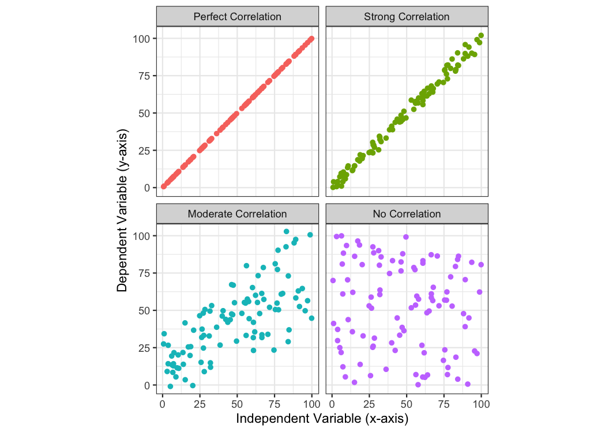
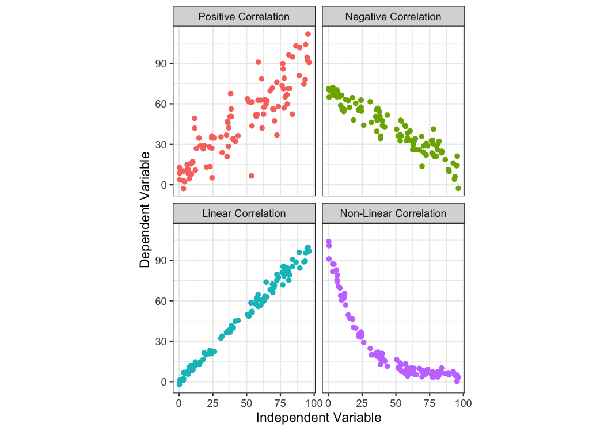

# Multivariate Data Exploration {#eda2}

```{r eda2, include=FALSE}
knitr::opts_chunk$set(echo = TRUE, fig.align = 'center')
library(tidyverse)
library(knitr)
library(bookdown)
library(scales)
library(kableExtra)
library(GGally)
```
## Ch. 7 Objectives
After this chapter, you should (know / understand / be able to ):

- Define correlation, causation, and their difference
- Conduct a formal exploratory data analysis on multivariate data using geoms from `ggplot`
- Create and interpret a scatterplot between two variables 
- Create and interpret a Q-Q plot
- Create and interpret directional bias in a Tukey mean difference plot
- Create and extract descriptive statistics and qualitative information from Boxplots


## Bivariate Data {#bivariate}
Whereas univariate data analyses are directed at "getting to know" the observations made for a single variable, bivariate (and multivariate) analyses are designed to examine the *relationship* that may exist between two (or more) variables. Like the Chapter on Univariate data, we will focus first on ***data exploration*** - a key step towards "getting to know" your data and one that should always proceed inferential statistics or "making conclusions about your data".

``` {block, type="rmdnote"}
Bivariate means *two variables* where the observations are paired (i.e., each time an observation is made we sample a value for both variables so that they are linked by place/time/observation).
```

## Scatterplot {#scatt}

Undoubtedly, you have seen scatterplots many times before but we will give them a formal treatment here. The **scatterplot** allows you to assess the strength, direction, and type of relationship between two variables of interest. This can be important for determining factors like:  

* Correlation  
* Linearity  
* Performance (of a measurement) in terms of precision, bias, and dynamic range   

Traditionally, a scatterplot shows paired observations of two variables with the ***dependent variable*** on the y-axis and the ***independent variable*** on the x-axis.  Creating a plot in this way means that, before you begin, you must make a judgement call about which variable *depends* on which.  The roots of this terminology/protocol lie in the practice of *linear regression* and the scientific method, the former of which we will discuss in more detail later.  For the purposes of exploratory data analysis, however, it actually doesn't matter which variable goes on which axis. That said, since we don't wish to break with tradition, let's agree to follow the dependent/independent variable guidelines so as not to invoke the wrath of the statistics gods.

**Statistics:**  
- The independent variable (x-axis) is thought to have some influence/control over the dependent variable (y-axis).

**Scientific Method:**  
The experimenter manipulates the control variable (independent, x-axis) and observes the changes in the response variable (dependent, y-axis). 

**Exploratory Data Analysis:**  
- We throw two variables onto a plot to investigate their relationship.  We make a guess about which one is the independent variable (x-axis) and which one is the dependent variable (y-axis) and we hope that nobody calls us out if we got it wrong.

### Causality
All this talk about **dependent** and **independent** variables is fundamentally rooted in the practice of ***causal inference*** reasoning: the ability to say that "action A" caused "outcome B".  Discovering (and proving) that one thing caused another to happen can be an incredibly powerful event.  It leads to the awarding of Nobel Prizes, the creation of new laws and regulations, guilt or innocence in court, the changing and convincing of human minds and behaviors, and simply put: more understanding.

A full treatment of causal inference reasoning is beyond the scope of this course, but we will, from time to time, delve into this topic.  The art of data science can be a beautiful and compelling way to demonstrate causality....but most of us need to learn to crawl before we can walk, run, or fly.  For now, let's put aside the pursuit of causation and begin with ***correlation***.

### Correlation
The scatterplot is a great way to visualize whether (and, to an extent, how) two variables are correlated.  

``` {block, type="rmdnote"}
Correlation: a mutual relationship or connection between two or more things; the process of establishing a relationship or connection between two or more measures.
```

``` {r corr_plots1, warning=FALSE, echo=FALSE, include=FALSE}

corr_plots1 <- tibble(x = runif(100, 0, 100),
                      y1 = x,
                      y2 = map_dbl(x, ~ (.x*(rnorm(1, mean = 1,  sd = 0.03)) + rnorm(1, mean = 0, sd = 2))),
                      y3 = map_dbl(x, ~ (.x*(rnorm(1, mean = 0.6,  sd = 0.2)) + rnorm(1, mean = 15, sd = 15))),
                      y4 = runif(100, 0, 100)
) %>%
  pivot_longer(y1:y4, names_to = "type") %>%
  mutate(types = as.factor(type))

levels(corr_plots1$types) <- c("Perfect Correlation", "Strong Correlation", "Moderate Correlation", "No Correlation")
  

p1 <- ggplot(data = corr_plots1,
                          aes(x = x, y = value)) +
  geom_point(aes(color = types)) +
  facet_wrap(facets = vars(types),
             ncol = 2) +
  theme_bw() +
  coord_fixed(ratio=1.0) +
  labs(x = "Independent Variable (x-axis)",
       y = "Dependent Variable (y-axis)") +
  theme(legend.position = "none")
 
ggsave("./images/correlation_example_1.png", dpi = 150)
```
Below are four examples of bivariate data with differing degrees of correlation: perfect, strong, moderate, and none.  These are qualitative terms, of course, what is "moderate" to one person may be poor and unacceptable to another.  Later on, in the modeling section \@ref(#model), we will discuss ways to assess the strength of correlation more quantitatively.
``` {r corr-example-1, echo = FALSE,  out.width = "700pt", fig.align = "center", fig.cap = "Scatterplot examples showing bivariate data with varying degrees of correlation."}

```
``` {r corr_plots2, warning=FALSE, echo=FALSE, include=FALSE}

corr_plots2 <- tibble(x = runif(100, 0, 100),
                     y1 = map_dbl(x, ~ (.x*(rnorm(1, mean = .8,  sd = 0.15)) + rnorm(1, mean = 10, sd = 10))),
                     y2 = map_dbl(x, ~ -(.x*(rnorm(1, mean = 0.6,  sd = 0.06)) - rnorm(1, mean = 70, sd = 5))),
                     y3 = map_dbl(x, ~ (.x*(rnorm(1, mean = 1,  sd = 0.02))^2 + rnorm(1, mean = 0, sd = 2))),
                     y4 = map_dbl(x, ~ (100*exp(-.x/20)*(rnorm(1, mean = 1,  sd = 0.03)) + rnorm(1, mean = 4, sd = 2)))
) %>%
  pivot_longer(y1:y4, names_to = "type") %>%
  mutate(types = as.factor(type))

levels(corr_plots2$types) <- c("Positive Correlation", 
                               "Negative Correlation", 
                               "Linear Correlation", 
                               "Non-Linear Correlation")
  

p2 <- ggplot(data = corr_plots2,
                          aes(x = x, y = value)) +
  geom_point(aes(color = types)) +
  facet_wrap(facets = vars(types)) +
  theme_bw() +
  coord_fixed(ratio=1) +
  theme(legend.position = "none") +
  labs(x = "Independent Variable",
       y = "Dependent Variable")
 
ggsave("./images/correlation_example_2.png", dpi = 150)
```
In addition to the strength of the correlation, the sign and form of the correlation can vary, too:  
  - **positive correlation**: the dependent variable *trends in the same direction* as the independent variable   
  - **negative correlation**: the dependent variable *decreases* when the independent variable *increases*  
  - **linear correlation**: the relationship between the two variables can be shown with a straight line  
  - **non-linear correlation**: the relationship between the two variables is curvilinear  

``` {r corr-example-2, echo = FALSE, out.width = "700pt", fig.align = "center", fig.cap = "Scatterplot examples showing bivariate data with varying types of correlation."}

```

### Correlation $\neq$ causation
``` {block, type="rmdnote"}
Causation: the process or condition by which one event, a cause, contributes to the occurence of another event, the effect. In this process the cause is partly or wholly responsible for the effect. 
```

Let's take a closer look at the dangers of mistaking a *correlated* relationship as *causal* relationship between two variables.  Shown below is a scatterplot that builds off the `mpg` dataset we first discussed in Chapter \@ref(dataviz). Using the `mpg` dataframe, we will plot the relationship between the number of cylinders in an engine (`cyl`, the independent variable) and that vehcile's fuel economy (`hwy`, the dependent variable). 

``` {r corr-example-3, echo = FALSE, message = FALSE, warning = FALSE, fig.cap = "Scatterplot of Engine Displacement vs. Fuel Economy"}

ggplot(data = (mpg), 
       aes(x = cyl, y = hwy)) +
  geom_jitter(aes(x = cyl, y = hwy),
             shape = 1,
             color = "blue",
             width = 0.1,
             height = 0.05,
             size = 2) +
  geom_smooth(method='lm', 
              se = FALSE,
              size = 0.5,
              color = "blue") +
  xlab("# of Cylinders") +
  ylab("Highway Fuel Economy (mi/gal)") + 
  theme_classic()
  

```
Looking at this plot, there appears a clear correlation between the number of cylinders in a vehicle and its fuel efficiency  A linear fit through these data gives a Pearson correlation coefficient of -0.76: not a perfect relationship but a significant one nonetheless. Does this mean that a *causal relationship* exists?  If so, then we only need to mandate that all future vehicles on the road be built with 4-cylinder engines, if we want more a fuel-efficient fleet!  That mandate, of course, would likely produce minimal effect.  Just because two variables are correlated doesn't mean that a change in one will ***cause*** a change in the other.

Those who understand internal combustion know that the number of cylinders is a design parameter more related to engine power than engine efficiency (i.e., the number of cylinders helps determine total displacement volume).  Indeed, the causal relationship for fuel efficiency, in terms of miles traveled per gallon, is due more directly to engine efficiency, vehicle drag coefficient, and vehicle mass.  If you want more fuel-efficient cars and trucks, you need more efficient engines that weigh less. Did you know that in the 1990s and early 2000s nearly all engine blocks were made from cast iron?  Today, nearly all of them are made from aluminum.  Can you guess why? 

> Did you know that being a smoker is correlated with having a lighter in your pocket?  Furthermore, it can be shown that keeping a lighter in your pocket is correlated with an increased risk of developing heart disease and lung cancer.  Does this mean lighters in your pocket cause lung cancer?

## Exploring Multivariate Data
With *multivariate data* we often consider more than just 2 variables of interest; however, visualizing more than 2 variables in a single plot can be challenging. There are advanced statistical approaches to exploring such data (e.g., multivariate regression, principal components, machine learning, etc.), but these techniques are beyond the scope of this course. Here, I will introduce a few graphical techniques that are useful for multivariate data exploration.  

### Faceting
One easy way to evaluate two or more variables is to create multiple plots (or facets) through the `ggplot2::facet` function. This function creates a series of plots, as panels, where each panel represents a different value (or level) of a third variable of interest. For example, let's create a ggplot2 object from the `mtcars` data set that explores the relationship between a vehicle's fuel economy and its weight.  First, let's create a simple bivariate scatterplot of these data (`mpg` vs. `wt`) and fit a linear model through the data (note: we haven't yet discussed modeling but more on [that here](#model)).

``` {r facet-1, message=FALSE, warning=FALSE, fig.cap="Scatterplot of fuel economy vs. vehicle weight from the `mtcars` dataset."}

# fit a linear model
g1_model <- lm(mpg ~ wt, data=mtcars)

#create a ggplot2 object
g1 <- ggplot(data = mtcars, 
             aes(x = wt, y = mpg)) + 
  geom_point() +
  geom_smooth(model = g1_model, method = "lm") + 
  ylab("Fuel Economy (mi/gal)") +
  xlab("Vehicle Weight (x1000 lb)")
g1
```
However, looking back at Figure \@ref(fig:corr-example-3), we know that the number of cylinders (`cyl`) is also associated with fuel efficiency. To examine at these three variables together (`mpg`, `wt`, and `cyl`) we can create a scatterplot that is *faceted* according to the `cyl` variable.  This is relatively easy to do in `ggplot2` by adding a `facet_grid()` layer onto our ggplot object.  The key arguments to pass into `facet_grid()` are:  

1. Whether we want to facet by **rows** or **columns**, and
2. The variable being used to create the facets.

In our case, column facets probably make the most sense so we would add code, `facet_grid(cols = vars(cyl)`, to the `ggplot2` object as follows:

``` {r facet-2, message=FALSE, warning=FALSE, fig.cap="Scatterplots of fuel economy vs. vehicle weight by number of cylinders in the engine (data from the `mtcars` dataset)."}

g1 + facet_grid(cols = vars(cyl),
                labeller = label_both) #this code adds names & values to the panel label

```
Interestingly, but perhaps not surprising, we can see that the vehicles with different cylinder numbers tend to have different fuel efficiencies, but even within these facets we still see a relationship between efficiency and vehicle weight.  

Here are the same data in a plot that is faceted by rows instead of columns.
``` {r facet-3, message=FALSE, warning=FALSE, fig.cap="Scatterplots of fuel economy vs. vehicle weight by number of cylinders in the engine (data from the `mtcars` dataset)."}

g1 + facet_grid(rows = vars(cyl),
                labeller = label_both)
```

### Coloring
We can also use color to indicate variation in data; this can be useful for introducing a third variable into scatterplots and time series plots. Note: when introducing a **color variable** into a plot, you must do so through an *aesthetic*, such as: `geom_point(aes(color = cyl))`

Let's recreate Figure \@ref(fig:facet-1) and highlight the `cyl` variable using difference colors. The addition of color provides us with the same level of insight as did the facets above.

``` {r colorplot-1, message=FALSE, warning=FALSE, fig.cap="Vehicle fuel economy vs. weight and colored by number of engine cylinders (data from mtcars)"}
# instruct R to treat the cyl variable as a factor with discrete levels
# this, in turn, tells ggplot2 to assign discrete colors to each level
mtcars$cyl <- as.factor(mtcars$cyl)

g3 <- ggplot(data = mtcars, 
             aes(x = wt, y = mpg, color = cyl)) + 
  geom_point() +
  ylab("Fuel Economy (mi/gal)") +
  xlab("Vehicle Weight, (x1000 lb)")

g3
```

``` {block, type="rmdwarning"}
When using color, be aware that many people are unable to distinguish red from green or blue from yellow. Many options exist to avoid issues from color blindness (e.g., the `viridis` palette) and websites like [color-blindness.com](https://www.color-blindness.com/coblis-color-blindness-simulator/) allow you to upload image files as a test against common forms.
```

Here is an updated version of Figure \@ref(fig:colorplot-1) that avoids issues with color blindness and, better yet, differentiates the `cyl` variable with both colors and symbols.

``` {r colorplot-2, message=FALSE, warning=FALSE, fig.cap="Vehicle fuel economy vs. weight and colored by number of engine cylinders (data from mtcars)"}

#"#330099","#CC0066","#FF6633", "#0099CC", "#FF9900","#CC6633", "#33CC99",

ggplot(data = mtcars, 
             aes(x = wt, 
                 y = mpg, 
                 color = cyl, 
                 shape = cyl)) + 
  geom_point(size = 2) +
  ylab("Fuel Economy (mi/gal)") +
  xlab("Vehicle Weight, (x1000 lb)") +
  scale_colour_manual(values = c("sandybrown", 
                                 "orangered", 
                                 "steelblue2")) +
  theme_classic()
```
``` {block, type="rmdtip"}
Whenever you use color to differentiate variables, use symbols, too. 
```
### Contour Plots

### Time-Series Density

## Ch-7 Exercises

## Ch-7 Homework
