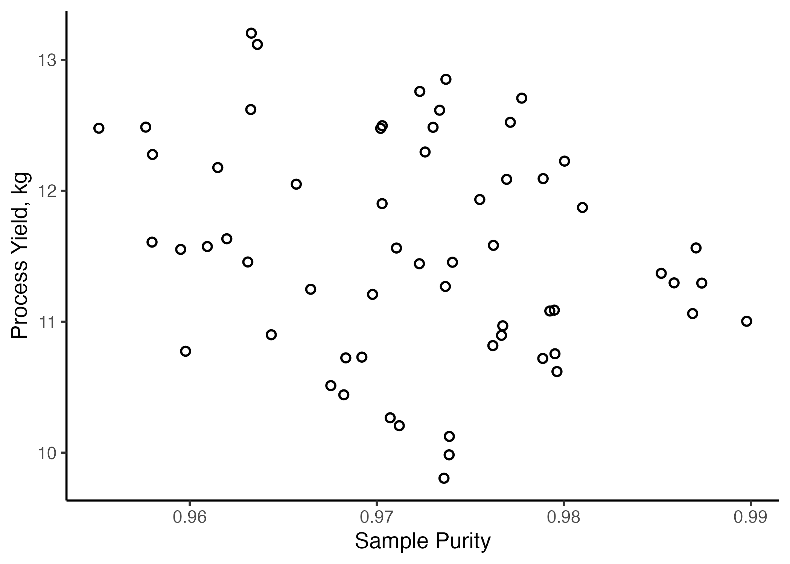

# Transformations and other Tricks {#eda3}
```{r edatips_intro, include=FALSE}
library(tinytex)
library(tidyverse)
library(gridExtra)
```
This chapter provides an introduction to several common techniques to organize, transform, and/or manipulate univariate data. I use the word *manipulate* here with good reason; many of these techniques can be used inappropriately or lead to inadvertent consequences, so tread carefully!  That warning aside, these techniques are useful and often allow you to gain insight into *"what the data are trying to tell you"*.  

## Objectives
This Chapter is designed around the following learning objectives. Upon completing this Chapter, you should be able to:  

- Define common approaches to data transformation  
- Explain the differences between *centering*, *rescaling*, and *standardizing* univariate data. 


## Transformation
The phrase *"Data Transformation"* means different things in different fields so we will define it here, in the statistical sense, as: ***applying one ore more mathematical operations to a variable*** (or in our case, all elements of numeric vector). You are undoubtedly familiar with data transformation, even if you haven't previously recognized it.  Some examples include:
- adding, subtracting, or multiplying a constant to all elements in a vector;
- taking the log, square root, or reciprocal of a variable;
- some combination of these approaches.

For example, your data are transformed whenever you convert temperature units from °F to °C, length units from inches to millimeters, or render a variable dimensionless (e.g., converting to units of percent, parts per million, or some other unitless value).  In addition to these "units transformations", we also conduct transformations to make the ***location*** and ***spread*** of data consistent, or to change the ***shape*** of a distribution of data (e.g., to reduce skewness or to linearize a variable). These latter approaches are often employed during multivariate analyses to help your variables "play nicely together" within the analytic framework you set forth. More on this to come.

```{block, type="rmdnote"}
There are two key facets to data transformation: **justification** and **documentation**.  Whenever data are transformed, you must provide a good reason for doing so (hint: there are many good reasons and also a few bad ones). Furthermore, **you must adequately document "how" and "why" the data were transformed**, so that others can understand your work and reproduce your results if needed.
```

### Centering
Centering means ***to subtract a constant from all values*** in a vector.  The **constant** to be subtracted could be an estimate of the data's central tendency, like the mean or median (hence the term *center*-ing), or it could be some residual value that you want to remove from all observations.  If you subtract the mean from every value of a vector, then the new vector will have a mean of 0; this can be useful when analyzing multiple variables (for example in a multivariate regression model), each of which has a different location.  Centering ***changes the location*** of a variable but ***spread stays the same***.

In engineering, the most common reason for centering data is not to subtract the mean or median value, but instead to "background subtract" or "zero" a set of univariate observations.  If you have ever used a digital scale to measure the weight of an object, you've probably noticed that when you turn it on, the scale does not always read zero.  Most of the time the instrument has a way to "re-zero" itself prior to use, but this is not always the case.  If your scale shows a mass of 298 g when nothing is placed on it, then you probably want to (1) document that value before taking measurements and (2) subtract a value of 298 from all subsequent weights that you perform with this scale.  That subtraction is an example of a "centering" transformation. 

``` {r centering1, echo=FALSE, eval=FALSE}
data1 <- tibble(
  uncenter = rnorm(100, mean = 600, sd = 30),
  centered = uncenter - 298)

p1 <- ggplot(data = data1) +
  stat_density(aes(x = uncenter),
               alpha = 0.5,
               fill = "darkgreen",
               adjust = 2) +
  xlab("Uncorrected weight (g)") +
  ylab("Relative Counts") +
  xlim(c(0,900)) +
  theme_minimal() +
  theme(axis.text.y = element_blank()) 

p2 <- ggplot(data = data1) +
  stat_density(aes(x = centered),
               alpha = 0.5,
               fill = "darkblue",
               adjust = 2) +
  xlab("Corrected weight (g)") +
  ylab("Relative Counts") +
  xlim(c(0,900)) +
  theme_minimal() +
  theme(axis.text.y = element_blank()) 

grid.arrange(p1, p2)

#ggsave("./images/centering.png")

```

``` {r centering-anno, echo=FALSE, fig.align="center", fig.cap="Data are sometimes centered to remove spurious values"}
knitr::include_graphics(path = "./images/centering_anno.png", dpi = 150)
```

### Rescaling
**To rescale a variable means to divide (or multiply) all values by a constant**.  Whereas *centering* is an arithmetic transformation, the process of *rescaling* data is multiplicative.  Rescaling changes both the location and spread of the data.

Some reasons to rescale data include:  

- to show variables of different magnitudes together on the same axis of a plot;
- to make the spread of two or more variables similar (e.g., when conducting an analysis of variance or multivariate regression with variables that each have different scales);
- when you want to render a variable dimensionless (e.g., when converting to percentage units).

## Normalization and Standardization
In a generic sense, to ***"normalize"*** a variable means: **to transform that variable so that it can be compared, evaluated, or comprehended more easily.**  Normalization often involves a combination of centering and rescaling operations that not only change the location and spread of the data, but also the *meaning* of data.  Normalization is used all the time. 
``` {block, type = "rmdwarning"}
Like *"transformation"*, the word "*normalization*" is defined differently in different fields, so be explicit when using this term in your work.  To some, the word normalization means to "make a variable normally distributed"; to others, it means to "normalize a database" so that redundancies are eliminated. 
```

There are many types of normalization operations; we will discuss a few examples here:  

### Rate normalization
To perform a rate normalization is **to divide one variable into another**, often to report something in terms of a rate.  

  - Two cars can have the same range (how many miles they can travel on one tank of gas) but different rates of fuel efficiency (miles traveled per gallon)  
  - Two countries can have the same GDI (*gross domestic income*; the sum of all  wages earned) but widely different rates of "per capita" income. 

### Standardizing
Standardization is a special case of transformation/normalization where each value in a set of observations (or vector) is subtracted by some level (often the central tendency) and divided by the spread.  When working with normally distributed data, the standardization of variable x_i into z_i is:

     $z_{i} = \frac{x_{i}-\overline{x}}{\sigma_{x}}$

where the mean and standard deviation of x are $\overline{x}$ and $\sigma_{x}$, respectively. The *standardization* of a variable renders the mean to 0 and the standard deviation to 1.  This type of normalization is useful when you wish to study relationships between multiple variables, each with different scale.

### Reducing Skewness
Sometimes your data are *not normally distributed*, even though you want them to be. In that case you still have options.  Some transformations, like the log, square root, or inverse, will make the spread of the data symmetric and approximately Gaussian. These transformations are commonly used to meet the needs (read: underlying assumptions) of many statistical models.

``` {r reduce-skew1, echo=FALSE, eval=FALSE, warning=FALSE, message=FALSE}
mean.data <- log(40)
sd.data <- log(5.5)

log.data <- tibble(
  norm1 = rlnorm(n = 1000, meanlog = mean.data, sdlog = sd.data) + 80
)
p3 <- ggplot(data = log.data) +
  stat_density(aes(x = norm1),
               kernel = "gaussian",
               adjust = 3.5,
               alpha = 0.75,
               fill = "darkorange") +
  xlab("Skewed Data") +
  xlim(c(0,400)) +
  theme_classic() +
  theme(axis.text.x = element_blank(),
        axis.text.y = element_blank(),
        axis.title.y = element_blank(),
        aspect.ratio = 1)

p4 <- ggplot(data = log.data) +
  stat_density(aes(x = log(norm1 - 80)),
               kernel = "gaussian",
               adjust = 2.5,
               alpha = 0.75,
               fill = "navy") +
  xlab("Normal Data") +
  theme_classic() +
  theme(axis.text.x = element_blank(),
        axis.text.y = element_blank(),
        axis.title.y = element_blank(),
        aspect.ratio = 1)

p5 <- grid.arrange(p3, p4, nrow=1)

ggsave(plot = p5, "./images/reduce_skew.png")
```

```{r reduce-skew2, echo=FALSE, fig.align="center", fig.cap="The log(x) transform is often used to reduce skewness in a variable."}

knitr::include_graphics("./images/reduce_skew_anno.png", dpi = 150)
```
## Stratification
**To stratify a sample means: to divide the sample into subsets (aka strata).** 

Stratified analyses can be performed many ways; one particularly useful way is graphically, by creating a stratification plot.  A stratification plot is like any other visualization that you have created, except that the strata are identified (i.e., called out) through the use of color, lines, symbols, etc.  Let's use the following example to demonstrate:

``` {r stratify1, echo=FALSE, eval=FALSE, message=FALSE}
set.seed(2)
levels = c(0.99, 0.98, 0.975)
strat.data <- tibble(
  reactor = rep(c("a", "b", "c"), 
             each = 1, 
             times = 20),
  purity = rep(runif(n = 60, 
                     min = levels - 0.02, 
                     max = levels), 
               times = 1)) %>%
  mutate(yield = 10 + 
           100*(1 - purity)*rnorm(n = 60, mean = 1, sd = 0.1) + 
           (1 - purity)) %>%
  mutate(yield2 = case_when(
    reactor == "a" ~ yield,
    reactor == "b" ~ yield - 1.25,
    reactor == "c" ~ yield - 2.5
  ))


unstratified <- ggplot(data = strat.data,
       aes(y = yield2, 
           x = purity)) +
  geom_point(size = 2,
             shape = 1,
             stroke = 1) +
  labs(color = "Reactor",
       x = "Sample Purity",
       y = "Process Yield, kg") +
  theme_classic()

ggsave("./images/unstratified.png")
```
A manufacturing operation is investigating the production of an expensive titanium alloy, where a 25% increase in the production yield of the alloy manufacturing process means the difference between profit and loss.  The materials group believes that sample purity should have an effect on the yield and for the past month, all three reactors at the plant have been producing alloys from Ti feed stock of varying purity. After one month, you decide to visualize the relationship between *process yield* and *sample purity* with a scatterplot, `geom_point()`.

``` {r stratify2, fig.align="center", fig.cap="Yield vs. Purity from the plant's three reactors over one month"}

```
Examination of Figure \@ref(fig:stratify2) reveals that, while there is considerable variation in the data, a clear relationship is not apparent between sample purity and process yield. However, it occurs to you that perhaps there is variation in results between the three different reactors in the plant.  Therefore, you decide to repeat this analysis ***stratifying the data by reactor type***.  In this case, you repeat the `ggplot()` call with an extra aesthetic of `color = reactor` in the scatterplot.

``` {r stratify3, echo=FALSE, eval=FALSE, message=FALSE}
stratified <- ggplot(data = strat.data,
       aes(y = yield2, 
           x = purity,
           color = reactor,
           stroke = 1)) +
  geom_point(size = 2,
             shape = 1) +
  labs(color = "Reactor",
       x = "Sample Purity",
       y = "Process Yield, kg") +
  theme_classic() +
  theme(legend.position = c(0.85, 0.8),
        legend.box.background = element_rect(colour = "black")) 

ggsave("./images/stratified.png")
```

``` {r stratify-png, fig.align="center", fig.cap="Yield vs. Purity over one month, stratified by reactor type"}
knitr::include_graphics("./images/stratified.png")
```
Figure \@ref(fig:stratify3) tells a very different story! Now we can see that two relationships are clearly evident.  

  1. There is a definite inverse relationship beteen *sample purity* and the *process yield* and  
  2. For a given purity level, each reactor has a different output.  Clearly, there is something different about each of these reactors that merits further study...  
  
## Censoring and Truncating Data
Have you ever heard the phrase ***"don't make the exception the rule"***? 

I think this phrase means, *don't let your judgment be governed solely by outliers.*  Whether or not this is good advice probably depends on the situation, but I do think one should have the ability to detect ***when an outlier has leverage over a situation***. 

Data visualization (like histograms, density plots, time-series, and boxplots) is a useful way to detect outliers, because these plots make it clear that one or more observations *"don't seem to belong with the rest"*.  For example, the plot below shows two boxplots: one depicts the rate of childhood asthma at 15 schools across a district, the other depicts the concentration of particulate black carbon (a type of air pollutant generated by incomplete combustion).

``` {r outlier1}
asthma.data <- tibble(
  asthma.rate = c(8, 6, 12, 18, 9, 8, 15, 14, 14, 10, 16, 9, 12, 15, 9),
  black.carbon = c(3.2, 2.5, 4.6, 6.1, 3.3, 3.1, 6.1, 5.3, 4.5, 3.3, 6.4, 3.7, 5.1, 6.8, 12)
)


ggplot(data = asthma.data) +
  geom_boxplot(aes(x = 1, y = asthma.rate)) +
  geom_boxplot(aes(x = 2, y = black.carbon)) +
  theme_classic()

ggplot(data = asthma.data) +
  geom_point(aes(x = black.carbon,
                 y = asthma.rate)) +
  theme_classic()

model <-lm(asthma.rate ~ black.carbon, data = asthma.data)
summary(model)
```

``` {block, type="rmdwarning"}
**Censoring data is dangerous business.** If you are going to censor an outlier, make sure to document **how** you discovered the outlier, **why** you believe it should be censored, and **"whether or not that censoring had an effect on your results/conclusions"**.  Then make sure to broadcast your thinking to everyone who comes in contact with your report.  If you try to hide your outliers, you are being unethical and setting yourself up for disaster.
```

```