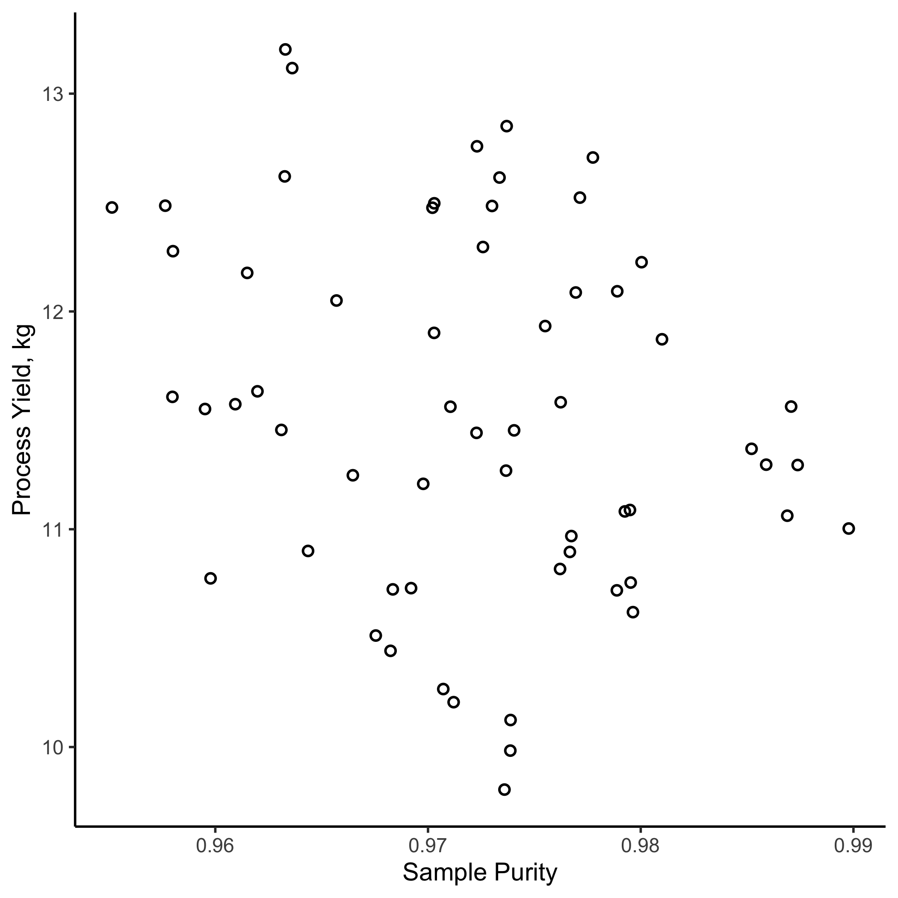
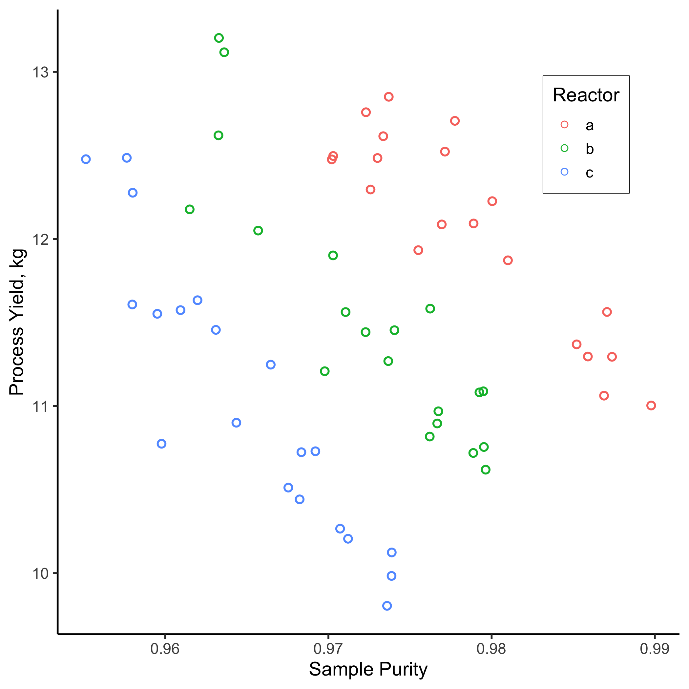

# Transformations and Other Tricks {#transform}
```{r edatips_intro, include=FALSE}
library(tinytex)
library(tidyverse)
library(gridExtra)
library(ggforce)
library(knitr)
library(bookdown)
library(knitr)
library(MASS)
```
This chapter provides an introduction to several common techniques to organize, transform, and/or manipulate univariate data. I use the word *manipulate* here with good reason; many of these techniques can be used inappropriately or lead to inadvertent consequences, so tread carefully!  That warning aside, these techniques are useful and often allow you to gain insight into *"what the data are trying to tell you"*.  

## Ch. 9 Objectives
This Chapter is designed around the following learning objectives. Upon completing this Chapter, you should be able to:  

- Define common approaches to data transformation  
- Explain the differences between *centering*, *rescaling*, and *standardizing* univariate data. 
- Stratify data into relevant groups for analysis
- Discuss the risks and potential approaches to handling outliers


## Transformation
The phrase *"Data Transformation"* means different things in different fields so we will define it here, in the statistical sense, as: ***applying one or more mathematical operations to a variable*** (or in our case, all elements of a numeric vector). You are undoubtedly familiar with data transformation, even if you haven't previously recognized it.  Some examples include:  

- adding, subtracting, or multiplying a constant to all elements in a vector;
- taking the log, square root, or reciprocal of a variable;
- some combination of these approaches.

For example, your data are transformed whenever you convert temperature units from °F to °C, length units from inches to millimeters, or render a variable dimensionless (e.g., converting to units of percent, parts per million, or some other unitless value).  In addition to these "units transformations", we also conduct transformations to make the ***location*** and ***spread*** of data consistent, or to change the ***shape*** of a distribution of data (e.g., to reduce skewness or to linearize a variable). These latter approaches are often employed during multivariate analyses to help your variables "play nicely together" within the analytic framework you set forth. More on this to come.

```{block, type="rmdnote"}
There are two key facets to data transformation: **justification** and **documentation**.  Whenever data are transformed, you must provide a good reason for doing so (hint: there are many good reasons and also a few bad ones). Furthermore, **you must adequately document "how" and "why" the data were transformed**, so that others can understand your work and reproduce your results if needed.
```

### Centering
Centering means ***to subtract (or sometimes add) a constant from all values*** in a vector.  The **constant** to be subtracted could be an estimate of the data's central tendency, like the mean or median (hence the term *center*-ing), or it could be some residual value that you want to remove from all observations.  If you subtract the mean from every value of a vector, then the new vector will have a mean of 0; this can be useful when analyzing multiple variables (for example in a multivariate regression model), each of which has a different location.  Centering ***changes the location*** of a variable but ***spread stays the same***.

In engineering, the most common reason for centering data is not to subtract the mean or median value, but instead to "background subtract" or "zero" a set of univariate observations.  If you have ever used a digital scale to measure the weight of an object, you've probably noticed that when you turn it on, the scale does not always read zero.  Most of the time the instrument has a way to "re-zero" itself prior to use, but this is not always the case.  If your scale shows a mass of 198 g when nothing is placed on it, then you probably want to (1) document that value before taking measurements and (2) subtract a value of 298 from all subsequent weights that you perform with this scale.  That subtraction is an example of a "centering" transformation. 

``` {r centering1, echo=FALSE, eval=FALSE}
data1 <- tibble(
  uncenter = rnorm(100, mean = 198, sd = 30),
  centered = uncenter - 198)

p1 <- ggplot(data = data1) +
  stat_density(aes(x = uncenter),
               alpha = 0.5,
               fill = "darkgreen",
               adjust = 2) +
  xlab("Uncorrected weight (g)") +
  ylab("Relative Counts") +
  xlim(c(-100,500)) +
  theme_minimal() +
  theme(axis.text.y = element_blank()) 

p2 <- ggplot(data = data1) +
  stat_density(aes(x = centered),
               alpha = 0.5,
               fill = "darkblue",
               adjust = 2) +
  xlab("Corrected weight (g)") +
  ylab("Relative Counts") +
  xlim(c(-100,500)) +
  theme_minimal() +
  theme(axis.text.y = element_blank()) 

grid.arrange(p1, p2)

#ggsave("./images/centering.png")

```

``` {r centering-anno, echo=FALSE, fig.align="center", fig.cap="Data are sometimes centered to correct spurious values"}
knitr::include_graphics(path = "./images/centering_anno.png", dpi = 150)
```

### Rescaling
**To rescale a variable means to divide (or multiply) all values by a constant**.  Whereas *centering* is an arithmetic transformation, the process of *rescaling* data is multiplicative.  Rescaling changes both the location and spread of the data.

Some reasons to rescale data include:  

- to show variables of different magnitudes together on the same axis of a plot;
- to make the spread of two or more variables similar (e.g., when conducting an analysis of variance or multivariate regression with variables that each have different scales);
- when performing a units conversion (e.g., mm to cm);
- when you want to render a variable dimensionless (e.g., when converting to percentage units).

## Normalization and Standardization
In a generic sense, to ***"normalize"*** a variable means: **to transform that variable so that it can be compared, evaluated, or comprehended more easily.**  Normalization often involves a combination of centering and rescaling operations that not only change the location and spread of the data, but also the *meaning* of data.  Normalization is performed all the time. 

``` {block, type = "rmdwarning"}
Like *"transformation"*, the word "*normalization*" is defined differently in different fields, so be explicit when using this term in your work.  To some, the word normalization means to "make a variable normally distributed"; to others, it means to "normalize a database" so that redundancies are eliminated. 
```

There are many types of normalization operations; we will discuss a few examples below.  

### Rate normalization
To perform a rate normalization is **to divide one variable into another**, often to report something in terms of a rate.  

  - Two cars can have the same range (how many miles they can travel on one tank of gas) but different rates of fuel efficiency (miles traveled per gallon)  
  - Two countries can have the same GDI (*gross domestic income*; the sum of all  wages earned) but widely different rates of "per capita" income (GDI/total population size). 

### Standardizing
Standardization is a special case of transformation/normalization where each value in a set of observations (or vector) is subtracted by some level (often the central tendency) and divided by the spread.  When working with normally distributed data, the standardization of variable $x_i$ into $z_i$ is:

$$z_{i} = \frac{x_{i}-\overline{x}}{\sigma_{x}}$$

where the mean and standard deviation of $x$ are $\overline{x}$ and $\sigma_{x}$, respectively. The *standardization* of a variable renders the mean to 0 and the standard deviation to 1.  This type of normalization is useful when you wish to study relationships between multiple variables, each with different scale. Note that standardization doesn't have to use the mean and standard deviation as the centering and normalizing variables, but those two are common.

### Reducing Skewness
Sometimes your data are *not normally distributed*, even though you want them to be. In that case you still have options.  Some transformations, like the log, square root, or inverse, will make the spread of the data symmetric and approximately Gaussian. These transformations are commonly used to meet the needs (read: underlying assumptions) of many statistical models. We discuss model assumptions (and their evaluation) in the [modeling chapter](#model).

``` {r reduce-skew1, echo=FALSE, include=FALSE}
mean.data <- log(40)
sd.data <- log(5.5)

log.data <- tibble(
  norm1 = rlnorm(n = 1000, meanlog = mean.data, sdlog = sd.data) + 80
)
p3 <- ggplot(data = log.data) +
  stat_density(aes(x = norm1),
               kernel = "gaussian",
               adjust = 3.5,
               alpha = 0.75,
               fill = "darkorange") +
  xlab("Skewed Data") +
  xlim(c(0,400)) +
  theme_classic() +
  theme(axis.text.x = element_blank(),
        axis.text.y = element_blank(),
        axis.title.y = element_blank(),
        aspect.ratio = 1)

p4 <- ggplot(data = log.data) +
  stat_density(aes(x = log(norm1 - 80)),
               kernel = "gaussian",
               adjust = 2.5,
               alpha = 0.75,
               fill = "navy") +
  xlab("Normal Data") +
  theme_classic() +
  theme(axis.text.x = element_blank(),
        axis.text.y = element_blank(),
        axis.title.y = element_blank(),
        aspect.ratio = 1)

p5 <- grid.arrange(p3, p4, nrow=1)

ggsave(plot = p5, "./images/reduce_skew.png")
```

```{r reduce-skew2, echo=FALSE, fig.align="center", fig.cap="The log(x) transform is often used to reduce skewness in a variable."}

knitr::include_graphics("./images/reduce_skew_anno.png", dpi = 150)
```

If you would like to lean more about data transformations (and how to make your data appear normally distributed), look up the ***Box-Cox method*** of power transformations. Lots of packages can run this method in R, such as `MASS::boxcox` and `EnvStats::boxcox`. And, yes, George Box is the same person that brought you the boxplot!

## Stratification
**To stratify a sample means: to divide the sample into subsets (aka strata).** 

Stratified analyses can be performed many ways; one particularly useful way is graphically, by creating a stratification plot.  A stratification plot is like any other visualization that you have created, except that the strata are identified (i.e., called out) through the use of color, lines, symbols, etc.  Let's use the following example to demonstrate:

``` {r stratify1, echo=FALSE, message=FALSE}
set.seed(2)
levels = c(0.99, 0.98, 0.975)
strat.data <- tibble(
  reactor = rep(c("a", "b", "c"), 
             each = 1, 
             times = 20),
  purity = rep(runif(n = 60, 
                     min = levels - 0.02, 
                     max = levels), 
               times = 1)) %>%
  mutate(yield = 10 + 
           100*(1 - purity)*rnorm(n = 60, mean = 1, sd = 0.1) + 
           (1 - purity)) %>%
  mutate(yield2 = case_when(
    reactor == "a" ~ yield,
    reactor == "b" ~ yield - 1.25,
    reactor == "c" ~ yield - 2.5
  ))


unstratified <- ggplot(data = strat.data,
       aes(y = yield2, 
           x = purity)) +
  geom_point(size = 2,
             shape = 1,
             stroke = 1) +
  labs(color = "Reactor",
       x = "Sample Purity",
       y = "Process Yield, kg") +
  theme_classic(base_size = 14)

ggsave("./images/unstratified.png")
```
A manufacturing operation is investigating the production of an expensive titanium alloy, where a 25% increase in the production yield of the alloy  means the difference between profit and loss.  The materials group believes that feedstock purity should have an strong effect on the yield. For the past month, all three reactors at the plant have been producing alloys from Ti feedstock of varying purity. After one month, you decide to visualize the relationship between *process yield* and *sample purity* with a scatterplot, `geom_point()`.

``` {r stratify2, echo=FALSE, fig.align="center", fig.cap="Yield vs. Purity from the plant's three reactors over one month", out.width = "500"}

```
Examination of Figure \@ref(fig:stratify2) reveals that, while there is considerable variation in the data, a clear relationship is not apparent between sample purity and process yield. Correlation analyses reveal a Pearson correlation coefficient of $r=$ `r round(cor(strat.data$yield2, strat.data$purity), 2)`, indicating a very low level of correlation between the two variables. However, it occurs to you that perhaps there is variation in results between the three different reactors in the plant.  Therefore, you decide to repeat this analysis ***stratifying the data by reactor type***.  In this case, you repeat the `ggplot()` call with an extra aesthetic of `color = reactor` in the scatterplot.

``` {r stratify3, echo=FALSE, message=FALSE}
stratified <- ggplot(data = strat.data,
       aes(y = yield2, 
           x = purity,
           color = reactor,
           stroke = 1)) +
  geom_point(size = 2,
             shape = 1) +
  labs(color = "Reactor",
       x = "Sample Purity",
       y = "Process Yield, kg") +
  theme_classic(base_size = 14) +
  theme(legend.position = c(0.85, 0.8),
        legend.box.background = element_rect(colour = "black")) 

strat.data %>%
  group_by(reactor) %>%
  summarise(Pearson = cor(yield2, purity))

#ggsave("./images/stratified.png")
```

``` {r stratify-png, echo=FALSE, fig.align="center", fig.cap="Yield vs. Purity over one month, stratified by reactor type", out.width = "500"}

```
Figure \@ref(fig:stratify-png) tells a very different story! Now we can see that two relationships are clearly evident.  

  1. There is a definite inverse relationship between *sample purity* and the *process yield* (Pearson correlation coefficients are now ~ 0.9 for each) and  
  2. For a given purity level, each reactor has a different output.  Clearly, there is something different about each of these reactors that merits further study...  
  
Figure \@ref(fig:stratify-png) raises a subtle, but very important, point: **data often have hierarchy** and that hierarchy may be influential. In this case, only when we account for the hierarchy (the reactor that produced each sample), do we see an important relationship arise.

``` {block, type="rmdnote"}
*Hierarchical data* means data that can be ordered into different ranks (or levels). Students at a university might be ordered by their their college, their major, or the year in which they matriculated. Those ranks may be important when analyzing student data; if so, your analysis should account for that! Note: you can also manufacture strata from within continuous data, for example, you could define strata according to quantiles of GPA among the study body.
```

## Outliers and Censoring
Have you ever heard the phrase ***"don't make the exception the rule"***? 

I think this phrase means, *don't let your judgment be governed solely by outliers.*  Whether or not this is good advice probably depends on the situation, but I do think one should have the ability to detect ***when an outlier has leverage over a situation***. 

``` {block, type="rmdnote"}
An **outlier** is an observation that lies an abnormal distance from other values in a random sample.
```

### Detecting Outliers {#outliers}
Data visualization (like histograms, density plots, time-series, and boxplots) can be useful for detecting outliers, because such graphs make it clear that one or more observations *"don't seem to belong with the rest"*.  For example, let's create an artificial dataframe called `asthma.data`. Within this dataframe are two variables:  

  - `asthma.rate`: the percentage of kids with asthma in a given school district
  - `black.carbon`: the concentration of airborne black carbon (a type of air pollutant generated by incomplete combustion, similar to what you see exhausted from a diesel truck) measured outside of a school at the center of each district.

``` {r outlier}
asthma.data <- tibble(
  asthma.rate = c(8, 6, 12, 18, 9, 
                  8, 15, 14, 14, 10,
                  16, 9, 12, 15, 9),
  black.carbon = c(3.2, 2.5, 4.6, 6.1, 3.3, 
                   3.1, 6.1, 5.3, 4.5, 3.3, 
                   6.4, 3.7, 5.1, 6.8, 12)
)
```

The plot below shows two boxplots: one depicts `asthma.rate` for the 15 school districts; the other depicts `black.carbon`. I've circled the apparent outlier. **Outliers are easy to see in boxplots because they fall outside the whiskers.**

``` {r outlier-1, echo=FALSE, warning=FALSE, fig.cap = "Boxplots for two sets of data; the one on the right has an outlier.", out.width = "500", fig.align = "center"}

p5 <- ggplot(data = asthma.data) +
  geom_boxplot(aes(x = 1, y = asthma.rate)) +
  ylab("Percentage of Students with Asthma") +
  xlab("") +
  theme_classic(base_size = 15) +
  theme(axis.text.x = element_blank())
  
p6 <- ggplot(data = asthma.data) +
  geom_boxplot(aes(x = 2, y = black.carbon)) +
  geom_ellipse(aes(x0=2, y0=12, a=.0625, b=0.5, angle = 0),
               linetype = 3,
               color = "orange") +
  ylab("Black Carbon Levels")+
  xlab("") +
  theme_classic(base_size = 15) +
  theme(axis.text.x = element_blank())

grid.arrange(p5,p6, ncol = 2)

```

Data visualization is *useful* for detecting outliers, but not definitive.  Indeed, there are no definitive methods for detecting outliers in data (mostly because that process is too contextual).  That said, there are some guidelines.

**The "1.5 x IQR" rule** is what was used in the boxplot of Figure \@ref(fig:outlier-1).  

This rule states that outliers are **any data points more than 1.5 times the inter-quartile range away from the upper and lower quartiles**.  This means data that are:  

  - *greater than*: [0.75 quantile value] + 1.5*IQR
  - *less than*: [0.25 quantile value] - 1.5*IQR
  
For the `black.carbon` data, we could calculate these thresholds with the following:

``` {r outlier-detect}
upper <- quantile(x = asthma.data$black.carbon,
                  probs = 0.75,
                  names = FALSE) + 
  1.5*IQR(x = asthma.data$black.carbon)

lower <- quantile(x = asthma.data$black.carbon,
                  probs = 0.25,
                  names = FALSE) - 
  1.5*IQR(x = asthma.data$black.carbon)

upper
lower
```
Interestingly, this rule suggests that outliers on the lower end need to be negative. Is that even possible for air pollution concentrations? (hint: NO) Other  statistical approaches for detecting outliers include:  

* a threshold of standard deviations away from the mean (i.e., computing z-scores); 
* Grubbs’ test;
* Tietjen-Moore Test, and others.

In the end, however, common sense and your contextual knowledge of the data are usually more important here.

### Censoring outliers
What should we do with outliers in our data? The answer depends on context (*are these life and death data we're dealing with or just the size of tomatoes from your garden?*) and on the questions you are asking. Here's an example:

The black carbon boxplot (right side of \@ref(fig:outlier-1)) has a clear outlier that falls far outside of the rest of the data.  This might not seem like a big deal but take a look at what happens when we fit a regression line through the data <span style="color: orange;">with the outlier included</span> and <span style="color: blue;">without the outlier</span>. 

``` {r outlier-2, warning=FALSE, message=FALSE, echo=FALSE, fig.align ="center", fig.cap="Effect of an outlier on a linear model with n=15 data points."}

#create a linear model using all the data
model_with <-lm(asthma.rate ~ black.carbon, 
                data = asthma.data)

#create a linear model with data filtered to remove the outlier
model_without <- lm(asthma.rate ~ black.carbon, 
                    data = filter(asthma.data, black.carbon < 12))

ggplot(data = asthma.data, aes(
             x = black.carbon,
             y = asthma.rate)) +
  geom_point() +
  geom_smooth(data = model_with$model, #call to new dataset but same x, y
              method = "lm",
              color = "orange") +
  stat_smooth(data = model_without$model, #call to new dataset but same x, y
              method = "lm") +
  geom_ellipse(aes(x0=12, y0=9, a=.5, b=.75, angle = 0),
               linetype = 3,
               color = "orange") +
  theme_classic() +
  theme(aspect.ratio = 1)
```
Examination of Figure \@ref(fig:outlier-2) suggests that the outlier is having a strong effect on the relationship between air pollution and childhood asthma. If the censored data are correct, we have just detected a strong correlation between asthma rates and air pollution. If the uncensored data are correct then the association is positive but very weak. So how do we handle this apparent outlier?  

Unfortunately, this sort of conundrum happens more often than we might like in the real world. *My advice would be to collect more data to support/discount the outlier. If that isn't possible (and no other explanation was forthcoming), I would probably show the analysis* ***both ways***.

```{block, type = "rmdwarning"}
**Censoring data is dangerous business.** If you are going to censor an outlier, make sure to document **how** you discovered/defined the outlier, **why** you believe it should be censored, and **"whether or not that censoring had an effect on your results/conclusions"**.  Then make sure to broadcast your thinking to everyone who comes in contact with your analysis  If you try to hide outliers, you are being unethical and setting yourself up for disaster.
```

## Ch-9 Exercises
Let's return to the topic of salaries by college major, as collected by the [NSF Survey of College Graduates](https://www.nsf.gov/statistics/srvygrads/).  I've extracted survey results for graduates of political science programs into a file called `salary_ch9.csv`.  You can find this .csv file on Canvas or our GitHub repository. 

### Salary Data for Poly Sci Majors
Let's read in the file and peek at the contents:

```{r read-salary-data, message=FALSE}
salary_ps <- read_csv("./data/salary_ch9.csv")

head(salary_ps)

```
We can see that we have `salary` information, `sex` (*Male* or *Female* respondent), and `major` (all of which are Poly Sci).  Let's calculate some basic descriptive statistics grouped by respondent sex.
```{r poly-sci-desc}
salary_ps %>%
  group_by(sex) %>%
  summarise(median = median(salary),
          mean = mean(salary),
          min = min(salary),
          max = max(salary),
          IQR = IQR(salary),
          .groups = "keep") %>%
  ungroup()
```
These descriptive statistics allow some quick insight into the data:  

  - Poly Sci majors identifying as male make higher median/mean salaries than those identifying as female;  
  - The mean salary is higher than the median salary in both cases (note that for perfectly *normal* distributions the mean and mean are equivalent);
  - The max salary is the same for both genders and is 10x higher than the median.  With a `min()` of 0 for both genders, this implies some level of skewness in these data.  

### Univariate Data Visualization  
Let's visualize these data with some basic EDA plots:

```{r salary-ps-plots, fig.align="center", fig.cap="Annual Salaries ($1000s) Reported by Poly Sci Majors"}
#create EDA plots
box1 <- ggplot(data = salary_ps,
       aes(y = sex,
           x = salary,
           fill = sex)) +
  geom_boxplot(outlier.alpha = 0.2) +
  scale_x_continuous(labels = scales::label_dollar())+
  theme_bw() +
  theme(legend.position = "none")

hist1 <- ggplot(data = salary_ps,
       aes(x = salary,
           fill = sex)) +
  geom_histogram(color = "white",
                 bins = 50) +
  scale_x_continuous(labels = scales::label_dollar()) +
  theme_bw() +
  theme(legend.position = c(0.75, 0.5))

cdf1 <- ggplot(data = salary_ps,
       aes(x = salary,
           color = sex)) +
  stat_ecdf() +
  scale_x_continuous(labels = scales::label_dollar()) +
  theme_bw() +
  ylab("Quantile") +
  theme(legend.position = c(0.75, 0.5))

grid.arrange(box1, hist1, cdf1, nrow = 2, ncol = 2)
```

The EDA plots confirm the salary discrepancy between male and female survey respondents and also suggest the **presence of some outliers**! Note how both the boxplot and histogram show a small amount of data way, way off to the right of each plot, where salary is about $1,000,000/yr.  Strangely, there are no respondent data between about $500,000/yr and $1,000,000/yr.  This seems very odd...

Upon further digging into these data, the [authors of the survey state](https://www.nsf.gov/statistics/2020/nsf20300/pdf/nsf20300.pdf) that "imputation methods" are employed for missing data.  ***Imputation*** is a process where values are *guessed* based on a statistical inference of the data at hand.  My suspicion is that a number of respondents chose not to report their annual salary (answers are optional) and that these extreme outliers were imputed based on other data/factors.  

### Rescale and Censor Data

Let's make the following transformations to the data:  

  - We will *rescale* the salary data to units of thousands of dollars to remove some of the zeros from the plot labels;
  - We will *censor* salaries above $500k/yr, since the validity of these numbers is dubious (*and because this is an exercise on data censoring*); 
  - We will *censor* salary levels below $10k/yr, because values below that level do not exceed the minimum wage for someone working full time.
  
```{block, type="rmdnote"}
Each of these censoring actions is questionable and arguments for keeping or removing these outliers are possible. However, for the modeling exercise below (where we try to simulate the bulk of the univariate salary distribution), it is unlikely that these censoring actions have a strong effect on the outcome.
```

```{r censor-rescale}
#rescale and censor the salary data
salary_ps2 <- salary_ps %>%
  dplyr::mutate(salary = salary/1000) %>% #convert to thousands of $
  dplyr::filter(salary < 500, #censor high outliers
                salary > 10)  #censor low outliers

```

Let's recreate the EDA plots from Figure \@ref(fig:salary-ps-plots) using the transformed and censored data.

```{r salary-ps2-plots, fig.align="center", fig.cap="2017 Annual Salaries ($1000s) Reported by Poly Sci Majors"}
#recreate EDA plots
box2 <- ggplot(data = salary_ps2,
       aes(y = sex,
           x = salary,
           fill = sex)) +
  geom_boxplot(outlier.alpha = 0.2) +
  scale_x_continuous(labels = scales::label_dollar(suffix = "k"))+
  theme_bw() +
  theme(legend.position = "none")

hist2 <- ggplot(data = salary_ps2,
       aes(x = salary,
           fill = sex)) +
  geom_histogram(color = "white",
                 bins = 50) +
  scale_x_continuous(labels = scales::label_dollar(suffix = "k")) +
  theme_bw() +
  theme(legend.position = c(0.75, 0.5))

cdf2 <- ggplot(data = salary_ps2,
       aes(x = salary,
           color = sex)) +
  stat_ecdf() +
  scale_x_continuous(labels = scales::label_dollar(suffix = "k")) +
  theme_bw() +
  ylab("Quantile") +
  theme(legend.position = c(0.75, 0.5))

grid.arrange(box2, hist2, cdf2, nrow = 2, ncol = 2)
```

Closer examination of these EDA plots suggests that, even after censoring and rescaling, the data are *skewed*: the lack of symmetry about the median (or mode, for the histogram) is evident in each plot. Looking at the shape of these distributions (and those in the [Appendix](#dist)) suggests that these data may be [log-normally](#log_normal_dist) distributed.

### Fit a Log-normal Distribution

Next, let's examine whether our salary data can be approximated with a log-normal distribution. There is a function in the `MASS::` package called `fitdistr()` that uses [*Maximum Likelihood Estimation*](https://en.wikipedia.org/wiki/Maximum_likelihood_estimation) theory (MLE), to estimate density function parameters for various reference distributions. The `fitdistr()` function requires a numeric vector of observed values, `x =` the data to be fit, and a "named" reference distribution to be modeled, `densfun = "log-normal"`.

```{r fitdist, warning=FALSE}

fit.lnorm <- fitdistr(salary_ps2$salary, densfun = "log-normal")

```

The output of `MASS::fitdistr()` is a `list`, with the first entry containing the fit parameters for the log-normal distribution (`meanlog` and `sdlog`).

```{r lognorm-estimates}
fit.lnorm$estimate %>%
  round(., 2) 
```

These two estimates represent the mean and standard deviation of the data *after* taking the log of each observation:  

- `meanlog` or $\hat{\mu}=$ `mean(log(salary))` and
- `sdlog` or $\hat{\sigma_g}=$`sd(log(salary))`).  
  
Recall that  lognormal data appear *normally distributed* when you take the log of each observation. To convert these values back into units of dollars, we must exponentiate them:

<div align="center">**Geometric Mean** = $exp(\hat{\mu})$</div>
<div align="center">**Geometric Standard Deviation (GSD)** = $exp(\hat{\sigma_g})$</div>


Geometric mean salary = `r round(exp(fit.lnorm$estimate[[1]]), 2)`  
Geometric standard deviation = `r round(exp(fit.lnorm$estimate[[2]]), 2)`

```{block, type="rmdnote"}

The terms *meanlog* and *sdlog* represent log-space values (i.e., the data have been log transformed) - for that reason they are unitless. The term *geometric mean* is presented in the units of the data (read: it's the easiest to comprehend). The  *geometric standard deviation* (GSD) is also unitless but different from *sdlog*. The **GSD is a ratio of quantiles**: it represents the ratio of data values at quantiles that are separated by a standard deviation: $GSD = \frac{q_{84}}{q_{50}}$ (the 0.84 quantile divided by the 0.5 quantile). GSD can also be calculated in the other direction,  $GSD = \frac{q_{50}}{q_{16}}$, the 0.5 quantile divided by the 0.16 quantile. 

```

### Plot Fitted vs Actual Data
We will conclude this exercise by examining graphically whether our fitted distribution tends to match the observed data.  Now that we have "best" fitted parameters for a lognormal distribution that approximates our data, how well does the fit perform?

To answer that question, we can simulate a *new* distribution and compare it to our observed data.  To simulate observations from a lognormal distribution we need to supply the function `stats::rlnorm()` with the following arguments:  

  - `n =` the sample size of observations (we will use n = `length(salary_ps2$salary)`)
  - `meanlog =` the estimated mean of the logged data ($\hat{\mu}=$ `r round(fit.lnorm$estimate[[1]], 2)`)
  - `sdlog =` the standard devation of the logged data ($\hat{\sigma_g}=$ `r round(fit.lnorm$estimate[[2]], 2)`)
  
```{r log-salary,  warning=FALSE, fig.cap="Salary Data Fitted by a Lognormal Distribution", fig.align="center"}

sal_simulate <- tibble(x = rlnorm(n = length(salary_ps2$salary),
                                 meanlog = fit.lnorm$estimate[[1]],
                                 sdlog = fit.lnorm$estimate[[2]]))

ggplot() +
  geom_histogram(data = salary_ps2,
                 aes(x = salary,
                     y = ..density..),
                 color = "white",
                 fill = "navy",
                 bins = 35) +
  geom_density(data = sal_simulate,
                aes(x = x),
               color = "darkorange1",
               size = 1) +
  ylab("Probability Density") +
  scale_x_continuous(labels = scales::label_dollar(suffix = "k"),
                     limits = c(0,500)) +
  theme_bw()
```

The eyeball test of our fit looks pretty good, which suggests that our data is indeed log-normal (or at least is reasonably approximated by a lognormal distribution).  Question to ponder: *when you know that your data are lognormal, does that change your expectation for what might be defined as an outlier?*


## Ch-9 Homework
This homework will give you practice at transforming and visualizing data and fitting a distribution to a set of data. Note that much of the code needed to complete this homework can be adapted from the [Chapter 9 Exercises](https://smogdr.github.io/edar_coursebook/transform.html#ch-9-exercises) shown above.