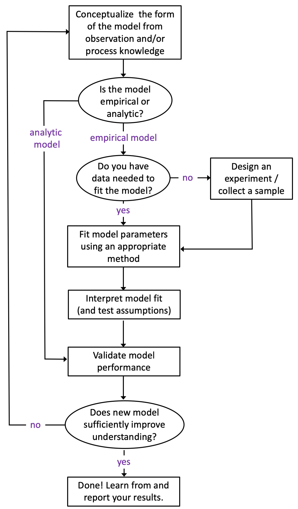

# Modeling {#model}
```{r model-setup, include=FALSE}
library(tidyverse)
library(knitr)
library(bookdown)
library(haven)
library(gridExtra)
```

```{block, type="rmdnote"}
A [***model***](https://www.merriam-webster.com/dictionary/model) is a system of postulates, data, and inferences presented as a mathematical description of an entity or state of affairs.
```

In this chapter we will discuss how models are conceptualized and "fit" to represent the data we have available. Models are useful because they provide a mathematical basis for how we see the world (i.e., an explanation for the observational data we collect). This means that models can help you: 

  1. quantify patterns or trends in your data;
  2. extrapolate your data (i.e., to guess an outcome outside the range of observed values);
  3. interpolate your data (i.e., to guess an outcome within the range of observed values but not at a location where data has been observed)
  4. predict future outcomes;
  5. conect ***theory*** (what you think should happen) to ***observation*** (what you actually see happen);


> <span style="color: blue;"> "All models are wrong, but some are useful" - George Cox, pioneering statistician </span>

## Ch. 11 Objectives
This chapter is designed around the following learning objectives. Upon
completing this chapter, you should be able to:  

- Describe the steps of model conceptualization, fitting, evaluation, and validation.
- Develop and fit linear models to continuous, bi-variate data
- Evaluate the assumptions of linear regression with visual diagnostics
- Apply transformation techniques to meet linear model assumptions
- Describe the process of parameter estimation using ordinary and weighted least squares
- Estimate probability density functions for univariate distributions 

## Process Modeling
Figure \@ref(fig:model-1) below provides a general process diagram for modeling ([adapted from the NIST Handbook on Statistics](https://www.itl.nist.gov/div898/handbook/pmd/section4/pmd41.htm)); these are the steps you should follow when developing a model. Even before you begin this process, however, you should ask yourself the following three questions:  

1. ***Why am I developing this model?***
2. ***What do I hope to learn from this model?***
3. ***What do I plan to do with this model?***

The answer to these questions will undoubtedly guide your thinking as you move through the process steps; it's important to have objectives and expectations at the start.  Without purpose, a process model often comes up short.  

``` {r model-1, echo=FALSE, message=FALSE, fig.cap="A generic process diagram for model conceptualization, development, and evaluation.", out.width="400", fig.topcaption=TRUE, fig.align="center"}


```
A couple points worth making about the process outline in Figure \@ref(fig:model-1).  First, observing a process and matching your observations to your training and experience is an invaluable tool for model construction.  Second, most models of "real-world things" like Newton's work on gravity or Milliken's model of elctron charge are empircal - that is, they are based on observation (not pure math).  Purely *analytic* models exist (mostly as mathematical "proofs") and such models don't need data to be *"fit"* but do need data to be *validated*. Third, many people choose to validate their model with the same data they used to fit the model (using an approach like blocking or cross-validation).  While I acknowledge that this approach is convenient (and sometimes the means available), I disagree with it.  You should always try to validate your model with an independent sample (better yet, with a sample that you didn't collect). Why? Although we put a lot of emphasis on ["random sampling"](#sample.collect), we rarely succeed at it in the real world. Having someone else validate your model with their (independent) data will go a long way towards convincing others that your model is both **useful** and **generalizable**. 

### Assumptions
An ***assumption*** is a fact or condition that is taken for granted. If you think about it, nearly every action you undertake carries assumptions.  If someone throws a baseball to you and you reach out your hand to catch it, you are assuming that you will indeed make that catch.  Otherwise, you would probably duck!  When you walk across a high bridge, you undoubtedly assume that it will hold your weight. Sure, you might have a compelling reason to cross the bridge at any cost, but in that case you have assumed that the reason for crossing the bridge outweighs other risks. Those of us who live in Colorado have, at one point, made the incorrect assumption about our car or truck's braking ability in the snow. 

**All scientific models are based on assumptions; many of those assumptions are necessary (read: critical) for the model or theory to be "correct".**

Although assumptions can be *taken for granted* when constructing a model or theory, that doesn't mean they should be ignored. Indeed, evaluating the assumptions of a model (or theory) is one of the first things that you should do when developing OR evaluating OR applying it.  *Testing assumptions* is the hallmark of a talented researcher, and yet, few researchers test their model assumptions regularly.

In this chapter, I will teach you about the assumptions of linear regression, but the take-home lesson is this: ***those who recognize and validate their assumptions will be rewarded for their efforts, prepared for what is to come, and will rarely depend on luck for success.***

## Model Fitting

> <span style="color: blue;"> "The purpose of models is not to fit the data but to sharpen the questions." - Samuel Karlim, mathematician and genomicist </span>

The best models are those that advance your understanding of a phenomenon so well that you soon leave the model behind, because the questions have since changed. We will not aspire to such great heights here, but it's worth understanding how models can be *fit* to data.  Model construction, fitting, and validation could represent an entire semester (or more) of work.  Here, will will discuss only two introductory applications: fitting of a linear model (using ordinary least squares) and basic distribution fits (using LOESS approaches). You have undoubtedly used a computer program to create a linear fit between an X and Y variable.  Microsoft Excel will do this for you with two columns of data and a few simple mouse clicks.  How that fit is achieved (and what assumptions underpin that fit) is what we will discuss here.

## OLS Regression
OLS stands for **"Ordinary Least Squares"**. The OLS technique is one of the most commons ways to fit a linear regression.  To keep things simple, let's discuss fitting a model with a single independent variable ($X$) as a predictor for our (dependent) outcome variable of interest ($Y$). A model with one instance of a single independent variable means we have, at maximum, only two parameter estimates to fit: the *intercept* term when $X = 0$ (which we call $\beta_{0}$) and the slope term for all values of $X$ (which we call $\beta_{1}$). Thus, we are fitting a straight-line equation between two variables with the following notation:

$$Y = \beta_{0} + \beta_{1}\cdot X + \epsilon$$
where:  

    $Y$ = the dependent variable (i.e, the outcome - what we are trying to model)   
    $\beta_{0}$ = the intercept parameter (to be *fit* by OLS model)   
    $\beta_{1}$ = the slope parameter (to be *fit* by the OLS model)   
    $X$ = the independent variable (i.e., the predictor variable)   
    $\epsilon$ = the error term (i.e., what is left over; what the model doesn't explain about $Y$)   

The OLS approach is straightforward: select model parameters ($\beta_{0}$, $\beta_{1}$) so that the model produces as little error as possible. With OLS, the model error is calculated as a *sum-of-squares error* (SSE; explained below). Graphically, this is shown in Figure \@ref(fig:OLS-anno), where the solid blue circles represent the actual data ($X_{i}, Y_{i}$). The grey line represents the "best fit" line that gives the smallest SSE possible. The model ***residuals*** (what are used to calculate the SSE) are denoted by vertical lines connecting the data points to the "best-fit line". The optimization algorithm is executed with matrix algebra.

``` {r OLS-anno, echo=FALSE, fig.cap="Graphical depiction for an OLS regression fit to minimize the sum of squared residuals"}
knitr::include_graphics("./images/OLS_anno.png")
```

The Y values *predicted* by the model are denoted as $\hat{Y_{i}}$ (we say "Y hat").  Mathematically, each residual ($\hat{\epsilon}$) is defined as:

$$\hat{\epsilon_{i}} = Y_{i} - \hat{Y_{i}}$$
where:  

    $\hat{\epsilon_{i}}$ is the residual for each (i^th^) observation  
    $Y_{i}$ represents each (i^th^) observation of the dependent variable, $Y$  
    $\hat{Y_{i}}$ represent the *predicted value* of $Y_{i}$ for each data point:  $\hat{Y_{i}} = \beta_{0} + \beta_{1}\cdot X_{i}$  

We use *vertical distance* to define residuals because we are trying to predict the $Y$ values, so we care only about how far away (in $Y$ space) our predictors, $\hat{Y_{i}}$, are relative to "true" $Y_{i}$ data. Another way to say this is that OLS *assumes* that our $X_{i}$'s are perfect observations ($X$ is measured without error).

The sum of squares error (SSE) is then: $$SSE = \sum_{i = 1}^{n} \left(\hat{\epsilon_{i}}\right)^{2}$$ 
for all $n$ observations in the data set. The SSE is a really useful term; it represents the overall variance in the $Y$-data that was explained by the model. Good models explain variance in your data, because variance means: changes in behavior of your data.

The overall model fit, $R^{2}$, is closely related to the SSE term.  Once you have SSE, you calculate the *total sum of squares* (TSS) as: 
$$TSS = \sum_{i = 1}^{n} \left(Y_{i} - \overline{Y} \right)$$ 
and then $R^{2}$ is calculated from their ratio:
$$R^2 = 1- \left(\frac{SSE}{TSS}\right)$$
The *total sum of squares* represents a measure of all of the variability in the data; the *residual sum of squares* represents a measure of the variability that remains *after the linear model has been applied*. Thus, **the $R^{2}$ term represents the proportion of variability in your data that was explained by the linear model**.

``` {block, type="rmdnote"}
The terms "residual sum of squares" and "error sum of squares" are interchangeable; you will see them both in the wild and they mean the same thing. 
```

### OLS Assumptions and Diagnostics {#OLS_assum}
Now that you have an idea "how" OLS works, let's talk about the assumptions of OLS linear models. I will break the assumptions of OLS linear regression into two groups: front-end and back-end. The front-end assumptions are ones that apply to the model and the data at the outset. Most of the front-end assumptions can be tested before you fit the model.  The back-end assumptions are ones that you test *after* the model has been built - these assumptions apply to the error term ($\epsilon$). I will write them out here and provide a brief explanation of how to evaluate each (and why you should care about doing so).

#### Front-end assumptions:  

(1) **The form of the model is linear in the coefficients.**  
    * *Linear in the coefficients* means that the parameter estimates ($\beta_{0}$, $\beta_{1}$,...$\beta_{n}$) all show up in the final model as being added together.  An important point here is that the ***model variables do not need to be linear terms***.  You can use linear regression with non-linear predictor variables, such that the following model would be considered "linear" in the parameters: $Y = \beta_{0} + \beta_{1}\cdot{X_{1}^{2}} + \beta_{2}\cdot{X_{2}^{3}} + \epsilon$.  This model is still "linear" because the $\beta$-terms are being added together. 
      * *How to check*: It's easy to tell if your model is linear in the coefficients by just looking at it, since this is a structural requirement. If the $\beta$-terms show up in non-arithmetic ways (e.g., $\cos(\beta_{1})\cdot X^{\beta_{2}}$) then you are developing a *non-linear* model (signifying that it's time to take a statistics course).  
      * *Why you care*: You model will not run (at least not correctly) if not set up correctly. Attempting to fit an OLS linear fit on a non-linear model is bad news.
(2) **The model is correctly specified.**  
    * This assumption speaks to the actual variables included in the model and their form. How many independent variables are needed and to what power do you raise each (if not to the first power)? Is the function $Y = f(X_{1},X_{2})$ appropriate or is $log(Y) = f(X_{1}^{2})$ or $Y = f(\frac{X_{1}}{X_{2}^{2}})$?  
      * *How to check*: This is a tough assumption to evaluate in advance. The best way to specify the model correctly is through a combination of (1) checking the other assumptions, (2) using your experience/process knowledge to inform the model design, (3) conducting an exploratory data analysis to inform your thinking and (4) following an established model selection procedure (this last one *also* suggests that you to take a formal class on statistics).
      * *Why you care*: If the model is not specified correctly it might perform poorly under validation, or, it might suggest that a variable is not important, when in fact it is!  
(3) **No collinearity between predictor variables.** 
    * The *no collinearity* assumption only applies when your model has more than one predictor variable ($X_{1}$, $X_{2}$, $X_{3}$, etc.). An example would be using waist size (as $X_{1}$) and body mass (as $X_{2}$) to predict a person's height ($Y$). The two predictor variables (waist size and mass) are likely to be strongly correlated (more on *that* topic below).
      * *How to check*: Run a correlation analysis on pairs of the independent variables (i.e., calculate a Pearson or Spearman correlation coefficient) and create a correlation plot matrix (a panel of [scatterplots](#scatt)) for all pairs of independent variables to examine *how* they are correlated.
      * *Why you care*: When two or more predictor variables are highly correlated, the model will struggle to fit parameter estimates (e.g., $\beta_{1}$, $\beta_{2}$) for the correlated variables (read: the parameters for the correlated variables will become very sensitive to small changes in the model, which is NOT good). Note that if you don't care about individual parameters (you only care about the model output) then violating this assumption is less important. If you do care about parameter estimates for individual predictors, the model could very well assign the wrong sign to one of the $\beta$ coefficients.

#### Back-end assumptions:  

The **error term** (4) has a **mean of zero**, is (5) **normally distributed**, (6) **homoscedastic**, and has (7) **no autocorrelation** or (8) **correlation with predictor (independent) variables**.  There's a lot riding on that little error term, $\epsilon$!.

(4) **Mean of residuals is zero**.  
    * The first requirement for a mean of zero ($\overline{\epsilon} = 0$) will be fulfilled if the model is set up and the OLS algorithm is implemented correctly.  
      * *How to check*: calculate the model residuals and take their `mean()`.  
      * *Why you care*: if $\overline{\epsilon} \neq 0$, or if $\overline{\epsilon}$ is not very close to zero, then something has gone seriously wrong with your model implementation.  
(5) **Residuals are normally distributed.**  
    * The general opinion among statisticians is that non-normal residuals are not a deal-breaker for your model. Non-normal residuals will affect your ability to generate confidence intervals about your estimates, but the estimates themselves should still be "BLUE", which stands for *"Best Linear Unbiased Estimator"*.  
      * *How to check*: create a [Q-Q plot](#qq.plot) about your residuals.  
      * *Why you care*: violation of the normality assumption can affect the precision of your estimates.  
(6) **Residuals are homoscedstic (not heteroscedastic).**  
    * The term *"homoscedastic"* means to **have equal variance**.  In the case of residuals, we want to see that their magnitude remains relatively constant as the dependent variable increases, $Y$.  
      * *How to check*: create a [scatterplot](#scatt) of residuals (y-axis) vs. the fitted values, $\hat{Y_{i}}$ (x-axis; yes, I know that sounds weird to plot the Y-variable on the x-axis...). The residuals should appear evenly scattered in both directions about zero with no apparent change in magnitude as the Y variable increases.  
      * *Why you care*: Heteroscedasticity (one of my favorite "don't I sound smart?" words) can affect the precision of your estimates and can also inflate your confidence in your results (read: you might think you are on to something when actually, you aren't). If your residuals are heteroscedastic, consider applying a [transformation](#transform) to your dependent variable to normalize the error variance. The BoxCox method one of my favorites.  
(7) **No residual autocorrelation.**  
    * Autocorrelation among residuals is a strong indicator that your model is not correctly specified.  
      * *How to check*: Create [autocorrelation and partial autocorrelation](#autocorr) plots for your residuals. Perform a Durbin-Watson test.  
      * *Why you care*: Autocorrelation among residuals is a strong indicator that your model is not correctly specified.
(8) **No residual correlation with independent variables.**  
    * Likewise, residual correlation with independent variables is a strong indicator that your model is not correctly specified.  
      * *How to check*: Conduct a correlation analysis on your residuals and independent variables, create [scatterplots](#scatter) to investigate the nature of the correlation (when present).  
      * *Why you care*: Correlation between residuals and independent variables is a strong indicator that your model is not correctly specified. You can do better!

## Example: OLS Linear Regression
Let's conduct a simple linear regression with two variables that we know are correlated: a person's waist size and their weight. We will use data collected by the US Centers for Disease Control as part of the [National Health and Nutrition Examination Survey (NHANES)](https://www.cdc.gov/nchs/nhanes/about_nhanes.htm) - a detailed annual survey of ~5,000 people living in the US.

```{r load-clean-data, echo=FALSE, include=FALSE}
require(haven)

data_raw <- read_xpt(file = "./data/BMX_J.xpt")
data_dem <- read_xpt(file = "./data/DEMO_J.xpt")

hww <- data_raw %>%
  dplyr::select(SEQN, BMXWT, BMXWAIST, BMXHT) %>%
  dplyr::rename(id = "SEQN",
         mass = "BMXWT",
         waist = "BMXWAIST",
         height = "BMXHT")

dems <- data_dem %>%
  dplyr::select(SEQN, RIAGENDR, RIDAGEYR) %>%
  dplyr::rename(id = "SEQN",
         gender = "RIAGENDR",
         age = "RIDAGEYR")

data <- left_join(hww, dems, by = "id")

data_18 <- data %>%
  dplyr::filter(age >= 18) %>%
  dplyr::mutate(sqrt_mass = sqrt(mass))

attr(data_18$sqrt_mass, "label") <- "square root of mass"

write.csv(data_18, file = "./data/bodysize.csv")
```
  
  **1. Specify the model**  
Before we begin let's "look" at the data and apply some process knowledge. A scatterplot of waist size vs. body mass is shown below.
``` {r model1, echo=FALSE, warning=FALSE, fig.cap="Scatterplot of body mass (kg) vs. waist circumfrence (cm) for US adults.", out.width="500", fig.align="center"}
p1 <- ggplot(data = data_18) +
  geom_point(aes(x = waist, y = mass),
             alpha = 0.1) + 
  xlab("Waist circumference, cm") +
  ylab("Body Mass, kg") +
  theme_classic(base_size = 13) 

p1
```
Clearly, a strong relationship exists between the two variables - one that we could probably approximate as linear. However, as engineers who have studied physics, we are taught that the mass of an object is the product of density, $\rho$, and volume, $V$: 
$$mass = \rho\cdot V$$ 
Human beings are mostly water, so we can assume that density is a constant from one person to the next. Our *"body volume"* is what changes. If we approximate our bodies as cylinders, then the *volume* (and mass) of our bodies is linearly related to the product of cross-sectional area and height. 
$$mass = \rho\cdot Area \cdot Height$$
However, we are modeling mass against waist circumference (not area), so our process knowledge tells us that waist size and body mass should NOT follow a linear relationship.
$$Area = \frac{Circumference^{2}}{2\pi}$$
Thus, substituting one equation into another, we arrive at the conclusion that mass should be proportional to the square of waist size.
$$mass \sim Circumference^{2}$$
Or, another way to say this is that the square root of mass is linearly related to body circumference.
$$\sqrt{mass} \sim Circumference$$
``` {r cylinder-comic, echo=FALSE, message=FALSE, fig.align="center"}

```

Let's transform $mass \rightarrow \sqrt{mass}$ and then examine the two scatterplots side by side.
``` {r model-compare, echo=FALSE, warning=FALSE, message=FALSE, fig.cap="Side-by-side comparison of two model specifications. Does one look more linear than the other?"}
p1 <- ggplot(data = data_18) +
  geom_point(aes(x = waist, y = mass),
             alpha = 0.1,
             color = "maroon4") +
  ylab("Mass, kg") +
  xlab("Waist Circumference, cm") +
  theme_classic(base_size = 13)

p2 <- ggplot(data = data_18) +
  geom_point(aes(x = waist, y = sqrt_mass),
             alpha = 0.1,
             color = "royalblue2") +
  ylab(expression(sqrt(mass))) +
  xlab("Waist Circumference, cm") +
  theme_classic(base_size = 13)

grid.arrange(p1, p2, ncol = 2)
```

Looking at the right plot in Figure \@ref(fig:model-compare), where $\sqrt(mass)$ is plotted, helps make the slight curvature in the left-side plot more evident. Both plots appear "mostly" linear but the one on the right "looks better", at least to me! Our process knowledge suggests that the model on the right is better specified. Let's fit both models and find out!

The NHANES data we use here is from 2017-2018 (saved as `bodysize.csv` and read into a data frame labeled: `data_18`). These data have been filtered to include adults only (`filter(age > 18)`).  The first few lines of data look like this:

``` {r data-18}
head(data_18)
```

### The `lm()` function
The `lm()` function in R stands for *"linear model"* and will perform an OLS fit on any linear model you specify. The function requires two arguments: a `formula` (i.e., the model specification) and the `data` with which to fit that model. Formulas are specified as `y ~ x`, so our call to `lm()` looks like this for each model:

``` {r call-linear-model}

model1 <- lm(mass ~ waist, data = data_18)

model2 <- lm(sqrt_mass ~ waist, data = data_18)

```

Now that we have stored each model as an object (`model1`, `model2`), so we can examine what they contain. The output of `lm()` is a list of class "lm".  If we type `view(model1)` the contents of the list become apparent.

``` {r model1-list, echo=FALSE, message=FALSE, fig.cap="The `lm()` function provides a self-contained list of the model, data frame, parameter estimates, residuals, and more."}

knitr::include_graphics("./images/model1_list.png")
```
As you can see, there is a wealth of information contained in the `lm()` object. The first list entry contains the model parameter estimates (`model1$coefficients`) in rank order:  

* **$\beta_{0}$ (model intercept):** -34.37  
* **$\beta_{1}$ (slope, `waist` coefficient):** 1.16

These are the primary outputs of the OLS fit; they define the line of "best fit" for which the SSE have been minimized.

To examine the overall fit of the model, we can call the `summary()` function with the model object as an argument.  Here is the summary for `model1`:

``` {r model1-summary}

summary(model1)

```

and here is the summary for `model2`:

``` {r model2-summary}

summary(model2)

```

Interestingly, both models have nearly equal fits to the data.  The $R^{2}$ for `model1` is 0.8025 and the $R^{2}$ for `model2` is 0.8075 (a negligible difference in my opinion). This brings up an interesting question: *which model is better*?  The answer to that question depends, of course, on (1) what you want to learn from the model, (2) what you plan to do with the model? Sound familiar?

Before getting to those questions, let's continue with the modeling process by evaluating our assumptions...

### OLS Diagnostics
In this section, we will run through our list of [OLS assumptions](#OLS_assum) for each of the models to prove that our models are proper and to help us decide which is better.

**Assumption #1: The form of the model is linear in the coefficients.**  
  This one is easy to answer because both models were set up with only one independent variable and an intercept term: $Y = \beta_{0} + \beta_{1}\cdot X$.  The $\beta$'s are added together so this assumption is valid for both `model1` and `model2`.
  
**Assumption #2: The model is correctly specified.**  
  This one is hard to answer (right now) but our process knowledge (the physics of volume~mass relationships) tells us that `model2` is more representative of reality than `model1`.  *Advantage: `model1`.*
  
**Assumption #3: No collinearity between predictor variables.**  
  This assumption is automatically valid because we have only one independent predictor variable in each model, ruling out any possibility of collinearity.
  
**Assumption #4: The error term has a mean of zero.**  
  We can calculate this from our two model objects.
  
``` {r error-mean}
mean(model1$residuals)

mean(model2$residuals)

```
Those are pretty small numbers.  Check and check.

**Assumption #5: The error term is normally distributed**  
This assumption can be checked several ways, but my preference is to create a Q-Q plot about the residuals (the Q's stand for *"quantile-quantile"*).  A Q-Q plot is a scatterplot that relates the quantile values of your data against the quantiles of an "expected distribution" - in this case the [normal distribution](#normal_dist).  If "your data" follow the shape of the "expected data" then both datasets can be said to follow the same distribution.  Thus, when you plot residuals on a "normal Q-Q plot", you are looking for your data to fall along a straight line through the center. The `{ggplot}` package allow you to create Q-Q plots using `geom_qq()` function, which creates the plot, and `geom_qq_line()`, which adds the "expected" line to aid your eye. The `{stats}` package in base R also allows you to do this with the `qqnorm()` and the `qqline()` functions.

Here are the Q-Q plots for `model1` and `model2`.

```{r qqplot, fig.cap="Q-Q plots of residuals for two linear models. Which set of residuals better approximates a normal distribution?"}
p3 <- ggplot(data  = model1$model, aes(sample = model1$residuals)) +
  geom_qq(alpha = 0.1,
          color = "maroon4") +
  geom_qq_line(color = "grey") +
  ggtitle("Model 1: mass ~ waist") +
  theme_classic()

p4 <- ggplot(data  = model2$model, aes(sample = model2$residuals)) +
  geom_qq(alpha = 0.1,
          color = "royalblue2") +
  geom_qq_line(color = "grey") +
  ggtitle("Model 2: sqrt(mass) ~ waist") +
  theme_classic()

grid.arrange(p3, p4, ncol = 2)
```

Both models reasonable follow the expected quantile plots, although `model1` shows more deviation from normality at the upper tail.  If I hadn't seen `model2`, which looks nearly perfect, I probably would have said that `model1` was adequate.  Advantage: `model2`. 

**Assumption #6: The error term is homoscedatic**  
To evaluate this assumption, we create a [scatterplot](#scatt) of residuals vs. the fitted values, $\hat{Y_{i}}$.  Both of these data are contained in the model output lists.

``` {r residual-plot, fig.cap="Residuals vs. fitted values as a check for homoscedasticity."}
p5 <- ggplot(data = model1$model) + 
  geom_point(aes(x = model1$fitted.values, y =model1$residuals),
             alpha = 0.25,
             color = "maroon3") +
  geom_hline(yintercept = 0) +
  theme_classic() +
  theme(aspect.ratio = 0.5)

p6 <- ggplot(data = model2$model)+ 
  geom_point(aes(x = model2$fitted.values, y =model2$residuals),
             alpha = 0.25,
             color= "royalblue2") +
  geom_hline(yintercept = 0) +
  theme_classic() +
  theme(aspect.ratio = 0.5)

grid.arrange(p5, p6, ncol = 1)
```

Looking at these plots, the residuals don't show major changes across the range of fitted values (for both plots) - this is a good outcome because it implies the residuals are homoscedastic.  There are slight differences between the two models, however.  For example, `model1` tends to have positive residuals at low and high values of $\hat{Y_{i}}$, whereas, `model2` seems to have more constant error across the range of $\hat{Y_{i}}$. Boring residuals are what you want. *Advantage: `model2`.*

**Assumption 7: No autocorrelation among residuals**
This assumption is evaluated by making a [partial autocorrelation plot](#autocorr) of your residuals. We will accomplish these plots using `pacf()` function from the `{stats}` package.

``` {r resid-autocorr, fig.cap="Partial autocorrelation plots of residuals."}
stats::pacf(model1$residuals, 
            main = "Model 1 Partial Autocorrelation Plot")
stats::pacf(model2$residuals, 
            main = "Model 2 Partial Autocorrelation Plot")

```
Neither plot shows a *strong* degree of autocorrelation, though both plots suggest that lag-5 autocorrelation is borderline significant (moreso for `model1`).  Autocorrelation among the residuals suggests that your model is not correctly specified and these results suggest that `model2` is slightly better specified than `model1`.  Perhaps something is missing from these models?

**Assumption 8: Residuals are not correlated with predictor variables.**
This assumption can be evaluated through a correlation analysis. The `cor()` function from the `{stats}` package allows you to calculate correlation coefficients (e.g., Pearson, Spearman) among variables in a data frame. If you supply a data frame as an argument to `cor()` it will calculate correlations among all possible variable combinations.  Otherwise, you can supply it with two vectors: `x = ` and `y = `.

``` {r resid-corr}
cor(x = model1$residuals, 
    y = model1$model[,2],
    method = "pearson" )

cor(x = model2$residuals, 
    y = model1$model[,2],
    method = "pearson" )

```

The correlation coefficients are both nearly zero, so this last assumption is validated.

***Which model is best?***
Both models explained ~80% of the variance in our dependent variable. Based on our process knowledge and the fit diagnostics, we can conclude that `model2` is better specified than `model1`.  In examining our process knowledge and the residuals, however, we cannot help but wonder if a better model exists out there to predict body mass based on measurement variables? 

## Probability Density Function {#pdf}  
The histogram is really an attempt to visualize the **probability density function** (pdf) for a distribution of univariate data.  The pdf is a mathematical representation of the likelihood of sampling a given value from the distribution, assuming a random draw.  Unlike the histogram (which bins data into groups), the pdf is a continuous function that can be solved at any datum.  A pdf can be expressed empirically (as a numeric approximation) or as an exact analytic equation (in the case normal, lognormal, and other *known* distributional forms). 

### Univariate Data Fits

## Calibration

## Exercises

hh1 - fit a two parameter model that suffers from multicollinearity (height ~ weight + waist) and use diagnostics to discover the problem.  Discuss how process knowledge suggests that a negative beta in this case makes absolutely no sense. 

Validate the mass-waist model using NHANES data from a different year

hh2 - fit a model that suffers from heteroscedasticity; transform the dependent variable to normalize the residuals.  Discuss issues with interpreting transformed models.

Create a new variable (volume = waist * height) and see if that variable explains more of the variance in mass from one of the NHANES data frames.

Use the employees.csv data to fit a model (vendor ~ metal).  Discover autocorrelation among the residuals. 

Calculate residuals from a model manually and prove that they are equal to the model$residuals values.


