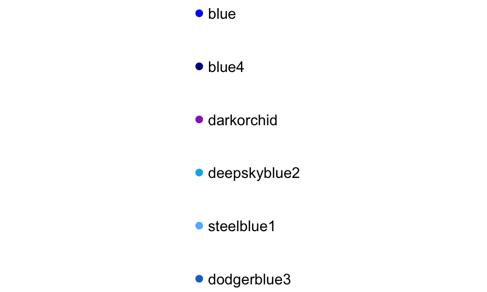

# Data Visualization: ggplot2 {#dataviz}


## Plots to explore data

Exploratory data analysis is a key step in data analysis and plotting your data in different ways is an important part of this process. In this section, I will focus on the basics of `ggplot2` plotting, to get you started creating some plots to explore your data. 
This section will focus on making **useful**, rather than **attractive** graphs, since at this stage we are focusing on exploring data for yourself rather than presenting results  to others. Next week, I will explain more about how you can customize ggplot objects, to help you make plots to communicate with others.  


All of the plots we'll make today will use the `ggplot2` package (another member of the tidyverse!). If you don't already have that installed, you'll need to install it. You then need to load the package in your current session of R:


```r
# install.packages("ggplot2")  ## Uncomment and run if you don't have `ggplot2` installed
library(ggplot2)
```

The process of creating a plot using `ggplot2` follows conventions that are a bit different than most of the code you've seen so far in R (although it is somewhat similar to the idea of piping I introduced in the last chapter). The basic steps behind creating a plot with `ggplot2` are:

1. Create an object of the `ggplot` class, typically specifying the **data** and some or all of the **aesthetics**; 
2. Add on **geoms** and other elements to create and customize the plot, using `+`.

You can add on one or many geoms and other elements to create plots that range from very simple to very customized. This week, we'll focus on simple geoms and added elements, and then explore more detailed customization next week. 

<div class="rmdwarning">
<p>If R gets to the end of a line and there is not some indication that the call is not over (e.g., <code>%&gt;%</code> for piping or <code>+</code> for <code>ggplot2</code> plots), R interprets that as a message to run the call without reading in further code. A common error when writing <code>ggplot2</code> code is to put the <code>+</code> to add a geom or element at the beginning of a line rather than the end of a previous line– in this case, R will try to execute the call too soon. To avoid errors, be sure to end lines with <code>+</code>, don’t start lines with it.</p>
</div>

### Initializing a ggplot object

The first step in creating a plot using `ggplot2` is to create a ggplot object. This object will not, by itself, create a plot with anything in it. Instead, it typically specifies the data frame you want to use and which aesthetics will be mapped to certain columns of that data frame (aesthetics are explained more in the next subsection). 

Use the following conventions to initialize a ggplot object:


```r
## Generic code
object <- ggplot(dataframe, aes(x = column_1, y = column_2))
```

The data frame is the first parameter in a `ggplot` call and, if you like, you can use the parameter definition with that call (e.g., `data = dataframe`). Aesthetics are defined within an `aes` function call that typically is used within the `ggplot` call. 

<div class="rmdnote">
<p>While the <code>ggplot</code> call is the place where you will most often see an <code>aes</code> call, <code>aes</code> can also be used within the calls to add specific geoms. This can be particularly useful if you want to map aesthetics differently for different geoms in your plot. We’ll see some examples of this use of <code>aes</code> more in later sections, when we talk about customizing plots. The <code>data</code> parameter can also be used in geom calls, to use a different data frame from the one defined when creating the original ggplot object, although this tends to be less common.</p>
</div>

### Plot aesthetics

**Aesthetics** are properties of the plot that can show certain elements of the data. For example, in Figure \@ref(fig:aesmapex), color shows (is mapped to) gender, x-position shows height, and y-position shows weight in a sample data set of measurements of children in Nepal. 

<div class="figure" style="text-align: center">

<p class="caption">(\#fig:aesmapex)Example of how different properties of a plot can show different elements to the data. Here, color indicates gender, position along the x-axis shows height, and position along the y-axis shows weight. This example is a subset of data from the `nepali` dataset in the `faraway` package.</p>
</div>

<div class="rmdnote">
<p>Any of these aesthetics could also be given a constant value, instead of being mapped to an element of the data. For example, all the points could be red, instead of showing gender.</p>
</div>

Which aesthetics are required for a plot depend on which geoms (more on those in a second) you're adding to the plot. You can find out the aesthetics you can use for a geom in the "Aesthetics" section of the geom's help file (e.g., `?geom_point`). Required aesthetics are in bold in this section of the help file and optional ones are not. Common plot aesthetics you might want to specify include: 

<table>
 <thead>
  <tr>
   <th style="text-align:left;"> Code </th>
   <th style="text-align:left;"> Description </th>
  </tr>
 </thead>
<tbody>
  <tr>
   <td style="text-align:left;"> `x` </td>
   <td style="text-align:left;"> Position on x-axis </td>
  </tr>
  <tr>
   <td style="text-align:left;"> `y` </td>
   <td style="text-align:left;"> Position on y-axis </td>
  </tr>
  <tr>
   <td style="text-align:left;"> `shape` </td>
   <td style="text-align:left;"> Shape </td>
  </tr>
  <tr>
   <td style="text-align:left;"> `color` </td>
   <td style="text-align:left;"> Color of border of elements </td>
  </tr>
  <tr>
   <td style="text-align:left;"> `fill` </td>
   <td style="text-align:left;"> Color of inside of elements </td>
  </tr>
  <tr>
   <td style="text-align:left;"> `size` </td>
   <td style="text-align:left;"> Size </td>
  </tr>
  <tr>
   <td style="text-align:left;"> `alpha` </td>
   <td style="text-align:left;"> Transparency (1: opaque; 0: transparent) </td>
  </tr>
  <tr>
   <td style="text-align:left;"> `linetype` </td>
   <td style="text-align:left;"> Type of line (e.g., solid, dashed) </td>
  </tr>
</tbody>
</table>

### Adding geoms

Next, you'll want to add one or more `geoms` to create the plot. You can add these with `+` after the `ggplot` statement to initialize the ggplot object. Some of the most common geoms are:

<table>
 <thead>
  <tr>
   <th style="text-align:left;"> Plot type </th>
   <th style="text-align:left;"> ggplot2 function </th>
  </tr>
 </thead>
<tbody>
  <tr>
   <td style="text-align:left;"> Histogram (1 numeric variable) </td>
   <td style="text-align:left;"> `geom_histogram` </td>
  </tr>
  <tr>
   <td style="text-align:left;"> Scatterplot (2 numeric variables) </td>
   <td style="text-align:left;"> `geom_point` </td>
  </tr>
  <tr>
   <td style="text-align:left;"> Boxplot (1 numeric variable, possibly 1 factor variable) </td>
   <td style="text-align:left;"> `geom_boxplot` </td>
  </tr>
  <tr>
   <td style="text-align:left;"> Line graph (2 numeric variables) </td>
   <td style="text-align:left;"> `geom_line` </td>
  </tr>
</tbody>
</table>

### Constant aesthetics

Instead of mapping an aesthetic to an element of your data, you can use a constant value for it. For example, you may want to make all the points green, rather than having color map to gender: 


In this case, you'll define that aesthetic when you add the geom, outside of an `aes` statement. In R, you can specify the shape of points with a number. Figure \@ref(fig:shapeexamples) shows the shapes that correspond to the numbers 1 to 25 in the `shape` aesthetic. This figure also provides an example of the difference between color (black for all these example points) and fill (red for these examples). You can see that some point shapes include a fill (21 for example), while some are either empty (1) or solid (19).


```
## Warning: `data_frame()` is deprecated as of tibble 1.1.0.
## Please use `tibble()` instead.
## This warning is displayed once every 8 hours.
## Call `lifecycle::last_warnings()` to see where this warning was generated.
```

<div class="figure" style="text-align: center">

<p class="caption">(\#fig:shapeexamples)Examples of the shapes corresponding to different numeric choices for the `shape` aesthetic. For all examples, `color` is set to black and `fill` to red.</p>
</div>

If you want to set color to be a constant value, you can do that in R using character strings for different colors. Figure \@ref(fig:colorexamples) gives an example of some of the different blues available in R. To find links to listings of different R colors, google "R colors" and search by "Images".

<div class="figure" style="text-align: center">

<p class="caption">(\#fig:colorexamples)Example of available shades of blue in R.</p>
</div>

### Useful plot additions

There are also a number of elements that you can add onto a `ggplot` object using `+`. A few that are used very frequently are: 

<table>
 <thead>
  <tr>
   <th style="text-align:left;"> Element </th>
   <th style="text-align:left;"> Description </th>
  </tr>
 </thead>
<tbody>
  <tr>
   <td style="text-align:left;"> `ggtitle` </td>
   <td style="text-align:left;"> Plot title </td>
  </tr>
  <tr>
   <td style="text-align:left;"> `xlab`, `ylab` </td>
   <td style="text-align:left;"> x- and y-axis labels </td>
  </tr>
  <tr>
   <td style="text-align:left;"> `xlim`, `ylim` </td>
   <td style="text-align:left;"> Limits of x- and y-axis </td>
  </tr>
</tbody>
</table>

### Example dataset

For the example plots, I'll use a dataset in the `faraway` package called `nepali`. This gives data from a study of the health of a group of Nepalese children. 


```r
library(faraway)
data(nepali)
```

I'll be using functions from `dplyr` and `ggplot2`, so those need to be loaded:


```r
library(dplyr)
library(ggplot2)
```

Each observation is a single measurement for a child; there can be multiple observations per child. I used the following code to select only the columns for child id, sex, weight, height, and age. I also used `distinct` to limit the dataset to only include one measurement for each chile, the child's first measurement in the dataset. 


```r
nepali <- nepali %>%
  select(id, sex, wt, ht, age) %>%
  mutate(id = factor(id),
         sex = factor(sex, levels = c(1, 2),
                      labels = c("Male", "Female"))) %>%
  distinct(id, .keep_all = TRUE)
```

After this cleaning, the data looks like this:


```r
head(nepali)
```

```
##       id    sex   wt    ht age
## 1 120011   Male 12.8  91.2  41
## 2 120012 Female 14.9 103.9  57
## 3 120021 Female  7.7  70.1   8
## 4 120022 Female 12.1  86.4  35
## 5 120023   Male 14.2  99.4  49
## 6 120031   Male 13.9  96.4  46
```

### Histograms

Histograms show the distribution of a single variable. Therefore, `geom_histogram()` requires only one main aesthetic, `x`, the (numeric) vector for which you want to create a histogram. For example, to create a histogram of children's heights for the Nepali dataset (Figure \@ref(fig:nepalihist1)), run: 


```r
ggplot(nepali, aes(x = ht)) + 
  geom_histogram()
```

<div class="figure" style="text-align: center">

<p class="caption">(\#fig:nepalihist1)Basic example of plotting a histogram with `ggplot2`. This histogram shows the distribution of heights for the first recorded measurements of each child in the `nepali` dataset.</p>
</div>

<div class="rmdnote">
<p>If you run the code with no arguments for <code>binwidth</code> or <code>bins</code> in <code>geom_histogram</code>, you will get a message saying “<code>stat_bin()</code> using <code>bins = 30</code>. Pick better value with <code>binwidth</code>.”. This message is just saying that a default number of bins was used to create the histogram. You can use arguments to change the number of bins used, but often this default is fine. You may also get a message that observations with missing values were removed.</p>
</div>

You can add some elements to the histogram now to customize it a bit. For example (Figure \@ref()), you can add a figure title (`ggtitle`) and clearer labels for the x-axis (`xlab`). You can also change the range of values shown by the x-axis (`xlim`).


```r
ggplot(nepali, aes(x = ht)) + 
  geom_histogram(fill = "lightblue", color = "black") + 
  ggtitle("Height of children") + 
  xlab("Height (cm)") + xlim(c(0, 120))
```

<div class="figure" style="text-align: center">

<p class="caption">(\#fig:nepalihist2)Example of adding ggplot elements to customize a histogram.</p>
</div>

The geom `geom_histogram` also has special argument for setting the number of width of the bins used in the histogram. Figure \@ref(fig) shows an example of how you can use the `bins` argument to change the number of bins that are used to make the histogram of height for the `nepali` dataset.  


```r
ggplot(nepali, aes(x = ht)) + 
  geom_histogram(fill = "lightblue", color = "black",
                 bins = 40) 
```

<div class="figure" style="text-align: center">

<p class="caption">(\#fig:nepalihist3)Example of using the `bins` argument to change the number of bins used in a histogram.</p>
</div>

Similarly, the `binwidth` argument can be used to set the width of bins. Figure \@ref(fig:nepalihist4) shows an example of using this function to create a histogram of the Nepali children's heights with binwidths of 10 centimeters (note that this argument is set in the same units as the x variable).


```r
ggplot(nepali, aes(x = ht)) + 
  geom_histogram(fill = "lightblue", color = "black",
                 binwidth = 10) 
```

<div class="figure" style="text-align: center">

<p class="caption">(\#fig:nepalihist4)Example of using the `binwidth` argument to set the width of each bin used in a histogram.</p>
</div>

### Scatterplots

A scatterplot shows how one variable changes as another changes. You can use the `geom_point` geom to create a scatterplot. For example, to create a scatterplot of height versus age for the Nepali data (Figure \@ref(fig:nepaliscatter1)), you can run the following code: 


```r
ggplot(nepali, aes(x = ht, y = wt)) + 
  geom_point()
```

<div class="figure" style="text-align: center">

<p class="caption">(\#fig:nepaliscatter1)Example of creating a scatterplot. This scatterplot shows the relationship between children's heights and weights within the nepali dataset.</p>
</div>

Again, you can use some of the options and additions to change the plot appearance. For example, to add a title, change the x- and y-axis labels, and change the color and size of the points on the scatterplot (Figure \@ref(fig:nepaliscatter2)), you can run:


```r
ggplot(nepali, aes(x = ht, y = wt)) + 
  geom_point(color = "blue", size = 0.5) + 
  ggtitle("Weight versus Height") + 
  xlab("Height (cm)") + ylab("Weight (kg)")
```

<div class="figure" style="text-align: center">

<p class="caption">(\#fig:nepaliscatter2)Example of adding ggplot elements to customize a scatterplot.</p>
</div>

You can also try mapping another variable in the dataset to the `color` aesthetic. For example, to use color to show the sex of each child in the scatterplot (Figure \@ref(fig:nepaliscatter3)), you can run:


```r
ggplot(nepali, aes(x = ht, y = wt, color = sex)) + 
  geom_point(size = 0.5) + 
  ggtitle("Weight versus Height") + 
  xlab("Height (cm)") + ylab("Weight (kg)")
```

<div class="figure" style="text-align: center">

<p class="caption">(\#fig:nepaliscatter3)Example of mapping color to an element of the data in a scatterplot.</p>
</div>


