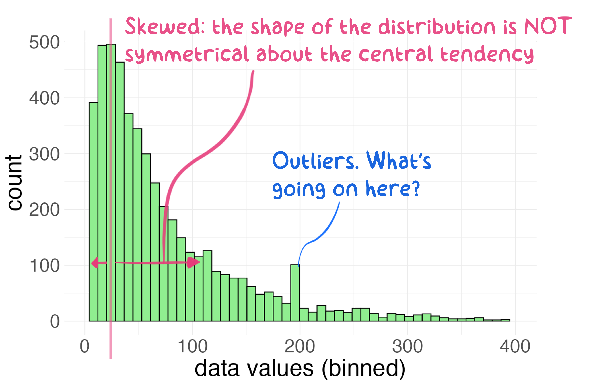

# Exploring Univariate Data {#eda1}


> *<span style="color: blue;"> Exploratory data analysis is graphical detective work - John Tukey </span>*

Exploratory Data Analysis (also known as EDA) is largely a visual technique based on the human trait of *"pattern recognition"*. The purpose of EDA is simple: learn about your datq through diagnostic visualization.

**Why is Exploratory Data Analysis (EDA) useful?**
Because getting to know a dataset is a key step towards making sense of it, and EDA is a great way to familiarize oneself with a dataset. As a result, you can use EDA to do many powerful things in a short span of time.

Think of the word **"Exploratory"** in terms of **"Hypothesis Building"**.

- In other words, **modeling** and **statistical inference testing** should come *after* EDA.  
- In other, other words: You can use EDA as a means to jump start ideas on *"what do I do with my data?"*!  

> *<span style="color: blue;"> Perfect data is boring. Flawed data, on the other hand, is interesting and mysterious. Perfect data doesn't get asked out on a second date.  - me </span> *

## Univariate Data

*Univartiate* means "only one variable" being considered (like medical doctors, statisticians enjoy the use fancy words to describe things...).  

*Univariate data analyses* describe ways to discover features about a single variable or quantity. While simple, univariate analyses are a great starting point for EDA because they allow us to isolate a variable for inspection. The variation in diameter of a mass-produced component, or pollutant concentration in the atmosphere, or the rate of a beating heart are all examples of things we might examine in a univariate sense. This is, of course, a potentially risky procedure because, as engineers, we are taught about *mechanisms* and *dependencies* that imply that variable A is inextricably linked to variable B through some physical process. That's OK to admit.  Univariate analyses are still useful. Trust me for now or just skip ahead to multivariate analyses...your choice.

### Location, Dispersion, and Shape
Univariate EDA often begins with an attempy to discover three important properties about an observed variable: its location, dispersion, and shape. Once you define these properties (the "what"), you can begin to probe the underlying causes for these properties (the "how" and "why"). Discovering "how" and "why" of a variable's location, dispersion, and shape might sound simple, and yet, answering such questions often represents the pinnacle of scientific discovery (read: they give out nobel prizes for that stuff).  Let's start with "what" (location, dispersion, and shape) and build from there.

The **location** of univariate data means: where do most of the values/observations fall? Do they tend to be large or small, based on what you know about the variable?

The **dispersion** of the data refers to its variability.  Are the values tightly bound in a small range or do they vary widely from one observation to the next? Note that the phrase "varies widely" is contextual.  The variation in the cost of an ice cream cone from one location to the next might look small to you but could mean the difference between joy and sorrow to a 10-year-old with only a $1.50 in their pocket... 

The **shape** of the distribution is actually a combination of location and dispersion but with some mathematical nuance. Knowing the shape of your data distribution means that you have insight into its *probability density function*. One wishes to know the "shape" of the populaiton distribution they are attempting to observe because once you know a distribution's shape, you can model it.  And if you can model the distribution, you can begin to make inferences about it (read: make extrapolations, predictions, or other types of inference). 

The shape of a distribution of data is often categorized based on whether it looks similar to one of many ***[reference distributions](#dist)***.  You can think of reference distributions like species of living organisms; there are lots out there but once you categorize one you can likely predict its behavior.  In other words, if the shape of your data matches a reference distribution, most of your modeling work is already done! Examples of reference distributions include the normal distribution, the  lognormal distribution, the uniform distribution etc. More on different types of *reference distributions* [here](#dist). 

### Example: Location and Dispersion  

Let's plan a camping trip.  Our trip is purely theotrical...so let's not worry  about costs, logistics, or other important factors. For this exercise we only care about *comfort* while outdoors.  When I think of being comfortable outdoors, the first thing that comes to mind is ***temperature***.  Did I bring the proper clothing?

We will consider going camping in two lovely spots: the first is the forest preserves along the Na Pali coast in Kauai, Hawaii and the second is the sunny hiking/climbing regoin around Jack's Canyon in southwest Colorado. Let's examine the location and dispersion of temperatures in these two regions for the month of July, 2019.  We can download such data from the <NOAA Climate Data Center>[https://www.ncdc.noaa.gov/cdo-web/search] that provides  daily average, minimum, and maximum temperature readings for these two regions.  Once we know the **location** and **dispersion** of these data, we can decide what clothes to bring!

We create a simple plot that summarizes the various temperatures measured at these two regions.  


First, if we are picking spots to go camping, both locations have average temperatures that seem very pleasant (about 68 $^\circ$F in Colorado and 74 $^\circ$F in Hawaii).  Those average values are measures of **location**.  However, if we look at the **dispersion** of temperature observations (the daily highs and lows), we can make an important distiction: the range of high-low values in Hawaii is fairly narrow, whereas the range in Colorado spans from 47 to 
90 $^\circ$F!  

The conclusion to be drawn here is that the ***location*** of average temperatre values (TAVG) are only slightly different between Hawaii and Colorado but the ***dispersion*** of the temperature data suggests that you probably want to pack twice as much clothing if you want to be comfortable in Colorado! The dispersion of these data also suggests that you could expect nice temperatures for a campfire at night in Jack's Canyon, where the minimum temps in the lower 50s $^\circ$F.  There are lots ways to communicate the location (e.g., mode, mean, median) and dispersion (e.g., range, IQR, standard deviation), many of which we will touch upon in this course.


## Quantiles

Let's assume you have a sample of univariate data.  A good starting point for exploring these data is to break them into *quantiles* and extract some basic information.  Quantiles allow you to see things like the start, middle, and end rather quickly, because the first step of quantile calculation is to sort your data from smallest to largest value.

A ***Quantile*** represents a fractional portion of an ordered, univariate distribution.  In other words, quantiles break a distribution into similarly sized 'chunks' where each chunk represents an equal fraction of the total distribution from start to finish. You can think of quantiles as ordered fractions. If you break a distribition into 10 equal chunks, or *deciles*, the first quantile (the 10^th^ % or the fraction 0.1) represents the value that bounds the lower 10 % of the observed data. The second quantile (0.2 fraction) represents the 20^th^% value for the observed data. The 0.3 quantile represents the 30^th^%, and so on. There are two important aspects to remember about quantiles: (1) Each quantile is defined only by its upper-end value; (2) quantiles are defined after the data have been *rank ordered* from lowest to highest value.  

Quantiles are often used to communicate ***descriptive statistics*** for univariate data:

The two most extreme quantiles define the ***Range***:  

- Min: zeroth quantile (0%) or lowest value  
- Max: n^th^ quantile; the highest value observed; the 100^th^ percentile (or 1.0 in fractional  terms)  

If you break a distribution into quarters, you have created *Quartiles*.  Let's generate a random sample between 0 and 100 and break the resulting counts into quartiles. A pure random number generator will create a **[uniform distribution](#unif_dist)** across the sample range since all values have equal probability of being chosen (`runif`) .  With that in mind, you can probably guess what the quartiles will look like, given a sufficiently large sample...


```r
set.seed(1)
univar1 <- runif(n = 1000, min = 0, max = 100)
univar1_quartiles <- quantile(univar1, probs = seq(0, 1, 0.25)) %>% round(1)
```

As expected, the quartiles from a uniform distribnution between 0 and 100 fall into predictable chunks: 25, 50, 75, and 100.

- The first, or lower quartile, contains the lower 25% of the distribution. In quantile terms, we define this quartile by its upper value, which occurs at the 25^th^ percentile (or the 0.25 quantile).   
- The second quartile is defined at the 50^th^ percentile value. Because this quantile ends at 0.5 (the 50^th^ percentile) it also represents the ***median*** of the distriution.  *Note: to define the data that falls into the second quartile, you actually need to know the 1^st^ and 2^nd^ quartile values, since you want the range of values that start at the 25^th^ percentile and end at the 50^th^ percentile. 
- the third quartile contains data for the 0.5 to 0.75 quantiles (50^th^ to the 75^th^%) 
- the fourth quartile contains the upper 25% of the distribution: 0.75 to 1.0 

### Quantiles and Descriptive Statistics

Quantiles allow us to calculate several important **descriptive statistics** for univariate data. For example, the quartile output above allows us to report the following descritptives:

<table class="table table-striped" style="width: auto !important; margin-left: auto; margin-right: auto;">
<caption>(\#tab:table_4_1)Quantiles and descriptive stats 
             for n=1000 samples from a uniform distribution, 0-100</caption>
 <thead>
  <tr>
   <th style="text-align:center;"> Quantile </th>
   <th style="text-align:center;"> Descriptor </th>
   <th style="text-align:center;"> Example Values </th>
  </tr>
 </thead>
<tbody>
  <tr>
   <td style="text-align:center;"> 0 </td>
   <td style="text-align:center;"> minimum </td>
   <td style="text-align:center;"> 0.1 </td>
  </tr>
  <tr>
   <td style="text-align:center;"> 1 </td>
   <td style="text-align:center;"> maximum </td>
   <td style="text-align:center;"> 100.0 </td>
  </tr>
  <tr>
   <td style="text-align:center;"> 0.5 </td>
   <td style="text-align:center;"> median </td>
   <td style="text-align:center;"> 48.3 </td>
  </tr>
  <tr>
   <td style="text-align:center;"> 0.25 </td>
   <td style="text-align:center;"> 25^th^% </td>
   <td style="text-align:center;"> 25.8 </td>
  </tr>
  <tr>
   <td style="text-align:center;"> 0.75 </td>
   <td style="text-align:center;"> 75^th^% </td>
   <td style="text-align:center;"> 74.7 </td>
  </tr>
  <tr>
   <td style="text-align:center;"> 0.75 - 0.25 </td>
   <td style="text-align:center;"> IQR </td>
   <td style="text-align:center;"> 48.9 </td>
  </tr>
</tbody>
</table>


A couple notes.  You mighht be asking why I didn't include *summary statistics* (like the mean and standard deviation) in this list of descriptive statistics.  The reason is not because I don't like using summary statistics but because their use implies that you know the type of the distribution you are describing (i.e., is it normally distributed, log-normal, bi-modal, etc.).  Use of descriptors like `mean()` and `sd()` are very useful when properly applied, but can be misleading when the distribution is skewed (**more on that later**).  Quantile descirptors, on the other hand, are largely agnostic to the type of distribution they describe (i.e,. the median is ALWAYS the 50% value, regarless of the shape of the distribution). The last descriptor in the list is the *"Inter-Quartile Rage"* or IQR for short.  The IQR is used in lots of disciplines to describe the values that contain the bulk, or "middle middle part" of the distribution, since it communicates the range of values needed to go from the 25^th^% to the 75^th^% of the distribution.  The IQR is *similar* in concept to a standard deviation but, again, makes no assumptions about the shape/type of the distribution being considered.  

Let's now create quantiles from a *normal distribution* of data (mean = 50, standard deviation = 15).  We'll start by randomly sampling 1000 values (using `rnorm`) and then arranging them with the `quanitle` function (the code chunk also shows how to calculate quantiles manually)

```r
normal1 <- rnorm(1000, mean = 50, sd = 15)
quantile(normal1, probs = seq(0, 1, 0.1)) %>%
  round(0)
```

```
##   0%  10%  20%  30%  40%  50%  60%  70%  80%  90% 100% 
##    1   30   36   42   45   49   53   58   63   70  105
```

```r
#manual method for calculating quantiles
normal_data <- tibble(
  sample_data = normal1,  #start with raw sample data
  sorted_data = sort(normal1),   #sort the data
  cum_frac = seq.int(from = 1/length(normal1),   #calculate cumulative fraction for each entry
                     to = 1,
                     by = 1/length(normal1)))


deciles <- seq.int(from = 0, to = 1, by = 0.1)

normal_data_deciles <- filter(normal_data, cum_frac %in% deciles)
```
## Univariate Data Visualization


## Cumulative Distribution Plot

A **cumulative distribution plot** lays out the raw quantiles (typically on the y-axis) against the observed data values (x-axis). Since we want to show **ALL** the data, each data point gets tied to a unit quantile (i.e., if htere are 100 data points in a sample distribution, each datum represents 1% of the total or a quantile of 0.01) . The x-axis, which shows the actual values, remains the same as for a histogram.   

>The cumulative distribution plot shows the rolling fraction (or percent) of data (y-axis) that are "less than or equal to" the (x-axis) values of that data.  

An annotated cumulative distribution plot is shown below for a set of temperature measurements:  


As you can see, there is a lot of information contained in a cumulative distribution plot!  We can see the range (min, max), the median (the 0.5 quantile), and the 25th and 75th percentile values for the distribution.  We can also pick out any value to and find out what fraction of the data are below it.  For example, picking out the quantile of 0.9 on the y-axis shows that 90% of the observed temperature values are below a level of 21 $^\circ$C. In fact, most of the basic descriptive statistics can be accessed on a cumulative distribution plot:  

  * median: x-axis value at quantile 0.5
  * 25^th^ and 75^th^ percentiles (or quartiles): x-axis values at quantile 0.25 and 0.75, respectively
  * interquartile range (IQR): x-axis distance between quantiles 0.25 and 0.75
  * range: min, max values at quantile 0 and 1.0, respectively


```r
sals <- read_csv("./data/ME_salaries.csv", 
                 col_types = c("iif"), 
                 col_names = c("salary", "age","gender"),
                 skip = 1)

#create cumulative percentage data
salaries <- sals %>%
  select(salary) %>%
  filter(salary < 500000) %>%
  arrange(salary) %>%
  mutate(cum_pct = seq.int(
    from = 1/length(salary), 
    to = 1, 
    by = 1/length(salary))) 
```


```r
#plot raw cumulative distribution
ggplot(data = salaries) +
  geom_point(aes(salary, cum_pct),
             size = 0.5,
             shape = 2,
             color = "red") + 
  stat_ecdf(aes(salary)) + #calculates an empirical cdf
  theme_bw()
```


```r
  #alternate method
  ggplot(data = salaries, aes(x = salary)) +
  geom_step(stat = "ecdf") +
  theme_bw() +
  labs(x = "Salaries of ME Graduates", y = "Cumulative Fraction") +
  scale_y_continuous(limits=c(-0.05, 1.03), expand = c(0,0)) +
  scale_x_continuous(labels = scales::label_dollar(scale = 0.001, 
                                                   prefix = '$', 
                                                   suffix = 'k'))+
  geom_segment(data = data.frame(x=quantile(salaries$salary),
                                 y=rep.int(-.05, 5),
                                 xend=quantile(salaries$salary),
                                 yend=seq(from = 0, to = 1, by = 0.25)),
               aes(x=x, y=y, xend=xend, yend=yend), 
               color = "red",
               linetype = "dashed")
```


## Histogram {#hist}

A **histogram** is a plot of counts (or frequency) as a function of magnitude (or levels). Histograms are useful because they allow you to "see" the spread and shape of your data as distribution. A histogram can tell you several important things about a variable:

* The central tendency (what's the most common value?)  
* The approximate range of the data (what are the max, min values?)  
* The dispersion (how spread out are the data?)  
* The nature of the distribution (i.e., do the data appear normally distributed or skewed?)  
* The presence (or absence) of outliers in the data (what are those observations doing way out there?)  

Below is a basic histogram that I've annotated to show key features.  This histogram was created by sampling a normal distribution `rnorm()` and plotted using `ggplot::geom_histogram`.  Examination of this histogram quickly reveals a lot about the underlying data.  For example, the central tendency is centered around a value of ~30 and the majority of the data appear to fall between a range of 20 - 40.  


  
  
### Histogram: what to look for?

In addition to being able to "see" key data descriptors (e.g., mean, range, spread), a histogram also allows one (a) to get a feel for ***skewness*** (whether the distribution is symmetric about the central tendency), (b) to see ***outliers***, and (c) to visualize other potential interesting features in the dataset.  



Figure X.X depicts just such a skewed distribution. While the central tendency is clearly evident, the spread of the data are not symmetrical about that central tendency.  Once outcome of skewed data is that the mean is not necessarily equal to the central tendency of the distribution.  

Figure X.X Calculations:
  mode: 41  
  median: 50  
  mean: 61  

Skewed distributions can be more challenging to handle because they are *less predictable* than normal distributions (*that said, statisticians have figured out how to model just about any type of distribution, so don't fret*).  Examination of Figure X.X also reveals the presence of a few ***outliers*** in the data: the apparent spike in observations around x = 200.  

Outliers are interesting features and should neither be ignored nor deleted outright. Outliers exist for some reason, and oftentimes only through detective-work or process knowledge can you elucidate their source.  

### What causes skewed histograms?
I want to spend some time thinking about mechanisms that cause variability in an observation. These mechanisms are often responsible for whether a set of observations appears normally distributed or skewed. We will focus on two types of distributions for now (normal and log-normal data), but many more types exist in the real world.  

A general "rule of thumb" is that *additive* variability tend to produce normally distributed data, whereas mechanisms that cause *multiplicative* variability tend to produce skewed (log-normal) data.  By *additive*, I mean that variable x tends to vary in a "plus/minus" sense about its mean.  Examples of additive variability include the distribution of heights measured in a sample of 3rd graders or the variability in the mass of a 3D-printed part produced 100 times on the same machine.  

*Multiplicative* (or log-normal) variability arises when the mechanism(s) controlling the variation of "x" are multipliers (or divisors) of x. Many real-world phenomena create multiplicative variability in observed data: the strength of a WiFi signal at different locations within a building, the magnitude of earthquakes measured at a given position on the Earth's surface, the size of rocks found in a section of a riverbed, or the size of particles found in air. All tend to be governed by multiplicative factors. In other words, all of these observations are controlled by mechanisms that suggest x = a*b*c not x = a+b+c. 

## Probability Density Function {#pdf}  
The histrogram is really an attempt to visualize the probability density function for univariate data.

## Time-Series  {#time_series}
The **time-series plot** (also called a **"run sequence"** plot) is something you have undoubtedly seen before. This plot depicts the value of a variable (y-axis) plotted in the sequence that the observations were made (x-axis, often shown as units of time). A time-series plot allows you to do several things:  

* Identify shifts in "location" of the variable (when and by how much do values change?)  
* Identify shifts in "variation" of the variable (does the data get more/less noisy over time?) 
* Identify (potential) outliers and when they occurred 
* Identify the ***timing*** of events! 


