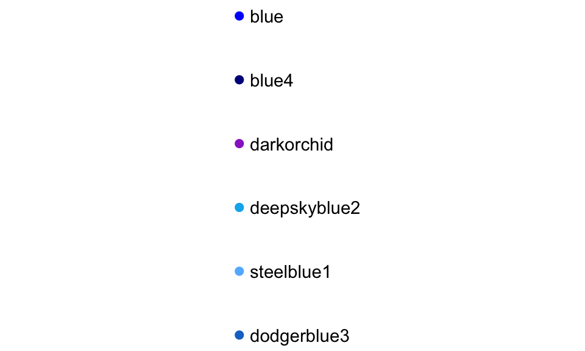

# Data Visualization: ggplot2 {#dataviz}


## Objectives
This Chapter is designed around the following learning objectives. Upon completing this Chapter, you should be able to:  

- Install and call the ggplot function to visualize dataframe elements;
- Define the difference between data, aesthetics, and layers in a ggplot call;
- Define how to change color and shape elements in a ggplot layer;
- Create, store, and save a ggplot object using an RStudio script.

## Install and call `ggplot2`
> <span style="color: blue;"> The best design gets out of the way between the viewer’s brain and the content. - Edward Tufte </span>

In this chapter, you will learn how to make basic plots using the `ggplot2` package in R (also part of the Tidyverse). This section will focus on making **useful**, rather than **attractive** graphs, since at this stage we are focusing on exploring data for yourself rather than presenting results to others. Later on, I will explain more about how you can customize ggplot objects, to help you make plots that "get out the way" between the content you wish to present and the viewer's brain, where you hope understanding takes root.  

If you don't already have `ggplot2` installed, you'll need to install it. You then need to load the package in your current session of R:


```r
install.packages("ggplot2")  
library(ggplot2)
```

The process of creating a plot using `ggplot2` follows conventions that are a bit different than most of the code you've seen so far in R (although it is somewhat similar to the idea of piping I introduced in the last chapter). The basic steps behind creating a plot with `ggplot2` are:

1. Create an object of the `ggplot` class, typically specifying the **data** and some or all of the **aesthetics**;

2. Add a layer or **geom** to the plot, along with other specific elements, using `+`.  

> **Aesthetics** or `aes` in R represent the things that we are plotting; the x and y data.  **Geoms** like `geom_point` represent the way in which we layer the aesthetics onto the plot. The geom is the type of plot that we are calling.  

You can layer on one or many geoms and other elements to create plots that range from very simple to very customized. We will start by focusing on simple geoms and added elements; later on, we will explore more detailed customization. 

<div class="rmdwarning">
<p>A common error when writing <code>ggplot2</code> code is to put the <code>+</code> to add a geom or element at the beginning of a line rather than the end of a previous line– in this case, R will try to execute the call too soon. If R gets to the end of a line and there is no indication to continue the call (e.g., <code>%&gt;%</code> for piping or <code>+</code> for <code>ggplot2</code> plots), R interprets that as a message to run the call without reading in further code. Thus, to avoid errors, be sure to end each line in <code>ggplot</code> calls with <code>+</code> (except for the final line when the call is actually over); don’t start lines with <code>+</code>.</p>
</div>

### Initializing a ggplot object

The first step in creating a plot using `ggplot2` is to create a ggplot object. This object will not, by itself, create a plot with anything in it. Instead, this first step typically specifies the data frame you want to use and which aesthetics will be mapped to certain columns of that data frame (aesthetics are explained more in the next subsection). 

Use the following conventions to initialize a ggplot object:


```r
## Generic code
object <- ggplot(my_dataframe, aes(x = data_column_1, y = data_column_2))
```

The data frame is the first parameter in a `ggplot` call and, if you like, you can use the parameter definition with that call (e.g., `data = dataframe`). Aesthetics are defined within an `aes` function call that typically is used within the `ggplot` call. 

<div class="rmdnote">
<p>While the <code>ggplot</code> call is the place where you will most often see an <code>aes</code> call, you can also make calls to <code>aes</code> within the calls to specific geoms. This can be particularly useful if you want to map aesthetics differently for different geoms in your plot. We’ll see some examples of this use of <code>aes</code> more in later sections, when we talk about customizing plots. The <code>data</code> parameter can also be used in geom calls, to use a different data frame from the one defined when creating the original ggplot object, although this tends to be less common.</p>
</div>

### Plot aesthetics
**Aesthetics** are properties of the plot that can show certain elements of the data. For example, in Figure \@ref(fig:mpg-1), we call an x-axis aesthetic (`x = class`) from the `mpg` dataset.  We then plot counts of cars within different vehicle classes using `geom_bar`. The `mpg` dataframe is included with the ggplot2 package; you can learn more about it by typing `?mpg` into the console after loading ggplot2 (`library(ggplot2)`).  You can also learn more by typing `str(mpg)` and `head(mpg)` - always a good practice when looking at a new dataframe!

According to `?mpg`:  
> "This dataset contains a subset of the fuel economy data that the EPA makes available on [http://fueleconomy.gov](http://fueleconomy.gov). It contains only models which had a new release every year between 1999 and 2008 - this was used as a proxy for the popularity of the car."


```r
# call to ggplot to map the data and a single aesthetic
ggplot(data = mpg, aes(x = class)) +
  # call to a specific geom to plot the mapped data
geom_bar()
```

<div class="figure" style="text-align: center">

<p class="caption">(\#fig:mpg-1)Example of a simple call to `ggplot` showing counts of vehicle classes from the `mpg` dataframe.</p>
</div>

Let's call this plot again with a second aesthetic, the `fill` color, which will be mapped to vehicle drive type (4-wheel, font-wheel, rear-wheel). The x-position will continue to show vehicle class, and the y-position will show the counts of vehicles, now colored by the drive types.


```r
# call to ggplot to map the data and a single aesthetic
ggplot(data = mpg, aes(x = class, fill = drv)) +
  # call to a specific geom to plot the mapped data
geom_bar()
```

<div class="figure" style="text-align: center">

<p class="caption">(\#fig:mpg-2)Example of a call to `ggplot` showing counts of vehicle classes from the `mpg` dataframe and colored by the `fill` aesthetic mapped to drive type (`drv`).</p>
</div>

<div class="rmdnote">
<p><code>ggplot</code> will naturally choose colors and add legends to plots when an aesthetic mapping creates such opportunities. You will learn ways to customize colors, legends, and other plot elements later on.</p>
</div>

Which aesthetics are required for a plot depend on which geoms (more on those in a second) you're adding to the plot. You can find out the aesthetics you can use for a geom in the "Aesthetics" section of the geom's help file (e.g., `?geom_bar`). Required aesthetics are in bold in this section of the help file and optional ones are not. Common plot aesthetics you might want to specify include: 

<table>
<caption>(\#tab:unnamed-chunk-4)Common Plot Aesthetics</caption>
 <thead>
  <tr>
   <th style="text-align:left;"> Code </th>
   <th style="text-align:left;"> Description </th>
  </tr>
 </thead>
<tbody>
  <tr>
   <td style="text-align:left;"> `x` </td>
   <td style="text-align:left;"> Position on x-axis </td>
  </tr>
  <tr>
   <td style="text-align:left;"> `y` </td>
   <td style="text-align:left;"> Position on y-axis </td>
  </tr>
  <tr>
   <td style="text-align:left;"> `shape` </td>
   <td style="text-align:left;"> Shape </td>
  </tr>
  <tr>
   <td style="text-align:left;"> `color` </td>
   <td style="text-align:left;"> Color of border of elements </td>
  </tr>
  <tr>
   <td style="text-align:left;"> `fill` </td>
   <td style="text-align:left;"> Color of inside of elements </td>
  </tr>
  <tr>
   <td style="text-align:left;"> `size` </td>
   <td style="text-align:left;"> Size </td>
  </tr>
  <tr>
   <td style="text-align:left;"> `alpha` </td>
   <td style="text-align:left;"> Transparency (1: opaque; 0: transparent) </td>
  </tr>
  <tr>
   <td style="text-align:left;"> `linetype` </td>
   <td style="text-align:left;"> Type of line (e.g., solid, dashed) </td>
  </tr>
</tbody>
</table>

### Adding geoms

When creating plots, you'll often want to add more than one `geom` to the plot. You can add these with `+` after the `ggplot` statement to initialize the ggplot object. Some of the most common geoms are:

<table>
<caption>(\#tab:unnamed-chunk-5)Common Plot Aesthetics</caption>
 <thead>
  <tr>
   <th style="text-align:left;"> Plot type </th>
   <th style="text-align:left;"> ggplot2 function </th>
  </tr>
 </thead>
<tbody>
  <tr>
   <td style="text-align:left;"> Histogram (1 numeric variable) </td>
   <td style="text-align:left;"> `geom_histogram` </td>
  </tr>
  <tr>
   <td style="text-align:left;"> Scatterplot (2 numeric variables) </td>
   <td style="text-align:left;"> `geom_point` </td>
  </tr>
  <tr>
   <td style="text-align:left;"> Boxplot (1 numeric variable, possibly 1 factor variable) </td>
   <td style="text-align:left;"> `geom_boxplot` </td>
  </tr>
  <tr>
   <td style="text-align:left;"> Line graph (2 numeric variables) </td>
   <td style="text-align:left;"> `geom_line` </td>
  </tr>
</tbody>
</table>

### Aesthetic override: a warning
The `ggplot2` package, like many Tidyverse packages, is both flexible and forgiving - designed to accomodate the user by "filling in the blanks" when no information is provided. For example, in the ggplot call that created Figure \@ref(fig:mpg-2), we didn't specify the colors to be used or the contents of the legend - instead ggplot figured those out for us. The `ggplot2` package is also somewhat *flexibile* in how calls and aesthetic mappings can be structured; for example, the following four calls all produce the same (identical) plot as shown in Figure \@ref(fig:mpg-2). Try it for yourself.


```r
# call to ggplot with aes() specified in main call
ggplot(data = mpg, aes(x = class, fill = drv)) +
geom_bar()

# call to ggplot with aes() specified in geom
ggplot(data = mpg) +
geom_bar(aes(x = class, fill = drv))

# call to ggplot with a mix of aes() mappings 
ggplot(data = mpg, aes(x = class)) +
geom_bar(aes(fill = drv))

# call to ggplot with all mappings in the geom 
ggplot() +
geom_bar(data = mpg, aes(x = class, fill = drv))
```

However, this flexibility also comes with occasional confusion, as you can often ***override*** one mapping with another one later on in the same call. For example, see what happends when two different `fill` mappings are specified at different points in the call:


```r
# call to ggplot where one `fill` overrides another
ggplot(data = mpg, aes(x = class, fill = drv)) +
geom_bar(fill = "darkgreen")
```

<div class="figure" style="text-align: center">

<p class="caption">(\#fig:mpg-4)Example of a call to `ggplot` showing counts of vehicle classes from the `mpg` dataframe and colored by the `fill` aesthetic mapped to drive type (`drv`).</p>
</div>
In this case, the aesthetic mapping of `aes(fill = drv)` was overridden by the specification in `geom_bar()`, where we wrote `fill = "darkgreen"`.  This second specification essentially wiped away the stacked bar colors and the legend (as shown in Figure \@ref(fig:mpg-2)).  As your `ggplot2` objects become more customized this sort of issue can arise; it comes with the territory of having flexible code. 

## Shapes and colors
In R, you can specify the shape of points with a number. Figure \@ref(fig:shapeexamples) shows the shapes that correspond to the numbers 1 to 25 in the `shape` aesthetic. This figure also provides an example of the difference between color (black for all these example points) and fill (red for these examples). You can see that some point shapes include a fill (21 for example), while some are either empty (1) or solid (19).

<div class="figure" style="text-align: center">

<p class="caption">(\#fig:shapeexamples)Examples of the shapes corresponding to different numeric choices for the `shape` aesthetic. For all examples, `color` is set to black and `fill` to red.</p>
</div>

If you want to set color to be a constant value, you can do that in R using character strings for different colors. Figure \@ref(fig:colorexamples) gives an example of some of the different blues available in R. To find links to listings of different R colors, google "R colors" and search by "Images".

<div class="figure" style="text-align: center">

<p class="caption">(\#fig:colorexamples)Example of available shades of blue in R.</p>
</div>

## Scales: useful plot edits

The 'ggplot2' package uses ***scales*** to as a way to make all sorts of tweaks and changes to how the plot is presented. According to the `ggplot2` reference: "Scales control the details of how data values are translated to visual properties. Override the default scales to tweak details like the axis labels or legend keys, or to use a completely different translation from data to aesthetic."

There are many scale elements that you can add onto a `ggplot` object using `+`. A few that are used very frequently are: 

<table>
<caption>(\#tab:unnamed-chunk-6)Common Scale Elements</caption>
 <thead>
  <tr>
   <th style="text-align:left;"> Element </th>
   <th style="text-align:left;"> Description </th>
  </tr>
 </thead>
<tbody>
  <tr>
   <td style="text-align:left;"> `ggtitle` </td>
   <td style="text-align:left;"> Plot title </td>
  </tr>
  <tr>
   <td style="text-align:left;"> `xlab`, `ylab` </td>
   <td style="text-align:left;"> x- and y-axis labels </td>
  </tr>
  <tr>
   <td style="text-align:left;"> `xlim`, `ylim` </td>
   <td style="text-align:left;"> Limits of x- and y-axis </td>
  </tr>
  <tr>
   <td style="text-align:left;"> `scale_x_log10` </td>
   <td style="text-align:left;"> Log scale x axis </td>
  </tr>
</tbody>
</table>

## Example plot

For the example plots, we will continue to use the `mpg` dataset from the `ggplot2` package. We will use functions from the `dplyr` package, too, so both need to be loaded. In this figure, we will look at highway fuel efficiency for SUVs in 2008, ordered by manufacturer and colored by the engine displacement size in liters.  We create subsets of the `mpg` dataframe in two ways:  

1. We create a summary dataframe (`mpg_5`) by applying two `filter` calls on the `mpg` object.  We then `group_by` the manufacturer so that average values for highway fuel economy (`hwy.mean`) and engine displacement (`displ.mean`) can be calculated through a call to `summarise`.  
2. We subset the `mpg` dataframe again, this time directly within the `data =` call for `ggplot2`.   

* The first layer (`geom_jitter`) is a point plot that adds a slight amount of wobble or jitter to the data points so that they don't overlap on the plot.  Here, we have called `geom_jitter` to display the individual values for 2008 SUV fuel economy (on the highway) as a function manufacturer.  

* The second layer (`geom_errorbar`) is a horizontal line plot showing the mean values for SUV models within each manufacturer.

We also add custom lables and a fancy color scale to investigate whether engine displacement has an effect on fuel efficiency (note the additional aesthetic calls for `color = ` in each layer).  The final part of the call `theme_classic()` tells ggplot to remove the grey background and the grid lines, which I don't feel are necessary.


```r
library(dplyr)
library(ggplot2)

# use dplyr to create a summary subset from the mpg dataframe
mpg_5 <- mpg %>%
  filter(class == "suv", year == 2008) %>%
  group_by(manufacturer) %>%
  summarise(hwy.mean = mean(hwy), displ.mean = mean(displ))

# call to ggplot, note that data and aesthetics are called in each geom layer
ggplot() +
  # first layer
  geom_jitter(data = filter(mpg, class == "suv", year == 2008),
           aes(x = manufacturer, 
               y = hwy, 
               color = displ),
           width = 0.1,
           size = 2) +
  # second layer
  geom_errorbar(data = mpg_5,
             aes(x = manufacturer,
                 ymin = hwy.mean,
                 ymax = hwy.mean,
                 color = displ.mean),
             alpha = 0.5,
             size = 1) +
  # customize plot labels
  labs(title = "Fuel Economy for 2008 SUVs by Manufacturer and Engine Displacement",
       color = "Disp (L)") +
  ylab("highway fuel economy (miles/gal)") +
  # add a fancy color scale
  scale_color_viridis_c(option = "D", direction = -1) +
  # adopt a theme without grey background
  theme_classic() 
```

<div class="figure" style="text-align: center">

<p class="caption">(\#fig:mpg-5)A two-layer (two `geom`) plot with customization</p>
</div>

What conclusions can you draw from examining Figure \@ref(fig:mpg-5)?  In general, model year 2008 SUVs did not have great fuel economy, as can be seen from both the means and the individual data points.  

## Store and save ggplot2 objects
Sometimes you will want to store a ggplot2 plot as an object in your global environment (so that it can be called or manipulated later on). This is done in the same way as you would create and assign a name to any other object in R.

```r
# create a ggplot object called "plot1"
plot1 <- ggplot(data = mpg, aes(x = class)) +
geom_bar()
```

<div class="rmdnote">
<p>When you create and store a <code>ggplot</code> object (<code>plot1 &lt;- ggplot(data = mpg....</code>) the plot itself will be created and stored but not returned as output. If you want to “see” the plot, just enter its name into the console or script.</p>
</div>

You can also save `ggplot2` plots as image files to a local directory using the `ggsave` function.  This function requires a filename but also allows you to specify paramaters like image resolution (`dpi = 300`), image type (`device = png()`), and image `height`, `width` and `units` of measurement. 


```r
# create a ggplot object called "plot1"
plot1 <- ggplot(data = mpg, aes(x = class)) +
geom_bar()

ggsave("./images/mpg-1.png",
       plot = plot1,
       dpi = 150,
       device = png(),
       width = 20,
       units = "cm")
```

## Getting help with ggplot2
The `ggplot2` package has become so popular that most of my "how do I do this?" questions have already been asked, answered, and archived on sites like [stackoverflow](https://stackoverflow.com/). Another great source is the ggplot2 reference section on the [Tidyverse site](https://ggplot2.tidyverse.org/reference/index.html). This page contains a nice, concise summary of how to call and customize plot objects. I reccommend  starting there because (1) it is created and maintained by the `ggplot2` developers (and, thus, is authoritative) and (2) the reference page contains all the function calls in an organized list, for which you can conduct a 'control/command F' search. 

## Class Exercises
1. Create a `geom_col`
2. Create a geom_jitter (mtcars y=mpg, x=cyl)
3. Vary fill, color, line for whole plot
4. Create fill, color aesthetics
