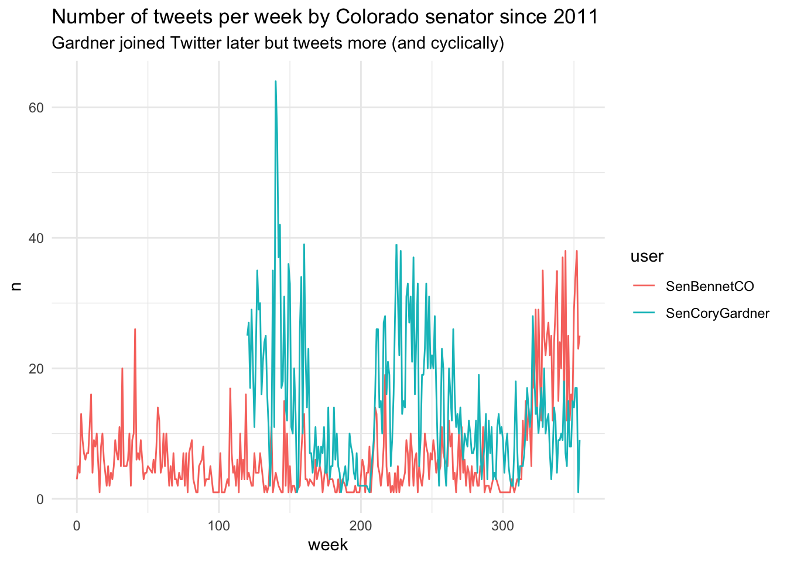
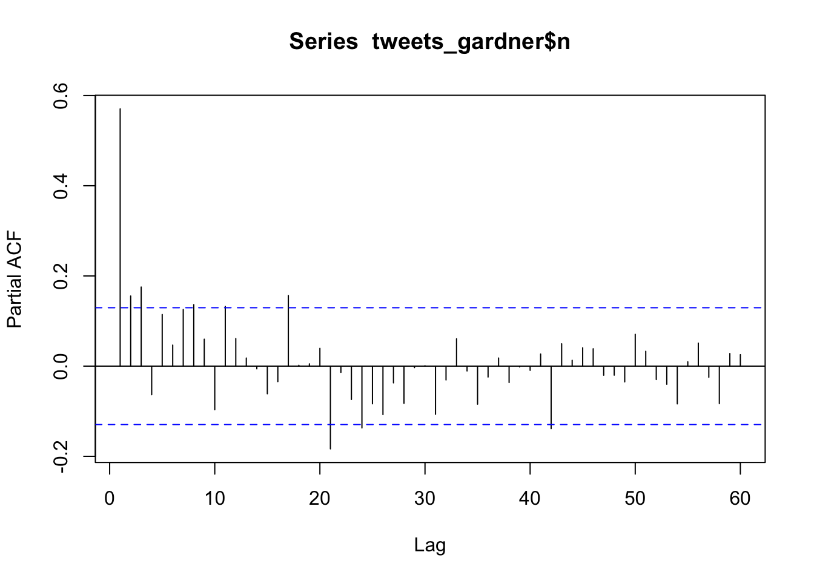

# Strings, Dates, and Tidying {#rprog3}


## Chapter 6 Objectives

This Chapter is designed around the following learning objectives. Upon
completing this Chapter, you should be able to:  

- Define the meaning of "strings" and "date time" objects in R
- Manipulate character strings using the `stringr` and `tidyr` packages of functions
- Parse strings using regular expressions ("regex")
- Describe how R stores a POSIXct date and time object internally
- Convert a character vector to a date format using functions from the
`lubridate` R package
- Extract information from a date object (e.g., month, year, day of week) using `lubridate` functions
- Search, organize, and visualize data that are linked to date objects
- Apply functions from the `dplyr` and `tidyr` packages to make dataframes "tidy"

## Strings {#strings}

***Strings*** are a form of character data like "John", or "blue", or "John's
sample 8021A turned blue". 

**Strings are defined in R using quotes `" "`** and stored as `character` 
vectors; they often show up in data analysis in one of two ways:  

  1. As ***metadata***. Metadata means: "data that describe other data".  
  A *readme.txt* file is metadata; notes and code comments are metadata. All of 
  these types of data usually come in the form of strings and are included 
  **with the data your are analyzing** but not **in the dataset** itself.  
  
  2. As ***vectorized data***.  In R programming, *"vectorized"* means: stored 
  as a column of data. Examples of vectorized strings that you might find 
  include things like: "participant names", or "survey responses to question 1",
  or "mode of failure". The example below creates three different string vectors 
  in R. *Note:* You can check the type of object you've created using the 
  `class()` or `typeof()` functions.
    

``` r
# examples of vectorized string data
names_respond <- c("Ahmed", 
                   "Josh", 
                   "Mateo", 
                   "William", 
                   "Ali", 
                   "Wei", 
                   "Steve-O",
                   "John")
q1_responses <- c("Because you told me to do it.",
                  "It seemed like the right thing to do at the time.",
                  "Because I had been over-served.",
                  "I don't know. I just did it.",
                  "I got caught up in the heat of the moment.",
                  "I was given an opportunity. I took my shot.",
                  "I plead the 5th.",
                  "I could ask you the same question.")
failure_mode <- c("fracture",
                  "yielding", 
                  "deflection", 
                  "fatigue", 
                  "creep")

# proof of vector type
class(names_respond)
```

```
## [1] "character"
```
    
The first step in analyzing a string is to parse it. 
**To parse means to examine the individual components.** For example, when you
read this sentence you parse the words and then assign meaning to those
words based on your memory, your understanding of grammar, and the context in
which those words occur. Context is often critical to understanding because the
meaning of words can change from one context to the next (i.e., whether you are
reading an instruction manual, a text message, a novel, or a warrant for your
arrest). Strings can be challenging to analyze because computers are built on
logical operations and mathematics; strings are neither of those. Computers
have fantastic memory, are OK at grammar, and are comically poor at
contextualization. Taken together, this means that strings can be challenging
(but not impossible) to analyze using computers. 

<div class="rmdnote">
<p>Are you active on social media platforms like Instagram or Twitter?
You can bet that a computer program has downloaded and parsed all of
your posts, each one as a string. You can learn a lot about a person
(and their buying habits) from what they post online!</p>
</div>

In this chapter, we will introduce a few simple string functions from base R
and the `stringr` package. We will also introduce the concept of 
**regular expressions** as a means to perform more advanced string
manipulation.


### String detect, match, subset

One of the simplest string operations is to search whether a string contains a
pattern of interest. The `stringr` package (part of the
[Tidyverse](https://stringr.tidyverse.org/){target="_blank"}) was developed 
to simplify the
analysis of strings. Most of the functions in `stringr` begin with `str_` and
end with a specific function name. A full list of functions is provided
[here](https://stringr.tidyverse.org/reference/index.html){target="_blank"}. Some examples:  

1. **`str_detect()`** returns a vector of logical values (TRUE/FALSE) indicating whether the pattern was detected within each string searched. The function takes two arguments, the `string` to be searched and the `pattern` for which to search. Let's search for the pattern `"Josh"` in the character vector of strings, `names_respond`, that we created above:
  

``` r
stringr::str_detect(string = names_respond, 
                    pattern = "Josh")
```

```
## [1] FALSE  TRUE FALSE FALSE FALSE FALSE FALSE FALSE
```

As expected, only one string in the vector produced a match.  

An added benefit of logical functions like `str_detect()` is that return values
of `TRUE` are coded as 1 and `FALSE` as 0.  Thus, if we `sum()` the result of
the `str_detect()` search, we will get the cumulative number of matches to
`"Josh"` from within our data.


``` r
stringr::str_detect(string = names_respond, 
           pattern = "Josh") %>%
  sum()
```

```
## [1] 1
```

In other words, logical functions like `str_detect()` allow us to do math on
string data! For example, we can now calculate the proportion of `"Josh"`
entries within our sample:


``` r
stringr::str_detect(string = names_respond, 
                    pattern = "Josh") %>%
  sum() / length(names_respond)
```

```
## [1] 0.125
```

2. **`str_extract()`** takes the same arguments as `str_detect()` but returns a vector of the matched values (by string index). By "matched values", I mean only the portion of the string for which the search created a match.


``` r
stringr::str_extract(string = names_respond, 
                     pattern = "Jo")
```

```
## [1] NA   "Jo" NA   NA   NA   NA   NA   "Jo"
```

3. **`str_subset()`** returns only the entries that were matched (i.e., if a match was detected, then the entire string that was matched is returned). If we subset our short list of names to the pattern of letters `"li"`, we get:


``` r
stringr::str_subset(string = names_respond, 
           pattern = "li")
```

```
## [1] "William" "Ali"
```
  
To note, there are base R versions of all these `stringr` functions.  Most are
performed with the `grep` family of functions. The term *"grep"* is an acronym
for **<u>G</u>lobal <u>R</u>egular <u>E</u>xpression <u>P</u>attern** (more on
*regular expressions* below).  Many "old-school" coders use this family of
functions, therefore, you will encounter them in the wild, so it's worth
knowing about them.


|stringr_funcs          |base_funcs                         |
|:----------------------|:----------------------------------|
|str_detect(x, pattern) |grepl(pattern, x)                  |
|str_match(x, pattern)  |regexec(pattern, x) + regmatches() |
|str_subset(x, pattern) |grep(pattern, x, value = TRUE)     |

### Regular Expressions

Before going much farther, we should spend some time discussing 
***regular expressions*** or **regex** for short. When we pass a `pattern`
argument to a function like `str_detect()`, the function treats that argument
like a "regex". Up until this point, I have only passed simple character
strings as `pattern` arguments (i.e., `pattern = "Josh"`).  In reality, we can
create much more advanced search criteria using **regex** syntax within our
search patterns. 

<div class="rmdnote">
<p>A <strong>regular expression</strong> is a sequence of characters
that define a search pattern to be implemented on a string.</p>
</div>

In the R programming language, regular expressions follow the POSIX 1003.2
standard; regex can have different syntax based on the underlying standard.
Regex are created by including search syntax (i.e., symbols that communicate
search parameters) within your quoted string. For example, square brackets `[]`
in a search pattern indicate a search for *any* of the characters within the
brackets; conversely, to match *all* the characters you simply include them in
quotes. A key strength of regex patterns is that they allow you to use logical
and conditional relations. For example, the following text search patterns can
be coded as regex:  

| Desired Search Pattern | Regex in R |
|:------------------------|:------------|
| *any letter followed by the numbers 3, 4, or 5* | "[:alpha:][345]" |
| *strings that start with 'ID' and are followed by 4 numbers* |  "^ID[:digit:]{4}" |

One challenging aspect of string searching in R, however, is that certain
"special characters" like the quote `"` and the backslash `\` symbol must be
explicitly identified within the string in order to be interpreted by R
correctly. To identify these *special characters* in a string, you need to
***"escape"*** that character using a backslash `\`. Thus, if you want to
search for a quote symbol, you would type in `\"`.  Whenever a regex requires
the use of a `\`, you have to identify it within a string as `\\`.   The table
below shows some basic regex syntax and how they would be implemented as a
search pattern in R.


Table: (\#tab:regex-1)Basic Regex Search Syntax and Example Implementation in R

| Regex syntax |                   String to be matched                    |      Example in R      |
|:------------:|:---------------------------------------------------------:|:----------------------:|
|     \\d      |                     Any numeric digit                     | "\\\\d" or "[:digit:]" |
|    [abc]     |                    matches a, b, or c                     |        "[abc]"         |
|    [a-z]     |          matches every character between a and z          |        "[a-z]"         |
|    [^abc]    |            matches anything except a, b, or c             |        "[^abc]"        |
|    (abc)     | creates a "capture group" whereby abc must occur together |        "(abc)"         |
|      ^b      |    starts with: look for "b" at the start of a string     |         "\^b"          |
|      b$      |      ends with: look for "b" at the end of a string       |         "b\$"          |
|   a&#124;b   |                       match a or b                        |       "a&#124;b"       |

**Regex** sequences have seemingly no end of sophistication and nuance; you
could spend dozens of hours learning to use them and hundreds more learning to
master them. We will only introduce basic concepts here.  More in-depth
introductions to regex syntax and usage can be found on [Hadley Wickham's R course](https://r4ds.hadley.nz/strings.html){target="_blank"}, 
on the `stringr` 
[cheatsheet](https://github.com/rstudio/cheatsheets/blob/main/strings.pdf){target="_blank"} 
developed by RStudio, and through practice with, my personal favorite, a game
of [Regex Golf](https://alf.nu/RegexGolf){target="_blank"}.

### String split, replace
  
`str_split()` will split a string into two (or more) pieces when a match is
detected. The string will always be split at the first match and again at each
additional match location, unless you specify that only a finite number of `n`
matches should occur. A couple points to note:

- `str_split()` splits on each side of the match; the matched part of the string
is *not* included in the output.

- because both sides of the split string are returned, your output will take 
the form of a `list`.
  

``` r
stringr::str_split(string = names_respond, pattern = "t")
```

```
## [[1]]
## [1] "Ahmed"
## 
## [[2]]
## [1] "Josh"
## 
## [[3]]
## [1] "Ma" "eo"
## 
## [[4]]
## [1] "William"
## 
## [[5]]
## [1] "Ali"
## 
## [[6]]
## [1] "Wei"
## 
## [[7]]
## [1] "S"     "eve-O"
## 
## [[8]]
## [1] "John"
```
  
`str_replace()` searches for a match and then replaces the matched value
with a new string of your choosing.  The function takes three arguments: the
`string` to be searched, the `pattern` to match, and the `replacement`
string to be inserted. Let's replace the first period detected in each of
the `q1_responses` strings with a question mark.  Both `.` and `?` are
*special characters* so we need to *"escape"* each of these symbols with two
back-slashes `\\`.
  

``` r
stringr::str_replace(string = q1_responses,
                     pattern = "\\.",
                     replacement = "\\?")
```

```
## [1] "Because you told me to do it?"                    
## [2] "It seemed like the right thing to do at the time?"
## [3] "Because I had been over-served?"                  
## [4] "I don't know? I just did it."                     
## [5] "I got caught up in the heat of the moment?"       
## [6] "I was given an opportunity? I took my shot."      
## [7] "I plead the 5th?"                                 
## [8] "I could ask you the same question?"
```

The `str_replace()` family of functions is useful for cleaning up misspellings
(or other unwanted language) in strings. Note, however, that `str_replace()`
will normally replace only one instance of a match; use `str_replace_all()` if
you plan to encounter multiple matches that need replacing.

<div class="rmdtip">
<p>The <code>pattern =</code> argument for matching can be a single
string or a vector of strings. In the latter case, you can define a
vector of <em>keywords</em> that you might be searching for across
sentences. In that case, use
<code>pattern = c("pattern_1", "pattern_2", "pattern_3", ...etc)</code>.</p>
</div>

## Dates and Date-times

Working with dates and times can be challenging. This section begins with a
discussion of how base R handles dates and times, since there is a ton of code
out there that utilizes these older functions. We will then quickly transition
to the `lubridate` family of functions (part of the Tidyverse) because of their
versatility and ease-of-use.  

### Dates and Times in base R

Dates and times in base R all proceed from an *"epoch"* or *time origin*.  In
R, the *epoch* or "dawn of time" occurred at midnight on January 1^st^, 1970. 
For the sake of the R programming world, the concept of time started at that
precise moment and has moved forward ever since. To note: R can handle
date-times before 1/1/1970; it just treats them as negative values!  

To see a date-time object, you can tell R to give you the current "System Time"
by calling the `Sys.time()` function.


``` r
Sys.time()
```

```
## [1] "2024-10-29 18:43:45 EDT"
```

As you can see, we got back the date, time, and timezone used by my computer
(*whenever I last ran this code in `bookdown`*).  If you want to see how this
time is stored in R internally, you can use `unclass()`, which returns an
object value with its class attributes removed.  When we wrap `unclass()`
around `Sys.time()`, we will see the number of seconds that have occurred
between the epoch of 1/1/1970 and right now:


``` r
unclass(Sys.time())
```

```
## [1] 1730241826
```

That's a lot of seconds.  How many years is that?  
Just divide that number by [60s/min $\cdot$ 60min/hr $\cdot$ 24hr/d $\cdot$
365d/yr] => 54.8656084 years.  

This calculation ignores leap years, but you get the point...

### Date-time formats

Note that the `Sys.time()` function provided the date in a
***"year-month-day"*** format and the time in an ***"hour-minute-second"***
format: 2024-10-29 18:43:45.76379.

Not everyone uses this exact ordering when they record dates and times, which
is one of the reasons working with dates and times can be tricky. You probably
have little difficulty recognizing the following date-time objects as
equivalent but, for some computer programs, not so much:

<table class="table table-striped" style="width: auto !important; margin-left: auto; margin-right: auto;">
<caption>(\#tab:date-times-1)(\#tab:date-times-1)Date-time objects come in different forms</caption>
 <thead>
  <tr>
   <th style="text-align:left;">  </th>
  </tr>
 </thead>
<tbody>
  <tr>
   <td style="text-align:left;"> 12/1/99 8:46 PM </td>
  </tr>
  <tr>
   <td style="text-align:left;"> 1-Dec-1999 20:46 UTC </td>
  </tr>
  <tr>
   <td style="text-align:left;"> December 1st, 1999, 20:46:00 </td>
  </tr>
</tbody>
</table>

<div class="rmdnote">
<p>You will often see time followed by <strong>“UTC”</strong>, which
stands for <em>“Universal Time, Coordinated”</em>. UTC is preferred by
programmers because it doesn’t have a timezone and it doesn’t follow
<em>Daylight Savings Time</em> conventions. Daylight savings is the bane
of many coders.</p>
<p>In practice, UTC is the same time as GMT (Greenwich Mean Time,
pronounced “gren-itch”) but with an important distinction. GMT is one of
the many <a
href="https://wikipedia.org/wiki/List_of_tz_database_time_zones"
target="_blank">time-zones</a> laid out across Earth’s longitude,
whereas, <strong>UTC has no timezone</strong>; UTC is the same time for
everyone, everywhere.</p>
<p>In Colorado, we are UTC-6 hours during <em>daylight savings</em>
(March-Nov) and UTC-7 during <em>standard time</em> (Nov-March). This
means that most Coloradoans eat dinner at 12am UTC (6pm MST).</p>
</div>

### Date-time classes in R

R has several classes of date-time objects, none of which are easy to remember:

1. **`POSIXct`** - stored as the time, in seconds, between the `epoch` of 1970-01-01 00:00:00 UTC and the date-time object in question.  
    * the 'ct' stands for *"continuous time"* to represent "continuous seconds from origin";
    * A `POSIXct` object is a single numeric vector, thus useful for efficient computing.
2. **`POSIXlt`** - stored as a list of date-time objects.  
    * the 'lt' stands for *"list time"*.
    * A `POSIXlt` list contains the following elements:
      * *sec* as 0–61 seconds
      * *min* as 0–59 minutes
      * *hour* as 0–23 hours
      * *mday* as 1–31 day of the month
      * *mon* as 0–11 months after the first of the year
      * *year* as Years since 1900
      * *wday* as 0–6 day of the week, starting on Sunday
      * *yday* as 0–365 days of the year.
      * *isdst* as a flag for Daylight savings time. Positive if in force, zero if not, negative if unknown.
3. **`POSIXt`** - this is a virtual class. `POSIXt` (without the "l") is an internal way for R to convert between `POSIXct` and `POSIXlt` date-time objects.  
    * Think of the `POSIXt` as a way for R to perform operations/conversions between a `POSIXct` and `POSIXlt` object without throwing an error your way.

As a reminder, here are some common **object classes** in R:

<table class="table" style="width: auto !important; margin-left: auto; margin-right: auto;">
 <thead>
  <tr>
   <th style="text-align:left;"> Class </th>
   <th style="text-align:left;"> Example </th>
  </tr>
 </thead>
<tbody>
  <tr>
   <td style="text-align:left;"> `character` </td>
   <td style="text-align:left;"> "Chemistry", "Physics", "Mathematics" </td>
  </tr>
  <tr>
   <td style="text-align:left;"> `numeric` </td>
   <td style="text-align:left;"> 10, 20, 30, 40 </td>
  </tr>
  <tr>
   <td style="text-align:left;"> `factor` </td>
   <td style="text-align:left;"> Male [underlying number: 1], Female [2] </td>
  </tr>
  <tr>
   <td style="text-align:left;"> `Date` </td>
   <td style="text-align:left;"> "2010-01-01" [underlying number: 14,610] </td>
  </tr>
  <tr>
   <td style="text-align:left;"> `logical` </td>
   <td style="text-align:left;"> TRUE, FALSE </td>
  </tr>
  <tr>
   <td style="text-align:left;"> `date-time` </td>
   <td style="text-align:left;"> "2020-06-23 11:05:20 MDT" </td>
  </tr>
</tbody>
</table>

To discover the class of a vector (including a column in a dataframe---remember
each column can be thought of as a vector), you can use `class()`:


``` r
class(Sys.time())
```

```
## [1] "POSIXct" "POSIXt"
```

Both the `POSIXct` and `POSIXlt` class of objects return the same value to the 
user; the difference is really in how these classes store date-time objects 
internally. To examine them, you can coerce `Sys.time()` into each of the two 
classes using `as.POSIXct` and `as.POSIXlt` functions and then examine their 
attributes.


``` r
time_now_ct <- as.POSIXct(Sys.time())
unclass(time_now_ct)
```

```
## [1] 1730241826
```


``` r
time_now_lt <- as.POSIXlt(Sys.time())
str(unclass(time_now_lt)) # the `str()` function makes the output more compact
```

```
## List of 11
##  $ sec   : num 45.8
##  $ min   : int 43
##  $ hour  : int 18
##  $ mday  : int 29
##  $ mon   : int 9
##  $ year  : int 124
##  $ wday  : int 2
##  $ yday  : int 302
##  $ isdst : int 1
##  $ zone  : chr "EDT"
##  $ gmtoff: int -14400
##  - attr(*, "tzone")= chr [1:3] "" "EST" "EDT"
##  - attr(*, "balanced")= logi TRUE
```

It's easy to see why the `POSIXct` object class is more computationally 
efficient, but it's also nice to see all the date-time information packed into 
the `POSIXlt`. This is why R keeps a key to unlock both using `POSIXt`.  
As my father used to say: clear as mud?

### Reading and classifying date-times

Oftentimes, when data is read into R, there are column elements that contain 
date and time information. These dates and times are often interpreted by R 
as *character* vectors, which means they have lost their relational attributes. 
For example, you cannot subtract "Monday 08:00" from "Wednesday 12:00" and get 
"2 days 4 hours". If we want to analyze dates and times in a relational way, 
we need to instruct R to recognize these as date-time objects (i.e., as either 
the `POSIXct` or `POSIXlt` class). Thus, to convert a character vector into 
date or date-time object requires a change of that vector's class.

Date-time elements can be tricky to work with for a few reasons:  

1. Different programs store and handle dates and times in different ways  
2. The existence of time zones means that date-time values can change with location
3. Date-time strings can be separated with spaces, colons, commas, slashes, dashes, or a mix of all those together (see Table \@ref(tab:date-times-1))

The base R function to convert between `character` classes and `date-time` 
classes is the function `strptime()`, which is short for 
*"**str**ing **p**arse into date-**time**"*. I mention this function not because
I encourage you to use it but because I want you to be able to recognize it. The
function has over 39 conversion specifications that it can take as arguments. 
That is to say, this function not simple to master. If you are a glutton for 
punishment, I invite you to read the R Documentation with `?strptime`.

Here are a few base R functions for working with date-time objects that are 
worth knowing:

<table class="table table-striped" style="width: auto !important; margin-left: auto; margin-right: auto;">
<caption>(\#tab:base-r-times)(\#tab:base-r-times)Basic Date-time functions</caption>
 <thead>
  <tr>
   <th style="text-align:left;"> {base} R Function </th>
   <th style="text-align:left;"> Value Returned </th>
   <th style="text-align:left;"> Example </th>
  </tr>
 </thead>
<tbody>
  <tr>
   <td style="text-align:left;"> Sys.Date() </td>
   <td style="text-align:left;"> Current system date </td>
   <td style="text-align:left;"> "2020-06-23" </td>
  </tr>
  <tr>
   <td style="text-align:left;"> Sys.time() </td>
   <td style="text-align:left;"> Current system date-Time </td>
   <td style="text-align:left;"> "2020-06-23 11:05:20 MDT" </td>
  </tr>
  <tr>
   <td style="text-align:left;"> Sys.timezone() </td>
   <td style="text-align:left;"> Current system timezone </td>
   <td style="text-align:left;"> "America/Denver" </td>
  </tr>
  <tr>
   <td style="text-align:left;"> as.POSIXct() </td>
   <td style="text-align:left;"> date-time object of class POSIXct </td>
   <td style="text-align:left;"> "2020-06-23 11:05:20 MDT" </td>
  </tr>
  <tr>
   <td style="text-align:left;"> as.POSIXlt() </td>
   <td style="text-align:left;"> date-time object of class POSIXlt </td>
   <td style="text-align:left;"> "2020-06-23 11:05:20 MDT" </td>
  </tr>
  <tr>
   <td style="text-align:left;"> strptime() </td>
   <td style="text-align:left;"> date-time object of class POSIXlt </td>
   <td style="text-align:left;"> "2020-06-23 11:05:20 MDT" </td>
  </tr>
</tbody>
</table>

## `lubridate` {#lubridate}

The `lubridate` package was developed specifically to make it easier to work
with date-time objects. You can find out more information on `lubridate`
[here](https://lubridate.tidyverse.org/){target="_blank"}.

### Parsing functions in `lubridate`

One of best aspects of `lubridate` is its ability to parse date-time objects 
with simplicity and ease; the `lubridate` parsing functions are designed as 
"named-to-order". Let me explain:  

> <span style="color: blue;"> **Parse**: ***to break apart and analyze the individual components*** of something, like a character string. </span>

* If a character vector is written in "**y**ear-**m**onth-**d**ay" format (e.g., `"2020-Dec-18"`), then the `lubridate` function to convert that vector is `ymd()`.

* If a character vector is written in "**d**ay-**m**onth-**y**ear" format (e.g., `"18-Dec-2020"`), then the `lubridate` function to convert that vector is `dmy()`.  Try it out:


``` r
# create a character vector
date_old <- "2020-Dec-18"

# prove it's a character class
class(date_old)
```

```
## [1] "character"
```

``` r
# convert it to a `Date` class with `ymd()`
date_new <- lubridate::ymd(date_old)

# prove it worked
class(date_new)
```

```
## [1] "Date"
```

That little conversion exercise may not have blown you away, but watch what 
happens when I feed the following set of wacky character vectors into that 
same `lubridate` parsing function, `ymd()`:


``` r
messy_dates <- c("2020------Dec the 12",
                 "20.-.12.-.12",
                 "2020aaa12aaa12",
                 "20,12,12",
                 "2020x12-12",
                 "2020   ....    12        ......     12",
                 "'20.December-12")
ymd(messy_dates)
```

```
## [1] "2020-12-12" "2020-12-12" "2020-12-12" "2020-12-12" "2020-12-12"
## [6] "2020-12-12" "2020-12-12"
```

Boom. That's right, the `ymd()` parsing function figured them all out correctly
with almost no effort on your part. But wait, there's more! 

The `lubridate` package contains parsing functions for almost any order you can 
imagine.

<table class="table" style="width: auto !important; margin-left: auto; margin-right: auto;">
 <thead>
  <tr>
   <th style="text-align:left;"> Parsing Function </th>
   <th style="text-align:left;"> Format to Convert </th>
  </tr>
 </thead>
<tbody>
  <tr>
   <td style="text-align:left;"> `ymd()` </td>
   <td style="text-align:left;"> year-month-day </td>
  </tr>
  <tr>
   <td style="text-align:left;"> `mdy()` </td>
   <td style="text-align:left;"> month-day-year </td>
  </tr>
  <tr>
   <td style="text-align:left;"> `dmy()` </td>
   <td style="text-align:left;"> day-month-year </td>
  </tr>
</tbody>
</table>

And if you need to parse a time component, simply add a combination of `_hms` to
the function call to parse time in "hours-minutes-seconds" format. Some 
additional examples of how you would parse time that followed from a `ymd` 
format:

<table class="table" style="width: auto !important; margin-left: auto; margin-right: auto;">
 <thead>
  <tr>
   <th style="text-align:left;"> Parsing Function </th>
   <th style="text-align:left;"> Format to Convert </th>
  </tr>
 </thead>
<tbody>
  <tr>
   <td style="text-align:left;"> `ymd_h()` </td>
   <td style="text-align:left;"> year-month-day_hours </td>
  </tr>
  <tr>
   <td style="text-align:left;"> `mdy_hm()` </td>
   <td style="text-align:left;"> year-month-day_hours-minutes </td>
  </tr>
  <tr>
   <td style="text-align:left;"> `dmy_hms()` </td>
   <td style="text-align:left;"> year-month-day_hours-minutes-seconds </td>
  </tr>
</tbody>
</table>

The beauty of the `lubridate` parsers is that they do the hard work of cleaning 
up the character vector, regardless of separators or delimiters within each 
string, and return either a `Date` or `Date-time` object class.

### Date-time manipulation with `lubridate`

To convert the `date` column in the `daily_show` data into a Date class, you can
run:


``` r
library(package = "lubridate")

# check the class of the 'date' column before mutating it
class(x = daily_show$date) 
```

```
## [1] "character"
```

``` r
daily_show <- mutate(.data = daily_show,
                     date = mdy(date))
head(x = daily_show, n = 3)
```

```
## # A tibble: 3 × 5
##    year job                date       category guest_name     
##   <dbl> <chr>              <date>     <chr>    <chr>          
## 1  1999 actor              1999-01-11 Acting   Michael J. Fox 
## 2  1999 Comedian           1999-01-12 Comedy   Sandra Bernhard
## 3  1999 television actress 1999-01-13 Acting   Tracey Ullman
```

``` r
# check the class of the 'date' column after mutating it
class(x = daily_show$date) 
```

```
## [1] "Date"
```

Once you have an object in the `Date` class, you can do things like plot by
date, calculate the range of dates, and calculate the total number of days the
dataset covers:


``` r
# report the min and max dates
range(daily_show$date)

# calculate the duration from first to last date using base
max(daily_show$date) - min(daily_show$date)
```

We could have used these to transform the date in `daily_show`, using the 
following pipe chain: 


``` r
daily_show <- readr::read_csv(file = "data/daily_show_guests.csv",
                              skip = 4) %>%
  dplyr::rename(job = GoogleKnowlege_Occupation,
                date = Show,
                category = Group,
                guest_name = Raw_Guest_List) %>%
  dplyr::select(-YEAR) %>%
  dplyr::mutate(date = lubridate::mdy(date)) %>%
  dplyr::filter(category == "Science")

# show first two rows of dataframe
head(x = daily_show, n = 2)
```

```
## # A tibble: 2 × 4
##   job          date       category guest_name     
##   <chr>        <date>     <chr>    <chr>          
## 1 neurosurgeon 2003-04-28 Science  Dr Sanjay Gupta
## 2 scientist    2004-01-13 Science  Catherine Weitz
```

The `lubridate` package also includes functions to pull out certain elements of 
a date, including: 

- `wday()` return the day of the week pertaining to a Date object
- `mday()` return the day of the month pertaining to a Date object
- `yday()` return the day of the year pertaining to a Date object
- `month()` return the month pertaining to a Date object
- `quarter()` return the quarter of hte year pertaining to a Date object
- `year()` return the year pertaining to a date object

For example, we could use `wday()` to create a new column with the weekday of 
each show: 


``` r
daily_show %>% 
  dplyr::mutate(show_day = lubridate::wday(x = date,
                                           label = TRUE)) %>%
  dplyr::select(date, show_day, guest_name) %>%
  dplyr::slice(1:5)
```

```
## # A tibble: 5 × 3
##   date       show_day guest_name            
##   <date>     <ord>    <chr>                 
## 1 2003-04-28 Mon      Dr Sanjay Gupta       
## 2 2004-01-13 Tue      Catherine Weitz       
## 3 2004-06-15 Tue      Hassan Ibrahim        
## 4 2005-09-06 Tue      Dr. Marc Siegel       
## 5 2006-02-13 Mon      Astronaut Mike Mullane
```

<div class="rmdwarning">
<p>R functions tend to use the timezone of <strong>YOUR</strong>
computer’s operating system by default—or UTC, or GMT. You need to be
careful when working with dates and times to either specify the time
zone or convince yourself the default behavior works for your
application. To see or set your computer’s time zone, use the
<code>Sys.timezone()</code> function from <code>{base}</code>.</p>
</div>

## Tidy Data

***"Tidy Data"*** is a philosophy for how to arrange your data in a intuitive, 
rectangular fashion, commonly in a `dataframe`. In his 
[2014 paper](https://www.jstatsoft.org/index.php/jss/article/view/v059i10/v59i10.pdf){target="_blank"}, 
Hadley Wickham states, 
*"tidy datasets provide a standardized way to link the structure of a dataset (its physical layout) with its semantics (its meaning)."*  

The definition of a tidy dataset is straightforward:  

  1. Each variable forms a column.
  2. Each observation forms a row.
  3. Each type of observational unit forms a table.

The first two rules, *each variable forms a column* and 
*each observation forms a row*, are relatively easy to implement.
In fact, most of the dataframes that we have used so far follow this convention.
The trick is to note that some column variables might look *independent* from 
one another, when, in fact, the columns represent a single variable broken out 
by some hierarchical, or nesting, structure.

For example, the (untidy) table below (\@ref(tab:grades-untidy)) shows exam 
grades for three students. Table \@ref(tab:grades-untidy) is untidy because
the variable depicting the exam score shows up in three different columns.  
Another way to characterize the *untidiness* of this table is that we have three
different exams (Exam1, Exam2, Exam3) that represent a variable (Exam_# or 
Exam_type), that is not represented with a column.

<table class="table table-condensed" style="width: auto !important; margin-left: auto; margin-right: auto;">
<caption>(\#tab:grades-untidy)(\#tab:grades-untidy)An Untidy Table of Exam Scores.</caption>
 <thead>
  <tr>
   <th style="text-align:left;"> Name </th>
   <th style="text-align:right;"> Exam1_Score </th>
   <th style="text-align:right;"> Exam2_Score </th>
   <th style="text-align:right;"> Exam3_Score </th>
  </tr>
 </thead>
<tbody>
  <tr>
   <td style="text-align:left;"> Harry </td>
   <td style="text-align:right;"> 85 </td>
   <td style="text-align:right;"> 79 </td>
   <td style="text-align:right;"> 88 </td>
  </tr>
  <tr>
   <td style="text-align:left;"> Ron </td>
   <td style="text-align:right;"> 81 </td>
   <td style="text-align:right;"> 75 </td>
   <td style="text-align:right;"> 89 </td>
  </tr>
  <tr>
   <td style="text-align:left;"> Hermione </td>
   <td style="text-align:right;"> 95 </td>
   <td style="text-align:right;"> 97 </td>
   <td style="text-align:right;"> 99 </td>
  </tr>
</tbody>
</table>

Thus, to tidy table \@ref(tab:grades-untidy), we need to create a variable 
called `Exam` and move all the scores into a new column vector named `Scores`.
This effectively makes the data "long" rather than "wide".

<table class="table table-condensed" style="width: auto !important; margin-left: auto; margin-right: auto;">
<caption>(\#tab:grades-tidy)(\#tab:grades-tidy)A Tidy Table of Exam Scores</caption>
 <thead>
  <tr>
   <th style="text-align:left;"> Name </th>
   <th style="text-align:right;"> Exam </th>
   <th style="text-align:right;"> Scores </th>
  </tr>
 </thead>
<tbody>
  <tr>
   <td style="text-align:left;"> Harry </td>
   <td style="text-align:right;"> 1 </td>
   <td style="text-align:right;"> 85 </td>
  </tr>
  <tr>
   <td style="text-align:left;"> Harry </td>
   <td style="text-align:right;"> 2 </td>
   <td style="text-align:right;"> 81 </td>
  </tr>
  <tr>
   <td style="text-align:left;"> Harry </td>
   <td style="text-align:right;"> 3 </td>
   <td style="text-align:right;"> 95 </td>
  </tr>
  <tr>
   <td style="text-align:left;"> Ron </td>
   <td style="text-align:right;"> 1 </td>
   <td style="text-align:right;"> 79 </td>
  </tr>
  <tr>
   <td style="text-align:left;"> Ron </td>
   <td style="text-align:right;"> 2 </td>
   <td style="text-align:right;"> 75 </td>
  </tr>
  <tr>
   <td style="text-align:left;"> Ron </td>
   <td style="text-align:right;"> 3 </td>
   <td style="text-align:right;"> 97 </td>
  </tr>
  <tr>
   <td style="text-align:left;"> Hermione </td>
   <td style="text-align:right;"> 1 </td>
   <td style="text-align:right;"> 88 </td>
  </tr>
  <tr>
   <td style="text-align:left;"> Hermione </td>
   <td style="text-align:right;"> 2 </td>
   <td style="text-align:right;"> 89 </td>
  </tr>
  <tr>
   <td style="text-align:left;"> Hermione </td>
   <td style="text-align:right;"> 3 </td>
   <td style="text-align:right;"> 99 </td>
  </tr>
</tbody>
</table>

For our work, one of the goals of data cleaning is to create datasets that 
follow this *tidy* convention. Fortunately, the `tidyr` package contains a 
useful function called `pivot_longer()` for re-arranging dataframes from 
untidy (typically "wide) to tidy ("long"). 

`pivot_longer()` is designed to "lengthen" a data frame by 
*"increasing the number of rows and decreasing the number of columns"*. 
This function creates two new columns as output and requires four arguments:  

- `data =` the dataframe to be lengthened
- `cols =` a list of the columns that should be combined together (forming a 
single variable to be represented in a new, single column)
- `names_to` = this is an output column that contains the **names** of the 
old columns that are being combined.
- `values_to` = this is the other output column that contains the **values** 
from within the old columns that are being combined.
    
<div class="rmdnote">
<p>The <code>pivot_longer()</code> function always creates two new
columns:</p>
<ul>
<li>one column contains <code>names_to =</code> information.</li>
<li>the other column contains the <code>values_to =</code> data.</li>
</ul>
</div>

In the case of Table \@ref(tab:grades-untidy), we are using `cols = ` to combine
`Exam1_Score`, `Exam2_Score` and `Exam3_Score` into a a column of 
`names_to = "Exam"` and the data represented in those three columns gets moved 
into a column of `values_to = "Scores"`. We also add a call to `dplyr::mutate()`
and `dplyr::case_when()` to convert strings to numbers.

The `case_when()` function allows you introduce multiple "if/else" statements into
a vectorized operation, such as within this call to `dplyr:mutate()`. This function 
takes a series of logical arguments as *cases*, with each case seeking to find a "match". Once a "match" occurs, an outcome instruction is followed. In the code
chunk below, the left-hand-side of each "case" evaluates whether each entry in
the `Exam` column equates to a particular string (like `"Exam_1_Score"`). On the
right-hand-side of each case, separated by a *tilde* ~, contains the `mutate()`
instruction.  In plain speak, the function reads:

> If the vector contains a string that matches "Exam_1_Score", then replace that entry with a 1; else, if the vector contains a string that matches "Exam_2_Score",
then replace that entry with a 2; else, if the vector contains a string that matches "Exam_3_Score", then replace that entry with a 3.


``` r
grades_untidy <- tibble::tibble(
  Name = c("Harry", "Ron", "Hermione"),
  Exam1_Score = c(85, 81, 95),
  Exam2_Score = c(79, 75, 97),
  Exam3_Score = c(88, 89, 99)
  ) 

tidygrades <- tidyr::pivot_longer(data = grades_untidy,
                                  cols = Exam1_Score:Exam3_Score,
                                  names_to = "Exam",
                                  values_to = "Scores") %>%
  dplyr::mutate(Exam = dplyr::case_when(
    Exam == "Exam1_Score" ~ 1,
    Exam == "Exam2_Score" ~ 2,
    Exam == "Exam3_Score" ~ 3
  ))
```

<table class="table table-condensed" style="width: auto !important; margin-left: auto; margin-right: auto;">
<caption>(\#tab:grades-tab3)(\#tab:grades-tab3)Pivot longer applied to untidy data</caption>
 <thead>
  <tr>
   <th style="text-align:left;"> Name </th>
   <th style="text-align:right;"> Exam </th>
   <th style="text-align:right;"> Scores </th>
  </tr>
 </thead>
<tbody>
  <tr>
   <td style="text-align:left;"> Harry </td>
   <td style="text-align:right;"> 1 </td>
   <td style="text-align:right;"> 85 </td>
  </tr>
  <tr>
   <td style="text-align:left;"> Harry </td>
   <td style="text-align:right;"> 2 </td>
   <td style="text-align:right;"> 79 </td>
  </tr>
  <tr>
   <td style="text-align:left;"> Harry </td>
   <td style="text-align:right;"> 3 </td>
   <td style="text-align:right;"> 88 </td>
  </tr>
  <tr>
   <td style="text-align:left;"> Ron </td>
   <td style="text-align:right;"> 1 </td>
   <td style="text-align:right;"> 81 </td>
  </tr>
  <tr>
   <td style="text-align:left;"> Ron </td>
   <td style="text-align:right;"> 2 </td>
   <td style="text-align:right;"> 75 </td>
  </tr>
  <tr>
   <td style="text-align:left;"> Ron </td>
   <td style="text-align:right;"> 3 </td>
   <td style="text-align:right;"> 89 </td>
  </tr>
  <tr>
   <td style="text-align:left;"> Hermione </td>
   <td style="text-align:right;"> 1 </td>
   <td style="text-align:right;"> 95 </td>
  </tr>
  <tr>
   <td style="text-align:left;"> Hermione </td>
   <td style="text-align:right;"> 2 </td>
   <td style="text-align:right;"> 97 </td>
  </tr>
  <tr>
   <td style="text-align:left;"> Hermione </td>
   <td style="text-align:right;"> 3 </td>
   <td style="text-align:right;"> 99 </td>
  </tr>
</tbody>
</table>

Now these data are tidy, wherein each variable forms a column, each row
forms an observation, and the table is specific to one observational unit. 
This may seem obvious, but most data analysis problems occur because of poor 
data management techniques. Remember: What might seem useful at the time---like 
a color-coded Excel spreadsheet---is a pain for computers and not reproducible.
Do yourself a favor and begin with the end in mind: *tidy data*.

## Chapter 6 Exercises

The following exercises use data on tweets from United Senators, processed by
[FiveThirtyEight](https://github.com/fivethirtyeight/data/tree/master/twitter-ratio){target="_blank"}.

### Set 1: Data import and manipulation

Create a pipeline that 

- imports the raw data (.csv) containing tweets from all US senators,
- filters the raw data to only Colorado ("CO") senators,
- creates **4 new variables** within a call to the appropriate `dplyr` function and four distinct `lubridate` functions based on the format of the date or date-time variable:
  - `date` from `created_at`
  - `hour_co` from `date`, also setting "America/Denver" timezone with `lubridate::with_tzone()`
  - `month` from `date`
  - `week` from `date`, and
- retains all variables **except** `url`, `created_at`, and `bioguide_id`


``` r
# pipeline to import, filter, manipulate datetime vars, select vars 
tweets_co <- readr::read_csv("data/senators.csv") %>% 
  dplyr::filter(state == "CO") %>% # filter to Colorado senators
  dplyr::mutate(date = lubridate::mdy_hm(created_at), # convert timestamp to datetime object
         hour_co = lubridate::hour(lubridate::with_tz(date, # convert timestamp to datetime object 
                                                      tzone = "America/Denver")), # and add timezone label
         month = lubridate::month(date), # create var of month from timestamp
         week = lubridate::week(date)) %>% # create var of week from timestamp
  dplyr::select(-(c(url, created_at, bioguide_id))) # retain all vars except 3
```

### Set 2: Counting

1. Which Colorado senators are included in the data? 


``` r
# find unique strings within user variable
# if you convert to factor, you can also find `levels()`
unique(tweets_co$user) 
```

```
## [1] "SenBennetCO"    "SenCoryGardner"
```

2. Which Colorado Senator tweets the most?


``` r
# compare number of tweets by senator; remember to always ungroup grouped data!
tweets_co %>% 
  dplyr::group_by(user) %>% 
  dplyr::tally() %>% 
  dplyr::ungroup()
```

```
## # A tibble: 2 × 2
##   user               n
##   <chr>          <int>
## 1 SenBennetCO     2211
## 2 SenCoryGardner  3225
```

### Set 3: Weekly tweets

Create a time series plot that indicates tweet activity on a weekly basis since
2011 for the Colorado senators. You will need to first create a new data frame 
that contains new time-date variables based on the (a) total time and (b) weeks
since data collection started. 


``` r
# create new time-based variables
tweets_co_wk <- tweets_co %>% 
  dplyr::mutate(time_since = as.duration(date - min(date)), # create duration variable, time since first datum
         week = round(as.numeric(time_since, "weeks"), 0)) %>% # duration rounded to nearest cumulative "weeks"
  dplyr::group_by(user, week) %>% # by week per user
  dplyr::tally() %>% # tweet count 
  dplyr::ungroup() # remember to ungroup grouped data
```


``` r
# plot time series of tweets per week per senator since 2011
ggplot2::ggplot(data = tweets_co_wk, 
       mapping = aes(x = week, y = n, color = user)) +
  geom_line() +
  theme_minimal() +
  labs(title = "Number of tweets per week by Colorado senator since 2011",
       subtitle = "Gardner joined Twitter later but tweets more (and cyclically)")
```



### Are tweets correlated in time?

We arbitrarily selected "weekly number of tweets" by each senator and it's possible that tweet volume in a prior week correlate with tweet volume in a subsequent week (i.e., autocorrelation).  This calls for an autocorrelation plot! We'll create one for Senator Gardner.


``` r
# create a data frame with only Gardner's tweets
tweets_gardner <- tweets_co_wk %>%
  filter(user == "SenCoryGardner")

# create a partial autocorrelation plot of tweets by week
pacf(tweets_gardner$n, lag.max = 60)  #go out more than 52 weeks to see annual correlation
```



It appears, as one might expect, that tweets are correlated in time.  Most of the correlation happens in the first three lags, so maybe these data would be better suited for a monthly average...

### Set 4: CSU vs. CU 

1. How many times are strings related to CSU mentioned by each senator by year?
This might include things like "CSU", "colostate", "Colostate", "Colorado State
U", "Rams", etc. You will need to use a few `dplyr` functions, one `lubridate`
function, and one `stringr` function within the pipeline.


``` r
# determine number of csu-related tweets by senator per year
tweets_co %>%
  dplyr::group_by(user, lubridate::year(date)) %>%
  dplyr::filter(stringr::str_detect(text, "CSU|colostate|Colostate|Colorado State U|RAMS|Rams|csu")) %>%
  dplyr::tally() %>% 
  dplyr::ungroup()
```

```
## # A tibble: 10 × 3
##    user           `lubridate::year(date)`     n
##    <chr>                            <dbl> <int>
##  1 SenBennetCO                       2011     1
##  2 SenBennetCO                       2012     1
##  3 SenBennetCO                       2013     1
##  4 SenBennetCO                       2014     2
##  5 SenBennetCO                       2015     2
##  6 SenBennetCO                       2017     1
##  7 SenCoryGardner                    2013     4
##  8 SenCoryGardner                    2015     5
##  9 SenCoryGardner                    2016     2
## 10 SenCoryGardner                    2017     2
```

2. What is the content of the tweets extracted in the previous question? You
will need to use another `stringr` function. You can use the same text strings
as before.


``` r
# extract csu-related tweet content
stringr::str_subset(tweets_co$text, 
                    "CSU|colostate|Colostate|Colorado State U|RAMS|Rams|csu")
```

```
##  [1] "RT @CSUAgSci: .@SenBennetCO &amp; @SenCoryGardner announce $500K @usda grant to @ColoradoStateU to study Farm to School program https://t.co/kb��_"
##  [2] "Best of luck to @CSUMensBball in #NIT first round against South Dakota State! #GoRams"                                                             
##  [3] "CSU-led study shows risks for CO if we don't tackle climate change. Risks worsen the longer we wait. It's time to act http://t.co/Nlz4pmj8D6"      
##  [4] "Congrats to @CSUPFootball on tonight's #NCAAD2 championship win! Great game and even better season. #BackthePack"                                  
##  [5] "Just wrapped up day 1 of our #COinnovation tour w/ visit to @CSUenergy engines lab. Day 2 in #GrandJunction tomorrow. http://t.co/2Yt5c09Tn3"      
##  [6] "Here's my #MarchMadness bracket. How do your picks compare? We'll be rooting for you @CUBuffsMBB and @CSUMensBball! https://t.co/4DCdvryOjb"       
##  [7] "Good luck to @CSUMensBball against Murray State this morning. #MarchMadness #CSUNCAA"                                                              
##  [8] "Good luck @cubuffs, @CSUFootball and @UNCOFOOTBALL this season. #gobuffs #Rams #BearNation"                                                        
##  [9] "RT @NewsCPR: .@SenCoryGardner on @CSUPoliSci's John Straayer: \"thanks for being that life-changing spark\"\r https://t.co/LM3CghawTa #copolit��_" 
## [10] "I visited the @CSUEnergy Powerhouse Energy Campus w/ @ColoradoStateU President Franks to learn more about CSU's cut��_ https://t.co/uTE7M7v7VN"    
## [11] "Met with @ColoradoStateU Chancellor Frank &amp; Vice Chancellor Parsons. My staffers who are fellow Rams joined! https://t.co/bF7LArS9Bw"          
## [12] "Congrats to @CSUWomensBball on capturing another Mountain West title &amp; being ranked #22 in the country. Go Rams! https://t.co/wawv4CNZLs"      
## [13] "Appreciate Coach Bobo &amp; @CSUFootball backing @CoachToCureMD today. Great cause! #TackleDuchenne!"                                              
## [14] "Nothing beats #AgDay at @ColoradoStateU! Always great being with fellow ram handlers at a @CSUFootball game. http://t.co/v32OhG1Kej"               
## [15] "@mitchellbyars @RepJaredPolis There is nothing more stylish than a @ColoradoStateU Rams shirt!"                                                    
## [16] "Great to be back in Ft Collins at my alma mater @ColoradoStateU. Thanks @CSUTonyFrank for the hospitality, &amp; go Rams http://t.co/zdIcrsgSdL"   
## [17] "Great day to be at the @NationalWestern on CSU Day! And thanks to @BoydPolhamus for the introduction! #NWSS2015 http://t.co/fc46YhoUXg"            
## [18] "Go @CSUfootball! #CSURams #BringBackTheBoot Win the #BorderWar"                                                                                    
## [19] "@RepMarthaRoby I'm proud to be a #CSURam  @CSUFootball"                                                                                            
## [20] "Go @CSUFootball!!!@UA_Athletics: Happy #RollTide Friday! RT if you're ready for @AlabamaFTBL vs. Colorado State! #CSUvsBAMA"                       
## [21] "#GoRams! #RMShowdown. @CSUfootball: #BeatTheBuffs. -cg"
```

3. Which Colorado senator tweets the most about University of Colorado? Use a 
similar approach to Question 7, with strings related to CU, such as "Buffs" or
"University of Colorado".


``` r
# number of cu-related tweets by senator per year
tweets_co %>%
  dplyr::group_by(user, lubridate::year(date)) %>%
  dplyr::filter(year(date) >= 2013) %>%
  dplyr::filter(stringr::str_detect(text, 
                                    "CU|Buffs|buffs|University of Colorado")) %>%
  dplyr::tally() %>% 
  dplyr::ungroup()
```

```
## # A tibble: 9 × 3
##   user           `lubridate::year(date)`     n
##   <chr>                            <dbl> <int>
## 1 SenBennetCO                       2013     3
## 2 SenBennetCO                       2014     2
## 3 SenBennetCO                       2015     3
## 4 SenBennetCO                       2016     3
## 5 SenBennetCO                       2017     3
## 6 SenCoryGardner                    2013     6
## 7 SenCoryGardner                    2015    11
## 8 SenCoryGardner                    2016     5
## 9 SenCoryGardner                    2017     3
```

## Chapter 6 Homework

You will continue to use the [FiveThirtyEight](https://github.com/fivethirtyeight/data/tree/master/twitter-ratio){target="_blank"} Twitter data for homework.

Download the csv from Canvas containing Colorado senators' tweets from 2011 to
2017 (not the full data file used in the above exercises) and the R Markdown
template. Your knitted submission is due at the start of the first class of the
next chapter. 
