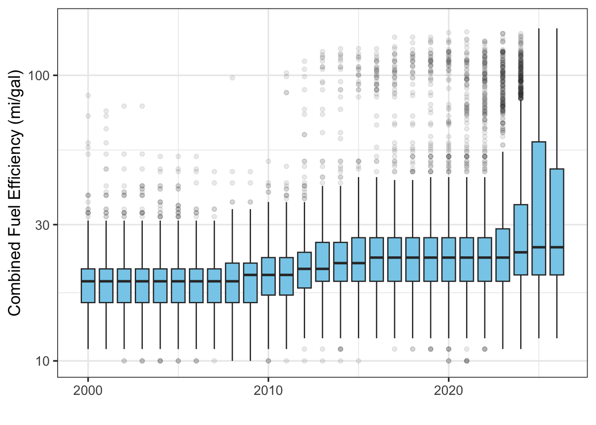
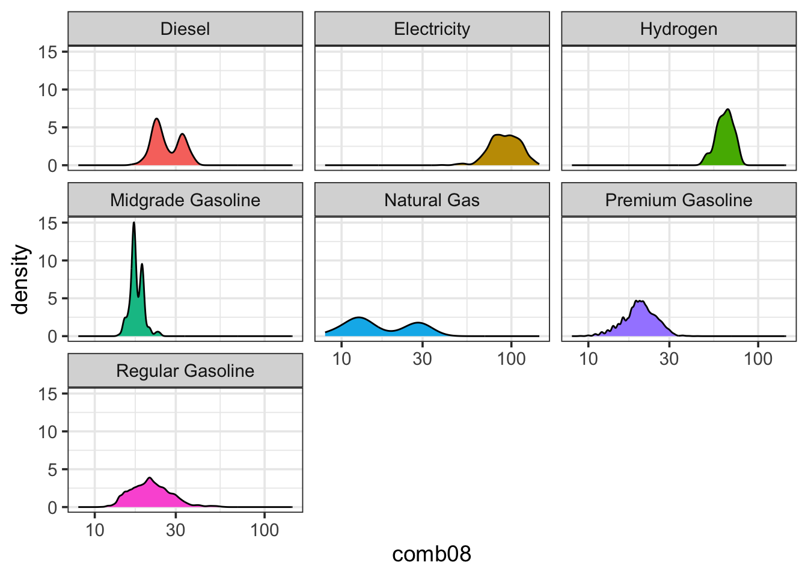
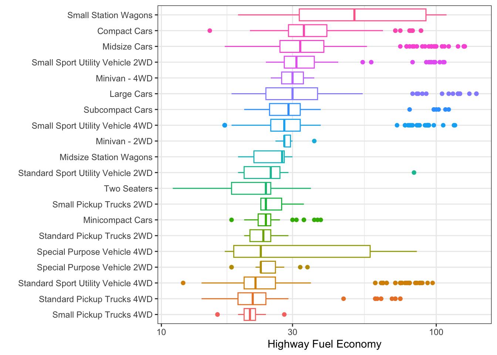

# Multivariate Data Exploration {#eda2}


## Chapter 7 Objectives

This Chapter is designed around the following learning objectives. Upon
completion, you should be able to:

- Understand the use and context of bivariate data
- Recognize the motivation behind a scatterplot from different perspectives
- Define correlation, causation, and the difference
- Create and interpret a scatterplot between two variables
- Leverage `ggplot2` for multivariate exploratory data analysis through facets and colors

## Bivariate Data {#bivariate}

Whereas univariate data analyses are directed at "getting to know" the
observations made for a single variable, bivariate---and multivariate---
analyses are designed to examine the *relationship* that may exist between two
(or more) variables. Like the Chapter on [Univariate EDA]({#eda1), we will
focus first on ***data exploration***, which is a key step towards "getting to
know" your data and one that should always proceed inferential statistics, or
*making conclusions about your data*.

<div class="rmdnote">
<p>Bivariate means <em>two variables</em> where the observations are
paired; each observation samples both variables so that they are
linked.</p>
</div>

## Scatterplot {#scatt}

Undoubtedly, you have seen scatterplots many times before; we will discuss them
in more detail here. The **scatterplot** allows you to assess the strength,
direction, and type of relationship between two variables. This can be
important for determining factors like:  

* Correlation  
* Linearity  
* Performance (of a measurement) in terms of precision, bias, and dynamic range

Traditionally, a scatterplot shows paired observations of two variables with
the ***dependent variable*** on the y-axis and the ***independent variable***
on the x-axis. Creating a plot in this way means that, before you begin, you
must make a judgment call about the direction of the relationship (i.e., which
variable *depends* on which). This relates to the scientific method and 
*linear regression*; we will discuss the latter in more detail later. For the
purposes of exploratory data analysis, however, it actually doesn't matter
which variable goes on which axis. That said, since we don't wish to break with
tradition, let's agree to follow the guidelines on independent (predictor) and 
dependent (outcome/response) variables. Although related, the researcher's
purpose or "mode" affects the intention behind a plot: 

 - **Scientific Method:** The experimenter manipulates the control variable (independent; on x-axis) and observes the changes in the response variable (dependent; y-axis).   
 
 - **Statistics:** The independent variable (x-axis) is thought to have some influence or control over the dependent variable (y-axis).

 - **Exploratory Data Analysis:** We throw two variables on a plot to investigate their relationship. We make a guess about which is the independent variable (x-axis) and which is the dependent variable (y-axis), and we hope that nobody calls us out if we got it wrong...  

### Causality

All this talk about dependent and independent variables is fundamentally rooted
in the practice of ***causal inference*** reasoning, which is the ability to 
say that "action A *caused* outcome B". Discovering---or proving---that one
thing caused another to happen can be incredibly powerful. Proving causality
leads to Nobel Prizes, creation of new laws and regulations, judgment of guilt
or innocence in court, changing human behavior and convincing human minds, and,
simply put, more understanding.

A full treatment of causal inference reasoning is beyond the scope of this
course, but we will, from time to time, delve into this topic.  The art of data
science can be a beautiful and compelling way to demonstrate causality, but we
need to learn to crawl before we can walk, run, or fly. For now, let's put
aside the pursuit of causation and begin with ***correlation***.

### Correlation {#corr}

The ***scatterplot*** is a great way to visualize *whether*, and, to some
extent, *how*, two variables are related to each other.  

<div class="rmdnote">
<p>Correlation: A mutual relationship or connection between two or more
things; the process of establishing a relationship or connection between
two or more measures. The variables can move up or down together or be
inversely related.</p>
</div>


Below are four examples of bivariate data with differing degrees of
correlation: perfect, strong, moderate, and none. These are qualitative terms,
of course; what is "moderate" to one person may be poor and unacceptable to
another. The qualitative strength of the correlation also depends on the 
research context. 

If you want to understand how to assess the strength of correlation 
quantitatively, you can explore the Pearson Correlation Coefficient (***r***)
in the [Appendix](#pearson), which is used to quantify the degree of linear
correlation between two variables.

<div class="figure" style="text-align: center">

<p class="caption">(\#fig:corr-example-1)Scatterplot examples showing bivariate data with varying degrees of correlation.</p>
</div>


In addition to the strength of the correlation, the sign and form of the
correlation can vary, too:  

  - **positive correlation**: the dependent variable *trends in the same direction* as the independent variable   
  - **negative correlation**: the dependent variable *decreases* when the independent variable *increases*  
  - **linear correlation**: the relationship between the two variables can be shown with a straight line  
  - **non-linear correlation**: the relationship between the two variables is curvilinear  

<div class="figure" style="text-align: center">

<p class="caption">(\#fig:corr-example-2)Scatterplot examples showing bivariate data with varying types of correlation.</p>
</div>

### Correlation $\neq$ causation

Did you know that being a smoker is correlated with having a lighter in your
pocket? Furthermore, it can be shown that keeping a lighter in your pocket is
correlated with an increased risk of developing heart disease and lung cancer.
Does this mean lighters in your pocket *cause* lung cancer?

<div class="rmdnote">
<p>Causation: the process or condition by which one event (cause)
contributes to the occurrence of another event (effect). In this
process, the cause is partly or wholly responsible for the effect.</p>
</div>

Let's take a closer look at the dangers of mistaking a *correlated*
relationship as a *causal* relationship between two variables. Shown below is a
scatterplot that builds off the `mpg` dataset we first discussed in Chapter
\@ref(dataviz). Using the `mpg` dataframe, we will plot the relationship
between the number of cylinders in an engine (`cyl`) (independent variable)
and that vehicle's fuel economy (`hwy`) (dependent variable).

<div class="figure" style="text-align: center">

<p class="caption">(\#fig:corr-example-3)Scatterplot of Engine Displacement vs. Fuel Economy</p>
</div>

Looking at this plot, there appears a clear correlation between the number of
cylinders in a vehicle and its fuel efficiency. A linear fit through these data
gives a Pearson correlation coefficient of -0.76, which is not a perfect
relationship but a strong one, nonetheless. Does this mean that a 
*causal relationship* exists? If so, then we only need to mandate that all
future vehicles on the road be built with 4-cylinder engines, if we want more a
fuel-efficient fleet! That mandate, of course, would likely produce minimal
effect. Just because two variables are correlated doesn't mean that a change in
one will ***cause*** a change in the other.

Those who understand internal combustion know that the number of cylinders is a
design parameter related more to engine power than to engine efficiency. In
other words, the number of cylinders helps determine total displacement
volume. Indeed, the causal relationship for fuel efficiency, in terms of miles
traveled per gallon, is due more directly to the energy conversion efficiency of the engine,
vehicle drag coefficient, and vehicle mass. If you want more fuel-efficient
cars and trucks, you need more efficient engines that weigh less. In the 1990s
and early 2000s nearly all engine blocks were made from cast iron. Today,
nearly all engine blocks are made from aluminum. Can you guess why? 

## Exploring Multivariate Data

With *multivariate data*, we often consider more than just two variables;
however, visualizing more than two variables in a single plot can be
challenging. There are advanced statistical approaches to exploring such data,
including multivariate regression, principal component analysis, and machine
learning approaches, but these techniques are beyond the scope of this course.
Here, I will introduce a few graphical techniques that are useful for exploring
multivariate data.

### Facets

One easy way to evaluate two or more variables is to create multiple plots (or
facets) with the `ggplot2::facet()` function. This function creates a series of
plots, as panels, where each panel represents a different value (or level) of a
third variable of interest. For example, let's create a `ggplot` object from
the `mtcars` data set that explores the relationship between a vehicle's fuel
economy and its weight. First, let's create a simple bivariate scatterplot of
these data (`mpg` vs. `wt`) and fit a linear model through the data. (Note: we
haven't discussed modeling yet but more on that [later](#model)).


```r
# fit a linear model; the ~ means we are modeling mpg as "y" and wt as "x"
g1_model <- lm(mpg ~ wt, data = mtcars)
# create a plot, assign it to an object named `g1`
g1 <- ggplot2::ggplot(data = mtcars, 
                      mapping = aes(x = wt, 
                                    y = mpg)) + 
  geom_point() +
  geom_smooth(model = g1_model, 
              method = "lm") + 
  ylab("Fuel Economy (mi/gal)") +
  xlab("Vehicle Weight (x1000 lb)")
g1
```

<div class="figure" style="text-align: center">

<p class="caption">(\#fig:facet-1)Scatterplot of fuel economy vs. vehicle weight from the `mtcars` dataset.</p>
</div>

Looking back at Figure \@ref(fig:corr-example-3), we know that the number of
cylinders (`cyl`) is also associated with fuel efficiency, and many of the
vehicles from `mpg` have different `cyl` numbers. To examine these three
variables together (`mpg`, `wt`, and `cyl`), we can create a scatterplot that
is *faceted* according to the `cyl` variable. This is relatively easy to do in
`ggplot2` by adding a `facet_grid()` layer onto our ggplot object. The key
details to pass to `facet_grid()` are:  

  1. Whether we want to see the facets as **rows** or **columns**, and
  2. The variable being used to create the facets.

These two specifications can be made as a single argument to `facet_grid()` in
the form:

  - `facet_grid(rows = vars(variable))` *or*
  - `facet_grid(cols = vars(variable))`,
  where *variable* is the name of the column vector used to define the facets.
  Note: `vars()` is a `ggplot2::` function that allows you to specify a column variable by name (instead of using `data.frame$variable`) to define the facets, similar to how we define variables in the `aes()` function.

In this case, seeing the plots in columns seems fine, so we would add  
`facet_grid(cols = vars(cyl)` to the `ggplot` object `g1` as follows:


```r
# facet previous plot by `cyl` columns and retain labels
g1 + facet_grid(cols = vars(cyl),
                labeller = label_both) # label each panel w/ variable name & value
```

<div class="figure" style="text-align: center">

<p class="caption">(\#fig:facet-2)Scatterplots of fuel economy vs. vehicle weight by number of cylinders in the engine (data from the `mtcars` dataset).</p>
</div>

Interestingly, but perhaps not surprising, we can see that the vehicles with
different cylinder numbers tend to have different fuel efficiency, but, even
within these facets, we still see a relationship between efficiency and vehicle
weight. Note that the faceting call led to the fitting of three different
linear models---one for each facet. 

Here are the same data in a plot that is faceted by rows instead of columns. Take note how `ggplot2::` allows you add the facet to the original plot object using a
`+`, as in: `g1 + facet_grid(...)`


```r
# facet previous plot by`cyl` in rows and retain labels
g1 + facet_grid(rows = vars(cyl),
                labeller = label_both)
```

<div class="figure" style="text-align: center">

<p class="caption">(\#fig:facet-3)Scatterplots of fuel economy vs. vehicle weight by number of cylinders in the engine (data from the `mtcars` dataset).</p>
</div>

### Colors

We can also use color to indicate variation in data; this can be useful for
introducing a third variable into scatter, jitter, and time-series plots (or when plotting multiple boxplots, histograms, or cumulative distributions). When
introducing **color as a variable** into a plot, you must do so through an
*aesthetic*, such as `geom_point(aes(color = cyl))`.

Let's recreate Figure \@ref(fig:facet-1) and highlight the `cyl` variable using
different colors. The addition of color provides us with the same level of
insight as the facets above.


```r
# instruct R to treat the `cyl` variable as a factor with discrete levels
# this, in turn, tells ggplot2 to assign discrete colors to each level
# `cyl` as a factor with four levels
mtcars$cyl <- as.factor(mtcars$cyl)
# recreate previous plot with color option
g3 <- ggplot2::ggplot(data = mtcars,
                      mapping = aes(x = wt, 
                           y = mpg, 
                           color = cyl)) + 
  geom_point() +
  ylab("Fuel Economy (mi/gal)") +
  xlab("Vehicle Weight, (x1000 lb)")
# call plot
g3
```

<div class="figure" style="text-align: center">

<p class="caption">(\#fig:colorplot-1)Vehicle fuel economy vs. weight and colored by number of engine cylinders (data from mtcars)</p>
</div>

<div class="rmdwarning">
<p>When using color, be aware that many people are unable to distinguish
red from green or blue from yellow. Many options exist to avoid issues
from color blindness (e.g., <code>viridis</code> palette) and websites
like <a
href="https://www.color-blindness.com/coblis-color-blindness-simulator/"
target="_blank">color-blindness.com</a> allow you to upload image files
so that you can see what your plot looks like to someone with color
blindness.</p>
</div>

Here is an updated version of Figure \@ref(fig:colorplot-1) that avoids issues
with color blindness and, better yet, differentiates the `cyl` variable with
both colors and symbols.


```r
# recreate previous plot with color-blind-friendly colors and shapes
ggplot2::ggplot(data = mtcars,
                mapping = aes(x = wt,
                              y = mpg,
                              color = cyl, 
                              shape = cyl)) + # distinguish by shape also!
  geom_point(size = 2.5) +
  ylab("Fuel Economy (mi/gal)") +
  xlab("Vehicle Weight, (x1000 lb)") +
  scale_colour_manual(values = c("sandybrown", # color-blind-friendly colors
                                 "orangered", 
                                 "steelblue2")) +
  theme_classic()
```

<div class="figure" style="text-align: center">

<p class="caption">(\#fig:colorplot-2)Vehicle fuel economy vs. weight and colored by number of engine cylinders (data from mtcars)</p>
</div>

<div class="rmdtip">
<p>Whenever you use <strong>color</strong> to differentiate variables,
use symbols, too.</p>
</div>

## Chapter 7 Exercises

### Fuel economy data

This in-class exercise will conduct an exploratory, multivariate data 
analysis on vehicle fuel economy. We will begin by downloading a .zip file from
[fueleconomy.gov](https://www.fueleconomy.gov/feg/ws/){target="_blank"}, which
is a Federal program that tracks the fuel economy of all vehicles sold in the
United States. The .zip file contains a .csv with fuel economy information for
nearly every vehicle manufactured  between 1984 and today. We will use the
`readr` and `dplyr` packages to load and clean the data, respectively. A data
dictionary (something that defines and explains each variable in the dataset)
is also available at the website above.

### Import and wrangle data

The first code chunk will download the data directly into a temporary file
using `download.file()` from base R. We will then `unzip()` (base R) the temp
file into a .csv and use `readr` to read that .csv into a dataframe named
`raw_data`. 


```r
# create an empty temporary object to hold the zipped data
temp <- base::tempfile()
# download the file into temp object
utils::download.file(
  url = "https://www.fueleconomy.gov/feg/epadata/vehicles.csv.zip",
  destfile = temp,
  mode="wb")
# unzip the folder within temp object to acess csv
temp2 <- utils::unzip(temp, 
                      "vehicles.csv", 
                      exdir = "./data/") # unzip .csv to local directory
# import csv into df object
raw_data <- readr::read_csv(temp2) #read the csv into a data frame
# delete the temp file
base::unlink(temp) 
# remove the two temp objects from local environment
base::rm(temp, temp2) 
```

**Public Service Announcement**: Notice the use of `rm()` from base R in the 
above code. This is an example of a recommended use case of this function;
do not EVER use this function to "restart" your R session. If you do, [Jenny
Bryan will find you and throw your computer out the window](https://www.tidyverse.org/blog/2017/12/workflow-vs-script/){target="_blank"}.

Looking at the `raw_data` dataframe, we see there are 83 variables with over 
42,000 observations.  That's a LOT of vehicles! In most analyses of large
datasets, we don't need to inspect every variable. Let's create a vector of
variables (`vars_needed`) that we want to keep and pass that vector to
`dplyr::select()` to retain only the variables we want. To pass a character 
vector as an argument to `dplyr::select()`, instead of just a single column
name, we use the `all_of()` function, which is an argument modifier from the
`tidyselect` R package. You can type `?tidyselect::all_of` in the R console to
learn more. Essentially, `tidyselect::all_of()` tells `dplyr::select()` to 
expect a character vector of column names to retain in the datset.


```r
# create a vector of var names to retain 
vars_needed <- c("id",
                 "make",
                 "model",
                 "year",
                 "cylinders", 
                 "displ", 
                 "drive",
                 "trany",
                 "VClass",
                 "fuelType1",
                 "comb08",
                 "highway08",
                 "city08")
# select necessary variables
df_mpg <- raw_data %>%
  dplyr::select(tidyselect::all_of(vars_needed))  
# remove full dataframe from environment
rm(raw_data) 
```

As you have seen before, some of these variables can be coded as **factors**,
which are *categorical* variables that can be classified into discrete levels.
For example, there are a finite number of vehicle transmission (`trany`) or
drivetrain (`drive`) types on the market, and, by telling R to code these data
as factors, we can analyze these variables in categorical form.

First, we will create a vector of variable names that we want to code as 
factors, `vars_factr`. Then we will apply the `as.factor()` function to those 
variables using `dplyr::mutate(dplyr::across())`. The `across()` function from
`dplyr` allows one to apply the same transformation to multiple columns in a
dataframe and is similar to how we used `tidyselect::all_of()` in the previous
example. We will also take the opportunity to rename a few of these variables,
following our naming guidelines discussed in earlier chapters, and to filter
the data to retain only vehicles made after the year 2000.


```r
# identify the columns that we want to convert to a factor
vars_factr <- c("make", "drive", "trany", "VClass", "fuelType1")
# overwrite existing df
df_mpg <- df_mpg %>% 
  # convert select vars to factors 
  dplyr::mutate(dplyr::across(tidyselect::all_of(vars_factr), 
                              .fns = as.factor)) %>% 
  # overwrite column names with simpler names
  dplyr::rename(fuel_type = fuelType1, 
                cyl = cylinders, 
                tran = trany, 
                v_class = VClass) %>% # easier string to type
  # keep only data collected after 2000 for the sake of simplicity
  dplyr::filter(year >= 2000) 
# remove previous objects from global environment
rm(vars_needed, vars_factr)
```

### Check data

Begin as we always do, by simply looking at some of the data.


```r
# examine first five rows of df
head(df_mpg)
```

```
## # A tibble: 6 × 13
##      id make  model  year   cyl displ drive tran  v_class fuel_…¹ comb08 highw…²
##   <dbl> <fct> <chr> <dbl> <dbl> <dbl> <fct> <fct> <fct>   <fct>    <dbl>   <dbl>
## 1 15589 Acura NSX    2000     6   3   Rear… Auto… Two Se… Premiu…     18      22
## 2 15590 Acura NSX    2000     6   3.2 Rear… Manu… Two Se… Premiu…     18      22
## 3 15591 BMW   M Co…  2000     6   3.2 Rear… Manu… Two Se… Premiu…     19      23
## 4 15592 BMW   Z3 C…  2000     6   2.8 Rear… Auto… Two Se… Premiu…     19      24
## 5 15593 BMW   Z3 C…  2000     6   2.8 Rear… Manu… Two Se… Premiu…     19      24
## 6 15594 BMW   Z3 R…  2000     6   2.5 Rear… Auto… Two Se… Premiu…     19      24
## # … with 1 more variable: city08 <dbl>, and abbreviated variable names
## #   ¹​fuel_type, ²​highway08
## # ℹ Use `colnames()` to see all variable names
```

Next, let's take a look at some of the factor levels. There are lots of ways
to do this in R, but the `levels()` function is the most straightforward.


```r
# print a character vector of levels for the drive variable in df_mpg
levels(df_mpg$drive) 
```

```
## [1] "2-Wheel Drive"              "4-Wheel Drive"             
## [3] "4-Wheel or All-Wheel Drive" "All-Wheel Drive"           
## [5] "Front-Wheel Drive"          "Part-time 4-Wheel Drive"   
## [7] "Rear-Wheel Drive"
```


```r
# print a character vector of levels for the fuel_type variable in df_mpg
levels(df_mpg$fuel_type) 
```

```
## [1] "Diesel"            "Electricity"       "Midgrade Gasoline"
## [4] "Natural Gas"       "Premium Gasoline"  "Regular Gasoline"
```


```r
# print a character vector of levels for the v_class variable in df_mpg
levels(df_mpg$v_class) 
```

```
##  [1] "Compact Cars"                       "Large Cars"                        
##  [3] "Midsize Cars"                       "Midsize Station Wagons"            
##  [5] "Midsize-Large Station Wagons"       "Minicompact Cars"                  
##  [7] "Minivan - 2WD"                      "Minivan - 4WD"                     
##  [9] "Small Pickup Trucks"                "Small Pickup Trucks 2WD"           
## [11] "Small Pickup Trucks 4WD"            "Small Sport Utility Vehicle 2WD"   
## [13] "Small Sport Utility Vehicle 4WD"    "Small Station Wagons"              
## [15] "Special Purpose Vehicle"            "Special Purpose Vehicle 2WD"       
## [17] "Special Purpose Vehicle 4WD"        "Special Purpose Vehicles"          
## [19] "Special Purpose Vehicles/2wd"       "Special Purpose Vehicles/4wd"      
## [21] "Sport Utility Vehicle - 2WD"        "Sport Utility Vehicle - 4WD"       
## [23] "Standard Pickup Trucks"             "Standard Pickup Trucks 2WD"        
## [25] "Standard Pickup Trucks 4WD"         "Standard Pickup Trucks/2wd"        
## [27] "Standard Sport Utility Vehicle 2WD" "Standard Sport Utility Vehicle 4WD"
## [29] "Subcompact Cars"                    "Two Seaters"                       
## [31] "Vans"                               "Vans Passenger"                    
## [33] "Vans, Cargo Type"                   "Vans, Passenger Type"
```

### Check for missing data

Next, let's see whether this dataframe contains missing data (`NA`s).  


```r
# count instances of missing values within df_mpg
sum(is.na(df_mpg))
```

```
## [1] 752
```

```r
# note this can work as a pipe, too
# df_mpg %>% is.na() %>% sum()
```

With a dataframe of this size, we shouldn't be surprised that there are 
752 `NA` values present. The next question is: where do
these `NA` values show up? There are several ways to answer this question;
here, we will use the `stats::complete.cases()` function with a
`dplyr::filter()` search. 

#### Example 1: Missing Data
The `compelete.cases()` function returns a logical vector indicating
which rows are *complete* (i.e., no missing values). The opposite of this
logical function, `!complete.cases()`, should return ONLY those rows that do 
contain `NA`s. Let's create a subset of `df_mpg` that only contains rows with
`NA` present.


```r
# return a df of rows with missing values
df_mpg %>%
  filter(!complete.cases(.))
```

```
## # A tibble: 370 × 13
##       id make   model        year   cyl displ drive tran  v_class fuel_…¹ comb08
##    <dbl> <fct>  <chr>       <dbl> <dbl> <dbl> <fct> <fct> <fct>   <fct>    <dbl>
##  1 16423 Nissan Altra EV     2000    NA    NA <NA>  <NA>  Midsiz… Electr…     85
##  2 16424 Toyota RAV4 EV      2000    NA    NA 2-Wh… <NA>  Sport … Electr…     72
##  3 17328 Toyota RAV4 EV      2001    NA    NA 2-Wh… <NA>  Sport … Electr…     72
##  4 17329 Ford   Th!nk        2001    NA    NA <NA>  <NA>  Two Se… Electr…     65
##  5 17330 Ford   Explorer U…  2001    NA    NA 2-Wh… <NA>  Sport … Electr…     39
##  6 17331 Nissan Hyper-Mini   2001    NA    NA <NA>  <NA>  Two Se… Electr…     75
##  7 18290 Toyota RAV4 EV      2002    NA    NA 2-Wh… <NA>  Sport … Electr…     78
##  8 18291 Ford   Explorer U…  2002    NA    NA 2-Wh… <NA>  Sport … Electr…     39
##  9 19296 Toyota RAV4 EV      2003    NA    NA 2-Wh… <NA>  Sport … Electr…     78
## 10 30965 Ford   Ranger Pic…  2001    NA    NA 2-Wh… Auto… Standa… Electr…     58
## # … with 360 more rows, 2 more variables: highway08 <dbl>, city08 <dbl>, and
## #   abbreviated variable name ¹​fuel_type
## # ℹ Use `print(n = ...)` to see more rows, and `colnames()` to see all variable names
```

Here, we discover that most of the the `NA` values are in the `cyl`, `displ`, 
and `tran`, columns. Further, we see that **all** of these vehicles have a 
`fuel_type` of *electric*, which makes sense because electric vehicles (EVs) do not
have internal combustion. This may be a variable level that we choose to
exclude from certain analyses later... 

**You might have noticed the "dot", `.`, used at the end of the `dplyr::filter` pipe above:**  
  
`df_mpg %>% filter(!complete.cases(.))`  
  
*Why is there a `.` as an argument to a function?*  

We use `.` as a [*placeholder argument*](https://magrittr.tidyverse.org/reference/pipe.html#arguments) when more than one function is nested within a single section of pipe (`%>%`).  The `complete.cases()` function requires an argument to run, so we must tell it to operate on the same dataframe on which `filter()` operates. The `.` accomplishes this need for an argument.  In other words, these three lines of code are equivalent:  


```r
df_mpg %>% filter(!complete.cases(.))

df_mpg %>% filter(!complete.cases(df_mpg))

filter(df_mpg, !complete.cases(df_mpg))
```

***Note:*** the `.` only works as a placeholder argument within a `%>%` call. The following code will throw an error because there is no pipe present:


```r
#this code will throw an error
filter(df_mpg, !complete.cases(.))  
```
#### Example 2: Missing Data

Filter the `df_mpg` data for *any variables* (`dplyr::any_vars()`) that contain
`NA`. Like `tidyselect::all_of()` that was used to clean the dataframe above,
the `any_vars()` function is a helper function designed for use within `dplyr`
and `tidyr` verbs.   
<br>*A word to the wise*: `dplyr::any_vars()` and similar variants 
have been **superseded**, which means new updates are not being made to them, and
the developers will eventually encourage users to transition to using
`dplyr::across()`. If you are interested, take a look at [this discussion thread](https://community.rstudio.com/t/using-filter-with-across-to-keep-all-rows-of-a-data-frame-that-include-a-missing-value-for-any-variable/68442)
on the topic.


```r
# filter the df for rows where any of the observations contain NA
df_mpg %>% 
  dplyr::filter_all(dplyr::any_vars(is.na(.)))
```

```
## # A tibble: 370 × 13
##       id make   model        year   cyl displ drive tran  v_class fuel_…¹ comb08
##    <dbl> <fct>  <chr>       <dbl> <dbl> <dbl> <fct> <fct> <fct>   <fct>    <dbl>
##  1 16423 Nissan Altra EV     2000    NA    NA <NA>  <NA>  Midsiz… Electr…     85
##  2 16424 Toyota RAV4 EV      2000    NA    NA 2-Wh… <NA>  Sport … Electr…     72
##  3 17328 Toyota RAV4 EV      2001    NA    NA 2-Wh… <NA>  Sport … Electr…     72
##  4 17329 Ford   Th!nk        2001    NA    NA <NA>  <NA>  Two Se… Electr…     65
##  5 17330 Ford   Explorer U…  2001    NA    NA 2-Wh… <NA>  Sport … Electr…     39
##  6 17331 Nissan Hyper-Mini   2001    NA    NA <NA>  <NA>  Two Se… Electr…     75
##  7 18290 Toyota RAV4 EV      2002    NA    NA 2-Wh… <NA>  Sport … Electr…     78
##  8 18291 Ford   Explorer U…  2002    NA    NA 2-Wh… <NA>  Sport … Electr…     39
##  9 19296 Toyota RAV4 EV      2003    NA    NA 2-Wh… <NA>  Sport … Electr…     78
## 10 30965 Ford   Ranger Pic…  2001    NA    NA 2-Wh… Auto… Standa… Electr…     58
## # … with 360 more rows, 2 more variables: highway08 <dbl>, city08 <dbl>, and
## #   abbreviated variable name ¹​fuel_type
## # ℹ Use `print(n = ...)` to see more rows, and `colnames()` to see all variable names
```

#### Example 3: Missing Data

Note: In [Chapter 8](#rprog4), you will learn to "map" the `sum()` and `is.na()` functions to each column of the data frame using `map_dfc` from the `purrr` package, which is designed to apply one ore more functions across columns of a data frame. This approach is the recommended way and I show it mainly as a preview of things to come in [Chapter 8](#rprog4).


```r
# preview of code we will learn in Chapter 8
df_mpg %>% purrr::map_dfc(~sum(is.na(.)))
```

### Visualize data

#### Tidy data

Our primary variable of interest is fuel economy, so let's begin by visualizing
the location, dispersion, and shape of `city08`, `highway08`, and `comb08`, 
which represent city, highway and combined fuel economy estimates. Note that 
`df_mpg` is not in a tidy format, as fuel economy data is presented in three
different columns. We'll fix that with `tidyr::pivot_longer()`.


```r
# before visualizing the data, convert to tidy format
tidy_mpg <- df_mpg %>%
  # choose simple names
  dplyr::rename(city = city08,
                hwy = highway08,
                comb = comb08) %>%
  # change data structure from wide to long 
  tidyr::pivot_longer(cols = c("city", "hwy", "comb"),
                      names_to = "metric",
                      values_to = "mpg") %>%
  # switch var to factor
  dplyr::mutate(metric = as.factor(metric))
```

#### Multivariate EDA options

With the data properly tidy, we can use our basic EDA plots with `stat_ecdf()`,
`geom_boxplot()`, and `geom_histogram()`, to visualize the fuel economy data.  
To show the different variables within the same plot, we use `color = ` 
or `fill = ` as an extra aesthetic. All three plots are then laid out using
`gridExtra::grid.arrange()`. 


```r
# create cumulative distribution function plot
ecdf <- ggplot2::ggplot(data = tidy_mpg, 
                        mapping = aes(x = mpg, 
                                      color = metric)) +
  stat_ecdf() +
  theme_bw() +
  scale_x_log10() +
  xlab(NULL) +
  ylab("Quantile") 
# create boxplot
box <- ggplot2::ggplot(data = tidy_mpg, 
                       mapping = aes(x = mpg, 
                                     fill = metric, 
                                     y = metric)) +
  geom_boxplot(outlier.alpha = 0.05) +
  theme_bw() +
  scale_x_log10() +
  xlab(NULL) +
  ylab("Metric") 
# create histogram
hist <- ggplot2::ggplot(data = tidy_mpg, 
                       mapping = aes(x = mpg, 
                                     fill = metric)) +
  geom_histogram(bins = 35,
                 alpha = 0.75,
                 position = "stack") +
  theme_bw() +
  scale_x_log10() +
  xlab("Fuel Economy, mi/gal") +
  ylab("Counts")
# embed plots into one figure
gridExtra::grid.arrange(ecdf, box, hist, 
                        widths = c(0.4,1,0.4),
                        layout_matrix = rbind(c(NA, 1, NA),
                                              c(NA, 2, NA),
                                              c(NA, 3, NA)))
```

<div class="figure" style="text-align: center">

<p class="caption">(\#fig:tidy-mpg-plot)Cumulative Distribution, Histogram, and Boxplots of 21st Centurty Vehicles.</p>
</div>

### Multivariate time series 

Next, let's look at a rough time series (by year) of all the combined fuel 
economy values, `comb08`, for all vehicle observations. The fuel economy data 
will be shown with boxplots, and we will use `group = year` as an aesthetic to 
show the overall time series. We will use a log-scale y-axis due to the large
variation expected, and outliers will be made more transparent to soften their
effect.


```r
# create time series plot 
e1 <- ggplot2::ggplot(data = df_mpg, 
                      mapping = aes(x = year, 
                                    y = comb08)) +
  geom_boxplot(aes(group = year),
               fill = "skyblue",
               outlier.alpha = 0.1) +
  scale_y_log10(limits = c(10,100)) +
  theme_bw()
# call plot
e1
```

<div class="figure" style="text-align: center">

<p class="caption">(\#fig:fuel-econ-ts)Boxplots of fleet-wide fuel efficiency by year.</p>
</div>

#### Consider context

[This Department of Energy website](https://afdc.energy.gov/data/10562) outlines
the *Corporate Average Fuel Economy* (CAFE) standards from the Environmental
Protection Agency that require vehicles to meet set fuel economy levels, in 
terms of miles per gallon, or "mpg", across the "fleet" of available vehicles.
Let's load a .csv file named `cafe` and look at the requirements by year.


```r
# import data
cafe <- read_csv("./data/CAFE_stds.csv", col_names = c("year", "mpg_avg"), skip = 1)
# plot cafe data
cafe.plot <- ggplot2::ggplot(data = cafe, 
                    mapping = aes(group = year, 
                                  y = mpg_avg, 
                                  x = year)) + 
  geom_col(fill = "maroon") + 
  theme_bw() +
  theme(axis.text.x = element_text(angle = 90, 
                                   hjust = 1)) +
  labs( y = "Required Average Fuel Efficiency (mpg)", 
        x = "Year", 
        title = "Federal Combined Average Fuel Economy (CAFE) Standards")
# call cafe plot
cafe.plot 
```


This is a nice 
[explanatory story](https://www.edmunds.com/fuel-economy/faq-new-corporate-average-fuel-economy-standards.html) 
of why the average fuel economy numbers don't match well to the published CAFE
standards. 

### Density plots

Create a series of geom_density plots showing combined fuel economy `comb08` 
across all vehicles and years as a function of `fuel_type`. Break out the 
different `fuel_type` categories into facets (ncol = 3).


```r
# density plot of combined fuel economy by fuel type with facets
g1 <- ggplot2::ggplot(data = df_mpg) +
  geom_density(aes(x = comb08, # notice the different location option for x aes
                   fill = fuel_type)) + 
  facet_wrap(~ fuel_type,
             ncol = 3) +
  scale_x_log10() +
  theme_bw() +
  theme(legend.position = "none")
# call plot
g1
```



Now show the same plot without facets.


```r
# density plot of combined fuel economy by fuel type without facets
g2 <- ggplot2::ggplot(data = df_mpg, 
                      mapping = aes(x = comb08)) + # now x aes is here 
  geom_density(aes(fill = fuel_type),
               position = "identity",
               alpha = 0.6,
               adjust = 1) +
  scale_x_log10() +
  theme_bw() 
# call plot
g2
```


### More multivariate plotting

Next, let's examine the effect of vehicle class on combined fuel economy for a
single year: 2020.


```r
# filter to year 2020 and reorder factor levels 
df_mpg.2020 <- df_mpg %>%
  dplyr::filter(year == 2020) %>%
  dplyr::mutate(v_class = forcats::fct_reorder(v_class, highway08, median))
# create plot of 2020 combined fuel economy
g1 <- ggplot2::ggplot(data = df_mpg.2020) + 
  geom_boxplot(aes(x = highway08, 
                   color = v_class, 
                   y = v_class)) + 
  scale_x_log10() +
  theme_bw() +
  ylab("") +
  xlab("Highway Fuel Economy") +
  theme(legend.position = "none")
# call plot
g1
```

<div class="figure" style="text-align: center">

<p class="caption">(\#fig:v-class)Highway Fuel Economy for 2020 Vehicles by Type</p>
</div>

### Practice questions

Finally, let's ask some simple questions and use some basic data wrangling to 
get the answers.

#### Question 1

Among 4-cylinder vehicles with Front-Wheel Drive, what make/model has the best highway fuel economy in 2018?


```r
df_mpg %>%
  dplyr::filter(cyl == 4, 
                drive == "Front-Wheel Drive", 
                year == 2018) %>%
  dplyr::slice_max(order_by = highway08, 
                   n = 1) %>%
  dplyr::select(make, model, drive, year, highway08)
```

```
## # A tibble: 1 × 5
##   make    model      drive              year highway08
##   <fct>   <chr>      <fct>             <dbl>     <dbl>
## 1 Hyundai Ioniq Blue Front-Wheel Drive  2018        59
```
  
Q2: Among 8-cylinder vehicles with Rear-Wheel Drive, what make/model has the 
worst city fuel economy in 2019?


```r
df_mpg %>%
  dplyr::filter(cyl == 8,
                drive == "Rear-Wheel Drive",
                year == 2019) %>%
  dplyr::slice_min(order_by = city08) %>%
  dplyr::select(make, model, drive, year, city08)
```

```
## # A tibble: 1 × 5
##   make    model    drive             year city08
##   <fct>   <chr>    <fct>            <dbl>  <dbl>
## 1 Bentley Mulsanne Rear-Wheel Drive  2019     10
```

<div class="figure" style="text-align: center">

<p class="caption">(\#fig:Q2a)The Bentley Mulsanne: $330k lets you park it on the sidewalk!</p>
</div>

## Chapter 7 Homework

You will continue to explore data from the National Science Foundation 2017
[National Survey of Graduates](https://www.nsf.gov/statistics/srvygrads/){target="_blank"}, which were introduced in an earlier chapter.

From Canvas, download the R Markdown template and the reduced dataset (.csv)
containing salary, age, and gender information. Your knitted submission is due
at the start of the class for the exam review.
