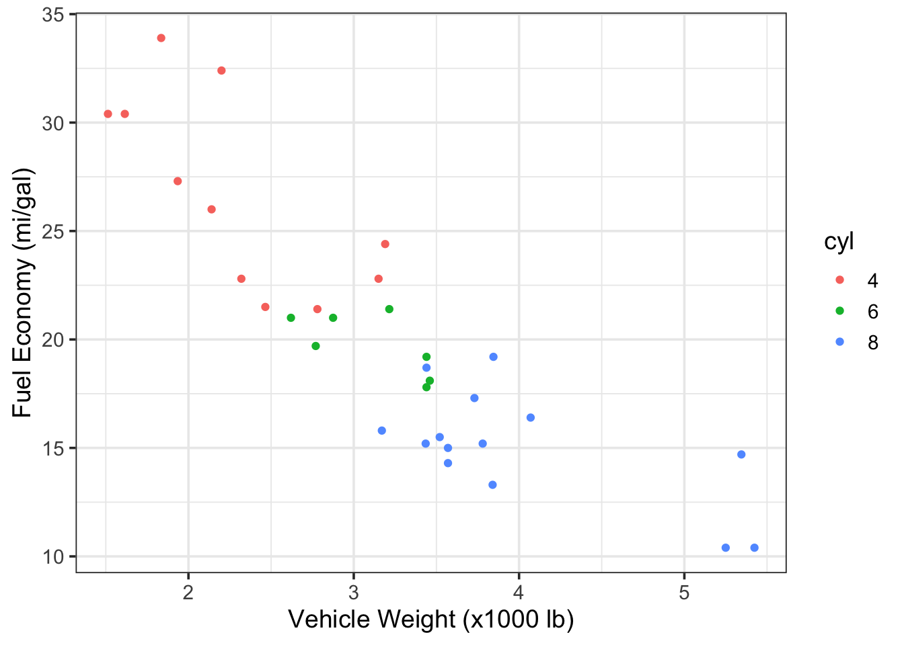

# Multivariate Data Exploration {#eda2}


## Ch. 7 Objectives
After this chapter, you should (know / understand / be able to ):

- Define correlation, causation, and their difference
- Conduct a formal exploratory data analysis on multivariate data using geoms from `ggplot`
- Create and interpret a scatterplot between two variables 
- Create and interpret a Q-Q plot
- Create and interpret directional bias in a Tukey mean difference plot
- Create and extract descriptive statistics and qualitative information from Boxplots


## Bivariate Data {#bivariate}
Whereas univariate data analyses are directed at "getting to know" the observations made for a single variable, bivariate (and multivariate) analyses are designed to examine the *relationship* that may exist between two (or more) variables. Like the Chapter on [Univariate data]({#eda1), we will focus first on ***data exploration*** - a key step towards "getting to know" your data and one that should always proceed inferential statistics or *making conclusions about your data*.

<div class="rmdnote">
<p>Bivariate means <em>two variables</em> where the observations are paired (i.e., each observation samples both variables so that they are linked).</p>
</div>

## Scatterplot {#scatt}

Undoubtedly, you have seen scatterplots many times before; we will give them a formal treatment here. The **scatterplot** allows you to assess the strength, direction, and type of relationship between two variables. This can be important for determining factors like:  

* Correlation  
* Linearity  
* Performance (of a measurement) in terms of precision, bias, and dynamic range   

Traditionally, a scatterplot shows paired observations of two variables with the ***dependent variable*** on the y-axis and the ***independent variable*** on the x-axis.  Creating a plot in this way means that, before you begin, you must make a judgement call about which variable *depends* on which.  The roots of this terminology/protocol lie in the practice of *linear regression* and the scientific method, the former of which we will discuss in more detail later.  For the purposes of exploratory data analysis, however, it actually doesn't matter which variable goes on which axis. That said, since we don't wish to break with tradition, let's agree to follow the guidelines on dependent/independent variables so as not to invoke the wrath of the gods.

**Statistics:**  
The independent variable (x-axis) is thought to have some influence/control over the dependent variable (y-axis).

**Scientific Method:**  
The experimenter manipulates the control variable (independent, x-axis) and observes the changes in the response variable (dependent, y-axis). 

**Exploratory Data Analysis:**  
We throw two variables onto a plot to investigate their relationship.  We make a guess about which one is the independent variable (x-axis) and which one is the dependent variable (y-axis) and we hope that nobody calls us out if we got it wrong.

### Causality
All this talk about **dependent** and **independent** variables is fundamentally rooted in the practice of ***causal inference*** reasoning: the ability to say that "action A" caused "outcome B".  Discovering (or proving) that one thing caused another to happen can be an incredibly powerful event.  Proving causality leads to the awarding of Nobel Prizes, the creation of new laws and regulations, the judgment of guilt or innocence in court, the changing and convincing of human minds and behaviors, and simply put: more understanding.

A full treatment of causal inference reasoning is beyond the scope of this course, but we will, from time to time, delve into this topic.  The art of data science can be a beautiful and compelling way to demonstrate causality....but most of us need to learn to crawl before we can walk, run, or fly.  For now, let's put aside the pursuit of causation and begin with ***correlation***.

### Correlation {#corr}
The scatterplot is a great way to visualize whether (and, to an extent, how) two variables are correlated.  

<div class="rmdnote">
<p>Correlation: a mutual relationship or connection between two or more things; the process of establishing a relationship or connection between two or more measures.</p>
</div>


Below are four examples of bivariate data with differing degrees of correlation: perfect, strong, moderate, and none.  These are qualitative terms, of course, what is "moderate" to one person may be poor and unacceptable to another.  Later on, in the [modeling section](#model), we will discuss ways to assess the strength of correlation more quantitatively.
<div class="figure" style="text-align: center">

<p class="caption">(\#fig:corr-example-1)Scatterplot examples showing bivariate data with varying degrees of correlation.</p>
</div>

In addition to the strength of the correlation, the sign and form of the correlation can vary, too:  
  - **positive correlation**: the dependent variable *trends in the same direction* as the independent variable   
  - **negative correlation**: the dependent variable *decreases* when the independent variable *increases*  
  - **linear correlation**: the relationship between the two variables can be shown with a straight line  
  - **non-linear correlation**: the relationship between the two variables is curvilinear  

<div class="figure" style="text-align: center">

<p class="caption">(\#fig:corr-example-2)Scatterplot examples showing bivariate data with varying types of correlation.</p>
</div>

### Correlation $\neq$ causation
<div class="rmdnote">
<p>Causation: the process or condition by which one event, a cause, contributes to the occurence of another event, the effect. In this process the cause is partly or wholly responsible for the effect.</p>
</div>

Let's take a closer look at the dangers of mistaking a *correlated* relationship as *causal* relationship between two variables.  Shown below is a scatterplot that builds off the `mpg` dataset we first discussed in Chapter \@ref(dataviz). Using the `mpg` data frame, we will plot the relationship between the number of cylinders in an engine (`cyl`), the independent variable, and that vehicle's fuel economy (`hwy`), the dependent variable). 

<div class="figure" style="text-align: center">

<p class="caption">(\#fig:corr-example-3)Scatterplot of Engine Displacement vs. Fuel Economy</p>
</div>
Looking at this plot, there appears a clear correlation between the number of cylinders in a vehicle and its fuel efficiency. A linear fit through these data gives a Pearson correlation coefficient of -0.76: not a perfect relationship but a significant one nonetheless. Does this mean that a *causal relationship* exists?  If so, then we only need to mandate that all future vehicles on the road be built with 4-cylinder engines, if we want more a fuel-efficient fleet!  That mandate, of course, would likely produce minimal effect.  Just because two variables are correlated doesn't mean that a change in one will ***cause*** a change in the other.

Those who understand internal combustion know that the number of cylinders is a design parameter related more to engine power than to engine efficiency (i.e., the number of cylinders helps determine total displacement volume).  Indeed, the causal relationship for fuel efficiency, in terms of miles traveled per gallon, is due more directly to engine conversion efficiency, vehicle drag coefficient, and vehicle mass.  If you want more fuel-efficient cars and trucks, you need more efficient engines that weigh less. In the 1990s and early 2000s nearly all engine blocks were made from cast iron.  Today, nearly all engine blocks are made from aluminum.  Can you guess why? 

> Did you know that being a smoker is correlated with having a lighter in your pocket?  Furthermore, it can be shown that keeping a lighter in your pocket is correlated with an increased risk of developing heart disease and lung cancer.  Does this mean lighters in your pocket cause lung cancer?

## Exploring Multivariate Data
With *multivariate data* we often consider more than just 2 variables of interest; however, visualizing more than 2 variables in a single plot can be challenging. There are advanced statistical approaches to exploring such data (e.g., multivariate regression, principal components, machine learning, etc.), but these techniques are beyond the scope of this course. Here, I will introduce a few graphical techniques that are useful for multivariate data exploration.  

### Faceting
One easy way to evaluate two or more variables is to create multiple plots (or facets) through the `ggplot2::facet` function. This function creates a series of plots, as panels, where each panel represents a different value (or level) of a third variable of interest. For example, let's create a ggplot2 object from the `mtcars` data set that explores the relationship between a vehicle's fuel economy and its weight.  First, let's create a simple bivariate scatterplot of these data (`mpg` vs. `wt`) and fit a linear model through the data (note: we haven't yet discussed modeling but more on [that later](#model)).


```r
# fit a linear model
g1_model <- lm(mpg ~ wt, data=mtcars)

#create a ggplot2 object
g1 <- ggplot(data = mtcars, 
             aes(x = wt, y = mpg)) + 
  geom_point() +
  geom_smooth(model = g1_model, method = "lm") + 
  ylab("Fuel Economy (mi/gal)") +
  xlab("Vehicle Weight (x1000 lb)")
g1
```

<div class="figure" style="text-align: center">

<p class="caption">(\#fig:facet-1)Scatterplot of fuel economy vs. vehicle weight from the `mtcars` dataset.</p>
</div>
However, looking back at Figure \@ref(fig:corr-example-3), we know that the number of cylinders (`cyl`) is also associated with fuel efficiency and many of the vehicles from `mpg` have different `cyl` numbers. To examine these three variables together (`mpg`, `wt`, and `cyl`) we can create a scatterplot that is *faceted* according to the `cyl` variable.  This is relatively easy to do in `ggplot2` by adding a `facet_grid()` layer onto our ggplot object.  The key details to pass to `facet_grid()` are:  

1. Whether we want to see the facets as **rows** or **columns**, and
2. The variable being used to create the facets.

These two specifications can be made as a single argument to `facet_grid()` in the form:

  - `facet_grid(rows = vars(variable))` or
  - `facet_grid(cols = vars(variable))`  
  where *variable* is the name of the column vector used to define the facets.

  In this case, seeing the plots in columns seems fine, so we would add:  
  `facet_grid(cols = vars(cyl)`, to the `ggplot()` object as follows:


```r
g1 + facet_grid(cols = vars(cyl),
                labeller = label_both) #this code adds names & values each panel label
```

<div class="figure" style="text-align: center">

<p class="caption">(\#fig:facet-2)Scatterplots of fuel economy vs. vehicle weight by number of cylinders in the engine (data from the `mtcars` dataset).</p>
</div>
Interestingly, but perhaps not surprising, we can see that the vehicles with different cylinder numbers tend to have different fuel efficiency, but even within these facets we still see a relationship between efficiency and vehicle weight.  Note also, that the faceting call led to the fitting of three different linear models, one for each facet. 

Here are the same data in a plot that is faceted by rows instead of columns.

```r
g1 + facet_grid(rows = vars(cyl),
                labeller = label_both)
```

<div class="figure" style="text-align: center">

<p class="caption">(\#fig:facet-3)Scatterplots of fuel economy vs. vehicle weight by number of cylinders in the engine (data from the `mtcars` dataset).</p>
</div>

### Coloring
We can also use color to indicate variation in data; this can be useful for introducing a third variable into scatter and time-series plots. Note: when introducing **color as a variable** into a plot, you must do so through an *aesthetic*, such as: `geom_point(aes(color = cyl))`.

Let's recreate Figure \@ref(fig:facet-1) and highlight the `cyl` variable using different colors. The addition of color provides us with the same level of insight as did the facets above.


```r
# instruct R to treat the cyl variable as a factor with discrete levels
# this, in turn, tells ggplot2 to assign discrete colors to each level
mtcars$cyl <- as.factor(mtcars$cyl)

g3 <- ggplot(data = mtcars, 
             aes(x = wt, y = mpg, color = cyl)) + 
  geom_point() +
  ylab("Fuel Economy (mi/gal)") +
  xlab("Vehicle Weight, (x1000 lb)")

g3
```

<div class="figure" style="text-align: center">

<p class="caption">(\#fig:colorplot-1)Vehicle fuel economy vs. weight and colored by number of engine cylinders (data from mtcars)</p>
</div>

<div class="rmdwarning">
<p>When using color, be aware that many people are unable to distinguish red from green or blue from yellow. Many options exist to avoid issues from color blindness (e.g., the <code>viridis</code> palette) and websites like <a href="https://www.color-blindness.com/coblis-color-blindness-simulator/">color-blindness.com</a> allow you to upload image files as a test against common forms.</p>
</div>

Here is an updated version of Figure \@ref(fig:colorplot-1) that avoids issues with color blindness and, better yet, differentiates the `cyl` variable with both colors and symbols.


```r
#"#330099","#CC0066","#FF6633", "#0099CC", "#FF9900","#CC6633", "#33CC99",

ggplot(data = mtcars, 
             aes(x = wt, 
                 y = mpg, 
                 color = cyl, 
                 shape = cyl)) + 
  geom_point(size = 2.5) +
  ylab("Fuel Economy (mi/gal)") +
  xlab("Vehicle Weight, (x1000 lb)") +
  scale_colour_manual(values = c("sandybrown", 
                                 "orangered", 
                                 "steelblue2")) +
  theme_classic()
```

<div class="figure" style="text-align: center">

<p class="caption">(\#fig:colorplot-2)Vehicle fuel economy vs. weight and colored by number of engine cylinders (data from mtcars)</p>
</div>
<div class="rmdtip">
<p>Whenever you use <strong>color</strong> to differentiate variables, use symbols, too.</p>
</div>
### Contour Plots

### Time-Series Density

## Ch-7 Exercises

### In-class: fueleconomy.gov
This in-class exercise is will conduct an exploratory, multivariate data 
analysis on vehicle fuel economy. We will begin by downloading a .zip file from [fueleconomy.gov](https://www.fueleconomy.gov/feg/ws/). This file contains a 
.csv with fuel economy information for nearly every vehicle manufactured 
between 1984 and today. We will use the `readr` and `dplyr` packages to load 
and clean the data, respectively. A data dictionary (something that defines 
and explains each variable in the data set) is also available at the website
above.

The first code chunk will download the fueleconomy.gov data directly from their
website and into a temp file using `download.file()` from base R.  We will then 
`unzip()` that temp file into a .csv and use `readr` to read that .csv into a 
data frame named `raw_data`. 


```r
#create a temp file to hold the zipped data
temp <- tempfile()
#download the file into temp file
download.file(url = "https://www.fueleconomy.gov/feg/epadata/vehicles.csv.zip",
              destfile = temp, 
              mode="wb")

temp2 <- unzip(temp, "vehicles.csv", exdir = "./data/") #unzip .csv to /data dir

raw_data <- read_csv(temp2) #read the csv into a data frame

unlink(temp) #delete the temp file

rm(temp, temp2) #remove the two temp objects from local environment
```

Looking at the `raw_data` data frame, we see there are 83 variables with over 
42,000 observations.  That's a LOT of vehicles! In most analyses of large data 
sets, we don't need to inspect every variable. Let's create a vector of 
variables (`vars_needed`) that we do want and then pass that vector to `dplyr::select()` to retain only the variables we want. To pass a character 
vector as an argument to `dplyr::select()`, we use the `all_of()` 
function - a `<tidy-select>` argument modifier. You can type 
`?tidyr_tidy_select` to learn more.


```r
vars_needed <- c("id",
                 "make",
                 "model",
                 "year",
                 "cylinders", 
                 "displ", 
                 "drive",
                 "trany",
                 "VClass",
                 "fuelType1",
                 "comb08",
                 "highway08",
                 "city08",
                 "co2TailpipeGpm"
                 )

df_mpg<-raw_data %>%
  dplyr::select(all_of(vars_needed))  
#all_of tells dplyr::select to expect a character vector of column names
rm(raw_data) #remove large file from memory
```

Some of these variables can be coded as **factors** (*categorical* variables 
that may be enumerated into *discrete levels*). For example, there are a 
finite number of vehicle transmission `trany` or drivetrain `drive` types on 
the market and by telling R to code these data as **factors**, we can analyze 
these variables in categorical form.

First, we will create a vector of variable names that we want to code as 
factors, `vars_factr`. The we will apply the `as.factor()` function to those 
variables using `dplyr::mutate(across())`. The `across()` function allows one 
to apply the same transformation to multiple columns in a data frame. We will 
also take the opportunity to rename a few of these variables (following our 
naming guidelines discussed earlier) and to filter the data to retain only 
vehciles made after the year 2000. 

```r
# ID the columns that we want as class:factor
vars_factr <- c("make", "drive", "trany", "VClass", "fuelType1")

df_mpg %>%
  # mutate(across(a)) applies the as.factor function only to the vars of interest
  dplyr::mutate(across(all_of(vars_factr), .fns = as.factor)) %>% 
  #create simpler names
  dplyr::rename(fuel_type = fuelType1, 
                cyl = cylinders, 
                tran = trany, 
                v_class = VClass) %>% # easier string to type
  # keep only data collected after 2000 for the sake of a millennial audience
  dplyr::filter(year >= 2000) -> df_mpg 

rm(vars_needed, vars_factr) # won't be needing these anymore
```

Begin as we always do, by simply looking at some of the data.


```r
head(df_mpg)
```

```
## # A tibble: 6 x 14
##      id make  model  year   cyl displ drive tran  v_class fuel_type comb08
##   <dbl> <fct> <chr> <dbl> <dbl> <dbl> <fct> <fct> <fct>   <fct>      <dbl>
## 1 15589 Acura NSX    2000     6   3   Rear… Auto… Two Se… Premium …     18
## 2 15590 Acura NSX    2000     6   3.2 Rear… Manu… Two Se… Premium …     18
## 3 15591 BMW   M Co…  2000     6   3.2 Rear… Manu… Two Se… Premium …     19
## 4 15592 BMW   Z3 C…  2000     6   2.8 Rear… Auto… Two Se… Premium …     19
## 5 15593 BMW   Z3 C…  2000     6   2.8 Rear… Manu… Two Se… Premium …     19
## 6 15594 BMW   Z3 R…  2000     6   2.5 Rear… Auto… Two Se… Premium …     19
## # … with 3 more variables: highway08 <dbl>, city08 <dbl>, co2TailpipeGpm <dbl>
```
Next, let's take a look at some of the factor levels.  There are lots of ways to do this in R.


```r
#print a character vector of levels for the drive variable in df_mpg
levels(df_mpg$drive) 
```

```
## [1] "2-Wheel Drive"              "4-Wheel Drive"             
## [3] "4-Wheel or All-Wheel Drive" "All-Wheel Drive"           
## [5] "Front-Wheel Drive"          "Part-time 4-Wheel Drive"   
## [7] "Rear-Wheel Drive"
```


```r
#print a character vector of levels for the fuel_type variable in df_mpg
levels(df_mpg$fuel_type) 
```

```
## [1] "Diesel"            "Electricity"       "Midgrade Gasoline"
## [4] "Natural Gas"       "Premium Gasoline"  "Regular Gasoline"
```


```r
#print a character vector of levels for the v_class variable in df_mpg
levels(df_mpg$v_class) 
```

```
##  [1] "Compact Cars"                       "Large Cars"                        
##  [3] "Midsize Cars"                       "Midsize Station Wagons"            
##  [5] "Midsize-Large Station Wagons"       "Minicompact Cars"                  
##  [7] "Minivan - 2WD"                      "Minivan - 4WD"                     
##  [9] "Small Pickup Trucks"                "Small Pickup Trucks 2WD"           
## [11] "Small Pickup Trucks 4WD"            "Small Sport Utility Vehicle 2WD"   
## [13] "Small Sport Utility Vehicle 4WD"    "Small Station Wagons"              
## [15] "Special Purpose Vehicle"            "Special Purpose Vehicle 2WD"       
## [17] "Special Purpose Vehicle 4WD"        "Special Purpose Vehicles"          
## [19] "Special Purpose Vehicles/2wd"       "Special Purpose Vehicles/4wd"      
## [21] "Sport Utility Vehicle - 2WD"        "Sport Utility Vehicle - 4WD"       
## [23] "Standard Pickup Trucks"             "Standard Pickup Trucks 2WD"        
## [25] "Standard Pickup Trucks 4WD"         "Standard Pickup Trucks/2wd"        
## [27] "Standard Sport Utility Vehicle 2WD" "Standard Sport Utility Vehicle 4WD"
## [29] "Subcompact Cars"                    "Two Seaters"                       
## [31] "Vans"                               "Vans Passenger"                    
## [33] "Vans, Cargo Type"                   "Vans, Passenger Type"
```

Next, let's see whether any variables contain missing data (NAs).  A simple way is to map the combined functions of `sum()` and `is.na()` to each column of the data frame. We do this using the `map_dfc` function (reads: map a function across columns of a dataframe) from the `purr::` package.


```r
df_mpg %>% map_dfc(~sum(is.na(.)))
```

```
## # A tibble: 1 x 14
##      id  make model  year   cyl displ drive  tran v_class fuel_type comb08
##   <int> <int> <int> <int> <int> <int> <int> <int>   <int>     <int>  <int>
## 1     0     0     0     0   231   230     4     9       0         0      0
## # … with 3 more variables: highway08 <int>, city08 <int>, co2TailpipeGpm <int>
```

If we filter the `df_mpg` data for entries that contain `NA` we discover that most of them are due to electric vehicles.  This may be a variable level that we choose to exclude from certain analyses later on... 

```r
missing_data <- df_mpg %>% filter_all(any_vars(is.na(.)))
head(missing_data, n=10)
```

```
## # A tibble: 10 x 14
##       id make  model  year   cyl displ drive tran  v_class fuel_type comb08
##    <dbl> <fct> <chr> <dbl> <dbl> <dbl> <fct> <fct> <fct>   <fct>      <dbl>
##  1 16423 Niss… Altr…  2000    NA    NA <NA>  <NA>  Midsiz… Electric…     85
##  2 16424 Toyo… RAV4…  2000    NA    NA 2-Wh… <NA>  Sport … Electric…     72
##  3 17328 Toyo… RAV4…  2001    NA    NA 2-Wh… <NA>  Sport … Electric…     72
##  4 17329 Ford  Th!nk  2001    NA    NA <NA>  <NA>  Two Se… Electric…     65
##  5 17330 Ford  Expl…  2001    NA    NA 2-Wh… <NA>  Sport … Electric…     39
##  6 17331 Niss… Hype…  2001    NA    NA <NA>  <NA>  Two Se… Electric…     75
##  7 18290 Toyo… RAV4…  2002    NA    NA 2-Wh… <NA>  Sport … Electric…     78
##  8 18291 Ford  Expl…  2002    NA    NA 2-Wh… <NA>  Sport … Electric…     39
##  9 19296 Toyo… RAV4…  2003    NA    NA 2-Wh… <NA>  Sport … Electric…     78
## 10 30965 Ford  Rang…  2001    NA    NA 2-Wh… Auto… Standa… Electric…     58
## # … with 3 more variables: highway08 <dbl>, city08 <dbl>, co2TailpipeGpm <dbl>
```

A nice way to begin EDA with a large, multivariate data set is to understand 
how the different variables are 'spread out' across the data set.  Let's begin 
with a time series (by year) of all the combined fuel economy values, `comb08`, 
for all vehicle observations. The fuel economy data will be shown with boxplots
overlain with violin plots. We will use a log-scale y-axis due to the large
variation expected and outliers will be made more transparent to soften their
effect.


```r
e1 <- ggplot(data = df_mpg, aes(x = year, y = comb08)) +
  geom_violin(aes(group = year),
               outlier.shape = NA,
               fill = "royalblue2") +
  geom_boxplot(aes(group = year),
               fill = NA,
               outlier.alpha = 0.2) +
  scale_y_log10(limits = c(10,100)) +
  theme_bw()
e1
```


This [DOE website](https://afdc.energy.gov/data/10562) outlines the EPA *Corporate Average Fuel Economy* (CAFE) standards that require vehicles to meet set fuel economy levels (in terms of miles-per-gallon; mpg) across the 'fleet' of available vehicles. Let's load a .csv file named `cafe` and look at the requirements by year.


```r
cafe <- read_csv("./data/CAFE_stds.csv", col_names = c("year", "mpg_avg"), skip = 1)

ggplot(cafe, aes(year, mpg_avg)) + geom_col(fill = "maroon") + 
  theme_bw() +
  theme(axis.text.x = element_text(angle = 90, hjust = 1)) +
  labs( y = "Required Average Fuel Efficiency (mpg)", 
        x = "Year", 
        title = "Federal Combined Average Fuel Economy (CAFE) Standards")
```


This is a nice [explanatory story](https://www.edmunds.com/fuel-economy/faq-new-corporate-average-fuel-economy-standards.html) of why the average fuel economy numbers don't match well to the published CAFE standards. 

Create a series of geom_density plots showing combined fuel economy `comb08` 
across all vehicles and years as a function of `fuel_type`.  
Break out the different `fuel_type` categories into facets (ncol = 3).

```r
g1 <- ggplot(data = df_mpg) + 
  geom_density(aes(comb08, fill = fuel_type)) + 
  facet_wrap(~fuel_type, ncol = 3) +
  scale_x_log10() +
  theme_bw() +
  theme(legend.position = "none")

g1
```


Show the same plot without facets.

```r
g2 <- ggplot(data = df_mpg, aes(x=comb08)) +
  geom_density(aes(fill = fuel_type),
                 position = "identity",
                 alpha = 0.6,
               adjust = 1) +
  scale_x_log10() +
  theme_bw() 

g2
```


Q1: Among *4-cylinder* vehicles with *Front-Wheel Drive*, what make/model has the best *highway fuel economy* in 2018?

```r
df_mpg %>%
  filter(cyl == 4, drive == "Front-Wheel Drive", year == 2018) %>%
  slice_max(order_by = highway08, n=1) %>%
  select(make, model, drive, year, highway08)
```

```
## # A tibble: 1 x 5
##   make    model      drive              year highway08
##   <fct>   <chr>      <fct>             <dbl>     <dbl>
## 1 Hyundai Ioniq Blue Front-Wheel Drive  2018        59
```
  

Q2: Among *8-cylinder* vehicles with *Rear-wheel Drive*, what make/model has the worst *city fuel economy* in 2019?

```r
df_mpg %>%
  filter(cyl == 8, drive == "Rear-Wheel Drive", year == 2019) %>%
  slice_min(order_by = city08) %>%
  #top_n(n = -1, wt = city08) %>%
  select(make, model, drive, year, city08)
```

```
## # A tibble: 1 x 5
##   make    model    drive             year city08
##   <fct>   <chr>    <fct>            <dbl>  <dbl>
## 1 Bentley Mulsanne Rear-Wheel Drive  2019     10
```

<div class="figure" style="text-align: center">

<p class="caption">(\#fig:Q2a)The Bentley Mulsanne: $330k lets you park it on the sidewalk!</p>
</div>

## Ch-7 Homework

Create a data fram from `df_mpg` that contains observations only for 
"Front-Wheel Drive" vehicles (one of the `drive` levels) that run on 
"Regular Gasoline" (a `fuel_type` level). With these data:  

1. Create a series of boxplots showing combined fuel efficiency on the y-axis 
and year on the x-axis.
