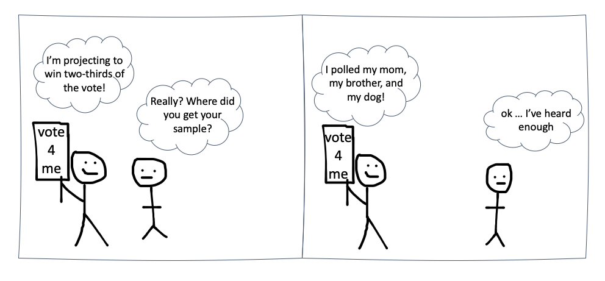
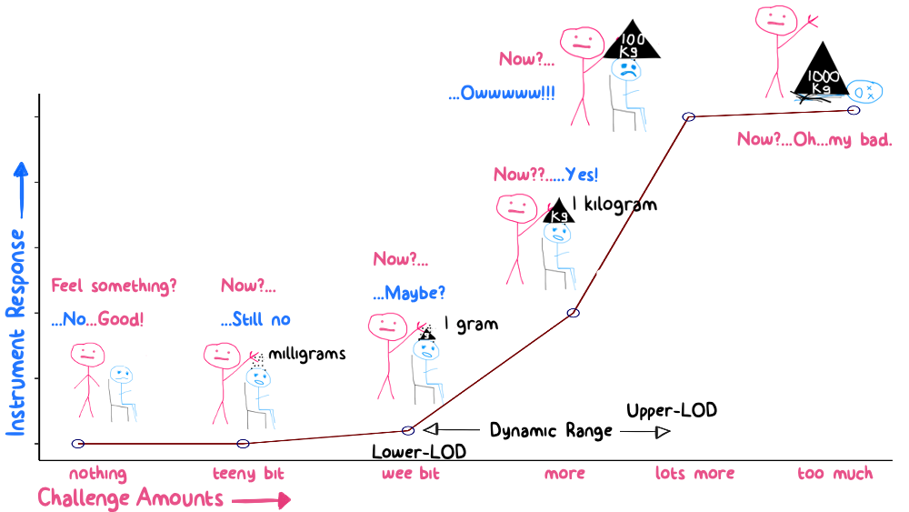
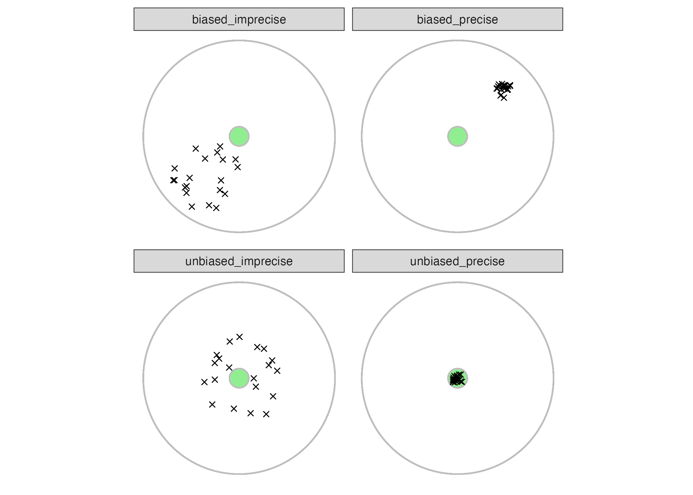
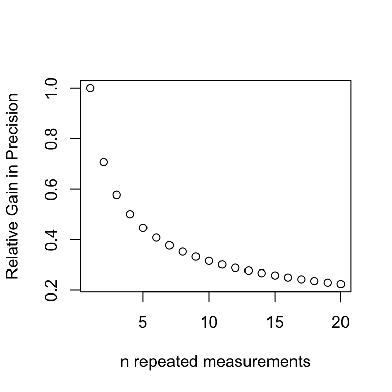

# Measurement {#measure}  


Measurement is a fundamental tool for characterization and verification in engineering (and many fields).  This chapter will provide a quick introduction to the science of measurement.  

## Ch. 10 Objectives
This Chapter is designed around the following learning objectives. Upon completing this Chapter, you should be able to:  

- Explain the difference between a sample and a population; 
- Define randomization and describe how it can be applied to simple, stratified, and cluster sampling; 
- Explain the difference between cluster and stratified sampling methods; 
- Describe how to estimate precision for a measurement system;
- Describe the difference between systematic and random measurement error;
- Estimate uncertainty and propagate it across a measurement process;
- Define limit of detection and estimate it for a measurement process

## Sampling
To conduct univariate analyses, we need data (i.e., observations).  To get those data, we need a sample.  To get that sample, we need to identify a population from which to sample.  Allow me to digress...  

### Samples vs. Populations {#sample}
At some point in the history of science someone came up with the idea that very few things are known for certain: we can only make estimates or educated guesses. This idea (which is hard to refute) gave rise to the concept of *samples* vs. *populations*.  In statistics, the ***population*** of an observed quantity or variable is the totality of every instance of that variable in the universe (...whoa...).  

Take the molecular diameter of an oxygen molecule. Even if we could measure the diameters of ALL the oxygen molecues in our atmosphere that would still represent only a tiny fraction (i.e., a ***sample***) of all the oxygen molecules bound up in the planet (and all of Earth's oxygen is but a tiny fraction of our solar system's, and so on). The *population* of all oxygen molecules across the universe is impossible to measure or "know" given our current capabilities. If, however, we measure a sufficient *sample* of oxygen molecules, we could probably infer the size of all the other O~2~ molecules within reason.

This is to say that the **population** is the thing we strive to make conclusions about but the **sample** is the thing (read: the data) that we have to work with.

### Collecting a sample {#sample.collect}
Samples are collected to provide estimates of populations so that those estimates can be used for ***inference*** (a fancy word that means: to make conclusions).  Many statistical procedures are based on the assumption that your sample is ***representative*** of the population you are trying to model/understand.  Assuming that your sample is good (read: representative) is a dangerous thing to do. In fact, MOST samples have some degree of un-good.  Just ask the polling experts from the 2016 U.S. presidential election, or the now humiliated and vilified [doctor who concluded that vaccines were the cause of childhood autism based on a sample of 12 kids](https://www.ncbi.nlm.nih.gov/pmc/articles/PMC2954080/){target="_blank"}
taken from a single birthday party...  

A sample is representative if each measure is drawn in a way that makes it ***independent*** from the next AND if the measurement method itself is ***unbiased*** (i.e., the making of the measurement does not alter the way the sample is counted). We will talk more about ***bias*** later in this Chapter, but suffice it so say that if I made you watch a 10-minute video on catastrophic airplane disasters and then gave you a survey about your fears of flying, I might be introducing some bias into that survey measurement.

Representative sampling is hard to do in practice.  A good sampling strategy employs ***randomization***: allow random chance to decide when and where measurements are made. The problem with this strategy, however, is that we have to place boundaries on the exact *when* and *where* of sampling due to limited resources. In reality, most samples are neither independent, nor randomly drawn; they are instead drawn from a single location, one after the next, for a short period of time. Such a *convenience sample* raises the possibility (1) that the data are non-independent (because any given measure is related [correlated] to the next one taken) and (2) that the sample lacks generalizability to the greater population (due to the focused [unique] nature of how/where the sample was collected). Scientific studies occasionally reach incorrect conclusions not because their statistical models were flawed, but instead because their sample was biased and/or unrepresentative of the true population. I can randomly survey 100 people at a political rally, but that doesn't mean the opinions I gather from these individuals are representative of all eligible voters in that part of the country. 

This is a much bigger problem than you might realize, because true random, unbiased sampling is often impossible or impractical in the real world. How would the Tesla Corporation collect a random, independent sample of 1000 [Model 3](https://www.tesla.com/model3){target="_blank"} vehicles after 10 years of real-world driving? Even with a random number generator applied to vehicle ID numbers, Tesla no longer owns those cars. They can't just take them back...   

- They could ask car owners to complete a customer satisfaction survey but then they might only get results from people who want to complain...(*bias*) 

- They could ask dealers to inspect cars but then they would be sampling only from the subset of owners that liked to do business with dealers...(potential for *bias* AND *non-independence*)  

- They could ask repair shops for data but then they would only be sampling from cars that had broken down for some reason...(potential for *bias* and *non-independence*)  

So...if you cannot collect a truly representative sample, how can you trust your results? Suffice it to say that there is an art to empirical research (empirical is a fancy word for observational). If you study *how* data were collected (especially from a sampling strategy) you will often realize how a "wrong conclusion" came to be.  

<div class="figure" style="text-align: center">

<p class="caption">(\#fig:samping-bias)Biased samples are easy to come by</p>
</div>

<div class="rmdcaution">
<p><strong>Hope</strong> is a dangerous word in science because it can
create <em>implicit bias</em>. The experimenter who <em>hopes</em> for a
certain outcome might unknowingly influence their sampling and/or
analysis strategy to promote that outcome. The best experiments are
designed as “win/win”: they produce valuable information, regardless of
the outcome (yes/no, null/alternative hypothesis, etc.). Such designs,
though often difficult to conceive, remove the need for hope
altogether.</p>
</div>

Let's review a few common sampling strategies here.  

### Simple Random Sampling
Simple random sampling means that samples are randomly collected from across the population and over a period of time where the population characteristics (especially those characteristics being measured) remain constant.  The main advantage of simple random sampling is that, when done correctly, your data should be unbiased and representative of the population.  The main issue with simple random sampling is that it can be hard to do "correctly".  

<div class="rmdnote">
<p>To collect a simple random sample, you need to ensure three
things:</p>
<ol style="list-style-type: decimal">
<li>that your sampling method gives <strong><em>every single
member</em></strong> of the population an <strong><em>equal
chance</em></strong> of being selected;</li>
<li>that your population remains relatively unchanged during the
sampling window;<br />
</li>
<li>that your sample size is sufficient to make inferences (read:
conclusions) with confidence.</li>
</ol>
</div>

How large of a sample size do you need to collect?  That depends on a lots of things:  

1. what do you want to do with the data? (read: what conclusions/questions are you after?)  
    - are you estimating location and/or spread, are you comparing location and/or spread, or are you fitting a model?
2. what are the risks/consequences of making incorrect conclusions?  
    - Do you need 95% confidence in your answer, 99%, 99.999%?  
3. how much variability do you expect to see in your data?   

These factors all work together to frame sample size considerations.  There are many ways to estimate sample size (too many for this course), so I will use only one here: sample size (n) for a t-test comparing two means:

&ensp;&ensp;&ensp;&ensp;&ensp;  $n = \frac{(Z_{\alpha/2}\cdot+Z_{\beta/2})^2\cdot2\cdot\sigma^2}{d^2}$     where,  

  - $\alpha$ represents the Type-1 error rate (1 - confidence level); 0.05 is typical  
  - $\beta$ represents the Type-2 error rate (1 - power); 0.2 is typical  
  - $Z_{\alpha/2}$ represents the critical value of the standardized [Normal distribution](#normal_dist) at $\alpha/2$  
  - $Z_{\beta/2}$ represents the critical value of the standardized [Normal distribution](#normal_dist) at $\beta/2$  
  - $\sigma^2$ is the population variance (you often need to guess/estimate $\sigma^2$)
  - $d$ is the difference (in means) that you are trying to detect  


### Systematic Sampling
Systematic sampling is often employed when simple random sampling is not feasible.  With systematic sampling, the population is first ordered according to a characteristic of interest (e.g., first to last, front to back, smallest to largest, youngest to oldest, etc.) and then samples are drawn at regular intervals from across the ordered range of values.  For example, if you wanted to know the opinions of marathoners at the finish line of a particular race, you might decide to randomly sample one person passing through the finish line every five minutes starting with the winner's group and ending with the last finisher.  The main disadvantage to systematic sampling is that your ordering scheme might introduce bias into the results.  For example, in the NBA's annual [3-point shooting contest](https://en.wikipedia.org/wiki/Three-Point_Contest){target="_blank"}, every 5th ball is worth extra points to the shooter; if we conducted systematic sampling of every 5th shot from start to finish, we would only select the shots worth extra points (i.e., the shots that the shooter cares the most about). 

### Stratified Sampling
Stratified sampling is often used when (1) you know "something" (a priori) about the population that you want to sutdy (or at least account for in your sample) and (2) when that "something" can be mapped onto the population to form groups.  With stratified sampling, you break the population into strata (a fancy word for *groups*) and then sample randomly (in equal proportion) from within each strata. This technique is used because the strata are believed to be important relative to the the variables of interest. The strata can be time-based (e.g., the quality of parts produced during the morning, afternoon, and night shift at a factory), place-based (e.g., the quality of parts produced at assembly plant A, B, C), or based on other known characteristics.  For example, when people are the focus of the study, strata are often formed about age groups, sex, income brackets, and educational attainment, to name a few. Stratified random sampling can be more tedious to conduct and is sometimes biased if not all of the subgroups within a population are identified. For example, a survey of the effects of housing on one's health that was stratified into *homeowners* vs. *renters* would ignore a key subgroup: those who are experiencing homelessness.

### Cluster Sampling
Cluster sampling is often used to save on time and effort during a sampling campaign when it's possible to break the population into **similar groups**, or clusters. The population is divided into clusters (based on some grouping characteristic) and then a proportion of those clusters are fully sampled.  For example, if your company had 50 distribution centers across the country, and you wished to study some measure of process efficiency, then you might select 10 centers as clusters, and fully sample each.  

Cluster sampling is considered less precise (i.e., more samples needed for a given question) than simple random sampling, but oftentimes it's unfeasible or too costly to sample the whole population.  If cluster units are apparent, they can provide considerable cost savings.

<div class="rmdnote">
<p>The important difference between <strong><em>stratified</em></strong>
and <strong><em>cluster</em></strong> sampling is how each design
defines the groups. With <em>stratified sampling</em>, the distinction
between groups (i.e., how the data varies from one group to the next) is
important; with <em>cluster sampling</em>, the distinction between
groups should be one of convenience (and hopefully not meaningful as it
relates to data variability).</p>
</div>

## Figures of Merit
All measurements are estimates of a *"true value"* that you seek to discover. To ensure that measurements are sound, we often estimate the ***figures of merit*** for a measurement system (or an instrument). There are many different figures of merit; we will only examine a few here, namely: limit of detection, dynamic range, precision, and bias.  Other figures of merit for measurement systems include things like linearity, sensitivity, and specificity - those topics will be covered in the *advanced* version of this course (which doesn't yet exist).

### Limit of Detection & Quantification {#LOD}
Imagine that I asked you to hold out your hand and close your eyes. Could you tell if I added a single grain of flour to your hand? Likely not. The mass of that grain is about 1/50^th^ that of an eyelash.  What if I added 100 grains?  Maybe you could tell.  If I added 1000 grains you could likely feel it.  This imaginary exercise outlines the concept of ***"limit of detection"***, or "LOD", which represents the *threshold* at which an instrument can distinguish between "something" and "nothing" being measured.  The concept of LOD applies best to instruments that measure continuous properties like time, distance, energy, force, etc.  

There are several approaches to estimating an instrument's lower limit of detection. The simplest approach is first to challenge that instrument to measure increasingly more "stuff" and observe it's response. This is shown graphically below with "instrument response" on the y-axis and "amount of stuff being measured" on the x-axis.  We use a logarithmic scale for the x axis because when we measure "stuff" in engineering we usually have the ability to observe several orders of magnitude (the length of a baseball stitch, a baseball, a baseball field, or a baseball stadium). Many instruments respond with an "S" shaped curve where you initially see no (or asymptotic response), followed by a linear response, followed by another asymptotic tail at the upper detection limit.


<div class="figure" style="text-align: center">

<p class="caption">(\#fig:lod-2)Experimental investigations into LOD and dynamic range</p>
</div>
To calculate the lower LOD, we often measure a series of "blanks" and then calculate the mean and standard deviation about those data.
<div class="rmdnote">
<p><strong>What is a blank?</strong> A <em>blank</em> is an attempt to
challenge the instrument to measure nothing from something. Let’s say
you had a scale to weigh the mass of cherries picked at an orchard. Each
load of cherries is weighed in a small paper bag (so that they don’t
spill everywhere). Then weighing the empty paper bag would be considered
a “blank” for that instrument.</p>
</div>

The LOD is typically defined as:

$$LOD = \mu_b + 3\cdot \sigma_b$$
where $\mu_b$ is the mean and $\sigma_b$ is the standard deviation of repeated measurements of an instrument blank. This calculation assumes that the instrument has a 1:1 response to increasing levels of analyte (i.e., the slope of the line between what's measured and what is actually there is 1). The "3" in the equation above comes from the probability density function for the [normal distribution](#normal_dist) - this equation implies that values above the LOD have a 99:1 chance of being correctly identified as above zero (i.e., three standard deviations away from a normal distribution centered at $\mu_b$).

Along these lines, the limit of quantification, *LOQ*, is used as a threshold of confidence to indicate that, not only can you detect something (from nothing), but that you can ***quantify how much***.

$$LOQ = \mu_b + 5\cdot \sigma_b$$
Note that some texts suggest the use of $10\cdot \sigma_b$ for establishing an LOQ threshold; I think that's too conservative...

<div class="rmdnote">
<p>The <strong>LOD</strong> indicates a threshold above which you can
detect something (and below which you do not have confidence that
<em>something is there</em>). The <strong>LOQ</strong> indicates whether
there is enough of that something to be quantified and reported as an
actual value.</p>
</div>

### Dynamic Range {#dynamic}
The LOD/LOQ concept is most often applied to an instrument's *minimum detectable quantity*, but it's important to realize that instruments also have a *maximum detectable quantities*, too. The ***dynamic range*** of an instrument, thus, describes the range of values (min/max) that an instrument can measure. It's important to know an instrument's dynamic range so that you don't misuse it. For example, you wouldn't use the scale in a doctor's office to weigh grains of rice just as you wouldn't ask human beings to report on the loudness of dog whistles.  The dynamic range of an instrument represents the measurement range between a lower and upper detection limit. 

Upper detection limits are typically obtained from instrument manufacturers (as opposed to experiment) because, while it's usually safe to repeatedly measure *blanks* for LOD/LOQ determinations, you run the risk of breaking the instrument if you overload it with signal!

### Precision {#precision}
In measurement science the term *precision* means "repeatability" or "instrument variability".  A precise measurement device is one that provides the same (or nearly the same) answer each time you make the measurement. This assumes, of course, that the thing being measured remains unchanged. Human vision is something that suffers from imprecision, especially as you get older (your eyesight usually gets worse). Look at the image below quickly and try to decode the letters you see.  If I asked you to identify this text quickly (in 10 seconds or less) once per day for a week, you might give me 7 different answers.  That's not a precise measurement.

<div class="figure" style="text-align: center">

<p class="caption">(\#fig:imprecise-1)Blurry vision is imprecise: repeated measures could lead to different answers</p>
</div>
Different authorities have varying opinions about the *best* way to quantify precision.  A simple, "top-down" approach is to take repeated measures of something (for which that instrument is designed to measure) several times over and then report the *spread* of those data (often as a *standard deviation*, but *range*, *IQR*, and *95% or 99% confidence intervals* are also used). Alternatively, a "bottom-up" approach is to propagate the errors associated with each facet of the measurement. As an empiricist (a fancy word for experimental-type), I prefer to gather data, so I often employ the "top-down" approach to precision. There are dangers to this approach however; these dangers are a direct result of the **sampling strategy** used to make repeated measures (see the following section for a more in-depth analysis). 

In the case of a temperature sensor, we might boil a large pot of water and repeatedly measure the temperature with a single probe (here in Fort Collins, Colorado, water boils at ~ 94 °C).  Those measurements are shown below:


``` r
temperatures <- tibble( data_seq = seq(from = 1,
                                       to = 25,
                                       by =1),
                        data_temp = c(93.4, 93.7, 96.0, 93.1, 93.8,
                                      94.2, 93.1, 94.6, 93.8, 95.1,
                                      93.1, 94.6, 94.7, 93.6, 92.8,
                                      95.7, 94.0, 93.0, 93.7, 94.6,
                                      94.4, 94.1, 94.2, 92.3, 94.4)) 

sd(temperatures$data_temp) %>% round(2)
```

```
## [1] 0.88
```

Let's create a 4-plot of those data to visualize basic characteristics.


``` r
p1 <- ggplot(data = temperatures) +
  geom_line(aes(x=data_seq, y=data_temp),
            color = "grey") +
  geom_point(aes(x=data_seq, y=data_temp),
             size = 2,
             shape = 1) +
  xlab("Sequence Order") +
  ylab("Temperature, °F") +
  theme_classic()

p2 <- ggplot(data = temperatures) +
  stat_ecdf(aes(x=data_temp)) +
  xlab("Temperature, °F") +
  ylab("Quantile") +
  theme_classic()

p3 <- ggplot(data = temperatures) +
  geom_histogram(aes(x = data_temp),
                 bins = 6,
                 color = "white") +
  xlab("Temperature, °F") +
  ylab("Frequency") +
  theme_classic()

p4 <- ggAcf(x = temperatures$data_temp) +
  theme_classic() +
  ggtitle(label = NULL)

grid.arrange(p1, p2, p3, p4)
```


  
Examination of the 4-plot reveals:  

- no major shifts or events in the time series; 
- an approximate normal distribution (but a small sample size so hard to tell for sure);
- values centered on 94 (spread from 92-96); 
- no apparent autocorrelation in the data.  

These results are all "good", as we are expecting the data to be tightly clustered together and somewhat boring.  We are now ready to estimate the precision of these repeated measurements.  Since the data are *approximate normal*, a mean and standard deviation seem appropriate. 


- Mean: 94 °C
- Std Dev: 0.9 °C

Thus, we report a precision of ± 0.9 °C around a value of 94 °C. Note that we report precision *about* a value (0.9 °C in this case), since our data are limited to a certain range.  In other words, we don't know if our estimate of precision is applicable to 0 or 200 °C conditions. 

Precision is often reported in relative terms, too, as a percentage about the location where the measurements were made.  For the example above, we would report $\frac{\widehat{\sigma}}{\widehat{\mu}}\cdot100$, which R calculates as 0.9574468, but which we would report as ±1% at 94 °C.

#### Significant Figures

The number of **significant figures** you report should always reflect what you believe to be the precision of your data. The danger here is that R, like most computer programs, will report many significant figures because it has no idea as to the context of the data.  See, for example:


``` r
sd(temperatures$data_temp)
```

```
## [1] 0.880814
```

Keep this in mind when reporting tabular or summary data.  The `round()` function is your friend in this endeavor!

<div class="rmdnote">
<p>If you measure temperature with a k-type thermocouple and report a
value of 93.28876 °C, you are admitting to the world your ignorance of
precision (and the science of temperature measurement). No thermocouple
reading is repeatable to 5 decimal places (or seven significant figures)
in °C; the best thermocouples are accurate to one decimal degree.
<strong>Always make sure to align your measurement precision with the
significant digits you report.</strong></p>
</div>

### Bias (accuracy) {#bias}
The word ***bias*** has several meanings depending on the field of use (e.g., a biased opinion, a racial or gender bias, or a biased voltage).  Here, we define *bias* as the quantifiable difference between a measurement and a true value. The terms bias and accuracy are closely related, but we prefer to use bias because that word implies a magnitude and direction, whereas accuracy is more qualitative. 


Precision and bias are easy to view graphically. In Figure \@ref(fig:bias-precision-plot2) I show the performance of four measurement systems. Each image shows a green circle in space that represents a "true value" that we are trying to measure. Each measurement attempt is depicted by an "x". If a measurement system (i.e., an instrument) is precise and unbiased, then each of the repeated measures would show up in the green circle, because they are close to the "true value" and to each other. This is the case in the lower right panel.  The upper-left panel, on the other hand, demonstrate a biased and imprecise instrument - biased because the average of the 20 measurements would not come close to the center and imprecise because the location of each individual measurement tends to vary by a distance larger than the size of the circle. The lower-left is unbiased but imprecise - unbiased because the average of the 20 measurements would land close to the center  of the circle but imprecise because the measurements vary widely. The upper-right panel demonstrates a precise (the repeated measures do not vary much) but biased ("off the mark" from center) measurement system.

<div class="figure" style="text-align: center">

<p class="caption">(\#fig:bias-precision-plot2)Examples of different combinations of bias and precision</p>
</div>

## Measurement Uncertainty
The *uncertainty* in any measurement represents the doubt about how close to the truth our measurement might be. If a measurement has uncertainty, that implies the possibility of **measurement error**. In a vein similar to bias and precision, we say that measurement error typically comes in one of two forms:  

- **Systematic error** is error that is repeatable in magnitude and direction; this type of error is traceable to some problem associated with how the measurement was made (and so can be corrected by "fixing" or calibrating the measurement system). Bias is a type of systematic error. Note that bias can only be detected by measuring a known quantity (i.e., a **standard**) or by comparing your measurement to that made by a **reference instrument**. Reference instruments are called such because they are trusted to be "bias free". 
- **Random error** is error that appears stochastic in nature (*stochastic is another word for random). These errors are "inherent in the measurement" and cannot be eliminated by calibration. The best way to reduce the influence from random errors is to increase your sample size (see [Repeated Measures](#repeated) below). Random error contributes to imprecision - this type of error can be detected simply by taking repeated measurements of the same thing.

Both imprecision and bias can contribute to measurement uncertainty; although, if we know that bias exists we often try to correct for that bias through [*calibration*](#calibration), which we will discuss in the next chapter. We try to correct for imprecision by increasing our sample size.

There are several ways that one can estimate uncertainty from imprecision, we will discuss two common approaches here: repeated measures and propagation of error.

### Repeated Measures {#repeated}
One of the simplest ways to quantify uncertainty in a single measurement is to repeat the measurement and examine the spread of the data. For example, wrap a length of string around your finger and measure that circumference to the nearest millimeter using a ruler. Do it 5 times. You probably won't get the same answer each time (but you *should* come close). The variability in those repeated measures represents an estimate of the uncertainty for that measurement. We often assume that random errors associated with repeated measures are normally distributed, so we estimate this imprecision by reporting a measurement as a `mean()` followed by a standard deviation, `sd()`: $\bar{X}\pm \hat{\sigma}_{X}$.

If you care about your measurement, make sure to repeat it so that you can report it with confidence. How many repeats are needed?  That depends on your definition of *acceptable precision*. The *standard error about a mean* is an estimate of the relative uncertainty for a generic measurement of $X$. The standard error (not to be confused with a standard deviation) is an estimate of the precision of a measurement; it scales with the inverse square root of the sample size, where $n$ is the number of repeated measurements: 

$$SE = \frac{\hat{\sigma}_{X}}{\sqrt{n}}$$
By this relationship, we see that more repeated measures afford more precision, but with diminishing returns: we need to increase our sample size by a factor of 4  to improve our relative precision by a factor of 2. 

<div class="figure" style="text-align: center">

<p class="caption">(\#fig:margin-of-error)Relative gain in Precision when estimating a mean with repeated measures</p>
</div>

### Error Propagation
To **propagate** means to spread or grow. When our measurements are performed in series, or as part of a larger system of measurements (read: an equation), then we must consider how each part contributes to the overall uncertainty. Thus, when we refer to *propagation of error*, we mean that measurement errors/uncertainties tend to compound each other. 

**Propagation of error** is a method to estimate overall uncertainty by examining the contribution by parts.  We will examine three basic forms: addition, multiplication, and exponential.

#### Addition/Subtraction Error
When two measurements are added (or subtracted), the uncertainties are propagated by a root sum of squares. Let $U$ represent the uncertainty in a measurement process that we are trying to estimate. If the measurement involves the addition of three variables ($A + B + C$), each with uncertainty $\sigma_{a}$, $\sigma_{b}$, $\sigma_{c}$, then the overall uncertainty is reported as:

$$U_{A+B+C} = \sqrt{\left({\sigma_{a}}\right)^2+\left(\sigma_{b}\right)^2+\left(\sigma_{c}\right)^2}$$
For example, imagine that you are weighing three components that are intended to comprise an assembled part.  Each component $A, B, C$ has been repeatedly weighed 5 times. Thus, you can report a mean and standard deviation for each.


``` r
weights <- tibble(
  A = c(1200, 1250, 1210, 1180, 1200),
  B = c(220, 230, 220, 210, 230),
  C = c(3000, 3020, 3100, 3060, 3120)
) %>%
  #these are all weights so let's tidy this data frame
  pivot_longer(cols = A:C,
               names_to = "Component",
               values_to = "Weight")
```

<table class="table table-striped table-condensed" style="width: auto !important; margin-left: auto; margin-right: auto;">
<caption>(\#tab:weights-table)Example Weights and Precision, grams</caption>
 <thead>
  <tr>
   <th style="text-align:center;"> Component </th>
   <th style="text-align:center;"> Mean Weight </th>
   <th style="text-align:center;"> Standard Deviation </th>
  </tr>
 </thead>
<tbody>
  <tr>
   <td style="text-align:center;"> A </td>
   <td style="text-align:center;"> 1208 </td>
   <td style="text-align:center;"> 26 </td>
  </tr>
  <tr>
   <td style="text-align:center;"> B </td>
   <td style="text-align:center;"> 222 </td>
   <td style="text-align:center;"> 8 </td>
  </tr>
  <tr>
   <td style="text-align:center;"> C </td>
   <td style="text-align:center;"> 3060 </td>
   <td style="text-align:center;"> 51 </td>
  </tr>
</tbody>
</table>

The uncertainty, $U$, expressed as a percentage is:

$$U_{A+B+C} = \sqrt{26^2+8^2+51^2} = 58 g$$
You may notice that the overall uncertainty is less than the absolute sum of the individual standard deviations. This is because we expect some random error to be negative and some to be positive, meaning that they can tend to cancel out.

#### Multiplicative Error

When variables are multiplied together, the uncertainty is propagated by a fractional root sum of squares. For example, $\frac{A}{B\cdot C}$ has uncertainty of:
$$U_{\frac{A}{B\cdot C}}, \% = 100\cdot \sqrt{\left(\frac{\sigma_{a}}{A}\right)^2+\left(\frac{\sigma_{b}}{B}\right)^2+\left(\frac{\sigma_{c}}{C}\right)^2}$$
Note that while additive uncertainty has units of the variable in question, multiplicative uncertainty is reported in relative percent terms.

#### Exponential Error
When values are raised to a power, such as $A^n$, then uncertainty is again relative and takes the form:

$$U_{A^n}, \% = 100\cdot \lvert{n}\rvert \frac{\sigma_a}{\lvert A \rvert}$$
This calculation does not utilize a root-mean operation, which is why the absolute values are indicated.

## CH-10 Homework

This homework will give you practice at working with a measurement data set: `airlift_mass_repeatability.csv`. This data set represents repeated measures of "blank" air sampling filters. 
