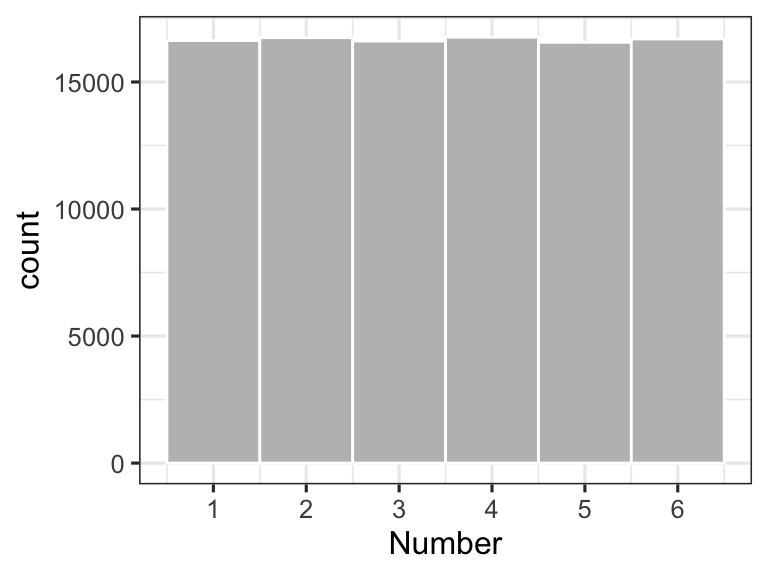
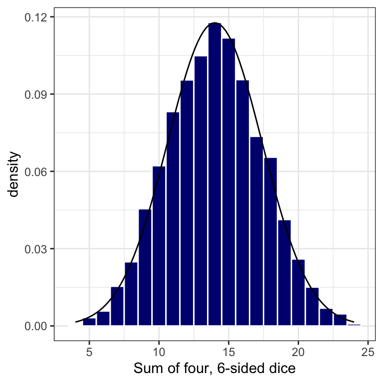
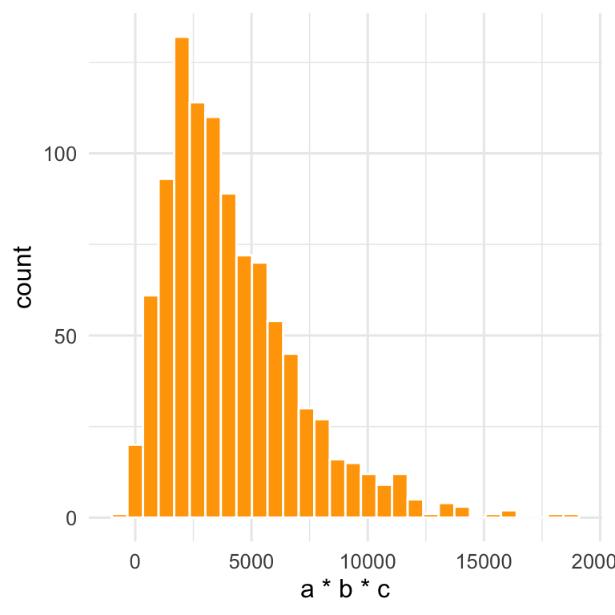

# Appendix: Reference Distributions {#dist}
In this chapter I discuss a handful of reference distributions that you may encounter while working thorugh this course. I don't go into great detail on any of these distributions (or their mathematical structure) because smarter, better, and more authoritative descriptions can be found elsehwere in reference texts or online. This is the $1 tour.  


## Uniform Distribution {#unif_dist}
The uniform distribution describes a situation where all obervations have an equal probability of occurrence. Examples of uniform distributions include: the outcome of a single  roll of a 6-sided die, or the flip of a coin, or the chance of picking a spade, heart, diamond, or club from a well-shuffled deck of cards.  In each of these cases, all potential outcomes have an equal chance of occuring.  A uniform distribition may be specified simply by setting the range of possible outcomes (i.e., a minimum, maximum, and anything in between). The "in-between" part also lets you specify whether you want to allow outcome values that are continuous (like from a random-number generator), integers (like from a dice roll), or some other format (like a binary 0 or 1; heads or tails).  

Below, we create a [probability density function](#pdf)  for the first roll of a six-sided die; this is a *discrete uniform distribition* since we only allow integers to occur.  A uniform distribution is appropriate here because any of the numbers between 1 and 6 has equal probability of being rolled.  Notice the shape of the histogram...flat.


```r
#create a uniform distribition for the first roll of a 6-sided die
six_sided <- tibble(
  rolls = ceiling(runif(10e4, min=1, max=7))
)

#create a histogram of the probability density for a uniform distribution 
ggplot(data = six_sided, aes(x = rolls)) +
  geom_histogram(
      breaks = seq(1,7,1), 
      fill = "grey",
      color = "white") +
  xlab("Number") +
  scale_x_continuous(breaks = c(0.5, 1.5, 2.5, 3.5, 4.5, 5.5, 6.5),
                     labels = as.factor(seq(0,6,1))) +
  theme_bw(base_size = 12)
```

<div class="figure">

<p class="caption">(\#fig:unif-dist)Outcome probability for the first roll of a 6-sided die</p>
</div>
  
  
### Characteristic Plots: Uniform Distribution
Below, we show the cumulative distribution plot and probability density function for a uniform distribution between 0 and 1.
<div class="figure">

<p class="caption">(\#fig:unif-dist-plots2)Characteristic Plots for a Uniform Distribution</p>
</div>

## Normal Distribution {#normal_dist}
The normal distribution arises from phenomena that tend to have *additive* variability. By "additive", I mean that the outcome (or variable of interest) tends to vary in a +/- fashion from one observation to the next. Lots of things have additive variability: the heights of 1^st^ graders, the size of pollen grains from a tree or plant, the variation in blood pressure across the population, or the average temperature in Fort Collins, CO for the month of June.  

Let's examine what *additive variability* looks like using the 6-sided dice mentioned above.  Although a dice roll has a uniform distribution of possible outcomes (rolling a 1,2,3,4,5, or 6), the variability associated with adding up the sum of three or more dice creates a normal distribution of outcomes.  If we were to roll four, 6-sided dice and sum the result (getting a value between 4 and 24 for each roll), and then repeat this experiment 10,000 times, we see the distribution shown below.  The smooth line represents a fit using a normal distribution - a pretty nice fit considering that we are working with a discrete (integer-based) dataset!
<div class="figure">

<p class="caption">(\#fig:normal1)A Normal Distribution</p>
</div>

### Normal Distribution: Characteristic Plots

Unlike the uniform distribution, the normal distribution is not specified by a range (it doesn't have one).  The normal distribution is specified by a *central tendancy* (a most-common value) and a measure of data's *dispersion* or spread (a standard deviation). A normal distribution is symmetric, meaning that the spread of the data is equal on each side of the central tendency.  This symmetry also means that the mode (the most common value), the median (the 50^th^ percentile or 0.5 quantile) and the mean (the average value) are all equal. A series of normal distributions of varying dispersion is shown in the panels below.

<div class="figure" style="text-align: center">

<p class="caption">(\#fig:normal2)Characteristic Plots for a Normal Distribution</p>
</div>

## Log-normal Distribution {#log_normal_dist}
Multiplicative variation is what gives rise to a "log-normal" distribution: a special type of skewed data.  

Let's create two normal distributions for variables 'a' and 'b':  


```r
#create two variables that are normally distributed
normal_data <- tibble(a = rnorm(n=1000, mean = 15, sd = 5),
                   b = rnorm(n=1000, mean = 10, sd = 3))
```

Individually, we know that these data are normally distributed (because we created them that way), but what does the distribution look like if we add these two variables together?


```r
#add those variables together and you get a normal distribution
normal_data %>% mutate(c = a + b) -> normal_data

ggplot2::ggplot(data = normal_data) + 
  geom_histogram(aes(c),
                 bins = 30,
                 fill = "navy",
                 color = "white") +
  xlab("Sum of a + b") +
  theme_minimal(base_size = 12)
```

<div class="figure" style="text-align: center">

<p class="caption">(\#fig:a-b-histogram)The Sum of Two Normally Distributed Variables</p>
</div>

```r
#ggsave("./images/hist_a_b.png", dpi = 150)
```
*Answer: still normal*.  Since all we did here was add together two normal distributions, we simply created a third (normal) distribution with more additive variability.  

What happens, however, if we multiply together a series of normally distributed variables?  

```r
#multiply together three normal variables
normal_data %>% 
  mutate(d = sample(a*b*c, 1000)) -> log_data

ggplot2::ggplot(data = log_data) + 
  geom_histogram(aes(d),
                 bins = 30,
                 fill = "orange",
                 color = "white") +
  xlab("a * b * c") +
  theme_minimal(base_size = 12) 
```

<div class="figure" style="text-align: center">

<p class="caption">(\#fig:a-b-lognormal)The Product of Three Normally Distributed Variables Multiplied Together</p>
</div>

```r
#ggsave("./images/hist_skew_out.png", dpi = 150)
```
*Answer: the additive variability becomes **multiplicative variability**, which leads to a skewed (in this case, log-normal) distribution.*

Multiplicative (or log-normal) variability arises when the mechanism(s)
controlling the variation of `x` are multipliers (or divisors) of `x`. Many
real-world phenomena create multiplicative variability in observed data: the
strength of a WiFi signal at different locations within a building, the
magnitude of earthquakes measured at a given position on the Earth's surface,
the size of rocks found in a section of a riverbed, or the size of particles
found in air. All of these phenomena tend to be governed by multiplicative
factors. In other words, all of these observations are controlled by mechanisms
that suggest $x = a * b * c$ not $x = a\cdot b\cdot c$.


## Statistical Terms

### Measures of Central Tendency

When we think about a distribution of data (in a [univariate](#univar) sense), the ***central tendency*** represents the center, or *location*, of the data. The central tendency is the answer to the question: *where do the values typically fall*? We will use the terms **mean**, **median**, and **mode** to describe a distribution's central tendency. They are defined as follows. 

Let $x$ be the variable of interest and assume that we have $n$ observations of *`x`* stored in R as a vector. Thus, each individual observation would be $x_{i}$ where $i$ goes from $1$ to $n$. In an R programming sense, $n =$ `length(x)`.

  - **Mean**: The average value, often termed as $\bar{x}$. Calculated in `{base} R`
  using the `mean()` function.
  
  $$\bar{x} = \frac{\sum_{i=1}^{n}x_{i}}{n}$$

 - **Mode**: The most commonly observed value for $x$ among all the $x_{i}$ values. The mode can be calculated using `mode()` or often seen via a [histogram](#hist) of `x`. Note that with continuous data (and precise measurements), the `mode()` can be confusing because no two values of `x` are the same...*unless* you group the observations into discrete bins (as is done in a histogram).
 
 - **Median**: The 50^th^ percentile value of $x$ when ordered from smallest to 
 largest value.  The value of $x_{i}$ that splits an ordered distribution of $x$ 
 into equal halves. The median is the same as the 0.5 [quantile](#quantile) of $x$.
 The median can be calculated directly using `median()` or the `quantile()` 
 function.
 
### Measures of Dispersion
The dispersion of a univariate distribution of data refers to its variability. We will use the following terms to describe dispersion. This is not a comprehensive list by any means, but these terms are common:

  - **Range**: The range is defined by the minimum and maximum value observed for
  the distribution of $x$.  For a large enough sample size, the range would contain nearly ALL possible observations of the data.  Lots of functions can be used to calculate the range: `range()`, `max()` and `min()`, or `quantile(x, probs = c(0,1))`.
  
  - **Inter-quartile Range (IQR)**: The IQR describes the variation in $x$ needed to go from the 25^th^% to the 75^th^% of the distribution. The IQR spans
the "middle part" of the distribution of $x$ and is calculated with `IQR()`.

  - **Standard deviation**: The standard deviation is a common measure of dispersion, but one that is easily misused, since the *"standard"* part of this term implies the  data are ***normally distributed*** (*hint: not all data are normally distributed*). Still, this term is so common that one should know it. The sample standard deviation of $x$, denoted as $\hat{\sigma_{x}}$, is calculated in R using `sd()` from the following formula:
  
  $$\hat{\sigma_{x}} = \sqrt {\frac{\sum_{i=1}^{n}(x_{i}-\bar{x})^2}{n-1}}$$
  
The units of $\hat{\sigma_{x}}$ are the same as $x$, so we can interpret the standard deviation as a measure of **dispersion** about the **mean**.  Thus, we often see $\bar{x}\pm\hat{\sigma_{x}}$ reported for a univariate distribution.

<div class="rmdnote">
<p>Note: the “hat” symbol, <span class="math inline">\(\hat{}\)</span>, over the <span class="math inline">\(\sigma\)</span> denotes that we are <em>estimating</em> the standard deviation based on a sample of <span class="math inline">\(x_{i}\)</span> values. Statisticians created these hats to remind us that measurements (aka: samples, observations) are only estimates of a true population value. More on samples and populations <a href="#sample">here</a>.</p>
</div>


  - **Variance**: The variance of $x$ is the *average of the squared difference from the mean* for all values of $x$.  The sample variance, denoted as $\hat{\sigma}^2$,
 is also the square of the *standard deviation*. Variance is calculated in R using the `var()` function.
  
  $$\hat{\sigma_{x}}^{2} = \frac{\sum_{i=1}^{n}(x_{i}-\bar{x})^2}{n-1}$$
  
***Why do we take the square of $x_{i}-\bar{x}$ when calculating these measures of***
***dispersion?***  *Answer*: Because when we are taking the sum, $\sum_{i=1}^n$, if we didn't calculate squares then the positive and negative deviations would cancel each other out and mislead our estimate of dispersion.  This is the reasoning behind all *root-mean-square* calculations.

<div class="rmdwarning">
<p>The mean and standard deviation are great measures of central tendency and dispersion when you are working with data that (approximately) follow a normal distribution. When data are skewed, the <code>mean()</code> and <code>sd()</code> can lead to unexpected results. See <a href="#skew">Figure 5.8</a>, as an example.</p>
</div>
 
### Pearson Correlation Coefficient {#pearson}
The Pearson correlation coefficient, ***r***, is a quantitative descriptor of the degree of **linear correlation** between two variables (let's call them `x` and `y`).  

The Pearson correlation coefficient indicates the proportion of linear variation 
in $y$ that can be explained by knowing $x$, when the data are paired.  By "linear" we mean a straight-line fit between the two variables.  The assumptions underlying the
Pearson correlation coefficient are as follows:  
  - The variables x, y are continuous. 
  - Both x and y were from a paired sample
  - The dataset is free of outliers (outliers tend to skew resutls)
  - A linear relationship exists between x and y

Below, we show a series of scatter plots with varying levels of linear correlation 
between two vectors: 
`x` and `y`. 


<div class="figure">

<p class="caption">(\#fig:pearson-plot-correlation)Pearson correlation for variables with perfect, strong, moderate, and no correlation.</p>
</div>

Values of **r** range from -1 (perfect negative correlation) to 0 (no correlation) to 1 (perfect positive correlation). As an engineer, I would say that two variables are *moderately correlated* when they have a Pearson correlation coefficient (as an absolute value) $|r|$, between 0.25 and 0.75. Two variables are *strongly correlated* when $|r|>0.75$. These are qualitative judgments on my part; someone in a different discipline (like  epidemiology or economics) might get super excited by discovering an r = 0.3 between two variables.

You will often see the square of Pearson correlation coefficient reported, $r^2$. 
The $r^2$ term is a direct indicator of how the ***variance*** in $y$ is explained by
knowing $x$.  Note that because of the square power, $r^2$ values range from zero to 1.

There are several ways to calculate **r** - all of these are mathematically equivalent. 
If we have `n` paired samples of `x` and `y`, then ***r*** is:

$$r = \frac{n\sum(x_{i}y_{i})-\sum x_{i} \sum y_{i} } {\sqrt {n\sum(x_{i}^{2})-\sum(x_{i})^{2}} \cdot \sqrt {n\sum(y_{i}^{2})-\sum(y_{i})^{2}}}$$

This equation looks like a lot of work but it's really just a lot of algebra to divide  the *covariance* of `x` and `y` with the product of their standard deviations: $\hat{\sigma}_{x}$, $\hat{\sigma}_{y}$. 

$$r = \frac{cov(x,y)} {\hat{\sigma}_{x} \cdot \hat{\sigma}_{y}}$$
You can rearrange the equation to calculate **r** using the mean and standard deviation as follows (note: the $n-1$ parts get canceled out):
$$r = \frac{\sum_{i=1}^{n}(x_{i} - \bar{x})\cdot(y_{i} - \bar{y}) } {\sqrt {\sum_{i=1}^{n}(x_{i}-\bar{x})^{2}} \cdot \sqrt {\sum_{i=1}^{n}(y_{i}-\bar{y})^{2}}}$$
<div class="figure" style="text-align: center">

<p class="caption">(\#fig:pearson-anno)The Pearson Correlation Coefficient is not as bad as it loooks in algebraic form.</p>
</div>


You can calculate **r** using the `cor()` function and supplying `x` and `y` as arguments.  For example:


```r
set.seed(9)
x <- 1:100
y <- x + runif(n = 100, min = -25, max = 25)

cor(x, y)
```

```
## [1] 0.8834837
```

Also note that **r** is **not** an appropriate indicator of **non-linear correlation**. For example, in the example that follows, `y` is perfectly represented as `x^4^`, but the Pearson correlation coefficient between these variables is not 1!


```r
set.seed(10)
x <- 1:100
y <- x^4 

cor(x, y)
```

```
## [1] 0.8672807
```

