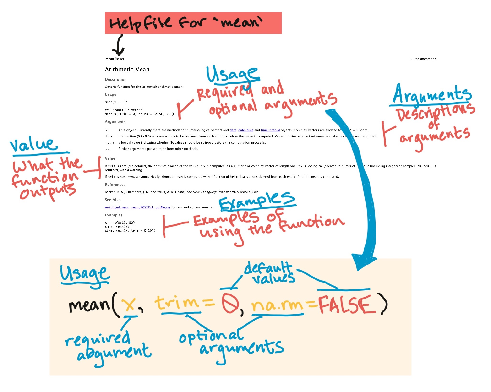
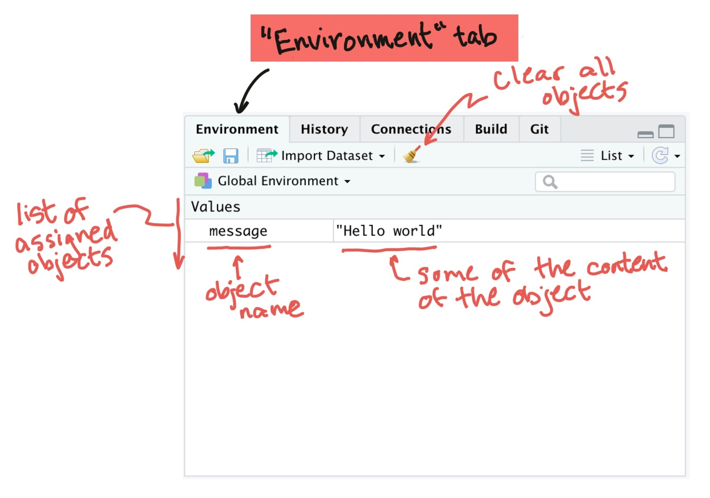
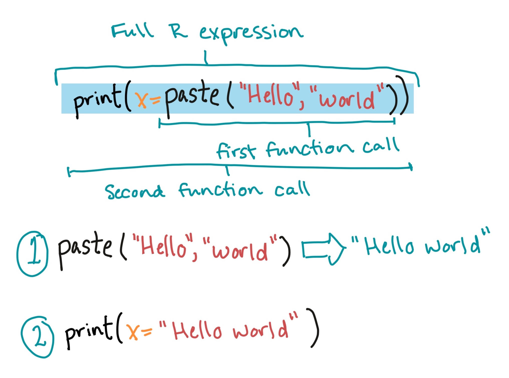
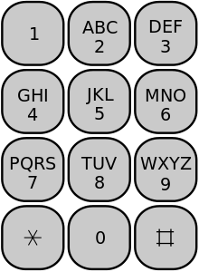
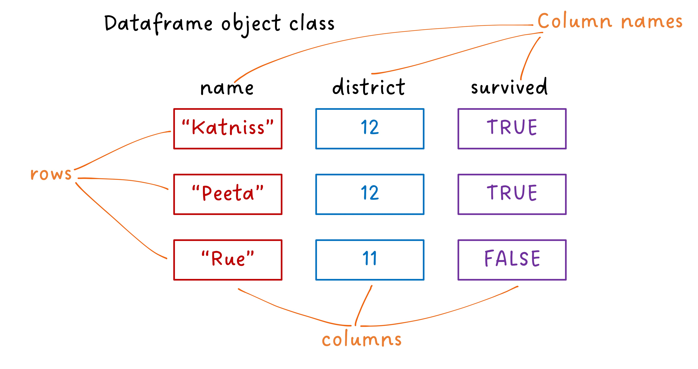
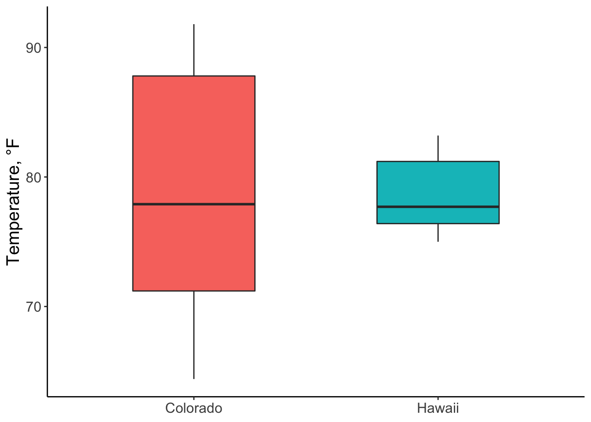
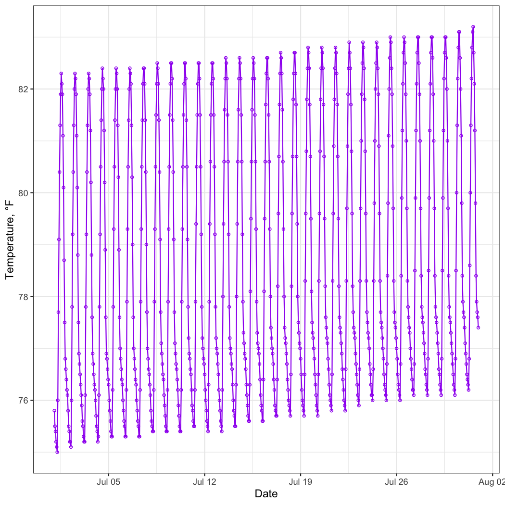
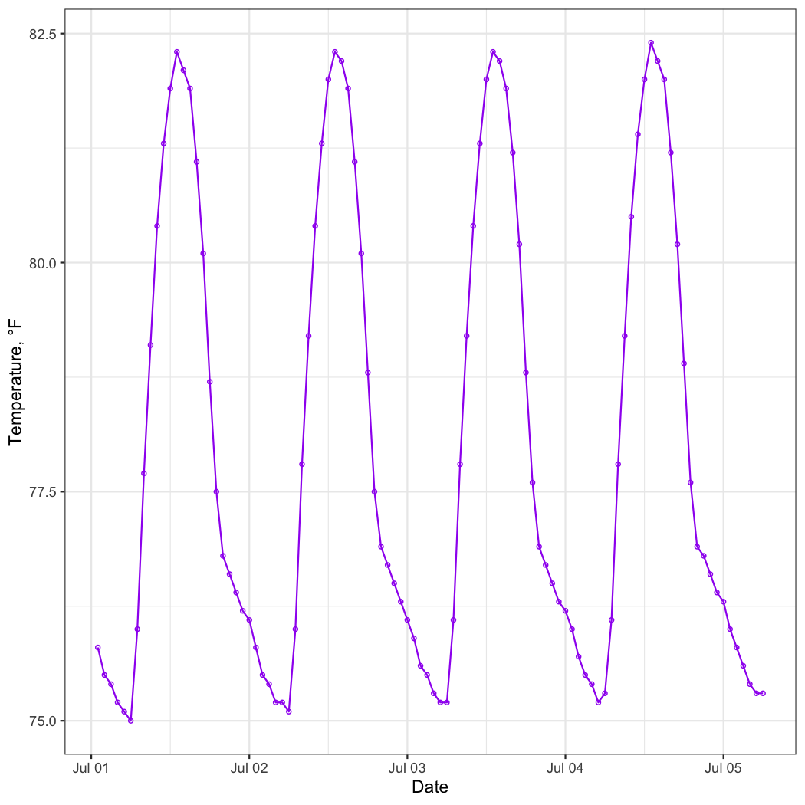
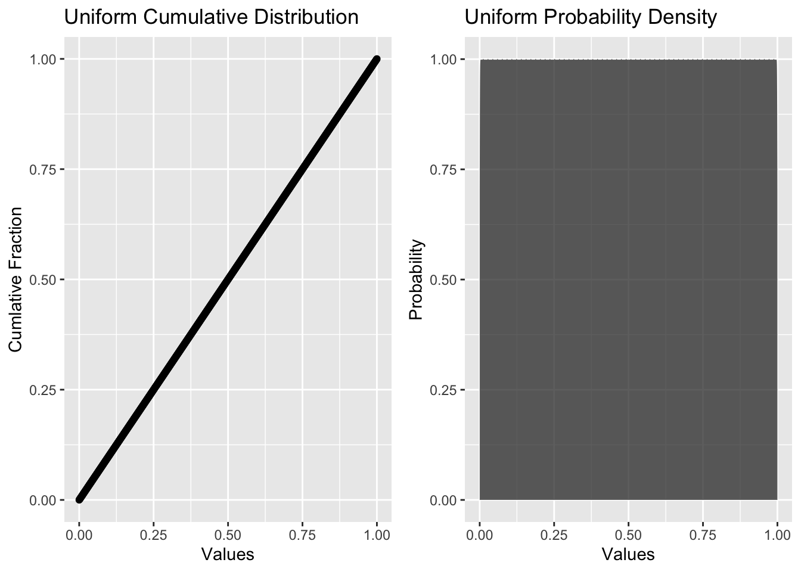
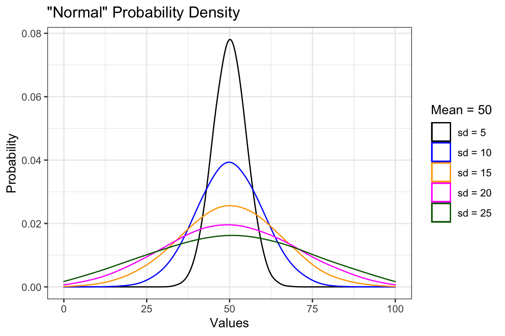

--- 
title: "Engineering Data Analysis in R"
author: "John Volckens and Kathleen E. Wendt"
date: "2020-07-13"
site: bookdown::bookdown_site
knit: "bookdown::render_book"
documentclass: book
bibliography: 
biblio-style: apalike
link-citations: yes
description: "This is an undergraduate technical elective course for mechanical engineers who wish to lean about data analysis using the R programming language."
---

```
## ── Attaching packages ──────────────────────────────────── tidyverse 1.2.1 ──
```

```
## ✓ ggplot2 3.3.0     ✓ purrr   0.3.3
## ✓ tibble  2.1.3     ✓ dplyr   0.8.3
## ✓ tidyr   1.0.2     ✓ stringr 1.4.0
## ✓ readr   1.3.1     ✓ forcats 0.4.0
```

```
## ── Conflicts ─────────────────────────────────────── tidyverse_conflicts() ──
## x dplyr::filter() masks stats::filter()
## x dplyr::lag()    masks stats::lag()
```

```
## 
## Attaching package: 'kableExtra'
```

```
## The following object is masked from 'package:dplyr':
## 
##     group_rows
```

# Introduction {#intro}
 <font size="5"> Preface </font>

I developed this coursebook to help engineers begin to *think* about data.  Most of my job at the university is to conduct research, yet most of the students who show up to my lab don't know where to begin when presented with data. The irony is that, while engineering students are continuously drilled on how to solve problems, they are rarely taught how to seek them out. My undergraduate advisor, Dr. David Hemenway, once told me: "The data are always trying to tell you something."  This book is an introduction to *data listening* because listening comes before understanding.

In broad terms, scientific and engineering research is about discovery: finding out something new. In practice, however, research is really about failure. Over the short term, researchers fail in the act of discovery much more often than they succeed. Such failure is to be expected because cutting-edge research ain't easy. Once you come to terms with accepting failure as a regular occurrence, you put yourself in a position to learn from it. To learn from failure requires that you observe and diagnose "what went wrong" and to do that, you need to listen to what the data are telling you. Let's begin.

## How to use this book

The coursebook is intended to be a sort of *self-help* guide for students who want to learn R programming and the art of engineering data science. The book is designed to get you started in the art, not master it. I'm not qualified to teach mastery in the art of R or engineering data science, so look elsewhere for that level of tutelage.

If you are new to these topics, you probably want to start at the beginning and proceed through each chapter sequentially. Some sections or material might seem boring or too easy. In that case, just skip to the end of the section and see if you can complete the exercises and answer the questions.

Nearly all of the graphics and data presented in this book were created or manipulated in R. In many places, however, I have hidden the code in order to streamline the message. If you ever wonder "How did he do that?" you can download any of the R Markdowns on [the GitHub repository](https://github.com/SmogDr/edar_coursebook/), where this coursebook is hosted. 

## Prerequisites

This course is intended for upper-level undergraduates who have completed MECH 231 (Experimental Design).

## Grading

### Grading for MECH 481A6

Course grades will be determined by the following five components:

<table class="table table-striped" style="width: auto !important; margin-left: auto; margin-right: auto;">
 <thead>
  <tr>
   <th style="text-align:center;"> Assessment component </th>
   <th style="text-align:center;"> Percent of grade </th>
  </tr>
 </thead>
<tbody>
  <tr>
   <td style="text-align:center;"> Exams </td>
   <td style="text-align:center;"> 60 </td>
  </tr>
  <tr>
   <td style="text-align:center;"> Quizzes </td>
   <td style="text-align:center;"> 25 </td>
  </tr>
  <tr>
   <td style="text-align:center;"> Homework </td>
   <td style="text-align:center;"> 15 </td>
  </tr>
</tbody>
</table>

## Course set-up

Please download and install the latest version of R and RStudio. 

- R: https://cran.r-project.org 
- RStudio: https://rstudio.com/products/rstudio/download/#download

Students will also need to download and install git software and create a GitHub account.

- Install git: https://git-scm.com/downloads 
- Create a GitHub account: https://github.com 

[Happy Git with R](https://happygitwithr.com/) by Dr. Jenny Bryan is a helpful resource for installation and set-up. Also, a team associated with the Colorado State University Statistics Department is actively developing a series of one-credit modules for undergraduate students new to R. Their [videos](https://csu-r.github.io/Module1/) on software installation and RStudio orientation may be particularly helpful at this stage.

If you want to generate PDF output from R Markdown documents, you will also need to install LaTex. I suggest taking the following approach, if you have never installed LaTex on your personal computer. More installation guidance can be found [here](https://bookdown.org/yihui/rmarkdown/installation.html). 


```r
# install R package
install.packages("tinytex")
# install LaTex "ingredients"
tinytex::install_tinytex()
```

## Coursebook

This coursebook will serve as the only required textbook for this course. I regularly edit and add to this book, so content may change somewhat over the semester. We typically cover about a chapter of the book every 1-2 weeks of the course.

This coursebook includes: 

- Links to the slides presented in class for each topic
- In-course exercises, typically including links to the data used in the exercise
- Homework assignments
- Appendix of [reference distributions](#dist)
- A list of vocabulary and concepts that should be mastered for each quiz

If you find any typos or bugs, or if you have any suggestions for how the book
can be improved, feel free to post it on the book's [GitHub Issues
page](https://github.com/SmogDr/edar_coursebook/issues).

This book was developed using Yihui Xie's [bookdown](https://bookdown.org) framework. The book is built using code that combines R code, data, and text to create a book for which R code and examples can be re-executed every time the book is re-built, which helps identify bugs and broken code examples quickly. The online book is hosted using GitHub's free [GitHub Pages](https://pages.github.com). All material for this book is
available and can be explored at [the book's GitHub
repository](https://github.com/SmogDr/edar_coursebook).

### Other helpful books (not required)

The best book to supplement the coursebook and lectures for this course is [R
for Data Science](http://r4ds.had.co.nz) by Garrett Grolemund and Hadley
Wickham. The entire book is freely available online through the same format of
the coursebook. You can also purchase a paper version of the book published by
O'Reilly for around $40. This book is an excellent and up-to-date reference by some of the best R programmers in the world.

There are a number of other useful books available on general R programming, including:

- [R for Dummies](https://colostate-primo.hosted.exlibrisgroup.com/primo-explore/fulldisplay?docid=01COLSU_ALMA51267598310003361&context=L&vid=01COLSU&lang=en_US&search_scope=Everything&adaptor=Local%20Search%20Engine&tab=default_tab&query=any,contains,r%20for%20dummies&sortby=rank&offset=0)
- [R Cookbook](https://colostate-primo.hosted.exlibrisgroup.com/primo-explore/fulldisplay?docid=01COLSU_ALMA21203304500003361&context=L&vid=01COLSU&lang=en_US&search_scope=Everything&adaptor=Local%20Search%20Engine&tab=default_tab&query=any,contains,r%20cookbook&sortby=rank&offset=0)
- [R Graphics Cookbook](http://www.amazon.com/R-Graphics-Cookbook-Winston-Chang/dp/1449316956/ref=sr_1_1?ie=UTF8&qid=1440997472&sr=8-1&keywords=r+graphics+cookbook)
- [Roger Peng's Leanpub books](https://leanpub.com/u/rdpeng)
- Various books on [bookdown.org](www.bookdown.org)

The R programming language is used extensively within certain fields, including
statistics and bioinformatics. If you are using R for a specific type of
analysis, you will be able to find many books with advice on using R for both
general and specific statistical analysis, including many available in print or
online through the CSU library.

## Acknowledgements

Most of the introductory material for this book were adapted from Professor [Brooke Anderson's R Programming Coursebook](https://geanders.github.io/RProgrammingForResearch/), to whom I owe thanks not only for the material but for the many helpful discussions. I would also like to acknowledge [John Tukey](http://rsbm.royalsocietypublishing.org/content/49/537.full.pdf+html), one of the pioneers of exploratory data analysis, and the creators of the [NIST Engineering Statistics Handbook](https://doi.org/10.18434/M32189), from which I have drawn many techniques. 

<!--chapter:end:index.Rmd-->

# The R Programming Environment {#rprog1}


## Objectives

This chapter is designed around the following learning objectives. Upon completing this chapter, you should be able to:  

- Define free and open source software and list some of its advantages over proprietary software
- Recognize the difference between R and RStudio
- Describe the differences between base R code that you initially download and
"package" code that you use to expand base R
- Use RStudio to download and install a package from the Comprehensive R Archive Network (CRAN) to your computer
- Use RStudio to load a package that you have installed within an R session
- Demonstrate how to access help documentation including vignettes and helpfiles for a package and its functions
- Demonstrate how to submit R expressions at the console
- Define the general syntax for calling a function and for specifying both required and optional arguments for that function
- Describe what an R object is and how to assign an R object a name to reference it in later code
- Describe how to create vector objects of numeric and character classes
- Describe how to explore and extract elements from vector objects
- Describe how to create dataframe objects
- Describe how to explore and extract elements from dataframe objects
- Compare the key differences between running R code from the console versus writing and running R code in an R script

## R and R Studio

### What is R?

R in an open-source programming language that evolved from the S language. The S
language was developed at Bell Labs in the 1970s, which is the same place (and
about the same time) that the C programming language was developed.

R itself was developed in the 1990s-2000s at the University of Auckland. It is
open-source software, freely and openly distributed under the GNU General Public
License (GPL). The base version of R that you download when you install R on
your computer includes the critical code for running R, but you can also install
and run "packages" that people all over the world have developed to extend R.

With new developments, R is becoming more and more useful for a variety of
programming tasks. However, where it really shines is in working with data and
doing statistical analysis. R is currently popular in a number of fields,
including statistics, machine learning, and data analysis.

R is an **interpreted language**. That means that you can communicate with it 
interactively from a command line. Other common interpreted languages include
Python and Perl.

<div class="figure" style="text-align: center">

<p class="caption">(\#fig:interpreted-language)Broad types of software programs. R is an interpreted language. 'Point-and-click' programs, like Excel and Word, are often easiest for a new user to get started with, but are slower for the computer and are restricted in the functionality they offer. By contrast, compiled languages (like C and Java), assembly languages, and machine code are faster for the computer and allow you to create a wider range of things, but can take longer to code and take longer for a new user to learn to work with.</p>
</div>

Compared to Python, R has some of the same strengths (e.g., quick and easy to code, interfaces well with other languages, easy to work interactively) and weaknesses (e.g., slower than compiled languages). For data-related tasks, R and Python are fairly neck-and-neck, with Julia an up-and-coming option. Nonetheless, R is still the first choice of statisticians in most fields, so I would argue that R has a an advantage, if you want to have access to cutting-edge statistical methods.

> "The best thing about R is that it was developed by statisticians. The worst thing about R is that...it was developed by statisticians." -- Bo Cowgill, Google, at the Bay Area R Users Group

### Free and open-source software

> "Life is too short to run proprietary software." -- Bdale Garbee

R is **free and open-source software**. Conversely, many other popular statistical programming languages such as SAS and SPSS are proprietary. It's useful to know what it means for software to be "open-source", both conceptually and in terms of how you will be able to use and add to R in your own work.

R is free, and it's tempting to think of open-source software just as "free
software". It is a little more subtle than that. It helps to consider some different meanings of the word "free". "Free" can mean:

- *Gratis*: Free as in free beer
- *Libre*: Free as in free speech

<div class="figure" style="text-align: center">

<p class="caption">(\#fig:open-source-overview)An overview of how software can be each type of free (beer and speech). For software programs developed using a compiled programming language, the final product that you open on your computer is run by machine-readable binary code. A developer can give you this code for free (as in beer) without sharing any of the original source code with you. This means you can't dig in to figure out how the software works and how you can extend it. By contrast, open-source software (free as in speech) is software for which you have access to the human-readable code that was used as in input in creating the software binaries. With open-source code, you can figure out exactly how the program is coded.</p>
</div>

Open-source software is the *libre* type of free (Figure
\@ref(fig:open-source-overview)). This means that, with software that is
open-source, you can:

- Access all of the code that makes up the software
- Change the code as you'd like for your own applications
- Build on the code with your own extensions
- Share the software and its code, as well as your extensions, with others

Often, open-source software is also free, making it "free and open-source software", or "FOSS".

Popular open source licenses for R and R packages include the GPL and MIT licenses.

> “Making Linux GPL'd was definitely the best thing I ever did.” -- Linus Torvalds

In practice, this means that, once you are familiar with the software, you can
dig deeply into the code to figure out exactly how it's performing certain
tasks. This can be useful for finding and eliminating bugs and can help researchers figure out if there are any limitations in how the code works
for their specific research.

It also means that you can build your own software on top of existing R software
and its extensions. I explain a bit more about R packages a bit later, but this
open-source nature of R has created a large community of people worldwide who develop and share extensions to R. As a result, you can pull in packages that let you do all kinds of things in R, like visualizing Tweets, cleaning up accelerometer data, analyzing complex surveys, fitting maching learning models, and a wealth of other cool things.

> "Despite its name, open-source software is less vulnerable to hacking than the secret, black box systems like those being used in polling places now. That’s because anyone can see how open-source systems operate. Bugs can be spotted and remedied, deterring those who would attempt attacks. This makes them much more secure than closed-source models like Microsoft’s, which only Microsoft employees can get into to fix." -- [Woolsey and Fox. *To Protect Voting, Use Open-Source Software.* New York Times. August 3, 2017.](https://www.nytimes.com/2017/08/03/opinion/open-source-software-hacker-voting.html?mcubz=3)

You can download the latest version of R from [CRAN](https://cran.r-project.org). Be sure to select the distribution for your type of computer system. R is updated occasionally; you should plan to re-install R at least once a year to make sure you're working with one of the newer versions. Check your current R version (e.g., by running `sessionInfo()` at the R console) to make sure you're not using an outdated
version of R. 

> "The R engine ...is pretty well uniformly excellent code but you
have to take my word for that. Actually, you don't. The whole engine is open source so, if you wish, you can check every line of it. If people were out to push dodgy software, this is not the way they'd go about it." -- Bill Venables, R-help (January 2004)

> “Talk is cheap. Show me the code.” -- Linus Torvalds

### What is RStudio?

To get the R software, you'll [download R](https://www.r-project.org) from the R
Project for Statistical Computing. This is enough for you to use R on your own
computer. But, for a more user-friendly experience, you should also download RStudio, an integrated development environment (IDE) for R. It provides you an interface for using R, with a lot of nice extras like R Projects that will make your life easier. All of the code chunks shown in this book were produced using RStudio.

As Chapter 1 outlined, you should download R first, then the RStudio IDE. 

[RStudio, PBC](https://blog.rstudio.com/2020/01/29/rstudio-pbc/) is a leader in the R community. Currently, the company:

- Develops and freely provides the RStudio IDE
- Provides excellent resources for learning and using R (e.g., cheatsheets, free online books)
- Is producing some of the popular R packages
- Employs some of the top people in R development
- Is a key member of The R Consortium in addition to others such as Microsoft, IBM, and Google

R has been advancing by leaps and bounds in terms of what it can do and the
elegance with which it does it, in large part because of the enormous
contributions of people involved with RStudio.

## Communicating with R

Because R is an interpreted language, you can communicate with it interactively. You do this using the following general steps: 

1. Open an **R session**
2. At the **prompt** in the **console**, enter an **R expression**
3. Read R's "response" (i.e., **output**)
4. Repeat 2 and 3
5. Close the R session

### R sessions, console, and command prompt

An **R session** is an "instance" of you using R. To open an R session, double-click on the icon for the RStudio IDE on you computer. When RStudio opens, you will be in a "fresh" R session, unless you restore a saved session, which is not best practice. To avoid saving work sessions, you should change the defaults in RStudio's Preferences menu, such that RStudio never saves the workspace to .RData on exit. A "fresh" R session means that, once you open RStudio, you will need to "set up" your session, including loading packages and importing data (discussed later).

In RStudio, the screen is divided into several "panes". We'll start with the pane called "Console". The **console** lets you "talk" to R. This is where you can "talk" to R by typing an **expression** at the **prompt** (the caret symbol, ">"). You press the "Return" key to send this message to R.

<div class="figure" style="text-align: center">

<p class="caption">(\#fig:r-console)Finding the 'Console' pane and the command prompt in RStudio.</p>
</div>

Once you press "Return", R will respond in one of three ways:

1. R does whatever you asked it to do with the expression and prints the output, if any, of doing that, as well as a new prompt so you can ask it something new.
2. R doesn't think you've finished asking for something, and instead of giving you a new prompt (">") it gives you a "+". This means that R is still listening, waiting for you to finish asking it something. 
3. R tries to do what you asked it to, but it can't. It gives you an **error message**, as well as a new prompt so you can try again or ask it something new. 

### R expressions, function calls, and objects

To "talk" with R, you need to know how to give it a complete **expression**. 
Most expressions you'll want to give R will be some combination of two elements: 

1. **Function calls**
2. **Object assignments**

We'll go through both these pieces and also look at how you can combine them 
together for some expressions.

According to John Chambers, one of the creators of the S language (precursor to R):

1. Everything that exists in R is an **object**
2. Everything that happens in R is a **call to a function**

In general, function calls in R take the following structure: 


```r
# generic code (this won't run)
function_name(formal_argument_1 = named_argument_1, 
              formal_argument_2 = named_argument_2,
              [etc.])
```

<div class="rmdwarning">
<p>Sometimes, we’ll show “generic” code in a code block, that doesn’t actually work if you put it in R, but instead shows the generic structure of an R call. We’ll try to always include a comment with any generic code, so you’ll know not to try to run it in R.</p>
</div>

A function call forms a complete R expression, and the output will be the result of running `print()` or `show()` on the object that is output by the function call. Here is an example of this structure: 


```r
print(x = "Hello, world!")
```

```
## [1] "Hello, world!"
```

Figure \@ref(fig:function-call) shows an example of the typical elements of a
function call. In this example, we're **calling** a function with the **name**
`print`. It has one **argument**, with a **formal argument** of `x`, which in
this call we've provided the **named argument**: "Hello, world!".

<div class="figure" style="text-align: center">

<p class="caption">(\#fig:function-call)Main parts of a function call. This example is calling a function with the name 'print'. The function call has one argument, with a formal argument of 'x', which in this call is provided the named argument 'Hello world'.</p>
</div>

The **arguments** are how you customize the call to an R function. For example,
you can use change the named argument value to print different messages with the
`print()` function. Note that the formal argument never changes.


```r
print(x = "Hello, world!")
```

```
## [1] "Hello, world!"
```

```r
print(x = "Hi, Fort Collins!")
```

```
## [1] "Hi, Fort Collins!"
```

Some functions do not require any arguments. For example, the `getRversion()` function will print out the version of R you are using.


```r
getRversion()
```

```
## [1] '3.6.2'
```

Some functions will accept multiple arguments. For example, the `print()` function allows you to specify whether the output should include quotation marks, using the `quote` formal argument: 


```r
print(x = "Hello world", quote = TRUE)
```

```
## [1] "Hello world"
```

```r
print(x = "Hello world", quote = FALSE)
```

```
## [1] Hello world
```

Arguments can be **required** or **optional**. 

For a required argument, if you don't provide a value for the argument when you call the function, R will respond with an error. For example, `x` is a **required argument** for the `print()` function, so if you try to call the function without it, you'll get an error: 


```r
print()
```

```
Error in print.default() : argument "x" is 
  missing, with no default
```

For an **optional argument** on the other hand, R knows a **default value** for that argument, so if you don't give it a value for that argument, it will just use the default value provided by the R developer who wrote the function. 

For example, for the `print()` function, the `quote` argument has the default value `TRUE`. So if you don't specify a value for that argument, R will assume it should use `quote = TRUE`. That's why the following two calls give the same result: 


```r
print(x = "Hello, world!", quote = TRUE)
```

```
## [1] "Hello, world!"
```

```r
print(x = "Hello, world!")
```

```
## [1] "Hello, world!"
```

Often, you'll want to find out more about a function, including:

- Examples of how to use the function
- Which arguments you can include for the function
- Which arguments are required versus optional
- What the default values are for optional arguments 

You can find out all this information in the function's **helpfile**, which you can access using the function `?`. For example, the `mean()` function will let you calculate the mean (average) of a group of numbers. To find out more about this function, at the console type:


```r
?mean
```

This will open a helpfile in the "Help" pane in RStudio. Figure
\@ref(fig:helpfile) shows some of the key elements of an example helpfile, the
helpfile for the `mean()` function. In particular, the "Usage" section helps you
figure out which arguments are **required** and which are **optional** in the
Usage section of the helpfile.

<div class="figure" style="text-align: center">

<p class="caption">(\#fig:helpfile)Navigating a helpfile. This example shows some key parts of the helpfile for the 'mean' function.</p>
</div>

There's one class of functions that looks a bit different from others. These are the infix **operator** functions. Instead using parentheses after the function name, they usually go *between* two arguments. One common example is the `+` operator:


```r
2 + 3
```

```
## [1] 5
```

There are operators for several mathematical functions: `+`, `-`, `*`, `/`. There are also other operators, including **logical operators** and **assignment operators**, which we'll cover later.

In R, a variety of different types and structures of data can be saved in **objects**. For right now, you can just think of an R object as a discrete container of data in R.

Function calls will produce an object. If you just call a function, as we've been doing, then R will respond by printing out that object. But, we often want to use that object more. For example, we might want to use it as an argument later in our "conversation" with R, when we call another function later. If you want to re-use the results of a function call later, you can **assign** that **object** to an **object name**. This kind of expression is called an **assignment expression**.

Once you do this, you can use that *object name* to refer to the object. This means that you don't need to re-create the object each time you need it---instead, you can create it once, and then just reference it by name each time you need it after that. For example, you can read in data from an external file as a dataframe object and assign it an object name. Then, when you need that data later, you won't need to read it in again from the external file.

The **"gets arrow"** (`<-`) is R's assignment operator. It takes whatever you've created on the right hand side of the `<-` and saves it as an object with the name you put on the left hand side of the `<-`:


```r
# generic code-- this will not work
[object name] <- [object]
```

For example, if I just type `"Hello, world!"`, R will print it back to me, but it won't save it anywhere for me to use later:


```r
"Hello, world!"
```

```
## [1] "Hello, world!"
```

If I assign it to an object, I can "refer" to that object in a later expression. For example, the code below assigns the **object** `"Hello, world!"` the **object name** `message`. Later, I can just refer to this object using the name `message`, for example in a function call to the `print()` function:


```r
message <- "Hello, world!"
print(x = message)
```

```
## [1] "Hello, world!"
```

When you enter an **assignment expression** like this at the R console, if everything goes right, then R will "respond" by giving you a new prompt, without any kind of message. There are three ways you can check to make sure that the object was successfully assigned to the object name: 

1. Enter the object's name at the prompt and press return. The default if you do this is for R to "respond" by calling the `print()` function with that object as the `x` argument.
2. Call the `ls()` function, which doesn't require any arguments. This will list all the object names that have been assigned in the current R session. 
3. Look in the "Environment" pane in RStudio. This also lists all the object names that have been assigned in the current R session.

Here are examples of these strategies:

1. Enter the object's name at the prompt and press return:


```r
message
```

```
## [1] "Hello, world!"
```

2. Call the `ls()` function:


```r
ls()
```

```
## [1] "message"
```

3. Look in the "Environment" pane in RStudio (see Figure \@ref(fig:environment)).

<div class="figure" style="text-align: center">

<p class="caption">(\#fig:environment)'Environment' pane in RStudio. This shows the names and first few values of all objects that have been assigned to object names in the global environment.</p>
</div>

You can make assignments in R using either the "gets arrow" (`<-`) or `=`. When you read other people's code, you'll see both. R gurus advise using `<-` rather than `=` when coding in R, because as you move to doing more complex things, some subtle problems might crop up if you use `=`. You can tell the age of a programmer by whether he or she uses the "gets arrow" or `=`, with `=` more common among the young and hip. For this course, however, I am asking you to code according to [Hadley Wickham's R style guide](http://adv-r.had.co.nz/Style.html), which specifies using the "gets arrow" for object assignment.

While the "gets arrow" takes two key strokes, you can somewhat get around this limitation by using RStudio's keyboard shortcut for the "gets arrow". This shortcut is Alt + - on Windows and Option + - on Macs. To see a full list of RStudio keyboard shortcuts, go to the "Help" tab in RStudio and select "Keyboard Shortcuts".

There are some absolute **rules** for the names you can use for an object name:

- Use only letters, numbers, and underscores 
- Don't start with anything but a letter

If you try to assign an object to a name that doesn't follow the "hard" rules, you'll get an error. For example, all of these expressions will give you an error:


```r
1message <- "Hello world"
_message <- "Hello world"
message! <- "Hello world"
```

In addition to these fixed rules, there are also some guidelines for naming objects that you should adopt now, since they will make your life easier as you advance to writing more complex code in R. The following three guidelines for naming objects are from [Hadley Wickham's R style guide](http://adv-r.had.co.nz/Style.html):

- Use lower case for variable names (`message`, not `Message`)
- Use an underscore as a separator (`message_one`, not `messageOne`)
- Avoid using names that are already defined in R (e.g., don't name an object
`mean`, because a `mean()` function exists)

> "Don't call your matrix 'matrix'. Would you call your dog 'dog'? Anyway, it
might clash with the function 'matrix'." -- Barry Rowlingson, R-help (October 2004)

Another good practice is to name objects after nouns (e.g., `message`) and
later, when you start writing functions, name those after verbs (e.g.,
`print_message`). You'll want your object names to be short enough that they
don't take forever to type as you're coding, but not so short that you can't
remember to what they refer.

<div class="rmdtip">
<p>Sometimes, you’ll want to create an object that you won’t want to keep for very long. For example, you might want to create a small object to test some code, but you plan to not need the object again once you’ve done that. You may want to come up with some short, generic object names that you use for these kinds of objects, so that you’ll know that you can delete them without problems when you want to clean up your R session.</p>
<p>There are all kinds of traditions for these placeholder variable names in computer science. <code>foo</code> and <code>bar</code> are two popular choices, as are, evidently, <code>xyzzy</code>, <code>spam</code>, <code>ham</code>, and <code>norf</code>. There are different placeholder names in different languages: for example, <code>toto</code>, <code>truc</code>, and <code>azerty</code> (French); and <code>pippo</code>, <code>pluto</code>, <code>paperino</code> (Disney character names in Italian). See the Wikipedia page on <a href="https://en.wikipedia.org/wiki/Metasyntactic_variable">metasyntactic variables</a> to find out more.</p>
</div>

What if you want to "compose" a call from more than one function call? One way
to do it is to assign the output from the first function call to a name and then
use that name for the next call. For example:


```r
message <- paste("Hello", "world")
print(x = message)
```

```
## [1] "Hello world"
```

If you give two objects the same name, the most recent definition will be used; objects can be overwritten by assigning new content to the same object name. For example: 


```r
a <- 1:10
b <- LETTERS [1:3]
a
```

```
##  [1]  1  2  3  4  5  6  7  8  9 10
```

```r
b
```

```
## [1] "A" "B" "C"
```

```r
a <- b
a
```

```
## [1] "A" "B" "C"
```

To create an R expression you can "nest" one function call inside another
function call. For example:


```r
print(x = paste("Hello", "world"))
```

```
## [1] "Hello world"
```

Just like with math, the order that the functions are evaluated moves from the inner set of parentheses to the outer one (Figure \@ref(fig:composing-functions)). There's one more way we'll look at later called "piping".

<div class="figure" style="text-align: center">

<p class="caption">(\#fig:composing-functions)'Environment' pane in RStudio. This shows the names and first few values of all objects that have been assigned to object names in the global environment.</p>
</div>

## R scripts

This is a good point in learning R for you to start putting your code in R scripts, rather than entering commands at the console.

An R script is a plain text file where you can save a series of R commands. You can save the script and open it up later to see or re-do what you did earlier, just like you could with something like a Word document when you're writing a paper.

To open a new R script in RStudio, go to the menu bar and select "File" -> "New File" -> "R Script". Alternatively, you can use the keyboard shortcut Command-Shift-N. Figure \@ref(fig:rscript) gives an example of an R script file opened in RStudio and points out some interesting elements.

<div class="figure" style="text-align: center">

<p class="caption">(\#fig:rscript)Example of an R script in RStudio.</p>
</div>

To save a script you're working on, you can click on the "Save" button, which looks like a floppy disk, at the top of your R script window in RStudio or use the keyboard shortcut Command-S. You should save R scripts using a ".R" file extension.

Within the R script, you'll usually want to type your code so there's one command per line. If your command runs long, you can write a single call over multiple lines. It's unusual to put more than one command on a single line of a script file, but you can if you separate the commands with semicolons (`;`). These rules all correspond to how you can enter commands at the console.

Running R code from a script file is very easy in RStudio. You can use either the "Run" button or Command-Return, and any code that is selected (i.e., that you've highlighted with your cursor) will run at the console. You can use this functionality to run a single line of code, multiple lines of code, or even just part of a specific line of code. If no code is highlighted, then R will instead run all the code on the line with the cursor and then move the cursor down to the next line in the script.

You can also run all of the code in a script. To do this, use the "Source" button at the top of the script window. You can also run the entire script either from the console or from within another script by using the `source()` function, with the filename of the script you want to run as the argument. For example, to run all of the code in a file named "MyFile.R" that is saved in your current working directory, run:


```r
source("MyFile.R")
```

While it's generally best to write your R code in a script and run it from there rather than entering it interactively at the R console, there are some exceptions. A main example is when you're initially checking out a dataset to make sure you've imported it correctly. It often makes more sense to run commands for this task, like `str()`, `head()`, `tail()`, and `summary()`, at the console. These are all examples of commands where you're trying to look at something about your data **right now**, rather than code that builds toward your analysis, or helps you import or wrangle your data.

### Commenting code

Sometimes, you'll want to include notes in your code. You can do this in all programming languages by using a *comment character* to start the line with your comment. In R, the comment character is the hash symbol, `#`. You can add comments into an R script to let others know (and remind yourself) what you're doing and why. Any line on a script line that starts with `#` will not be read by R. You can also take advantage of commenting to comment out certain parts of code that you don't want to run at the moment. *But, make sure to finalize your R scripts with only functional code and useful comments.* R will skip any line that starts with `#` in a script. For example, if you run the following code:

`# Don't print this.`

`"But print this"`

R will only print the second, uncommented line. 

You can also use a comment in the middle of a line, to add a note on what you're doing in that line of the code. R will skip any part of the code from the hash symbol on. For example:


```r
"Print this" # But not this, it's a comment.
```

```
## [1] "Print this"
```

There's usually no reason to use code comments when running commands at the R console; however, it's very important to get in the practice of including meaningful comments in R scripts. This helps you remember what you did when you revisit your code later.

> “You know you're brilliant, but maybe you'd like to understand what you did 2 weeks from now.” -- Linus Torvalds

## The "package" system

### R packages

> "Any doubts about R's big-league status should be put to rest, now that we have a Sudoku Puzzle Solver. Take that, SAS!" -- David Brahm (announcing the `sudoku` package), R-packages (January 2006)

Your original download of R is only a starting point. You can expand functionality of R with what are called *packages*, or extensions with new code and functionality that add to the basic "base R" environment. To me, this is a bit like this toy train set. You first buy a very basic set that looks something like Figure \@ref(fig:toy-train-basic).

<div class="figure" style="text-align: center">

<p class="caption">(\#fig:toy-train-basic)The toy version of base R.</p>
</div>

To take full advantage of R, you'll want to add on packages. In the case of the train set, at this point, a doting grandparent adds on extensively through birthday presents, so you end up with something that looks like Figure \@ref(fig:toy-train-fancy).

<div class="figure" style="text-align: center">

<p class="caption">(\#fig:toy-train-fancy)The toy version of what your R set-up will look like once you find cool packages to use for your research.</p>
</div>

Each package is basically a bundle of extra R functions. They may also include  help documentation, datasets, and some other objects, but typically the heart of an R package is the new functions it provides.

You can get these "add-on" packages in a number of ways. The main source for installing packages for R remains the Comprehensive R Archive Network, or [CRAN](https://cran.r-project.org). However, [GitHub](https://github.com) is growing in popularity, especially for packages that are still in active development. You can also create and share packages among your collaborators or co-workers, without ever posting them publicly. 

### Installing from CRAN

<div class="figure" style="text-align: center">

<p class="caption">(\#fig:cran10000)Celebrating CRAN's 10,000th package, which was created by Dr. Brooke Anderson.</p>
</div>

The most popular place from which to download packages is currently CRAN, which has over 10,000 R packages available (Figure \@ref(fig:cran10000)). You can install packages from CRAN using R code, with the `install.packages()` function. For example, telephone keypads include letters for each number (Figure \@ref(fig:phone-keypad)), which allow companies to have "named" phone numbers that are easier for people to remember, like 1-800-GO-FEDEX and 1-800-FLOWERS.

<div class="figure" style="text-align: center">

<p class="caption">(\#fig:phone-keypad)Telephone keypad with letters corresponding to each number.</p>
</div>

The `phonenumber` package is a cool little package that will convert between numbers and letters based on the telephone keypad. Since this package is on CRAN, you can install the package to your computer using the `install.packages()` function:


```r
install.packages(pkgs = "phonenumber")
```

This downloads the package from CRAN and saves it in a special location on your computer where R can load it when you're ready to use it. Once you've installed a package to your computer this way, you don't need to re-run this `install.packages` for the package ever again, unless the package maintainer posts an updated version.

Just like R itself, packages often evolve and are updated by their maintainers. You should update your packages as new versions come out. Typically, you have to reinstall packages when you update your version of R, so this is a good chance to get the most up-to-date version of the packages you use.

### Loading an installed package

Once you have installed a package, it will be saved to your computer. But, you won't be able to access its functions within an R session until you *load* it in that R session. Loading a package essentially makes all of the package's functions available to you. 

You can load a package in an R session using the `library()` function, with the package name inside the parentheses.


```r
library(package = "phonenumber")
```

Figure \@ref(fig:install-vs-load) provides a conceptual picture of the different steps of installing and loading a package.

<div class="figure" style="text-align: center">

<p class="caption">(\#fig:install-vs-load)Install a package (with `install.packages()`) to get it onto your computer. Load it (with `library()`) to get it into your R session.</p>
</div>

Once a package is loaded, you can use all its exported (i.e., public) functions by calling them directly. For example, the `phonenumber` package has a function called `letterToNumber()` that converts a character string to a number. If you have not loaded the `phonenumber` package in your current R session and try to use this function, you will get an error. Once you've loaded `phonenumber` using the `library()` function, you can use this function in your R session:


```r
fedex_number <- "GoFedEx"
letterToNumber(value = fedex_number)
```

```
## [1] "4633339"
```

<div class="rmdnote">
<p>R vectors can have several different <em>classes</em>. One common class is the character class, which is the class of the character string we’re using here (“GoFedEx”). You’ll always put character strings in quotation marks. Another key class is numeric (numbers). Later in the course, we’ll introduce other classes that vectors can have, including factors and dates. For the simplest vector classes, these classes are determined by the type of data that the vector stores.</p>
</div>

When you open RStudio, unless you reload the history of a previous R session (which I strongly **do not** recommend), you will start your work in a "fresh" R session. This means that, once you open RStudio, you will need to run the code to load any packages, define any objects, and read in any data that you will need for analysis in that session.

If you are using a package in academic research, you should cite it, especially if it implements a nonstandard algorithm or method. You can use the `citation()` function to get the information you need about how to cite a package:


```r
citation(package = "phonenumber")
```

```
## 
## To cite package 'phonenumber' in publications use:
## 
##   Steve Myles (2015). phonenumber: Convert Letters to Numbers and Back
##   as on a Telephone Keypad. R package version 0.2.2.
##   https://CRAN.R-project.org/package=phonenumber
## 
## A BibTeX entry for LaTeX users is
## 
##   @Manual{,
##     title = {phonenumber: Convert Letters to Numbers and Back as on a Telephone Keypad},
##     author = {Steve Myles},
##     year = {2015},
##     note = {R package version 0.2.2},
##     url = {https://CRAN.R-project.org/package=phonenumber},
##   }
```

<div class="rmdnote">
<p>We’ve talked here about loading packages using the <code>library()</code> function to access their functions. This is not the only way to access the package’s functions. The syntax <code>[package name]::[function name]</code> will allow you to use a function from a package you have installed on your computer, even if its package has not been loaded in the current R session. Typically, this syntax is not used much in data analysis scripts, in part because it makes the code much longer. You will occasionally see it in learning contexts to build familiarity with the package::function connection and in which package a function exists. It is also used to distinguish between two functions from different packages that have the same name, as this format makes the desired function unambiguous. One example where this syntax often is needed is when both <code>plyr</code> and <code>dplyr</code> packages are loaded in an R session, since these share functions with the same name.</p>
</div>

Packages typically include some documentation to help users. These include: 

- **Package vignettes**: Longer, tutorial-style documents that walk the user through the basics of how to use the package and often give some helpful example cases of the package in use.
- **Function helpfiles**: Files for each user-facing function within the package, following an established structure. These include information about what inputs are required and optional for the function, what output will be created, and what options can be selected by the user. In many cases, these also include examples of using the function.

To determine which vignettes are available for a package, you can use the `vignette()` function, with the package's name specified for the `package` option:


```r
vignette(package = "phonenumber")
```

From the output of this, you can call any of the package's vignettes directly. For example, the previous call tells you that this package only has one vignette, and that vignette has the same name as the package ("phonenumber"). Once you know the name of the vignette you would like to open, you can also use `vignette()` to open it:


```r
vignette(topic = "phonenumber")
```

To access the helpfile for any function within a package you've loaded, you can use `?` followed by the function's name, but note the lack of `()`:


```r
?letterToNumber
```

## R's most basic object types

An R object stores some type of data that you want to use later in your R code, without fully recreating it. The content of R objects can vary from very simple (e.g., `"GoFedEx"` string in the example code above) to very complex objects with lots of elements (e.g., machine learning model).

Objects can be structured in different ways, in terms of how they "hold" data. These difference structures are called **object classes**. One class of objects can be a subtype of a more general object class.

There are a variety of different object types in R, shaped to fit different types of objects, from the simple to complex. In this section, we'll start by describing two object types that you will use most often in basic data analysis: **vectors** (one-dimensional objects) and **dataframes** (two-dimensional objects).

For these two object classes (vectors and dataframes), we'll look at: 

1. How that class is structured
2. How to make a new object with that class
3. How to extract values from objects with that class

### Vectors

To get an initial grasp of the *vector* object type in R, think of it as a one-dimensional object, or a string of values. Figure \@ref(fig:vector-example) provides an example of the structure for a very simple vector, one that holds the names of the three main characters in the *Harry Potter* book series.

<div class="figure" style="text-align: center">

<p class="caption">(\#fig:vector-example)An example of the structure of an R object with the vector class. This object class contains data as a string of values, all with the same data type.</p>
</div>

All values in a vector must be of the same data type (i.e., all numbers, all characters, or all dates). If you try to create a vector with elements from different types (e.g., vector of "FedEx", which is a character, and 3, a number), R will coerce all of the elements to the most generic class of the included elements (e.g., "FedEx" and "3" will both become characters, since "3" can be changed to a character, but "FedEx" can't be changed to a number). Figure \@ref(fig:vector-example-classes) gives some examples of different classes of vectors.

<div class="figure" style="text-align: center">

<p class="caption">(\#fig:vector-example-classes)Examples of vectors of different classes. All the values in a vector must be of the same type (e.g., all numbers or all characters). There are different classes of vectors depending on the type of data they store.</p>
</div>

To create a vector from different elements, you'll use the concatenation function, `c()` to join them together, with commas between the elements; *concatenate* is a fancy word that means "to link together". For example, to create the vector shown in Figure \@ref(fig:vector-example), you 
can run:


```r
c("Harry", "Ron", "Hermione")
```

```
## [1] "Harry"    "Ron"      "Hermione"
```

If you want to use that object later, you can assign it an object name in the expression: 


```r
main_characters <- c("Harry", "Ron", "Hermione")
print(x = main_characters)
```

```
## [1] "Harry"    "Ron"      "Hermione"
```

This **assignment expression**, for assigning a vector an object name, follows
the structure we covered earlier for function calls and assignment expressions
(Figure \@ref(fig:vector-assignment)).

<div class="figure" style="text-align: center">

<p class="caption">(\#fig:vector-assignment)Elements of the assignment expression for creating a vector and assigning it an object name.</p>
</div>

If you create a numeric vector, you should not put the values in quotation marks:


```r
n_kids <- c(1, 7, 1)
```

If you mix classes when you create the vector, R will coerce all the elements to most generic class of the included elements:


```r
mixed_classes <- c(1, 3, "five")
mixed_classes
```

```
## [1] "1"    "3"    "five"
```

Notice that the two integers, 1 and 3, are now in quotation marks because they were put in a vector with a value with the character data type. You can use the `class()` function to determine the class of an object: 


```r
class(x = mixed_classes)
```

```
## [1] "character"
```

A vector's *length* is the number of elements in the vector. You can use the `length()` function to determine a vector's length:


```r
length(x = mixed_classes)
```

```
## [1] 3
```

Once you create an object, you will often want to reference the whole object in future code. Nonetheless, there will be some times when you'll want to reference only certain elements of the object. You can pull out certain values from a vector by using indexing with square brackets (`[...]`) to identify the locations of the element you want to extract. For example, to extract the second element of the `main_characters` vector, you can run:


```r
main_characters[2] # Get the second value
```

```
## [1] "Ron"
```

You can use this same method to extract more than one value. You just need to create a numeric vector with the position of each element you want to extract and pass that in the square brackets. For example, to extract the first and third elements of the `main_characters` vector, you can run:


```r
main_characters[c(1, 3)] # Get first and third values
```

```
## [1] "Harry"    "Hermione"
```

The `:` operator can be very helpful with extracting values from a vector.  This operator creates a sequence of values from the value before the `:` to the value after `:`, going by units of 1. For example, if you want to create a list of the numbers between 1 and 10, you can run: 


```r
1:10
```

```
##  [1]  1  2  3  4  5  6  7  8  9 10
```

If you want to extract the first two values from the `main_characters` vector, you can use the `:` operator: 


```r
main_characters[1:2] # Get the first two values
```

```
## [1] "Harry" "Ron"
```

You can also use logic to pull out some values of a vector. For example, you might only want to pull out even values from the `fibonacci` vector. 

<div class="rmdtip">
<p>One thing that people often find confusing when they start using R is knowing when to use and not use quotation marks. The general rule is that you use quotation marks when you want to refer to a character string literally, but no quotation marks when you want to refer to the value in a previously-defined object.</p>
<p>For example, if you saved the string <code>"Volckens"</code> as the object <code>my_name</code> (<code>my_name &lt;- "Volckens"</code>), then in later code, if you type <code>my_name</code> (no quotation marks), you’ll get <code>"Volckens"</code>, while if you type out <code>"my_name"</code> (with quotation marks), you’ll get <code>"my_name"</code> (what you typed).</p>
<p>One thing that makes this rule confusing is that there are a few cases in R where you really should, following this rule, use quotation marks, but the function is coded to let you be lazy and get away without them. One example is the <code>library()</code> function. In the code earlier in this section to load the “phonenumber” package, you want to load the package “phonenumber” (with quotation marks), rather than load whatever character string is saved in the object named <code>phonenumber</code>. But, <code>library()</code> is one of the functions where you can be lazy and skip the quotation marks, and it will still load the package. Therefore, this function works if you do or do not use quotation marks around the package name.</p>
</div>

### Dataframes

A dataframe is a two-dimensional object made of one or more vectors of the same length stuck together side-by-side. It is the closest R has to an Excel spreadsheet-type structure. Figure \@ref(fig:example-dataframe) gives a conceptual example of a dataframe created from several of the vector examples in Figure \@ref(fig:vector-example-classes).

<div class="figure" style="text-align: center">

<p class="caption">(\#fig:example-dataframe)An example dataframe created from several vectors of the same length and with observations aligned across vector positions. For example, the first value in each vector provides a value for Harry, the second for Ron.</p>
</div>

Here's how the dataframe in Figure \@ref(fig:example-dataframe) will look in R:


```
## # A tibble: 3 x 4
##   first_name last_name n_kids survived
##   <chr>      <chr>      <dbl> <lgl>   
## 1 Harry      Potter         1 TRUE    
## 2 Ron        Weasley        7 TRUE    
## 3 Hermione   Granger        1 TRUE
```

This dataframe is arranged in rows and columns, with names for each column (Figure \@ref(fig:annotated-dataframe)). Note that each row of this dataframe gives a different observation. In this case, our unit of observation is a Harry Potter character. Each column gives a different type of information, including first name, last name, birth year, and whether they're still alive for each of the observations (i.e., book characters). Notice that the number of elements in each of the columns must be the same in this dataframe, but that the different columns can have different classes of data (e.g., character vectors for `first_name` and `last_name`; logical value of TRUE or FALSE for `alive`).

<div class="figure" style="text-align: center">

<p class="caption">(\#fig:annotated-dataframe)The elements of a dataframe: columns, rows, and column names.</p>
</div>

We will be working with a specific class of dataframe called a **tibble**. You can create tibble dataframes using the `tibble()` function from the `tibble` package. Most often you will create a dataframe by reading in data from a file, using something like `read_csv()` from the `readr` package.

<div class="rmdnote">
<p>There are base R functions for both of these tasks (i.e., <code>data.frame()</code> and <code>read.csv()</code>, respectively), eliminating the need to load additional packages with a <code>library()</code> call. The series of packages that make up what’s called the “tidyverse” have brought a huge improvement in the ease and speed of working with data in R. We will be teaching these tools in this course, and that’s why we’re going directly to <code>tibble()</code> and <code>read_csv()</code> from the start, rather than base R equivalents. Later in the course, we’ll talk more about this “tidyverse” and what makes it so great.</p>
</div>

To create a dataframe, you can use the `tibble()` function from the `tibble` package. The general format for using `tibble()` is:


```r
## generic code; will not run
[name of object] <- tibble([1st column name] = [1st column content],
                           [2nd column name] = [2nd column content])
```

with an equals sign between the column name and column content for each column,
and commas between each of the columns. Here is an example of the code used to create the *Harry Potter* `tibble` dataframe shown above:


```r
library(package = "tibble")
hp_data <- tibble(first_name = c("Harry", "Ron", "Hermione"),
                  last_name = c("Potter", "Weasley", "Granger"),
                  n_kids = c(1, 7, 1),
                  survived = c(TRUE, TRUE, TRUE))
hp_data
```

```
## # A tibble: 3 x 4
##   first_name last_name n_kids survived
##   <chr>      <chr>      <dbl> <lgl>   
## 1 Harry      Potter         1 TRUE    
## 2 Ron        Weasley        7 TRUE    
## 3 Hermione   Granger        1 TRUE
```

You can also create a dataframe by sticking together vectors you already have saved as R objects. For example:


```r
hp_data <- tibble(first_name = main_characters,
                  last_name = c("Potter", "Weasley", "Granger"),
                  n_kids = n_kids,
                  survived = c(TRUE, TRUE, TRUE))
hp_data
```

```
## # A tibble: 3 x 4
##   first_name last_name n_kids survived
##   <chr>      <chr>      <dbl> <lgl>   
## 1 Harry      Potter         1 TRUE    
## 2 Ron        Weasley        7 TRUE    
## 3 Hermione   Granger        1 TRUE
```

Note that this call requires the `main_characters` and `n_kids` vectors to be the same *length*. They don't have to be, and, in this case, are not, the same *class* of objects. Specifically, `main_characters` is a character class, and `n_kids` is numeric.

<div class="rmdnote">
<p>You can put more than one function call in a single line of R code, as in this example. The <code>c()</code> creates a vector, while the <code>tibble()</code> creates a dataframe, using the vectors created by the calls to <code>c()</code>. When you use multiple functions within a single R call, R will evaluate starting from the inner-most parentheses outward, much like the order of mathematical operations.</p>
</div>

So far, we've only seen how to create dataframes from scratch within an R session. Usually, however, you'll create R dataframes by reading in data from an outside file using the `read_csv()` from the `readr` package or other related functions. For example, you might want to analyze data on all the guests that came on the *Daily Show*, *circa* Jon Stewart. If you have this data in a comma-separated (csv) file on your computer called "daily_show_guests.csv", you can read it into your R session with the following code:


```r
library(package = "readr")
daily_show <- read_csv(file = "daily_show_guests.csv",
                       skip = 4)
```

In this code, the `read_csv()` function is reading in the data from the file "daily_show_guests.csv", while the "gets arrow" (`<-`) assigns that data to the object `daily_show`, which you can then reference in later code to explore and plot the data.

You can use the functions `dim()`, `nrow()`, and `ncol()` to figure out the dimensions (i.e., number of rows and columns) of a dataframe:


```r
dim(x = daily_show)
```

```
## [1] 2693    5
```

```r
nrow(x = daily_show)
```

```
## [1] 2693
```

```r
ncol(x = daily_show)
```

```
## [1] 5
```

Base R also has some useful functions for quickly exploring dataframes:

- `str()`: Show the structure of an R object, including a dataframe
- `summary()`: Give summaries of each column of a dataframe.

For example, you can explore the data we just pulled in on the *Daily Show*  with: 


```r
str(object = daily_show)
```

```
## Classes 'spec_tbl_df', 'tbl_df', 'tbl' and 'data.frame':	2693 obs. of  5 variables:
##  $ YEAR                     : num  1999 1999 1999 1999 1999 ...
##  $ GoogleKnowlege_Occupation: chr  "actor" "Comedian" "television actress" "film actress" ...
##  $ Show                     : chr  "1/11/99" "1/12/99" "1/13/99" "1/14/99" ...
##  $ Group                    : chr  "Acting" "Comedy" "Acting" "Acting" ...
##  $ Raw_Guest_List           : chr  "Michael J. Fox" "Sandra Bernhard" "Tracey Ullman" "Gillian Anderson" ...
##  - attr(*, "spec")=
##   .. cols(
##   ..   YEAR = col_double(),
##   ..   GoogleKnowlege_Occupation = col_character(),
##   ..   Show = col_character(),
##   ..   Group = col_character(),
##   ..   Raw_Guest_List = col_character()
##   .. )
```

```r
summary(object = daily_show)
```

```
##       YEAR      GoogleKnowlege_Occupation     Show              Group          
##  Min.   :1999   Length:2693               Length:2693        Length:2693       
##  1st Qu.:2003   Class :character          Class :character   Class :character  
##  Median :2007   Mode  :character          Mode  :character   Mode  :character  
##  Mean   :2007                                                                  
##  3rd Qu.:2011                                                                  
##  Max.   :2015                                                                  
##  Raw_Guest_List    
##  Length:2693       
##  Class :character  
##  Mode  :character  
##                    
##                    
## 
```

To extract data from a dataframe, you can use some functions from the `dplyr` package, including `select()` and `slice()`. The `select()` function will pull out columns, while the `slice()` function will extract rows. In this chapter, we'll talk about  how to extract certain rows or columns of a dataframe by their *position* (i.e., based on row or column number). For example, if you wanted to get the first two rows of the `hp_data` dataframe, you could run:


```r
library(package = "dplyr")
slice(.data = hp_data, c(1:2))
```

```
## # A tibble: 2 x 4
##   first_name last_name n_kids survived
##   <chr>      <chr>      <dbl> <lgl>   
## 1 Harry      Potter         1 TRUE    
## 2 Ron        Weasley        7 TRUE
```

If you wanted to get the first and fourth columns, you could run: 


```r
select(.data = hp_data, c(1, 4))
```

```
## # A tibble: 3 x 2
##   first_name survived
##   <chr>      <lgl>   
## 1 Harry      TRUE    
## 2 Ron        TRUE    
## 3 Hermione   TRUE
```

You can compose calls from both functions. For example, you could extract the values in the first and fourth columns of the first two rows with: 


```r
select(.data = slice(.data = hp_data, c(1:2)), c(1, 4))
```

```
## # A tibble: 2 x 2
##   first_name survived
##   <chr>      <lgl>   
## 1 Harry      TRUE    
## 2 Ron        TRUE
```

You can use square-bracket indexing (`[..., ...]`) for dataframes, too, but you will need to manage two dimensions: rows and columns. Put the rows you want before the comma and the columns after; if you want all rows or all columns, leave the corresponding spot blank. Here are two examples of using square-bracket indexing to pull a subset of the `hp_data` dataframe:


```r
hp_data[1:2, 2] # First two rows, second column
```

```
## # A tibble: 2 x 1
##   last_name
##   <chr>    
## 1 Potter   
## 2 Weasley
```

```r
hp_data[3, ] # Last row, all columns
```

```
## # A tibble: 1 x 4
##   first_name last_name n_kids survived
##   <chr>      <chr>      <dbl> <lgl>   
## 1 Hermione   Granger        1 TRUE
```

<div class="rmdnote">
<p>If you forget to put the comma in the indexing for a dataframe (e.g., <code>fibonacci_seq[1:2]</code>), you will index out the <em>columns</em> that fall at that position or positions. To avoid confusion, I suggest that you always use indexing with a comma when working with dataframes.</p>
</div>

<!--chapter:end:02-rprog1.Rmd-->

# Getting and Cleaning Data {#rprog2}


## Objectives

This Chapter is designed around the following learning objectives. Upon completing this Chapter, you should be able to:  

- Recognize what a flat file is and how it differs from data stored in a binary file format
- Distinguish between delimited and fixed width formats for flat files
- Identify the delimiter in a delimited file
- Describe a working directory
- Demonstrate how to read in different types of flat files
- Demonstrate how to read in a few types of binary files (Matlab, Excel) 
- Recognize the difference between relative and absolute file pathnames
- Describe the basics of your computer's directory structure
- Reference files in different locations in your directory structure using relative and absolute pathnames
- Apply the basic `dplyr` functions `rename`, `select`, `mutate`, `slice`, `filter`, and `arrange` to work with data in a dataframe object
- Define a logical operator and know the R syntax for common logical operators
- Apply logical operators in conjunction with `dplyr`'s `filter` function to create subsets of a dataframe based on logical conditions 
- Apply a sequence of `dplyr` functions to a dataframe using piping

## Overview

There are four basic steps you will often repeat as you prepare to analyze data
in R:

1. Identify where the data is (If it's on your computer, which directory? If
it's online, what's the url?)
2. Read data into R (e.g., `read_delim`, `read_csv` from the `readr` package)
using the file path you figured out in step 1
3. Check to make sure the data came in correctly (`dim`, `head`, `tail`, `str`)
4. Clean the data up 

In this chapter, I'll go basics for each of these steps, as well as dive a bit
deeper into some related topics you should learn now to make your life easier as
you get started using R for data analysis.

## Reading data into R

Data comes in files of all shapes and sizes. R has the capability to read data
in from many of these, even proprietary files for other software (e.g., Excel
and Matlab files). As a small sample, here are some of the types of data files that
R can read and work with:

- Flat files (much more about these in just a minute)
- Files from other software packages (Matlab, SAS, Excel)
- Tables on webpages (e.g., the table on ebola outbreaks near the end of [this
Wikipedia
page](http://en.wikipedia.org/wiki/Ebola_virus_epidemic_in_West_Africa))
- Data in a database (e.g., MySQL, Oracle)
- Data in JSON and XML formats
- Really crazy data formats used in other disciplines (e.g., netCDF files from
climate research, MRI data stored in Analyze, NIfTI, and DICOM formats)
- Geographic shapefiles
- Data through APIs (API = Automated Prgramming Interface, most websites use APIs to ask you for input and then use that input to direct new information back to you)

Often, it is possible to read in and clean up even incredibly messy data, by
using functions like `scan` and `readLines` to read the data in a line at a
time, and then using regular expressions (which I'll cover in the "Intermediate"
section of the course) to clean up each line as it comes in. 

### Reading local flat files

Much of the data that you will want to read in will be in **flat files**. Basically,
these are files that you can open using a text editor; the most common type
you'll work with are probably comma-separated files (often with a `.csv` or
`.txt` file extension). Most flat files come in two general categories:

1. Fixed width files; and

2. Delimited files: 

- ".csv": Comma-separated values
- ".tab", ".tsv": Tab-separated values
- Other possible delimiters: colon, semicolon, pipe ("|")

*Fixed width files* are files where a column always has the same width, for all
the rows in the column. These tend to look very neat and easy-to-read when you
open them in a text editor. For example, the first few rows of a fixed-width
file might look like this:

```
Course                            Number          Day          Time
Thermodynamics                    337             M/W/F        9:00-9:50
Aerosol Physics and Technology    577             M/W/F        10:00-10:50
```

Fixed width files used to be very popular, and they make it easier to look at data
when you open the file in a text editor. However, now it's pretty rare to just use 
a text editor to open a file and check out the data, and these files can be a bit 
of a pain to read into R and other programs because you sometimes have to specify 
exactly how wide each of the columns is. You may come across a fixed width file 
every now and then, particularly when working with older data, so it's 
useful to be able to recognize one and to know how to read it in.

*Delimited files* use some **delimiter** (for example, a comma or a tab) to
separate each column value within a row. The first few rows of a delimited file
might look like this:

```
Course, Number, Day, Time
"Thermodynamics", 337, "M/W/F", "9:00-9:50"
"Aerosol Physics and Technology", 577, "M/W/F", "10:00-10:50"
```

Delimited files are very easy to read into R. You just need to be able to figure
out what character is used as a delimiter (commas in the example above) and
specify that to R in the function call to read in the data.

These flat files can have a number of different file extensions. The most
generic is `.txt`, but they will also have ones more specific to their format,
like `.csv` for a comma-delimited file (.csv stands for **"comma separated values"**) or `.fwf` for a fixed with file.

R can read in data from both fixed with and delimited flat files. The only catch
is that you need to tell R a bit more about the format of the flat file,
including whether it is fixed width or delimited. If the file is fixed width,
you will usually have to tell R the width of each column. If the file is
delimited, you'll need to tell R which delimiter is being used.

If the file is delimited, you can use the `read_delim` family of functions from
the `readr` package to read it in. This family of functions includes several
specialized functions. All members of the `read_delim` family are doing the same
basic thing. The only difference is what defaults each function has for the
delimiter (`delim`). Members of the `read_delim` family include:

Function     | Delimiter
------------ | ---------- 
`read_csv`    |  comma     
`read_csv2`   | semi-colon 
`read_table2` | whitespace
`read_tsv`    | tab

You can use `read_delim` to read in any delimited file, regardless of the delimiter.
However, you will need to specify the delimiter using the `delim` parameters. If you
remember the more specialized function call (e.g., `read_csv` for a comma delimited
file), therefore, you can save yourself some typing. 

For example, to read in the Ebola data, which is comma-delimited, you could
either use `read_table` with a `delim` argument specified or use `read_csv`, in
which case you don't have to specify `delim`:


```r
library(package = "readr")

# The following two calls do the same thing
ebola <- read_delim(file = "data/country_timeseries.csv", delim = ",")
```


```r
ebola <- read_csv(file = "data/country_timeseries.csv")
```

```
## Parsed with column specification:
## cols(
##   Date = col_character(),
##   Day = col_double(),
##   Cases_Guinea = col_double(),
##   Cases_Liberia = col_double(),
##   Cases_SierraLeone = col_double(),
##   Cases_Nigeria = col_double(),
##   Cases_Senegal = col_double(),
##   Cases_UnitedStates = col_double(),
##   Cases_Spain = col_double(),
##   Cases_Mali = col_double(),
##   Deaths_Guinea = col_double(),
##   Deaths_Liberia = col_double(),
##   Deaths_SierraLeone = col_double(),
##   Deaths_Nigeria = col_double(),
##   Deaths_Senegal = col_double(),
##   Deaths_UnitedStates = col_double(),
##   Deaths_Spain = col_double(),
##   Deaths_Mali = col_double()
## )
```

<div class="rmdtip">
<p>The message that R prints after this call (“Parsed with column specification:..”) lets you know what classes were used for each column (this function tries to guess the appropriate class and typically gets it right). You can suppress the message using the <code>cols_types = cols()</code> argument.</p>
<p>If <code>readr</code> doesn’t correctly guess some of the columns classes you can use the <code>type_convert()</code> function to take another go at guessing them after you’ve tweaked the formats of the rogue columns.</p>
</div>

This family of functions has a few other helpful options you can specify. For example,
if you want to skip the first few lines of a file before you start reading in the data,
you can use `skip` to set the number of lines to skip. If you only want to read in 
a few lines of the data, you can use the `n_max` option. For example, if you have a 
really long file, and you want to save time by only reading in the first ten lines
as you figure out what other options to use in `read_delim` for that file, you could
include the option `n_max = 10` in the `read_delim` call. Here is a table of some of
the most useful options common to the `read_delim` family of functions: 

Option  | Description
------- | -----------
`skip`    | How many lines of the start of the file should you skip?
`col_names`  | What would you like to use as the column names?
`col_types`   | What would you like to use as the column types?
`n_max`   | How many rows do you want to read in?
`na` | How are missing values coded?


<div class="rmdnote">
<p>Remember that you can always find out more about a function by looking at its help file. For example, check out <code>?read_delim</code> and <code>?read_fwf</code>. You can also use the help files to determine the default values of arguments for each function.</p>
</div>

So far, we've only looked at functions from the `readr` package for reading in data
files. There is a similar family of functions available in base R, the `read.table`
family of functions. The `readr` family of functions is very similar to the base R 
`read.table` functions, but have some more sensible defaults. Compared to the
`read.table` family of functions, the `readr` functions: 

- Work better with large datasets: faster, includes progress bar
- Have more sensible defaults (e.g., characters default to characters, not factors)

I recommend that you always use the `readr` functions rather than their base R 
alternatives, given these advantages. However, you are likely to come across code
that someone else has written that uses one of these base R functions, so it's 
helpful to know what they are. Functions in the `read.table` family include:

- `read.csv`
- `read.delim`
- `read.table` 
- `read.fwf`

<div class="rmdnote">
<p>The <code>readr</code> package is a member of the tidyverse of packages. The <em>tidyverse</em> describes an evolving collection of R packages with a common philosophy, and they are unquestionably changing the way people code in R. Many were developed in part or full by Hadley Wickham and others at RStudio. Many of these packages are less than ten years old, but have been rapidly adapted by the R community. As a result, newer examples of R code will often look very different from the code in older R scripts, including examples in books that are more than a few years old. In this course, I’ll focus on “tidyverse” functions when possible, but I do put in details about base R equivalent functions or processes at some points—this will help you interpret older code. You can download all the tidyverse packages using <code>install.packages("tidyverse")</code>, <code>library("tidyverse")</code> makes all the tidyverse functions available for use.</p>
</div>

### Reading in other file types

Later in the course, we'll talk about how to open a variety of other file types
in R. However, you might find it immediately useful to be able to read in files
from other statistical programs.

There are two "tidyverse" packages---`readxl` and `haven`---that help with this.
They allow you to read in files from the following formats:


File type   Function       Package  
----------  -------------  ---------
Excel       `read_excel`   `readxl` 
SAS         `read_sas`     `haven`  
SPSS        `read_spss`    `haven`  
Stata       `read_stata`   `haven`  

## Directories and pathnames

The following video covers this section on "Directories and pathnames" 

### Directory structure

So far, we've only looked at reading in files that are located in your current
working directory. For example, if you're working in an R Project, by default
the project will open with that directory as the working directory, so you can
read files that are saved in that project's main directory using only the file
name as a reference.

However, you'll often want to read in files that are located somewhere else on
your computer, or even files that are saved on another computer (for example,
data files that are posted online). Doing this is very similar to reading in a
file that is in your current working directory; the only difference is that you
need to give R some directions so it can find the file.

The most common case will be reading in files in a subdirectory of your current
working directory. For example, you may have created a "data" subdirectory in
one of your R Projects directories to keep all the project's data files in the
same place while keeping the structure of the main directory fairly clean. In
this case, you'll need to direct R into that subdirectory when you want to read
one of those files.

To understand how to give R these directions, you need to have some
understanding of the directory structure of your computer. It seems a bit of a
pain and a bit complex to have to think about computer directory structure in
the "basics" part of this class, but this structure is not terribly complex once
you get the idea of it. There are a couple of very good reasons why it's worth
learning now.

First, many of the most frustrating errors you get when you start using R trace
back to understanding directories and filepaths. For example, when you try to
read a file into R using only the filename, and that file is not in your current
working directory, you will get an error like:

```
Error in file(file, "rt") : cannot open the connection
In addition: Warning message:
In file(file, "rt") : cannot open file 'Ex.csv': No such file or directory
```

This error is especially frustrating when you're new to R because it happens at
the very beginning of your analysis---you can't even get your data in. Also, if
you don't understand a bit about working directories and how R looks for the
file you're asking it to find, you'd have no idea where to start to fix this
error. Second, once you understand how to use pathnames, especially relative
pathnames, to tell R how to find a file that is in a directory other than your
working directory, you will be able to organize all of your files for a project
in a much cleaner way. For example, you can create a directory for your project,
then create one subdirectory to store all of your R scripts, and another to
store all of your data, and so on. This can help you keep very complex projects
more structured and easier to navigate. We'll talk about these ideas more in the
course sections on Reproducible Research, but it's good to start learning how
directory structures and filepaths work early.

Your computer organizes files through a collection of directories. Chances are,
you are fairly used to working with these in your daily life already (although
you may call them "folders" rather than "directories"). For example, you've
probably created new directories to store data files and Word documents for a
specific project.

Figure \@ref(fig:filedirstructure) gives an example file directory structure for
a hypothetical computer. Directories are shown in blue, and files in green.

<div class="figure" style="text-align: center">

<p class="caption">(\#fig:filedirstructure)An example of file directory structure.</p>
</div>

You can notice a few interesting things from Figure \@ref(fig:filedirstructure).
First, you might notice the structure includes a few of the directories that you
use a lot on your own computer, like `Desktop`, `Documents`, and `Downloads`.
Next, the directory at the very top is the computer's root directory, `/`. For a
PC, the root directory might something like `C:`; for Unix and Macs, it's
usually `/`. Finally, if you look closely, you'll notice that it's possible to
have different files in different locations of the directory structure with the
same file name. For example, in the figure, there are files names
`heat_mort.csv` in both the `CourseText` directory and in the `example_data`
directory. These are two different files with different contents, but they can
have the same name as long as they're in different directories. This fact---that
you can have files with the same name in different places---should help you
appreciate how useful it is that R requires you to give very clear directions to
describe exactly which file you want R to read in, if you aren't reading in
something in your current working directory.

You will have a home directory somewhere near the top of your structure,
although it's likely not your root directory. In the hypothetic computer in
Figure \@ref(fig:filedirstructure), the home directory is
`/Users/brookeanderson`. I'll describe just a bit later how you can figure out
what your own home directory is on your own computer.

### Working directory

When you run R, it's always running from within some working directory, which
will be one of the directories somewhere in your computer's directory structure.
At any time, you can figure out which directory R is working in by running the
command `getwd()` (short for "get working directory"). For example, my R session
is currently running in the following directory:


```r
getwd()
```

```
## [1] "/Users/wendtke/Documents/R/edar_coursebook"
```

This means that, for my current R session, R is working in the
`RProgrammingForResearch` subdirectory of my `brookeanderson` directory (which
is my home directory).

There are a few general rules for which working directory R will start in when
you open an R session. These are not absolute rules, but they're generally true.
If you have R closed, and you open it by double-clicking on an R script, then R
will generally open with, as its working directory, the directory in which that
script is stored. This is often a very convenient convention, because often any
of the data you'll be reading in for that script is somewhere near where the
script file is saved in the directory structure. If you open R by
double-clicking on the R icon in "Applications" (or something similar on a PC),
R will start in its default working directory. You can find out what this is, or
change it, in RStudio's "Preferences". Finally, if you open
an R Project, R will start in that project's working directory (the directory in
which the `.Rproj` file for the project is stored).

### File and directory pathnames

Once you get a picture of how your directories and files are organized, you can
use pathnames, either absolute or relative, to read in files from different
directories than your current working directory. Pathnames are the directions
for getting to a directory or file stored on your computer.

When you want to reference a directory or file, you can use one of two types of
pathnames:

- *Relative pathname*: How to get to the file or directory from your current
working directory
- *Absolute pathname*: How to get to the file or directory from anywhere on the
computer

Absolute pathnames are a bit more straightforward conceptually, because they
don't depend on your current working directory. However, they're also a lot
longer to write, and they're much less convenient if you'll be sharing some of
your code with other people who might run it on their own computers. I'll
explain this second point a bit more later in this section.

*Absolute pathnames* give the full directions to a directory or file, starting
all the way at the root directory. For example, the `heat_mort.csv` file in the
`CourseText` directory has the absolute pathname:

```
"/Users/brookeanderson/Desktop/RCourseFall2015/CourseText/heat_mort.csv"
```

You can use this absolute pathname to read this file in using any of the `readr`
functions to read in data. This absolute pathname will *always* work, regardless
of your current working directory, because it gives directions from the
root---it will always be clear to R exactly what file you're talking about.
Here's the code to use to read that file in using the `read.csv` function with
the file's absolute pathname:


```r
heat_mort <- read_csv(file = "/Users/brookeanderson/Desktop/RCourseFall2015/CourseText/heat_mort.csv")
```

The *relative pathname*, on the other hand, gives R the directions for how to
get to a directory or file from the current working directory. If the file or
directory you're looking for is pretty close to your current working directory
in your directory structure, then a relative pathname can be a much shorter way
to tell R how to get to the file than an absolute pathname. However, the
relative pathname depends on your current working directory---the relative
pathname that works perfectly when you're working in one directory will not work
at all once you move into a different working directory.

As an example of a relative pathname, say you're working in the directory
`RCourseFall2015` within the file structure shown in Figure
\@ref(fig:filedirstructure), and you want to read in the `heat_mort.csv` file in
the `CourseText` directory. To get from `RCourseFall2015` to that file, you'd
need to look in the subdirectory `CourseText`, where you could find
`heat_mort.csv`. Therefore, the relative pathname from your working directory
would be:

```
"CourseText/heat_mort.csv"
```

You can use this relative pathname to tell R where to find and read in the file:


```r
heat_mort <- read_csv("CourseText/heat_mort.csv")
```

While this pathname is much shorter than the absolute pathname, it is important
to remember that if you are working in a different working directory, this
relative pathname would no longer work.

There are a few abbreviations that can be really useful for pathnames:


Shorthand   Meaning                                           
----------  --------------------------------------------------
`~`         Home directory                                    
`.`         Current working directory                         
`..`        One directory up from current working directory   
`../..`     Two directories up from current working directory 

These can help you keep pathnames shorter and also help you move "up-and-over"
to get to a file or directory that's not on the direct path below your current
working directory.

For example, my home directory is `/Users/brookeanderson`. You can use the
`list.files()` function to list all the files in a directory. If I wanted to
list all the files in my `Downloads` directory, which is a direct sub-directory
of my home directory, I could use:

```
list.files("~/Downloads")
```

As a second example, say I was working in the working directory `CourseText`,
but I wanted to read in the `heat_mort.csv` file that's in the `example_data`
directory, rather than the one in the `CourseText` directory. I can use the `..`
abbreviation to tell R to look up one directory from the current working
directory, and then down within a subdirectory of that. The relative pathname in
this case is:

```
"../Week2_Aug31/example_data/heat_mort.csv"
```

This tells R to look one directory up from the working directory (`..`) (this is
also known as the **parent directory** of the current directory), which in this
case is to `RCourseFall2015`, and then down within that directory to
`Week2_Aug31`, then to `example_data`, and then to look there for the file
`heat_mort.csv`.

The relative pathname to read this file while R is working in the `CourseTest`
directory would be:

```
heat_mort <- read_csv("../Week2_Aug31/example_data/heat_mort.csv")
```

Relative pathnames "break" as soon as you tried them from a different working
directory---this fact might make it seem like you would never want to use
relative pathnames, and would always want to use absolute ones instead, even if
they're longer. If that were the only consideration (length of the pathname),
then perhaps that would be true. However, as you do more and more in R, there
will likely be many occasions when you want to use relative pathnames instead.
They are particularly useful if you ever want to share a whole directory, with
all subdirectories, with a collaborator. In that case, if you've used relative
pathnames, all the code should work fine for the person you share with, even
though they're running it on their own computer. Conversely, if you'd used
absolute pathnames, none of them would work on another computer, because the
"top" of the directory structure (i.e., for me, `/Users/brookeanderson/Desktop`)
will almost definitely be different for your collaborator's computer than it is
for yours.

If you're getting errors reading in files, and you think it's related to the
relative pathname you're using, it's often helpful to use `list.files()` to make
sure the file you're trying to load is in the directory that the relative
pathname you're using is directing R to.

### Diversion: `paste`

This is a good opportunity to explain how to use some functions that can be very
helpful when you're using relative or absolute pathnames: `paste()` and
`paste0()`.

As a bit of important background information, it's important that you understand
that you can save a pathname (absolute or relative) as an R object, and then use
that R object in calls to later functions like `list.files()` and `read_csv()`.
For example, to use the absolute pathname to read the `heat_mort.csv` file in
the `CourseText` directory, you could run:

```
my_file <- "/Users/brookeanderson/Desktop/RCourseFall2015/CourseText/heat_mort.csv"
heat_mort <- read_csv(file = my_file)
```

You'll notice from this code that the pathname to get to a directory or file can
sometimes become ungainly and long. To keep your code cleaner, you can address
this by using the `paste` or `paste0` functions. These functions come in handy
in a lot of other applications, too, but this is a good place to introduce them.

The `paste()` function is very straightforward. It takes, as inputs, a series of
different character strings you want to join together, and it pastes them
together in a single character string. (As a note, this means that your result
vector will only be one element long, for basic uses of `paste()`, while the
inputs will be several different character stings.) You separate all the
different things you want to paste together using with commas in the function
call. For example:


```r
paste("Sunday", "Monday", "Tuesday")
```

```
## [1] "Sunday Monday Tuesday"
```

```r
length(x = c("Sunday", "Monday", "Tuesday"))
```

```
## [1] 3
```

```r
length(x = paste("Sunday", "Monday", "Tuesday"))
```

```
## [1] 1
```

The `paste()` function has an option called `sep = `. This tells R what you want
to use to separate the values you're pasting together in the output. The default
is for R to use a space, as shown in the example above. To change the separator,
you can change this option, and you can put in just about anything you want. For
example, if you wanted to paste all the values together without spaces, you
could use `sep = ""`:


```r
paste("Sunday", "Monday", "Tuesday", sep = "")
```

```
## [1] "SundayMondayTuesday"
```

As a shortcut, instead of using the `sep = ""` option, you could achieve the
same thing using the `paste0` function. This function is almost exactly like
`paste`, but it defaults to `""` (i.e., no space) as the separator between
values by default:


```r
paste0("Sunday", "Monday", "Tuesday")
```

```
## [1] "SundayMondayTuesday"
```

With pathnames, you will usually not want spaces. Therefore, you could think
about using `paste0()` to write an object with the pathname you want to
ultimately use in commands like `list.files()` and `setwd()`. This will allow
you to keep your code cleaner, since you can now divide long pathnames over
multiple lines:

```
my_file <- paste0("/Users/brookeanderson/Desktop/",
                  "RCourseFall2015/CourseText/heat_mort.csv")
heat_mort <- read_csv(file = my_file)
```

You will end up using `paste()` and `paste0()` for many other applications, but
this is a good example of how you can start using these functions to start to
get a feel for them.

### Reading online flat files

So far, I've only shown you how to read in data from files that are saved to
your computer. R can also read in data directly from the web. If a flat file is
posted online, you can read it into R in almost exactly the same way that you
would read in a local file. The only difference is that you will use the file's
url instead of a local file path for the `file` argument.

With the `read_*` family of functions, you can do this both for flat files from
a non-secure webpage (i.e., one that starts with `http`) and for files from a
secure webpage (i.e., one that starts with `https`), including GitHub and
Dropbox.

For example, to read in data from this [GitHub repository of Ebola
data](https://raw.githubusercontent.com/cmrivers/ebola/master/country_timeseries.csv),
you can run:


```r
url <- paste0("https://raw.githubusercontent.com/cmrivers/",
              "ebola/master/country_timeseries.csv")
ebola <- read_csv(file = url)
slice(.data = (select(.data = ebola, 1:3)), 1:3)
```

```
## # A tibble: 3 x 3
##   Date       Day Cases_Guinea
##   <chr>    <dbl>        <dbl>
## 1 1/5/2015   289         2776
## 2 1/4/2015   288         2775
## 3 1/3/2015   287         2769
```


## Data cleaning

The following video covers the section on "Data Cleaning" from 2018:

<iframe width="560" height="315" src="https://www.youtube.com/embed/EUJcgIU8xmY" frameborder="0" allow="autoplay; encrypted-media" allowfullscreen></iframe>

Once you have loaded data into R, you'll likely need to clean it up a little
before you're ready to analyze it. Here, I'll go over the first steps of how to
do that with functions from `dplyr`, another package in the tidyverse. Here are
some of the most common data-cleaning tasks, along with the corresponding
`dplyr` function for each:


Task                         `dplyr` function 
---------------------------  -----------------
Renaming columns             `rename`         
Filtering to certain rows    `filter`         
Selecting certain columns    `select`         
Adding or changing columns   `mutate`         

In this section, I'll describe how to do each of these four tasks; in later
sections of the course, we'll go much deeper into how to clean messier data.

For the examples in this section, I'll use example data listing guests to the
Daily Show. To follow along with these examples, you'll want to load that data,
as well as load the `dplyr` package (install it using `install.packages` if you
have not already):


```r
library("dplyr")
daily_show <- read_csv(file = "data/daily_show_guests.csv", skip = 4)
```

I've used this data in previous examples, but as a reminder, here's what it looks like: 


```r
head(x = daily_show)
```

```
## # A tibble: 6 x 5
##    YEAR GoogleKnowlege_Occupation Show    Group  Raw_Guest_List  
##   <dbl> <chr>                     <chr>   <chr>  <chr>           
## 1  1999 actor                     1/11/99 Acting Michael J. Fox  
## 2  1999 Comedian                  1/12/99 Comedy Sandra Bernhard 
## 3  1999 television actress        1/13/99 Acting Tracey Ullman   
## 4  1999 film actress              1/14/99 Acting Gillian Anderson
## 5  1999 actor                     1/18/99 Acting David Alan Grier
## 6  1999 actor                     1/19/99 Acting William Baldwin
```

### Renaming columns 

A first step is often re-naming the columns of the dataframe. It can be hard to
work with a column name that:

- is long
- includes spaces or other special characters
- includes upper case

You can check out the column names for a dataframe using the `colnames`
function, with the dataframe object as the argument. Several of the column names
in `daily_show` have some of these issues:


```r
colnames(x = daily_show)
```

```
## [1] "YEAR"                      "GoogleKnowlege_Occupation"
## [3] "Show"                      "Group"                    
## [5] "Raw_Guest_List"
```

To rename these columns, use `rename`. The basic syntax is:


```r
## Generic code
rename(.data = dataframe, 
       new_column_name_1 = old_column_name_1,
       new_column_name_2 = old_column_name_2)
```

The first argument is the dataframe for which you'd like to rename columns. Then
you list each pair of new versus old column names (in that order) for each of
the columns you want to rename. To rename columns in the `daily_show` data using
`rename`, for example, you would run:


```r
daily_show <- rename(.data = daily_show,
                     year = YEAR,
                     job = GoogleKnowlege_Occupation, 
                     date = Show, 
                     category = Group,
                     guest_name = Raw_Guest_List)
head(x = daily_show, 3)
```

```
## # A tibble: 3 x 5
##    year job                date    category guest_name     
##   <dbl> <chr>              <chr>   <chr>    <chr>          
## 1  1999 actor              1/11/99 Acting   Michael J. Fox 
## 2  1999 Comedian           1/12/99 Comedy   Sandra Bernhard
## 3  1999 television actress 1/13/99 Acting   Tracey Ullman
```

<div class="rmdwarning">
<p>Many of the functions in tidyverse packages, including those in <code>dplyr</code>, provide exceptions to the general rule about when to use quotation marks versus when to leave them off. Unfortunately, this may make it a bit hard to learn when to use quotation marks versus when not to. One way to think about this, which is a bit of an oversimplification but can help as you’re learning, is to assume that anytime you’re using a <code>dplyr</code> function, every column in the dataframe you’re working with has been loaded to your R session as its own object.</p>
</div>

### Selecting columns

Next, you may want to select only some columns of the dataframe. You can use the
`select` function from `dplyr` to subset the dataframe to certain columns. The
basic structure of this command is:


```r
## Generic code
select(.data = dataframe, column_name_1, column_name_2, ...)
```

In this call, you first specify the dataframe to use and then list all of the
column names to include in the output dataframe, with commas between each column
name. For example, to select all columns in `daily_show` except `year` (since
that information is already included in `date`), run:


```r
select(.data = daily_show, job, date, category, guest_name)
```

```
## # A tibble: 2,693 x 4
##    job                date    category guest_name      
##    <chr>              <chr>   <chr>    <chr>           
##  1 actor              1/11/99 Acting   Michael J. Fox  
##  2 Comedian           1/12/99 Comedy   Sandra Bernhard 
##  3 television actress 1/13/99 Acting   Tracey Ullman   
##  4 film actress       1/14/99 Acting   Gillian Anderson
##  5 actor              1/18/99 Acting   David Alan Grier
##  6 actor              1/19/99 Acting   William Baldwin 
##  7 Singer-lyricist    1/20/99 Musician Michael Stipe   
##  8 model              1/21/99 Media    Carmen Electra  
##  9 actor              1/25/99 Acting   Matthew Lillard 
## 10 stand-up comedian  1/26/99 Comedy   David Cross     
## # … with 2,683 more rows
```

<div class="rmdwarning">
<p>Don’t forget that, if you want to change column names in the saved object, you must reassign the object to be the output of <code>rename</code>. If you run one of these cleaning functions without reassigning the object, R will print out the result, but the object itself won’t change. You can take advantage of this, as I’ve done in this example, to look at the result of applying a function to a dataframe without changing the original dataframe. This can be helpful as you’re figuring out how to write your code.</p>
</div>

The `select` function also provides some time-saving tools. For example, in the
last example, we wanted all the columns except one. Instead of writing out all
the columns we want, we can use `-` with the columns we don't want to save time:


```r
daily_show <- select(.data = daily_show, -year)
head(x = daily_show, n = 3)
```

```
## # A tibble: 3 x 4
##   job                date    category guest_name     
##   <chr>              <chr>   <chr>    <chr>          
## 1 actor              1/11/99 Acting   Michael J. Fox 
## 2 Comedian           1/12/99 Comedy   Sandra Bernhard
## 3 television actress 1/13/99 Acting   Tracey Ullman
```

### Add or change columns

You can change a column or add a new column using the `mutate` function from the
`dplyr` package. That function has the syntax:


```r
# Generic code
mutate(.data = dataframe,
       changed_column = function(changed_column),
       new_column = function(other arguments))
```

For example, the `job` column in `daily_show` sometimes uses upper case and
sometimes does not (this call uses the `unique` function to list only unique
values in this column):


```r
head(x = unique(x = daily_show$job), n = 10)
```

```
##  [1] "actor"              "Comedian"           "television actress"
##  [4] "film actress"       "Singer-lyricist"    "model"             
##  [7] "stand-up comedian"  "actress"            "comedian"          
## [10] "Singer-songwriter"
```

To make all the observations in the `job` column lowercase, use the `str_to_lower` function from the `stringr` package within a `mutate` function: 


```r
library(package = "stringr")
mutate(.data = daily_show, 
       job = str_to_lower(string = job))
```

```
## # A tibble: 2,693 x 4
##    job                date    category guest_name      
##    <chr>              <chr>   <chr>    <chr>           
##  1 actor              1/11/99 Acting   Michael J. Fox  
##  2 comedian           1/12/99 Comedy   Sandra Bernhard 
##  3 television actress 1/13/99 Acting   Tracey Ullman   
##  4 film actress       1/14/99 Acting   Gillian Anderson
##  5 actor              1/18/99 Acting   David Alan Grier
##  6 actor              1/19/99 Acting   William Baldwin 
##  7 singer-lyricist    1/20/99 Musician Michael Stipe   
##  8 model              1/21/99 Media    Carmen Electra  
##  9 actor              1/25/99 Acting   Matthew Lillard 
## 10 stand-up comedian  1/26/99 Comedy   David Cross     
## # … with 2,683 more rows
```

### Base R equivalents to `dplyr` functions

Just so you know, all of these `dplyr` functions have alternatives, either
functions or processes, in base R:


`dplyr`    Base R equivalent                  
---------  -----------------------------------
`rename`   Reassign `colnames`                
`select`   Square bracket indexing            
`filter`   `subset`                           
`mutate`   Use `$` to change / create columns 

You will see these alternatives used in older code examples.

### Filtering to certain rows

Next, you might want to filter the dataset down so that it only includes certain
rows. For example, you might want to get a dataset with only the guests from
2015, or only guests who are scientists.

You can use the `filter` function from `dplyr` to filter a dataframe down to a
subset of rows. The syntax is:


```r
## Generic code
filter(.data = dataframe, logical expression)
```

The `logical expression` in this call gives the condition that a row must meet to
be included in the output data frame. For example, if you want to create a data
frame that only includes guests who were scientists, you can run:


```r
scientists <- filter(.data = daily_show, 
                     category == "Science")
head(x = scientists)
```

```
## # A tibble: 6 x 4
##   job            date    category guest_name            
##   <chr>          <chr>   <chr>    <chr>                 
## 1 neurosurgeon   4/28/03 Science  Dr Sanjay Gupta       
## 2 scientist      1/13/04 Science  Catherine Weitz       
## 3 physician      6/15/04 Science  Hassan Ibrahim        
## 4 doctor         9/6/05  Science  Dr. Marc Siegel       
## 5 astronaut      2/13/06 Science  Astronaut Mike Mullane
## 6 Astrophysicist 1/30/07 Science  Neil deGrasse Tyson
```

To build a logical expression to use in `filter`, you'll need to know some of R's
logical operators. Some of the most commonly used ones are:

Operator  | Meaning | Example
--------- | ------- | ---------------------------------
`==`      | equals  | `category == "Acting"`
`!=`      | does not equal | `category != "Comedy`
`%in%`    | is in | `category %in% c("Academic", "Science")`
`is.na()` | is missing | `is.na(job)`
`!is.na()`| is not missing | `!is.na(job)`
`&`       | and | `year == 2015 & category == "Academic"`
`|`       | or | `year == 2015 | category == "Academic"`

We'll use these logical operators and expressions a lot more as the course
continues, so they're worth learning by heart.

<div class="rmdwarning">
<p>Two common errors with logical operators are: (1) Using <code>=</code> instead of <code>==</code> to check if two values are equal; and (2) Using <code>== NA</code> instead of <code>is.na</code> to check for missing observations.</p>
</div>

## Piping

The following video covers the lecture material

So far, I've shown how to use these `dplyr` functions one at a time to clean up
the data, reassigning the dataframe object at each step. However, there's a
trick called "piping" that will let you clean up your code a bit when you're
writing a script to clean data.

If you look at the format of these `dplyr` functions, you'll notice that they
all take a dataframe as their first argument:


```r
# Generic code
rename(.data = dataframe, 
       new_column_name_1 = old_column_name_1,
       new_column_name_2 = old_column_name_2)
select(.data = dataframe, 
       column_name_1, column_name_2)
filter(.data = dataframe, 
       logical expression)
mutate(.data = dataframe,
       changed_column = function(changed_column),
       new_column = function(other arguments))
```

Without piping, you have to reassign the dataframe object at each step of this
cleaning if you want the changes saved in the object:


```r
daily_show <-read_csv(file = "data/daily_show_guests.csv",
                      skip = 4)
daily_show <- rename(.data = daily_show, 
                     job = GoogleKnowlege_Occupation,
                     date = Show,
                     category = Group,
                     guest_name = Raw_Guest_List)
daily_show <- select(.data = daily_show, 
                     -YEAR) 
daily_show <- mutate(.data = daily_show, 
                     job = str_to_lower(job))
daily_show <- filter(.data = daily_show, 
                     category == "Science")
```

Piping lets you clean this code up a bit. It can be used with any function that
inputs a dataframe as its first argument. It *pipes* the dataframe created right
before the pipe (`%>%`) into the function right after the pipe. With piping,
therefore, the same data cleaning looks like:


```r
daily_show <-read_csv(file = "data/daily_show_guests.csv",
                      skip = 4) %>%
  rename(job = GoogleKnowlege_Occupation,
         date = Show,
         category = Group,
         guest_name = Raw_Guest_List) %>%
  select(-YEAR) %>%
  mutate(job = str_to_lower(job)) %>%
  filter(category == "Science")
```

Notice that, when piping, the first argument (the name of the dataframe) is
excluded from all function calls that follow a pipe. This is because piping
sends the dataframe from the last step into each of these functions as the
dataframe argument.

## In-course Exercise

### Downloading and checking out the example data

Download the whole directory for this week from Github
(https://github.com/geanders/week_2_data). To do that, go the the [GitHub page
with data for this week's exercise](https://github.com/geanders/week_2_data)
and, in the top right, choose "Clone or Download" and then choose "Download
ZIP". This will download a compressed file with the full directory of data,
probably to your computer's "Downloads" folder. Then move the directory into
your course Project directory and "unzip" it (try double-clicking the file, or
right click on the file and see if there's a "decompress" or "unzip" option).
All the files will be in a subdirectory---move them into the main Project
directory (don't do this in R, just use whatever technique you usually use on
your computer to move files between directories).

- Look through the structure of the "data" directory. What files are in the
directory? Which files are **flat files**? Which are **delimited** (one category
of flat files), and what are their delimiters?
- Create a new R script to put all the code you use for this exercise. Create a
subdirectory in your course directory called "R" and save this script there
using a `.R` extension (e.g., "week_2.R").

### Reading in different types of files

Now you'll try reading in data from a variety of types of file formats.  

Try the following tasks:

- What type of flat file do you think the "ld\_genetics.txt" file is? See if you
can read it in and save it as the R object `ld_genetics`. Use the `summary`
function to check out basic statistics on the data.
- Check out the file "measles\_data/02-09-2015.txt". What type of flat file do
you think it is? Since it's in a subdirectory, you'll need to tell R how to get
to it from the project directory, using something called a **relative pathname**
(we'll talk about this a lot more in the next section of the lecture). Read this
file into R as an object named `ca_measles`, using the relative pathname
("measles\_data/02-09-2015.txt") in place of the file name in the `read_tsv`
function call. Use the `col_names` option to name the columns "city" and
"count". What would the default column names be if you didn't use this option
(try this out by running `read_csv` without the `col_names` option)?
- Read in the Excel file "icd-10.xls" and assign it to the object name `idc10`.
Use the [`readxl` package to do that](https://github.com/hadley/readxl)
(examples are at the bottom of the linked page).
- Read in the SAS file `icu.sas7bdat`. To do this, use the [`haven`
package](https://github.com/hadley/haven). Read the file into the R object
`icu`.

Example R code:


```r
# Load the `readr` package
library(package = "readr")
```


```r
# Use `read_tsv` to read this file. 
ld_genetics <- read_tsv(file = "data/ld_genetics.txt")
```

```
## Parsed with column specification:
## cols(
##   pos = col_double(),
##   nA = col_double(),
##   nC = col_double(),
##   nG = col_double(),
##   nT = col_double(),
##   GCsk = col_double(),
##   TAsk = col_double(),
##   cGCsk = col_double(),
##   cTAsk = col_double()
## )
```


```r
summary(object = ld_genetics)
```

```
##       pos                nA            nC              nG       
##  Min.   :    500   Min.   :185   Min.   :120.0   Min.   : 85.0  
##  1st Qu.: 876000   1st Qu.:288   1st Qu.:173.0   1st Qu.:172.0  
##  Median :1751500   Median :308   Median :190.0   Median :189.0  
##  Mean   :1751500   Mean   :309   Mean   :191.9   Mean   :191.8  
##  3rd Qu.:2627000   3rd Qu.:329   3rd Qu.:209.0   3rd Qu.:208.0  
##  Max.   :3502500   Max.   :463   Max.   :321.0   Max.   :326.0  
##        nT             GCsk                TAsk              cGCsk      
##  Min.   :188.0   Min.   :-189.0000   Min.   :-254.000   Min.   : -453  
##  1st Qu.:286.0   1st Qu.: -30.0000   1st Qu.: -36.000   1st Qu.:10796  
##  Median :306.0   Median :   0.0000   Median :  -2.000   Median :23543  
##  Mean   :307.2   Mean   :  -0.1293   Mean   :  -1.736   Mean   :22889  
##  3rd Qu.:328.0   3rd Qu.:  29.0000   3rd Qu.:  32.500   3rd Qu.:34940  
##  Max.   :444.0   Max.   : 134.0000   Max.   : 205.000   Max.   :46085  
##      cTAsk      
##  Min.   :-6247  
##  1st Qu.: 1817  
##  Median : 7656  
##  Mean   : 7855  
##  3rd Qu.:15036  
##  Max.   :19049
```


```r
# Use `read_tsv` to read this file. Because the first line
# of the file is *not* the column names, you need to specify what the column
# names should be with the `col_names` parameter. 
ca_measles <- read_tsv(file = "data/measles_data/02-09-2015.txt",
                       col_names = c("city", "count"))
```

```
## Parsed with column specification:
## cols(
##   city = col_character(),
##   count = col_double()
## )
```


```r
head(x = ca_measles)
```

```
## # A tibble: 6 x 2
##   city               count
##   <chr>              <dbl>
## 1 ALAMEDA                6
## 2 LOS ANGELES           20
## 3 City of Long Beach     2
## 4 City of Pasadena       4
## 5 MARIN                  2
## 6 ORANGE                34
```


```r
# You'll need the `readxl` package to read in the Excel file. Load that. 
library(package = "readxl")
```


```r
# Use the `read_excel` function to read in the file. 
icd10 <- read_excel(path = "data/icd-10.xls")
```


```r
head(x = icd10)
```

```
## # A tibble: 6 x 2
##   Code    `ICD Title`                                       
##   <chr>   <chr>                                             
## 1 A00-B99 I. Certain infectious and parasitic diseases      
## 2 A00-A09 Intestinal infectious diseases                    
## 3 A00     Cholera                                           
## 4 A00.0   Cholera due to Vibrio cholerae 01, biovar cholerae
## 5 A00.1   Cholera due to Vibrio cholerae 01, biovar eltor   
## 6 A00.9   Cholera, unspecified
```


```r
# You'll need the `haven` function to read in the SAS file. Load that.
library(package = "haven")
```


```r
# Use the `read_sas` function to read in this file.
icu <- read_sas(data_file = "data/icu.sas7bdat")
```


```r
library(package = "dplyr")
slice(.data = select(.data = icu, 1:5), 1:5)
```

```
## # A tibble: 5 x 5
##      ID   STA   AGE GENDER  RACE
##   <dbl> <dbl> <dbl>  <dbl> <dbl>
## 1     4     1    87      1     1
## 2     8     0    27      1     1
## 3    12     0    59      0     1
## 4    14     0    77      0     1
## 5    27     1    76      1     1
```

### Directory structure 

Once you have the data, I'd like you to try using `getwd()` to figure out your
current working directory and `list.files()` to figure out which files you have
in the directories near that current working directory.

Start by creating a new subdirectory called "data" in your R Project directory
for this class (if you don't already have that subdirectory). Move the data you
downloaded in the start of this In-Course Exercise into that "data"
subdirectory. (For this, use whatever tools you would normally use on your
computer to move files from one directory to another---you don't have to do this
part in R.) Keep the "measles" data in its own subdirectory (so, the "data"
subdirectory of your project will have its own "measles" subdirectory, which
will have those files).

Check that you are, in fact, in the working directory you think you're in. Run:


```r
getwd()
```

Does it agree with the R project name in the top right hand corner of your R
Studio window?

Now, use the `list.files` function to print out which files or subdirectories
you have in your current working directory:


```r
list.files()
```

Try the following tasks: 

* Read in the ebola data in `country_timeseries.csv` from your current working
directory. This will require you to use a relative filename to direct R to how
to find that file in the "data" subdirectory of your current working directory.
* Assign the data you read in to an R object named `ebola`. How many rows and
columns does it have? What are the names of the columns?
* While staying in the same working directory, used `list.files()` to print the
names of the available files in the "data" subdirectory using the `path`
argument. How about in the "R" subdirectory (if you have one)?
* Try to list the files in your "data" subdirectory using:
    + A relative pathname
    + An absolute pathname
* Now use a relative pathname along with `list.files()` to list all the files in
the "measles_data" subdirectory.
* Then try to read in the Ebola data using the appropriate `readr` function and
a relative pathname.
* Which method (absolute or relative pathnames) always used the same code,
regardless of your current working directory? Which method used different code,
depending on the starting working directory?

Read in the Ebola data in `country_timeseries.csv` from your current working
directory. This will require you to use a relative filename to direct R to how
to find that file in the "data" subdirectory of your current working directory.


```r
ebola <- read_csv(file = "data/country_timeseries.csv")
```

How many rows and columns does it have? What are the names of the columns?


```r
dim(x = ebola)    # Get the dimensions of the data (`nrow` and `ncol` would also work)
colnames(x = ebola) # Get the column names (you can also just print the object: `ebola`)
```

While staying in the same working directory, used `list.files()` to print the
names of the available files in the "data" subdirectory by using the `path`
argument. How about in the "R" subdirectory (if you have one)?


```r
list.files(path = "data")
list.files(path = "R")
```

Try to list the files in your "data" subdirectory using:
    + A relative pathname
    + An absolute pathname
    

```r
list.files(path = "data") # This is using a relative pathname
list.files(path = "/Users/brookeanderson/Documents/r_course_2018/data") # Absolute pathname
     # (Yours will be different and will depend on how your computer file
     # structure is set up.)
```

Now use a relative pathname along with `list.files()` to list all the files in
the "measles_data" subdirectory.


```r
list.files(path = "data/measles_data")
```

Then try to read in the Ebola data using the appropriate `readr` function and a
relative pathname


```r
ebola <- read_csv(file = "data/country_timeseries.csv")
```

If you have extra time: 

- Find out some more about this Ebola dataset by checking out [Caitlin Rivers'
Ebola data GitHub repository](https://github.com/cmrivers/ebola). Who is Caitlin
Rivers? How did she put this dataset together?
- Search for R code related to Ebola research on GitHub. Go to the [GitHub home
page](https://github.com) and use the search bar to search for "ebola". On the
results page, scroll down and use the "Language" sidebar on the left to choose
repositories with R code. Did you find any interesting projects?
- When you `list.files()` for the "data" subdirectory, almost everything listed
has a file extension, like `.csv`, `.xls`, `.sas7bdat`. One thing does not.
Which one? Why does this listing not have a file extension?

### Cleaning up data #1

Try out the following tasks:

- Copy the following code into an R script. Figure out what each line does, and
add comments to each line of code describing what the code is doing. Use the 
helpfiles for functions as needed to figure out functions we haven't covered yet.


```r
# Copy this code to an R script and add comments describing what each line is doing
# Install any packages that the code loads but that you don't have.
library(package = "haven")
library(package = "forcats")
library(package = "stringr")

icu <- read_sas(data_file = "data/icu.sas7bdat")

icu <- select(.data = icu, ID, AGE, GENDER)

icu <- rename(.data = icu, 
              id = ID,
              age = AGE,
              gender = GENDER)

icu <- mutate(.data = icu,
              gender = as_factor(x = gender),
              gender = fct_recode(.f = gender,
                                  Male = "0",
                                  Female = "1"),
              id = str_c(id)) 

icu
```

- Following previous parts of the in-course exercise, you have an R object
called `ebola` (if you need to, use some code from earlier in this in-course
exercise to read in the data and create that object). Create an object called
`ebola_liberia` that only has the columns with the date and the number of cases
and deaths in Liberia. How many columns does this new dataframe have? How many
observations?
- Change the column names to `date`, `cases`, and `deaths`.
- Add a column called `ratio` that has the ratio of deaths to cases for each
observation (i.e., death counts divided by case counts).

Example R code:


```r
# Load the dplyr package
library(package = "dplyr")

## Create a subset with just the Liberia columns and Date
ebola_liberia <- select(.data = ebola, 
                        Date, Cases_Liberia, Deaths_Liberia)
head(x = ebola_liberia)
```

```
## # A tibble: 6 x 3
##   Date       Cases_Liberia Deaths_Liberia
##   <chr>              <dbl>          <dbl>
## 1 1/5/2015              NA             NA
## 2 1/4/2015              NA             NA
## 3 1/3/2015            8166           3496
## 4 1/2/2015            8157           3496
## 5 12/31/2014          8115           3471
## 6 12/28/2014          8018           3423
```

```r
## How many colums and rows does the whole dataset have (could also use `dim`)?
ncol(x = ebola_liberia)
```

```
## [1] 3
```

```r
nrow(x = ebola_liberia)
```

```
## [1] 122
```

```r
## Rename the columns
ebola_liberia <- rename(.data = ebola_liberia,
                        date = Date,
                        cases = Cases_Liberia,
                        deaths = Deaths_Liberia)
head(ebola_liberia)
```

```
## # A tibble: 6 x 3
##   date       cases deaths
##   <chr>      <dbl>  <dbl>
## 1 1/5/2015      NA     NA
## 2 1/4/2015      NA     NA
## 3 1/3/2015    8166   3496
## 4 1/2/2015    8157   3496
## 5 12/31/2014  8115   3471
## 6 12/28/2014  8018   3423
```

```r
## Add a `ratio` column
ebola_liberia <- mutate(.data = ebola_liberia, 
                        ratio = deaths / cases)
head(x = ebola_liberia)
```

```
## # A tibble: 6 x 4
##   date       cases deaths  ratio
##   <chr>      <dbl>  <dbl>  <dbl>
## 1 1/5/2015      NA     NA NA    
## 2 1/4/2015      NA     NA NA    
## 3 1/3/2015    8166   3496  0.428
## 4 1/2/2015    8157   3496  0.429
## 5 12/31/2014  8115   3471  0.428
## 6 12/28/2014  8018   3423  0.427
```

### Cleaning up data #2

- Filter out all rows from the `ebola_liberia` dataframe that are missing death
counts for Liberia. How many rows are in the dataframe now?
- Create a new object called `first_five` that has only the five observations
with the highest death counts in Liberia. What date in this dataset had the most
deaths?

Example R code:


```r
## Filter out the rows that are missing death counts for Liberia
ebola_liberia <- filter(.data = ebola_liberia, 
                        !is.na(deaths))
head(x = ebola_liberia)
```

```
## # A tibble: 6 x 4
##   date       cases deaths ratio
##   <chr>      <dbl>  <dbl> <dbl>
## 1 1/3/2015    8166   3496 0.428
## 2 1/2/2015    8157   3496 0.429
## 3 12/31/2014  8115   3471 0.428
## 4 12/28/2014  8018   3423 0.427
## 5 12/24/2014  7977   3413 0.428
## 6 12/20/2014  7862   3384 0.430
```

```r
nrow(x = ebola_liberia)
```

```
## [1] 81
```

```r
## Create an object with just the top five observations in terms of death counts
first_five <- arrange(.data = ebola_liberia, 
                      desc(deaths)) # First, rearrange the rows by deaths
first_five <- slice(.data = first_five, 
                    1:5) # Limit the dataframe to the first five rows
first_five # Two days tied for the highest deaths counts (Jan. 2 and 3, 2015).
```

```
## # A tibble: 5 x 4
##   date       cases deaths ratio
##   <chr>      <dbl>  <dbl> <dbl>
## 1 1/3/2015    8166   3496 0.428
## 2 1/2/2015    8157   3496 0.429
## 3 12/31/2014  8115   3471 0.428
## 4 12/28/2014  8018   3423 0.427
## 5 12/24/2014  7977   3413 0.428
```

### Piping

Try the following tasks: 

- Copy the following "piped" code into an R script. Figure out what each line
does, and add comments to each line of code describing what the code is doing.


```r
# Copy this code to an R script and add comments describing what each line is doing
library(package = "haven")
icu <- read_sas(data_file = "data/icu.sas7bdat") %>% 
  select(ID, AGE, GENDER) %>% 
  rename(id = ID,
         age = AGE, 
         gender = GENDER) %>% 
  mutate(gender = as_factor(x = gender),
         gender = fct_recode(.f = gender, 
                             Male = "0",
                             Female = "1"),
         id = str_c(id)) %>% 
  arrange(age) %>% 
  slice(1:10)

icu
```
- In previous sections of the in-course exercise, you have created code to read
in and clean the Ebola dataset to create `ebola_liberia`. This included the
following cleaning steps: (1) selecting certain columns, (2) renaming those
columns, (3) adding a `ratio` column, and (4)
removing observations for which the count of deaths in Liberia is missing.
Re-write this code to create and clean `ebola_liberia` as "piped" code. Start
from reading in the raw data.

Example R code:


```r
ebola_liberia <- read_csv(file = "data/country_timeseries.csv") %>% 
  select(Date, Cases_Liberia, Deaths_Liberia) %>%  
  rename(date = Date, 
         cases = Cases_Liberia, 
         deaths = Deaths_Liberia) %>% 
  mutate(ratio = deaths / cases) %>% 
  filter(!is.na(x = cases))

head(x = ebola_liberia)
```

```
## # A tibble: 6 x 4
##   date       cases deaths ratio
##   <chr>      <dbl>  <dbl> <dbl>
## 1 1/3/2015    8166   3496 0.428
## 2 1/2/2015    8157   3496 0.429
## 3 12/31/2014  8115   3471 0.428
## 4 12/28/2014  8018   3423 0.427
## 5 12/24/2014  7977   3413 0.428
## 6 12/20/2014  7862   3384 0.430
```

<!--chapter:end:03-rprog2.Rmd-->

# Data Visualization: ggplot2 {#dataviz}


## Objectives
This Chapter is designed around the following learning objectives. Upon completing this Chapter, you should be able to:  

- Install and call the ggplot function to visualize dataframe elements;
- Define the difference between data, aesthetics, and layers in a ggplot call;
- Define how to change color and shape elements in a ggplot layer;
- Create, store, and save a ggplot object using an RStudio script.

## Install and call `ggplot2`
> <span style="color: blue;"> The best design gets out of the way between the viewer’s brain and the content. - Edward Tufte </span>

In this chapter, you will learn how to make basic plots using the `ggplot2` package in R (also part of the Tidyverse). This section will focus on making **useful**, rather than **attractive** graphs, since at this stage we are focusing on exploring data for yourself rather than presenting results to others. Later on, I will explain more about how you can customize ggplot objects, to help you make plots that "get out the way" between the content you wish to present and the viewer's brain, where you hope understanding takes root.  

If you don't already have `ggplot2` installed, you'll need to install it. You then need to load the package in your current session of R:


```r
install.packages("ggplot2")  
library(ggplot2)
```

The process of creating a plot using `ggplot2` follows conventions that are a bit different than most of the code you've seen so far in R (although it is somewhat similar to the idea of piping I introduced in the last chapter). The basic steps behind creating a plot with `ggplot2` are:

1. Create an object of the `ggplot` class, typically specifying the **data** and some or all of the **aesthetics**;

2. Add a layer or **geom** to the plot, along with other specific elements, using `+`.  

> **Aesthetics** or `aes` in R represent the things that we are plotting; the x and y data.  **Geoms** like `geom_point` represent the way in which we layer the aesthetics onto the plot. The geom is the type of plot that we are calling.  

You can layer on one or many geoms and other elements to create plots that range from very simple to very customized. We will start by focusing on simple geoms and added elements; later on, we will explore more detailed customization. 

<div class="rmdwarning">
<p>A common error when writing <code>ggplot2</code> code is to put the <code>+</code> to add a geom or element at the beginning of a line rather than the end of a previous line– in this case, R will try to execute the call too soon. If R gets to the end of a line and there is no indication to continue the call (e.g., <code>%&gt;%</code> for piping or <code>+</code> for <code>ggplot2</code> plots), R interprets that as a message to run the call without reading in further code. Thus, to avoid errors, be sure to end each line in <code>ggplot</code> calls with <code>+</code> (except for the final line when the call is actually over); don’t start lines with <code>+</code>.</p>
</div>

### Initializing a ggplot object

The first step in creating a plot using `ggplot2` is to create a ggplot object. This object will not, by itself, create a plot with anything in it. Instead, this first step typically specifies the data frame you want to use and which aesthetics will be mapped to certain columns of that data frame (aesthetics are explained more in the next subsection). 

Use the following conventions to initialize a ggplot object:


```r
## Generic code
object <- ggplot(my_dataframe, aes(x = data_column_1, y = data_column_2))
```

The data frame is the first parameter in a `ggplot` call and, if you like, you can use the parameter definition with that call (e.g., `data = dataframe`). Aesthetics are defined within an `aes` function call that typically is used within the `ggplot` call. 

<div class="rmdnote">
<p>While the <code>ggplot</code> call is the place where you will most often see an <code>aes</code> call, you can also make calls to <code>aes</code> within the calls to specific geoms. This can be particularly useful if you want to map aesthetics differently for different geoms in your plot. We’ll see some examples of this use of <code>aes</code> more in later sections, when we talk about customizing plots. The <code>data</code> parameter can also be used in geom calls, to use a different data frame from the one defined when creating the original ggplot object, although this tends to be less common.</p>
</div>

### Plot aesthetics
**Aesthetics** are properties of the plot that can show certain elements of the data. For example, in Figure \@ref(fig:mpg-1), we call an x-axis aesthetic (`x = class`) from the `mpg` dataset.  We then plot counts of cars within different vehicle classes using `geom_bar`. The `mpg` dataframe is included with the ggplot2 package; you can learn more about it by typing `?mpg` into the console after loading ggplot2 (`library(ggplot2)`).  You can also learn more by typing `str(mpg)` and `head(mpg)` - always a good practice when looking at a new dataframe!

According to `?mpg`:  
> "This dataset contains a subset of the fuel economy data that the EPA makes available on [http://fueleconomy.gov](http://fueleconomy.gov). It contains only models which had a new release every year between 1999 and 2008 - this was used as a proxy for the popularity of the car."


```r
# call to ggplot to map the data and a single aesthetic
ggplot(data = mpg, aes(x = class)) +
  # call to a specific geom to plot the mapped data
geom_bar()
```

<div class="figure" style="text-align: center">

<p class="caption">(\#fig:mpg-1)Example of a simple call to `ggplot` showing counts of vehicle classes from the `mpg` dataframe.</p>
</div>

Let's call this plot again with a second aesthetic, the `fill` color, which will be mapped to vehicle drive type (4-wheel, font-wheel, rear-wheel). The x-position will continue to show vehicle class, and the y-position will show the counts of vehicles, now colored by the drive types.


```r
# call to ggplot to map the data and a single aesthetic
ggplot(data = mpg, aes(x = class, fill = drv)) +
  # call to a specific geom to plot the mapped data
geom_bar()
```

<div class="figure" style="text-align: center">

<p class="caption">(\#fig:mpg-2)Example of a call to `ggplot` showing counts of vehicle classes from the `mpg` dataframe and colored by the `fill` aesthetic mapped to drive type (`drv`).</p>
</div>

<div class="rmdnote">
<p><code>ggplot</code> will naturally choose colors and add legends to plots when an aesthetic mapping creates such opportunities. You will learn ways to customize colors, legends, and other plot elements later on.</p>
</div>

Which aesthetics are required for a plot depend on which geoms (more on those in a second) you're adding to the plot. You can find out the aesthetics you can use for a geom in the "Aesthetics" section of the geom's help file (e.g., `?geom_bar`). Required aesthetics are in bold in this section of the help file and optional ones are not. Common plot aesthetics you might want to specify include: 

<table>
<caption>(\#tab:unnamed-chunk-4)Common Plot Aesthetics</caption>
 <thead>
  <tr>
   <th style="text-align:left;"> Code </th>
   <th style="text-align:left;"> Description </th>
  </tr>
 </thead>
<tbody>
  <tr>
   <td style="text-align:left;"> `x` </td>
   <td style="text-align:left;"> Position on x-axis </td>
  </tr>
  <tr>
   <td style="text-align:left;"> `y` </td>
   <td style="text-align:left;"> Position on y-axis </td>
  </tr>
  <tr>
   <td style="text-align:left;"> `shape` </td>
   <td style="text-align:left;"> Shape </td>
  </tr>
  <tr>
   <td style="text-align:left;"> `color` </td>
   <td style="text-align:left;"> Color of border of elements </td>
  </tr>
  <tr>
   <td style="text-align:left;"> `fill` </td>
   <td style="text-align:left;"> Color of inside of elements </td>
  </tr>
  <tr>
   <td style="text-align:left;"> `size` </td>
   <td style="text-align:left;"> Size </td>
  </tr>
  <tr>
   <td style="text-align:left;"> `alpha` </td>
   <td style="text-align:left;"> Transparency (1: opaque; 0: transparent) </td>
  </tr>
  <tr>
   <td style="text-align:left;"> `linetype` </td>
   <td style="text-align:left;"> Type of line (e.g., solid, dashed) </td>
  </tr>
</tbody>
</table>

### Adding geoms

When creating plots, you'll often want to add more than one `geom` to the plot. You can add these with `+` after the `ggplot` statement to initialize the ggplot object. Some of the most common geoms are:

<table>
<caption>(\#tab:unnamed-chunk-5)Common Plot Aesthetics</caption>
 <thead>
  <tr>
   <th style="text-align:left;"> Plot type </th>
   <th style="text-align:left;"> ggplot2 function </th>
  </tr>
 </thead>
<tbody>
  <tr>
   <td style="text-align:left;"> Histogram (1 numeric variable) </td>
   <td style="text-align:left;"> `geom_histogram` </td>
  </tr>
  <tr>
   <td style="text-align:left;"> Scatterplot (2 numeric variables) </td>
   <td style="text-align:left;"> `geom_point` </td>
  </tr>
  <tr>
   <td style="text-align:left;"> Boxplot (1 numeric variable, possibly 1 factor variable) </td>
   <td style="text-align:left;"> `geom_boxplot` </td>
  </tr>
  <tr>
   <td style="text-align:left;"> Line graph (2 numeric variables) </td>
   <td style="text-align:left;"> `geom_line` </td>
  </tr>
</tbody>
</table>

### Aesthetic override: a warning
The `ggplot2` package, like many Tidyverse packages, is both flexible and forgiving - designed to accomodate the user by "filling in the blanks" when no information is provided. For example, in the ggplot call that created Figure \@ref(fig:mpg-2), we didn't specify the colors to be used or the contents of the legend - instead ggplot figured those out for us. The `ggplot2` package is also somewhat *flexibile* in how calls and aesthetic mappings can be structured; for example, the following four calls all produce the same (identical) plot as shown in Figure \@ref(fig:mpg-2). Try it for yourself.


```r
# call to ggplot with aes() specified in main call
ggplot(data = mpg, aes(x = class, fill = drv)) +
geom_bar()

# call to ggplot with aes() specified in geom
ggplot(data = mpg) +
geom_bar(aes(x = class, fill = drv))

# call to ggplot with a mix of aes() mappings 
ggplot(data = mpg, aes(x = class)) +
geom_bar(aes(fill = drv))

# call to ggplot with all mappings in the geom 
ggplot() +
geom_bar(data = mpg, aes(x = class, fill = drv))
```

However, this flexibility also comes with occasional confusion, as you can often ***override*** one mapping with another one later on in the same call. For example, see what happends when two different `fill` mappings are specified at different points in the call:


```r
# call to ggplot where one `fill` overrides another
ggplot(data = mpg, aes(x = class, fill = drv)) +
geom_bar(fill = "darkgreen")
```

<div class="figure" style="text-align: center">

<p class="caption">(\#fig:mpg-4)Example of a call to `ggplot` showing counts of vehicle classes from the `mpg` dataframe and colored by the `fill` aesthetic mapped to drive type (`drv`).</p>
</div>
In this case, the aesthetic mapping of `aes(fill = drv)` was overridden by the specification in `geom_bar()`, where we wrote `fill = "darkgreen"`.  This second specification essentially wiped away the stacked bar colors and the legend (as shown in Figure \@ref(fig:mpg-2)).  As your `ggplot2` objects become more customized this sort of issue can arise; it comes with the territory of having flexible code. 

## Shapes and colors
In R, you can specify the shape of points with a number. Figure \@ref(fig:shapeexamples) shows the shapes that correspond to the numbers 1 to 25 in the `shape` aesthetic. This figure also provides an example of the difference between color (black for all these example points) and fill (red for these examples). You can see that some point shapes include a fill (21 for example), while some are either empty (1) or solid (19).

<div class="figure" style="text-align: center">

<p class="caption">(\#fig:shapeexamples)Examples of the shapes corresponding to different numeric choices for the `shape` aesthetic. For all examples, `color` is set to black and `fill` to red.</p>
</div>

If you want to set color to be a constant value, you can do that in R using character strings for different colors. Figure \@ref(fig:colorexamples) gives an example of some of the different blues available in R. To find links to listings of different R colors, google "R colors" and search by "Images".

<div class="figure" style="text-align: center">

<p class="caption">(\#fig:colorexamples)Example of available shades of blue in R.</p>
</div>

## Scales: useful plot edits

The 'ggplot2' package uses ***scales*** to as a way to make all sorts of tweaks and changes to how the plot is presented. According to the `ggplot2` reference: "Scales control the details of how data values are translated to visual properties. Override the default scales to tweak details like the axis labels or legend keys, or to use a completely different translation from data to aesthetic."

There are many scale elements that you can add onto a `ggplot` object using `+`. A few that are used very frequently are: 

<table>
<caption>(\#tab:unnamed-chunk-6)Common Scale Elements</caption>
 <thead>
  <tr>
   <th style="text-align:left;"> Element </th>
   <th style="text-align:left;"> Description </th>
  </tr>
 </thead>
<tbody>
  <tr>
   <td style="text-align:left;"> `ggtitle` </td>
   <td style="text-align:left;"> Plot title </td>
  </tr>
  <tr>
   <td style="text-align:left;"> `xlab`, `ylab` </td>
   <td style="text-align:left;"> x- and y-axis labels </td>
  </tr>
  <tr>
   <td style="text-align:left;"> `xlim`, `ylim` </td>
   <td style="text-align:left;"> Limits of x- and y-axis </td>
  </tr>
  <tr>
   <td style="text-align:left;"> `scale_x_log10` </td>
   <td style="text-align:left;"> Log scale x axis </td>
  </tr>
</tbody>
</table>

## Example plot

For the example plots, we will continue to use the `mpg` dataset from the `ggplot2` package. We will use functions from the `dplyr` package, too, so both need to be loaded. In this figure, we will look at highway fuel efficiency for SUVs in 2008, ordered by manufacturer and colored by the engine displacement size in liters.  We create subsets of the `mpg` dataframe in two ways:  

1. We create a summary dataframe (`mpg_5`) by applying two `filter` calls on the `mpg` object.  We then `group_by` the manufacturer so that average values for highway fuel economy (`hwy.mean`) and engine displacement (`displ.mean`) can be calculated through a call to `summarise`.  
2. We subset the `mpg` dataframe again, this time directly within the `data =` call for `ggplot2`.   

* The first layer (`geom_jitter`) is a point plot that adds a slight amount of wobble or jitter to the data points so that they don't overlap on the plot.  Here, we have called `geom_jitter` to display the individual values for 2008 SUV fuel economy (on the highway) as a function manufacturer.  

* The second layer (`geom_errorbar`) is a horizontal line plot showing the mean values for SUV models within each manufacturer.

We also add custom lables and a fancy color scale to investigate whether engine displacement has an effect on fuel efficiency (note the additional aesthetic calls for `color = ` in each layer).  The final part of the call `theme_classic()` tells ggplot to remove the grey background and the grid lines, which I don't feel are necessary.


```r
library(dplyr)
library(ggplot2)

# use dplyr to create a summary subset from the mpg dataframe
mpg_5 <- mpg %>%
  filter(class == "suv", year == 2008) %>%
  group_by(manufacturer) %>%
  summarise(hwy.mean = mean(hwy), displ.mean = mean(displ))

# call to ggplot, note that data and aesthetics are called in each geom layer
ggplot() +
  # first layer
  geom_jitter(data = filter(mpg, class == "suv", year == 2008),
           aes(x = manufacturer, 
               y = hwy, 
               color = displ),
           width = 0.1,
           size = 2) +
  # second layer
  geom_errorbar(data = mpg_5,
             aes(x = manufacturer,
                 ymin = hwy.mean,
                 ymax = hwy.mean,
                 color = displ.mean),
             alpha = 0.5,
             size = 1) +
  # customize plot labels
  labs(title = "Fuel Economy for 2008 SUVs by Manufacturer and Engine Displacement",
       color = "Disp (L)") +
  ylab("highway fuel economy (miles/gal)") +
  # add a fancy color scale
  scale_color_viridis_c(option = "D", direction = -1) +
  # adopt a theme without grey background
  theme_classic() 
```

<div class="figure" style="text-align: center">

<p class="caption">(\#fig:mpg-5)A two-layer (two `geom`) plot with customization</p>
</div>

What conclusions can you draw from examining Figure \@ref(fig:mpg-5)?  In general, model year 2008 SUVs did not have great fuel economy, as can be seen from both the means and the individual data points.  

## Store and save ggplot2 objects
Sometimes you will want to store a ggplot2 plot as an object in your global environment (so that it can be called or manipulated later on). This is done in the same way as you would create and assign a name to any other object in R.

```r
# create a ggplot object called "plot1"
plot1 <- ggplot(data = mpg, aes(x = class)) +
geom_bar()
```

<div class="rmdnote">
<p>When you create and store a <code>ggplot</code> object (<code>plot1 &lt;- ggplot(data = mpg....</code>) the plot itself will be created and stored but not returned as output. If you want to “see” the plot, just enter its name into the console or script.</p>
</div>

You can also save `ggplot2` plots as image files to a local directory using the `ggsave` function.  This function requires a filename but also allows you to specify paramaters like image resolution (`dpi = 300`), image type (`device = png()`), and image `height`, `width` and `units` of measurement. 


```r
# create a ggplot object called "plot1"
plot1 <- ggplot(data = mpg, aes(x = class)) +
geom_bar()

ggsave("./images/mpg-1.png",
       plot = plot1,
       dpi = 150,
       device = png(),
       width = 20,
       units = "cm")
```

## Getting help with ggplot2
The `ggplot2` package has become so popular that most of my "how do I do this?" questions have already been asked, answered, and archived on sites like [stackoverflow](https://stackoverflow.com/). Another great source is the ggplot2 reference section on the [Tidyverse site](https://ggplot2.tidyverse.org/reference/index.html). This page contains a nice, concise summary of how to call and customize plot objects. I reccommend  starting there because (1) it is created and maintained by the `ggplot2` developers (and, thus, is authoritative) and (2) the reference page contains all the function calls in an organized list, for which you can conduct a 'control/command F' search. 

## Class Exercises
1. Create a `geom_col`
2. Create a geom_jitter (mtcars y=mpg, x=cyl)
3. Vary fill, color, line for whole plot
4. Create fill, color aesthetics

<!--chapter:end:04-dataviz.Rmd-->

# Univariate Data Exploration {#eda1}


> *<span style="color: blue;"> Exploratory data analysis is graphical detective work - John Tukey </span>*

Exploratory Data Analysis (also known as EDA) is largely a visual technique based on the human trait of *"pattern recognition"*. The purpose of EDA is simple: learn about your data through diagnostic visualization.

**Why is Exploratory Data Analysis (EDA) useful?**
Because getting to know a dataset is a key step towards making sense of it, and EDA is a great way to familiarize oneself with a dataset. As a result, you can use EDA to do many powerful things in a short span of time.

Think of the word **"Exploratory"** in terms of **"Hypothesis Building"**.

- In other words, **modeling** and **statistical inference testing** should come *after* EDA.  
- In other, other words: You can use EDA to jump start ideas on *"what do I do with my data?"*!  

> *<span style="color: blue;"> Perfect data is boring. Flawed data, on the other hand, is interesting and mysterious. Perfect data doesn't get asked out on a second date.  - me </span> *

## Objectives
This Chapter is designed around the following learning objectives. Upon completing this Chapter, you should be able to:  

- Define and interpret the location, dispersion, and shape of univariate data distributions
- Calculate quantiles and basic descriptive statistics for univariate data
- Create a cumulative distribution plot and extract quantile information from it
- Create and interpret data from a histogtam
- Define skewness (and its effect on measures of spread and central tendency) in qualitative terms
- Create a time-series plot and identify shifts in location and dispersion
- Define autocorrelation (quantitatively and qualitatively) 
- Identidy time lags where autocorrelation is significant using an autocorrelation (and partial autocorrelation) plot

## Univariate Data

*Univartiate* means "only one variable" being considered (like medical doctors, statisticians enjoy the use fancy words to describe things...).  

*Univariate data analyses* describe ways to discover features about a single variable or quantity. While simple, univariate analyses are a great starting point for EDA because they allow us to isolate a variable for inspection. The variation in diameter of a mass-produced component, or pollutant concentration in the atmosphere, or the rate of a beating heart are all examples of things we might examine in a univariate sense. This is, of course, a potentially risky procedure because, as engineers, we are taught about *mechanisms* and *dependencies* that imply that variable A is inextricably linked to variable B through some physical process. That's OK to admit.  Univariate analyses are still useful. Trust me for now or just skip ahead to multivariate analyses...your choice.

### Location, Dispersion, and Shape
Univariate EDA often begins with an attempy to discover three important properties about an observed variable: its location, dispersion, and shape. Once you define these properties (the "what"), you can begin to probe the underlying causes for these properties (the "how" and "why"). Discovering "how" and "why" of a variable's location, dispersion, and shape might sound simple, and yet, answering such questions often represents the pinnacle of scientific discovery (read: they give out nobel prizes for that stuff).  Let's start with "what" (location, dispersion, and shape) and build from there.

The **location** of univariate data means: where do most of the values/observations fall? Do they tend to be large or small, based on what you know about the variable?

The **dispersion** of the data refers to its variability.  Are the values tightly bound in a small range or do they vary widely from one observation to the next? Note that the phrase "varies widely" is contextual.  The variation in the cost of an ice cream cone from one location to the next might look small to you but could mean the difference between joy and sorrow to a 10-year-old with only a $1.50 in their pocket... 

The **shape** of the distribution is actually a combination of location and dispersion but with some mathematical nuance. Knowing the shape of your data distribution means that you have insight into its *probability density function*. One wishes to know the "shape" of the distribution they inspecting because once you know a distribution's shape, you can model it.  And if you can model the distribution, you can begin to make inferences about it (read: make extrapolations, predictions, or other types of inference). More on this later in [***Modeling***](#model).

The shape of a distribution of data is often categorized based on whether it follow that of a ***[reference distribution](#dist)*** (of which there are many types).  You can think of reference distributions like species of living organisms; there are lots out there but once you categorize one you can likely predict its behavior.  In other words, if the shape of your data matches a reference distribution, most of your modeling work is already done! Examples of reference distributions include the normal distribution, the  lognormal distribution, the uniform distribution etc. More on different types of *reference distributions* [here](#dist). 

### Example: Location and Dispersion  

Let's plan a camping trip.  Our trip is purely theotrical...so let's not worry  about costs, logistics, or other important factors. For this exercise we only care about *comfort* while outdoors.  When I think of being comfortable outdoors, the first thing that comes to mind is ***temperature***.  Did I bring the proper clothing?

We will consider going camping in two lovely spots: the first is the forest preserves along the Na Pali coast in Kauai, Hawaii and the second is the sunny hiking/climbing regoin around Jack's Canyon in southwest Colorado. Let's examine the location and dispersion of hourly temperatures in these two regions for the month of July, 2010.  We can download such data from the [NOAA Climate Data Center](https://www.ncdc.noaa.gov/cdo-web/search) that provides weather data for these two regions.  Once we know the **location** and **dispersion** of these data, we can decide what clothes to bring!

In Figure \@ref(fig:NOAA-temps-2) we use `geom_jitter` to plot the hourly temperatures measured at these two regions for July 2010.  For this plot we define three aesthetics:  

* **y =** location
* **x =** temperature
* **color =** location (not necessary for the plot, but the color between variables can be helpful)


<div class="figure" style="text-align: center">

<p class="caption">(\#fig:NOAA-temps-2)Hourly temperature levels in Colorado and Hawaii for the month of July, 2010.</p>
</div>

First, if we are picking spots to go camping, both locations have daily averaage temperatures that seem very pleasant (the average is about 78.9 $^\circ$F in Colorado and 78.6 $^\circ$F in Hawaii). When we calculate an average value we are creating an indicator of a variable's **location**.  However, if we look at the **dispersion** of temperature observations (how the readings vary across the month), we can make an important distiction: the range of observed temperature values in Hawaii is fairly narrow, whereas the range in Colorado spans from 64.4 to 
91.8 $^\circ$F!  

The conclusion to be drawn here is that the ***central tendencies*** of hourly temperature are nearly identical between Hawaii and Colorado but the ***dispersion*** of the temperature data suggests that you might want to pack more gear if you want to be comfortable in Colorado (see \@ref(fig:NOAA-temps-annotate)). 

You will discover that there are many ways to communicate location (e.g., mode, mean, median) and dispersion (e.g., range, IQR, standard deviation); we will touch upon several such descriptors in this course.

<div class="figure" style="text-align: center">

<p class="caption">(\#fig:NOAA-temps-annotate)The Hawaii and Colorado temperature data have similar locations (or central tendencies) but differing dispersion (or spread).</p>
</div>


## Quantiles

Let's assume you have a sample of univariate data.  A good starting point for exploring these data is to break them into *quantiles* and extract some basic information.  Quantiles allow you to see things like the start, middle, and end rather quickly, because the first step of quantile calculation is to sort your data from smallest to largest value.

<div class="rmdtip">
<p>A Quantile represents a fractional portion of an ordered, univariate distribution.</p>
</div>

In other words, quantiles break a set of observations into similarly sized 'chunks' where each chunk represents an equal fraction of the total distribution from start to finish. If you line your data up from smallest to largest and then slice that list into sections, you have created a set of quantiles. For example, when a distribition is broken into 10 equal chunks, or *deciles*, the first quantile (the 10^th^ % or the 0.1 fraction) represents the value that bounds the lower 10 % of the observed data. The second quantile (0.2 fraction) represents the 20^th^% value for the observed data. The 0.3 quantile represents the 30^th^%, and so on. There are two important aspects to remember about quantiles: (1) Each quantile is defined only by its upper-end value; (2) quantiles are defined after the data have been *rank ordered* from lowest to highest value.  

Quantiles are often used to communicate ***descriptive statistics*** for univariate data:

The two most extreme quantiles define the ***Range***:  

- `Min`: the 0% or lowest value; the zeroth quantile 
- `Max`: the 100^th^ percentile (or 1.0 in fractional  terms); the highest value observed; the n^th^ quantile   

If you break a distribution into quarters, you have created *Quartiles*.  Let's generate a sample of random numbers between 0 and 100 and break the resulting data into quartiles. A random number generator, like `runif`, will create a **[uniform distribution](#unif_dist)** across the sample range provided because all values within that range have equal probability of being chosen.  With that in mind, you can probably guess what the quartiles will look like, given a sufficiently large sample...


```r
set.seed(1)
univar1 <- runif(n = 1000, min = 0, max = 100)
univar1_quartiles <- quantile(univar1, probs = seq(0, 1, 0.25)) %>% round(1)
```

<div class="figure" style="text-align: center">

<p class="caption">(\#fig:quantiles-2)Quartiles estimated from n=1000 samples of a uniform distribution between 0 and 100</p>
</div>
As expected, the 1^st^, 2^nd^, 3^rd^, and 4^th^ quartiles from a uniform distribnution between 0 and 100 fall into predictable chunks of approximately 25, 50, 75, and 100.

- The first, or lower quartile, contains the lower 25% of the distribution. In quantile terms, we define this quartile by its upper value, which occurs at the 25^th^ percentile (or the 0.25 quantile).   
- The second quartile contains the 25^th^ to the 50^th^ percentile values of the data (but remember that we define this quartile at the upper end of that range: the 0.5 quantile). Note: the 0.5 quantile also represents the ***median*** of the distribution.  
- the third quartile contains data for the 0.5 to 0.75 quantiles (50^th^ to the 75^th^%). 
- the fourth quartile contains the upper 25% of the distribution: 0.75 to 1.0 

### Quantiles and Descriptive Statistics

Quantiles allow us to calculate several important **descriptive statistics** for univariate data. For example, the quartile output above allows us to report the following descriptives:


<table class="table table-striped" style="width: auto !important; margin-left: auto; margin-right: auto;">
<caption>(\#tab:unnamed-chunk-2)Quantiles and descriptive statistics
             for n=1000 samples from a uniform distribution, 0-100</caption>
 <thead>
  <tr>
   <th style="text-align:center;"> Quantile </th>
   <th style="text-align:center;"> Descriptor </th>
   <th style="text-align:center;"> Example Values </th>
  </tr>
 </thead>
<tbody>
  <tr>
   <td style="text-align:center;"> 0 </td>
   <td style="text-align:center;"> minimum </td>
   <td style="text-align:center;"> 0.1 </td>
  </tr>
  <tr>
   <td style="text-align:center;"> 1 </td>
   <td style="text-align:center;"> maximum </td>
   <td style="text-align:center;"> 100.0 </td>
  </tr>
  <tr>
   <td style="text-align:center;"> 0.5 </td>
   <td style="text-align:center;"> median </td>
   <td style="text-align:center;"> 48.3 </td>
  </tr>
  <tr>
   <td style="text-align:center;"> 0.25 </td>
   <td style="text-align:center;"> 25^th^% </td>
   <td style="text-align:center;"> 25.8 </td>
  </tr>
  <tr>
   <td style="text-align:center;"> 0.75 </td>
   <td style="text-align:center;"> 75^th^% </td>
   <td style="text-align:center;"> 74.7 </td>
  </tr>
  <tr>
   <td style="text-align:center;"> 0.75 - 0.25 </td>
   <td style="text-align:center;"> IQR </td>
   <td style="text-align:center;"> 48.9 </td>
  </tr>
</tbody>
</table>

A couple notes.  You might wonder why I didn't include *summary statistics* (like the `mean()` and standard deviation (`sd()`)) in this list. The reason is not because I dislike those descriptors but because their use implies that one knows the type/shape of the distribution being described (i.e., whether the distribution is normally distributed, log-normal, bi-modal, etc.).  Use of descriptors like `mean()` and `sd()` are very useful when properly applied, but can be misleading when the distribution is skewed (**more on that later**).  Quantile descirptors, on the other hand, are agnostic to the type of distribution they describe (i.e,. the median is ALWAYS the 50% value, regardless of the shape of the distribution). 
The last descriptor in the list is the *"Inter-Quartile Range"* or IQR for short; the IQR describes the spread of the data and communicates the range of values needed to go from the 25^th^% to the 75^th^% of the distribution. The IQR spans the "middle part" of the distribution.  The IQR is *similar* in concept to a standard deviation but makes no assumptions about the shape/type of the distribution being considered.  

Let's now create quantiles from a *normal distribution* of data (mean = 50, standard deviation = 15).  We'll start by randomly sampling 1000 values (using `rnorm`) and then arranging them with the `quanitle` function (the code chunk also shows how to calculate quantiles manually).

```r
normal1 <- rnorm(1000, mean = 50, sd = 15)
quantile(normal1, probs = seq(0, 1, 0.1)) %>%
  round(0)
```

```
##   0%  10%  20%  30%  40%  50%  60%  70%  80%  90% 100% 
##    1   30   36   42   45   49   53   58   63   70  105
```

```r
#manual method for calculating quantiles
normal_data_2 <- tibble(
  sample_data = normal1,  #start with raw sample data
  sorted_data = sort(normal1),   #sort the data
  cum_frac = seq.int(from = 1/length(normal1),   #calculate cumulative fraction for each entry
                     to = 1,
                     by = 1/length(normal1)))


deciles <- seq.int(from = 0, to = 1, by = 0.1)

#take only the quantiles that match the decile values created above
normal_data_deciles <- filter(normal_data_2, cum_frac %in% deciles)
```
Normal distributions are more complicated than uniform distributions, and it's hard to get a lot out of the decile summary when shown in tabular format.  This brings us to my favorite part of exploratory data analysis: ***data visualization***.

## Univariate Data Visualization

Data visualization is a powerful technique for exploring data. Visualizing univariate data is the **first step** in getting to know your data, once they have been read into R and cleaned.

Below I introduce formal approaches to visualizing the location, dispersion, and shape of univariate data.  Later on we will explore relationships between two or more variables in [multivariate data analyses](#eda2). The techniques shown below are simple, poqwerful, and often underutilized.

### Summary vs. Enumerative Plots
Univariate data visualizations can be broken down into two categories: ***summary plots*** and ***enumerative plots***. A *summary plot* is called such because it shows you the data *summarized* in some way. Thus, some analysis or manipulation happens to the data prior to the generation of a summary plot. *Enumerative* is a fancy word that means: to name or show ***ALL*** of the data without modification. *Enumerative plots* show the *raw data* and *all the data* in a single plot. There are strengths and weaknesses to both these types of plots.   

* **Enumerative plots:**    
  * Strengths: They show you *all* the data without manipulation. This is considered a strength because many analysts like to see raw data; they believe that *"The data don't lie"*.  
  * Weaknesses: Enumerative plots can take more "looking at" in order to comprehend. Sometimes more data = more work for your brain.  
* **Summary plots:**  
  * Strengths: Summary plots are easy to read and easy to see the "main points".
  * Weaknesses: Summary plots don't show you all the data; they only show you a summary of the data.  You are more likely to miss nuances or special features when looking at a summary plot.

## Cumulative Distribution Plot

A **cumulative distribution plot** is an *enumerative plot* that lays out the raw quantiles (typically on the y-axis) against the observed data (x-axis). Because these plots show all the data, each observation gets assigned a unit quantile (i.e., if there are 100 data points in a sample, each datum represents 1% of the total or a quantile of 0.01) . Thus, quantiles are shown on the y-axis and the x-axis shows the observed data, ordered from smallest to largest value.   

<div class="rmdnote">
<p>The cumulative distribution plot shows the rolling fraction (or percent) of data (y-axis) that are “less than or equal to” the (x-axis) values of that data.</p>
</div>

An annotated cumulative distribution plot is shown below for a sample of temperature data that follow a normal distribution. For this plot, I calculated the `unit_quantiles` manually (to show you how this can be done):  


<div class="figure" style="text-align: center">

<p class="caption">(\#fig:norm-cdf-plot)Annotated Cumulative Distribution Plot for Normally-Distributed Temperature Data</p>
</div>

As you can see, there is a lot of information contained in a cumulative distribution plot!  We can see the range (min, max), the median (the 0.5 quantile), and any other percentile values for the distribution.  We can quickly pick out any value to and find out what fraction of the data are below it.  For example, picking out the quantile of 0.9 on the y-axis shows that 90% of the observed temperature values are below a level of 21 $^\circ$C. In fact, most of the basic descriptive statistics can be accessed on a cumulative distribution plot:  

* **median**: x-axis value at quantile 0.5  
* **25^th^ and 75^th^ percentiles** (or quartiles): x-axis values at quantile 0.25 and 0.75, respectively  
* **interquartile range** (IQR): x-axis distance between quantiles 0.25 and 0.75  
* **range**: min, max values at quantile 0 and 1.0, respectively  
  
Cumulative distribution plots also reveal details about the dispersion of the observed data (and, more subtly, about the shape/nature of underlying data distribution). For example, in the temperature example above (Fig. \@ref(fig:norm-cdf-plot)), the curve has geometric symmetry about the median - this symmetry indicates that the dispersion of the data is equal as you move away from the median in either direction. 

### Cumulative Distribution Plot Example

The `ggplot` package can create cumulative distribution plots several ways:  

* Using `geom_step(aes(x = your.univariate.data), stat = "ecdf")`  
* Using `stat_ecdf(aes(x = your.univariate.data))`

In the example below, we create a cumulative distribution plot of annual salaries reported by individuals with a degree in Mechanical Engineering in the US. These data come from the [NSF Survey of College Gradautes](https://www.nsf.gov/statistics/srvygrads/). I've also taken the liberty of identifying the max, min, and quartile values on the plot.


```r
#load data
raw_salaries <- read_csv("./data/ME_salaries.csv", 
                 col_types = "iif", 
                 col_names = c("salary", "age","gender"),
                 skip = 1)

#create cumulative fractions 
ordered_salaries <- raw_salaries %>%
  select(salary) %>%
  filter(salary < 500000) %>% #to remove numeric identifiers like '989961'
  arrange(salary) %>%
  mutate(cum_pct = seq.int(
    from = 1/length(salary), 
    to = 1, 
    by = 1/length(salary))) 
  
  #alternate method if you don't want to calculate cumulative fractions
  cdf_ME_salaries <- ggplot(data = ordered_salaries, 
                            aes(x = salary)) +
  geom_step(stat = "ecdf") + #ecdf = 'empiricial cumulative distribution function'
  theme_bw() +
  labs(x = "Salaries of ME Graduates", y = "Cumulative Fraction") +
  scale_y_continuous(limits=c(-0.05, 1.03), expand = c(0,0),
                     breaks = seq(from = 0,
                                        to = 1,
                                        by = 0.1)) +
  scale_x_continuous(labels = scales::label_dollar(scale = 0.001, 
                                                   prefix = '$', 
                                                   suffix = 'k'),
                     minor_breaks = seq(from = 0,
                                  to = 450000,
                                  by = 10000))+
  geom_segment(data = data.frame(x=quantile(ordered_salaries$salary),
                                 y=rep.int(-.05, 5),
                                 xend=quantile(ordered_salaries$salary),
                                 yend=seq(from = 0, to = 1, by = 0.25)),
               aes(x=x, y=y, xend=xend, yend=yend), 
               color = "red",
               linetype = "dashed")
ggsave("./images/cdf_me_salaries.png", dpi = 150)
```

```
## Saving 7 x 5 in image
```

<div class="figure" style="text-align: center">

<p class="caption">(\#fig:cdf-me-salaries)Annual Salaries Reported by US Graduates (all ages) with a Mechanical Engineering Degree</p>
</div>
The good news is that if you can survive the undergraduate grind in Mechanical Engineering, you have a good chance of making a great living wage.  The median salary is $
96,000 - note this is for graduates of all ages across the country in the year 2017.  Don't expect that paycheck on your first day on the job!

One interesting thing you may notice in Figure \@ref(fig:cdf-me-salaries) is that the 'tails' of the plot (the shape of the curves about the median value) are not symmetrical. One tail looks longer than the other.  This lack of symmetry implies a degree of *skewness* in the data.  Why is that?  We will explore skewness at several points in this course (and discuss some of the mechanisms that cause data to be skewed later on).

## Histogram {#hist}

A **histogram** is a *summary* plot of counts (or frequency of observations) as a function of magnitude (or levels). Histograms are useful because they allow you to visualize the spread and shape of your data as distribution. A histogram can tell you several important things about a variable:

* The location or central tendency (what's the most common value?)  
* The approximate range of the data (what are the max, min values?)  
* The dispersion (how spread out are the data?)  
* The nature of the distribution (i.e., do the data appear normally distributed or skewed?)  
* The presence (or absence) of outliers in the data (what are those observations doing way out there?)  

Below is a basic histogram that I've annotated to show some key features.  This histogram was created by sampling a normal distribution `rnorm()`. We create the plot using `geom_histogram`, which requires only an `x =` aesthetic to run.

Examination of this histogram quickly reveals a lot about the underlying data.  For example, the central tendency is located around a value of ~30 and the majority of the data appear to fall between a range of 20 - 40.  


<div class="figure" style="text-align: center">

<p class="caption">(\#fig:hist-anno-1)A histogram is a plot of counts (or frequency of observations) as a function of magnitude (or levels) of univariate data</p>
</div>
  
### Histogram: what to look for?
In addition to being able to "see" key data descriptors (e.g., mean, range, spread), a histogram also allows one (a) to get a feel for ***skewness*** (whether the distribution is symmetric about the central tendency), (b) to see ***outliers***, and (c) to visualize other potential interesting features in the dataset.  


<div class="figure" style="text-align: center">

<p class="caption">(\#fig:skew-hist-out-plot)A histogram depicting a skewed distribution</p>
</div>
Figure \@ref(fig:skew-hist-out-plot) depicts just such a skewed distribution. Examination of Figure \@ref(fig:skew-hist-out-plot) also reveals the presence of potential ***outliers*** in the data: the apparent spike in observations around x = 200. Outliers are interesting features and should neither be ignored nor deleted outright. Outliers exist for some reason, and oftentimes only through detective-work or mechanistic knowledge can you elucidate their source (we will delve into the handling of outliers later on; for now it's enough to know that they exist).  

In Figure \@ref(fig:skew-hist-out-plot) the central tendency is evident, but the spread of the data are not symmetrical about that central tendency.  One outcome of skewed data is that traditional location measures of  central tendency (mode, median, mean) do not agree with each other:  

Figure \@ref(fig:skew-hist-out-plot) central tendency calculations:  

* mode: 14  
* median: 53  
* mean: 87  

<div class="figure" style="text-align: center">

<p class="caption">(\#fig:skew-hist-out-plot-2)Describing the spread of skewed data with a "standard deviation" can lead to confusion and trouble: in this case the existence of physically impossible values.</p>
</div>

Another, potentially more troubling, outcome of skewed data is that certain measures of the spread of the data (such as the standard deviation) can lead to misleading conclusions.  For example, if we calculate and extend "one standard deviation" to the mean of the data in Figure \@ref(fig:skew-hist-out-plot-2), we would imply the existence of negative values (87 - 113 = -26), which is often impossible in the case of physical measurements. This is a common mistake in data analysis: the application of "normal" descriptors like `mean` and `sd` to "non-normal" data. 
Skewed distributions can be more challenging to handle because they are *less predictable* than normal distributions (*that said, statisticians have figured out how to model just about any type of distribution, so don't fret*). In any case, we can always rely on quantile calculations for descriptors (median and IQR) since those descriptors do not make assumptions about the shape of the distribution in question.

### What causes skewed histograms?
I want to spend some time thinking about mechanisms that cause variability in an observation. These mechanisms are often responsible for whether a set of observations appears normally distributed or skewed. We will focus on two types of distributions for now: [normal](#normal_dist) and [log-normal](#log_normal_dist) data. Many other types of data distributions exist in the real world.  

A general "rule of thumb" is that *additive* variability tends to produce normally distributed data, whereas mechanisms that cause *multiplicative* variability tend to produce skewed data (log-normal, in the case of Figure \@ref(fig:skew-hist-out-plot)).  By *additive*, I mean that variable x tends to vary in a "plus/minus" sense about its central tendency.  Examples of additive variability include the distribution of heights measured in a sample of 3^rd^ graders or the variability in the mass of a 3D-printed part produced 100 times by the same machine.  

*Multiplicative* (or log-normal) variability arises when the mechanism(s) controlling the variation of "x" are multipliers (or divisors) of x. Many real-world phenomena create multiplicative variability in observed data: the strength of a WiFi signal at different locations within a building, the magnitude of earthquakes measured at a given position on the Earth's surface, the size of rocks found in a section of a riverbed, or the size of particles found in air. All of these phenomena tend to be governed by multiplicative factors. In other words, all of these observations are controlled by mechanisms that suggest x = a*b*c not x = a+b+c. Explicit examples of *multiplicative* variability (and how it leads to log-normal data) are provided [here](#log_normal_dist). 

## Boxplot {#box}
The boxplot is *summary plot* that allows one to view a distribution by its quartiles (Figure \@ref(fig:boxplot-1-anno)). The "box" in a boxplot consists of three parallel lines (usually oriented vertically) connected on their sides to form a box. The outer box lines (also called the *"hinges"*) represent the 0.25 and 0.75 quantiles and the inner line represents the 0.5 quantile, or median.  Thus, the height of the box depicts the inter-quartile range of the data.  Boxplots are often drawn with lines extending out from each end of the box (these lines are called *"whiskers"*). These whisker lines vary in their representation.  For some plots, the whiskers represent either: the max/min values, respectively, OR a distance of 1.5xIQR if the either the max or min value are larger than 1.5xIQR.  Other times the whiskers represent the 0.9 or 0.95 quantiles or 1.58xIQR/sqrt(2). Because of these variations, it's best to define the whiskers for the viewer (either in the text or the Figure caption).  Here is the R definition from the helpfile `?geom_boxplot`:

> The upper whisker extends from the hinge to the largest value no further than 1.5 * IQR from the hinge (where IQR is the inter-quartile range, or distance between the first and third quartiles). The lower whisker extends from the hinge to the smallest value at most 1.5 * IQR of the hinge. Data beyond the end of the whiskers are called "outlying" points and are plotted individually.


<div class="figure" style="text-align: center">

<p class="caption">(\#fig:boxplot-1-anno)A generic boxplot The box lines represent the lower, middle, and upper quartiles, respectively; the whiskers represent 1.5*IQR in each direction.</p>
</div>

Boxplots *can be created* for a single univariate distribution (as shown in Figure \@ref(fig:boxplot-1-anno)), but the strength of the boxplot really comes from drawing several together, so that one univariate distribution can be compared to another.  In my opnion, single boxplots are quite boring by themselves (and the same information presented by a boxplot is just as easy to get from a cumulative distribution plot).  However, I do think it's faster to view quartiles (and the IQR) on the boxplot, so a plot with multiple boxplots has its advantages.  For example, let's look at the data from Figure \@ref(fig:NOAA-temps-2) as two boxplots.

<div class="figure" style="text-align: center">

<p class="caption">(\#fig:boxplot-2)Boxplots of hourly temperatures in Colorado and Hawaii for July, 2010. Whiskers represent 1.5*IQR</p>
</div>
Examination of the boxplots in Figure \@ref(fig:boxplot-2) conveys much the same information as what is seen for the raw data originally plotted in Figure \@ref(fig:NOAA-temps-2): both distributions have same central tendencies but the Colorado distribution has considerably more variation.

## Time-Series  {#time_series}
The **time-series plot** plot (also called a **"run sequence"** plot) is something you have undoubtedly seen before. This plot (typically shown as an *enumerative plot*) depicts the value of a variable (y-axis) plotted in the sequence that the observations were made (x-axis, often shown as units of time). A time-series plot allows you to do several things:  

* Identify shifts in "location" of the variable (when and by how much do values change over time?)  
* Identify shifts in "variation" of the variable (does the data get more/less noisy over time?) 
* Identify (potential) outliers and when they occurred 
* Identify the ***timing*** of events!

Let's plot the same temperature data from Hawaii as shown in \@ref(fig:NOAA-temps-2) as a time series.  We will use  `geom_point` and `geom_line` to create this plot, both of which require the following aesthetics: `x = ` and `y = `

```r
# plot Temp vs Time for Colorado data
NOAA_HI_time_series<- ggplot(data = filter(NOAA_temps, location == "Hawaii"), 
       aes(x = date, 
           y = temp_hr_f)) +
  geom_line(linejoin = "round",
            color = "purple") +
  geom_point(size = 1,
             shape = 1,
             color = "purple") +
  labs(x = "Date",
       y = "Temperature, °F") +
  theme_bw()
ggsave("./images/NOAA_HI_time_series.png", dpi = 150)
```

<div class="figure" style="text-align: center">

<p class="caption">(\#fig:NOAA-HI-time-series)Time series of hourly temperature measurements in Kauai, Hawaii for July 2010.</p>
</div>

**What can we see in these data?**  Here are some quick conclusions:  
  
1. The temperature appears to rise and fall in a predictable pattern each day (duh).
2. Over the course of the month, we can see a gradual increase in daily mean temperature taking place.  

Neither of these conclusions are groundbreaking, but they both allude to an important outcome: there are patterns to be seen in these data!  None of those patterns were evident in the cumulative distribution or histogram plots.  If we zoom in on just the first 5 days of the month, we see the daily temperature patterns in more detail. 
    

```r
# plot Temp vs Time for Colorado data
NOAA_HI_time_series<- ggplot(data = filter(NOAA_temps, location == "Hawaii", date <= "2010-07-05"), 
       aes(x = date, 
           y = temp_hr_f)) +
  geom_line(linejoin = "round",
            color = "purple") +
  geom_point(size = 1,
             shape = 1,
             color = "purple") +
  labs(x = "Date",
       y = "Temperature, °F") +
  theme_bw()
ggsave("./images/NOAA_HI_time_series-2.png", dpi = 150)
```

<div class="figure" style="text-align: center">

<p class="caption">(\#fig:NOAA-HI-time-series-2)Time series of hourly temperature measurements in Kauai, Hawaii for July 1-5, 2010.</p>
</div>


## Autocorrelation {#autocorr}

Autocorrelation, or serial correlation, means *correlated with oneself across time*.  Autocorrelation is a concept that suggests *"whatever is happening in this moment is still likely to be happening in the next moment."* Lots of things are autocorrelated: your mood right now is likely related to your mood 15 minutes from now (or 15 minutes ago).  The weather outside at 08:00 on a given day is a good predictor of the weather outside an hour later at 09:00, or two hours later at 10:00, and so on, but less so in fourteen days hence. 

Almost all physical phenomona have a degree of autocorrelation and that's important because if a datapoint at time 'i' is correlated with time 'i + 1' then those two datapoints are NOT independent. Yet, many statistical tests assume that the underlying data ARE independent from one another!  Thus, autocorrelation can pose a problem when we want to make inferences using data collected over a span of time.  Fortunately, we have ways of detecting the presence (and relative strength) of autocorrelation with a simple exploratory plot. 

The **autocorrelation plot** is a *summary plot* that gives the Pearson correlation coefficient (r) between all measurements (x~i~) and their lags (x~i+n~), where *x* represents an observation and *i* represents a point in time.  

This plot can help answer the following questions:  

* Are the data correlated with each other over time?  
    - Note: if the answer is *yes* then your data are *not necessarily independent measures*  
* Are there patterns (periodicity) to discover?  
    - hourly?  
    - daily?  
    - weekly?  
    - seasonally?  
    
Let's examine the Hawaii temperature data shown in Figures \@ref(fig:NOAA-temps-2) and \@ref(fig:NOAA-HI-time-series) using an autocorrelation plot. The `ggplot2` package doesn't have explicit geoms for autocorrelation plots (sigh), but there are simple alternatives.

* The `acf()` function from the `stats` package (loaded in base R)
* The `ggAcf()` function in the `forecast` package (requires a time-series object `ts`)

Both of these functions calculate autocorrelation lags and plot them through time (i.e., where each unit of time represents the duration of a single lag). Here, the y-axis represents the Pearson correlation coefficient and the x-axis represents time lags (for the basic unit of time in which the data are arranged). 


```r
#subset the datafile to contain only measures from Colorado
NOAA_temps_HI <- NOAA_temps %>% 
  dplyr::filter(location == "Hawaii")

#call the autocorrelation plot from `stats`
acf(NOAA_temps_HI$temp_hr_f,       
    main = " " ,
    xlab = "Lag (hours)",
    ylab = "Correlation coefficient") 
```


The plot suggests a fairly **strong level of autocorrelation in these temperature data**.  We should not be surprised, especially after seeing the time series shown in Figures \@ref(fig:NOAA-HI-time-series) and \@ref(fig:NOAA-HI-time-series-2).  Can you explain why the Pearson correlation coefficient is negative at a 12-hr lag?  Why does the coefficient trend back upwards to nearly perfect correlation at 24-hr lags?

Other notes about autocorrelation plots:  

* Bars above the blue horizontal lines indicate that autocorrelation is worth attention.  
* One important implication of autocorrelated data is that the data wihtin a given lag duration are **not independent.**  
* This *lack of independence* violates the assumptions of many modeling approaches (that's potentially bad).  

### Partial Autocorrelation  
The **partial autocorrelation plot** is a *summary plot* that gives the correlation coefficient (r) between all timepoints (x~i~) and their lags (x~i+n~) *after accounting for autocorrelation for all previous lags*.  

The partial autocorrelation plot can help you decide: *how far out in time should I go in order to assume that measurment (x~i~) is independent from (x~i+n~)?*  

```r
pacf(NOAA_temps_HI$temp_hr_f,      #call the partial autocorrelation plot
     main = " ", 
     xlab = "Lag (hours)",
     ylab = "Partial Correlation Coefficient") 
```


In this case, after a 2-hr lag, the data loses most autocorrelation, except for some periodicity around 12- and 24-hr lags.

## Exploring Data
The whole point of this chapter comes down to this: when you have new data (i.e., data with which you are unfamiliar) the best thing to do is to explore that data graphically.  Create a histogram, a cumulative distribution, a time-series, and an autocorrelation plot to start. Together, these plots allow you to see basic features and extract important descriptors such as central tendency, spread, shape, and quantiles. EDA plots also frequently lead to more questions; the answers to which, will bring you even closer to understanding what the data are trying to tell you. Let your eyes do the listening at first.

## In-course Exercises

1. Practice creating histogram, CDF, time-series, and ACF; extract relevant features from each.

2. (hh) Introduce `library(gridExtra)` and create multi-panel EDA plots

3. Visualize data from a bi-modal distribution (hist, cum dist). Talk about why `mean` is not a good representation of the central tendency.

List which plot types discussed in this chapter are *enumerative* vs. *summary*.


<!--chapter:end:05-eda1.Rmd-->

# Strings, Dates, and Tidying {#rprog3}


## Objectives

This Chapter is designed around the following learning objectives. Upon completing this Chapter, you should be able to:  

- Describe how R stores the POSIXct date and time object internally
- Convert a column to a date format using `lubridate` functions
- Extract information from a date object (e.g., month, year, day of week) using `lubridate` functions
- Search, organize, and visualize data that are linked to date objects
- Manipulate character strings using the `stringr` and `tidyr` packages of functions
- Parse strings using regular expressions (regex)
- Define the primary characteristics of *"Tidy Data"*
- Apply functions from the `dplyr` and `tidyr` packages to make dataframes "tidy"

## Strings {#strings}
Strings are class of character vectors

### String detect & match

### Regular Expressions

### String split & separate

### String extract & remove

## Dates and Date-times

To begin, we discuss how the core R code `{base}` handles dates and times, since there is a ton of code out there that utilizes these older functions. We will then quickly transition to the `lubridate` family of functions (part of the Tidyverse) because of their versatility and ease-of-use.  

### Dates and Times in base R

Dates and times in base R all proceed from an *"epoch"* or *time origin*.  In R, the *epoch* or "dawn of time" occurred at midnight on January 1^st^, 1970.  For the sake of the R programming world, the concept of time started at that precise moment and has moved forward ever since.  To note: R can handle date-times before 1/1/1970; it just treats them as negative values!  

To see a date-time object, you can tell R to give you the current "System Time" by calling the `Sys.time()` function.


```r
Sys.time()
```

```
## [1] "2020-07-13 18:49:21 MDT"
```
As you can see, we got back the date, time, and current timezone used by my computer.  If you want to see how this time is stored in R internally, you can use `unclass()`, which returns an object value with its class attributes removed.  When we wrap `unclass()` around `Sys.time()`, we will see the number of seconds that have occurred between the epoch of 1/1/1970 and right now:


```r
unclass(Sys.time())
```

```
## [1] 1594687761
```

That's a lot of seconds.  How many years is that?  
Just divide that number by [60s/min $\cdot$ 60min/hr $\cdot$ 24hr/d $\cdot$ 365d/yr] ~ 50.5672172 years.  
This calculation ignores leap years but you get the point...

### Date-time formats
Note that the `Sys.time()` function provided the date in a ***"year-month-day"*** format and the time in an ***"hour-minute-second"*** format: 2020-07-13 18:49:21

Not everyone uses this exact ordering when they record dates and times, which is one of the reasons working with dates and times can be tricky.  You probably have little difficulty recognizing the following date-time objects as equivalent but not-so-much for some computer programs:

<table class="table table-striped" style="width: auto !important; margin-left: auto; margin-right: auto;">
<caption>(\#tab:date-times-1)Date-time objects come in different forms</caption>
<tbody>
  <tr>
   <td style="text-align:left;"> 12/1/99 8:46 PM </td>
  </tr>
  <tr>
   <td style="text-align:left;"> 1-Dec-1999 20: UTC </td>
  </tr>
  <tr>
   <td style="text-align:left;"> December 1st, 1999, 20:46:00 </td>
  </tr>
</tbody>
</table>

<div class="rmdnote">
<p>You will often see time referenced with a <strong>“UTC”</strong>, which stands for <em>“Universal Time, Coordinated”</em>. UTC is preferred by programmers because it doesn’t have a timezone and it doesn’t follow <em>Daylight Savings Time</em> conventions (DST is the bane of many coders).</p>
<p>In practice, UTC is the same time as GMT (Greenwich Mean Time, pronounced “gren-itch”) but with an important distinction. GMT is one of the many <a href="https://wikipedia.org/wiki/List_of_tz_database_time_zones">time-zones</a> across the planet, whereas, UTC has no time zone.</p>
</div>

### Date-time classes in R

R has several classes of date-time objects, none of which are easy to remember:  

1. **`POSIXct`** - stored as the time, in seconds, between the `epoch` of 1970-01-01 00:00:00 UTC and the date-time object in question.  
    * the 'ct' stands for *"continuous time"* to represent "continuous seconds from origin";
    * A `POSIXct` object is a single numeric vector (and so provides for efficient computing).
2. **`POSIXlt`** - stored as a list of date-time objects.  
    * the 'lt' stands for *"list time"*.
    * A `POSIXlt` list contains the following elements:
      * *sec* as 0–61 seconds
      * *min* as 0–59 minutes
      * *hour* as 0–23 hours
      * *mday* as 1–31 day of the month
      * *mon* as 0–11 months after the first of the year
      * *year* as Years since 1900
      * *wday* as 0–6 day of the week, starting on Sunday
      * *yday* as 0–365 days of the year.
      * *isdst* as a flag for Daylight savings time.  Positive if in force, zero if not, negative if unknown.
3. **`POSIXt`** - this is a virtual class.  `POSIXt` (without the "l") is an internal way for R to convert between `POSIXct` and `POSIXlt` date-time objects.  
    * Think of the `POSIXt` as a way for R to perform operations/conversions between a `POSIXct` and `POSIXlt` object without throwing an error your way.

As a reminder, here are some of the most common **vector classes** in R:

<table class="table" style="width: auto !important; margin-left: auto; margin-right: auto;">
 <thead>
  <tr>
   <th style="text-align:left;"> Class </th>
   <th style="text-align:left;"> Example </th>
  </tr>
 </thead>
<tbody>
  <tr>
   <td style="text-align:left;"> `character` </td>
   <td style="text-align:left;"> "Chemistry", "Physics", "Mathematics" </td>
  </tr>
  <tr>
   <td style="text-align:left;"> `numeric` </td>
   <td style="text-align:left;"> 10, 20, 30, 40 </td>
  </tr>
  <tr>
   <td style="text-align:left;"> `factor` </td>
   <td style="text-align:left;"> Male [underlying number: 1], Female [2] </td>
  </tr>
  <tr>
   <td style="text-align:left;"> `Date` </td>
   <td style="text-align:left;"> "2010-01-01" [underlying number: 14,610] </td>
  </tr>
  <tr>
   <td style="text-align:left;"> `logical` </td>
   <td style="text-align:left;"> TRUE, FALSE </td>
  </tr>
  <tr>
   <td style="text-align:left;"> `date-time` </td>
   <td style="text-align:left;"> "2020-06-23 11:05:20 MDT" </td>
  </tr>
</tbody>
</table>

To discover the class of a vector (including a column in a dataframe -- remember
each column can be thought of as a vector), you can use `class()`:


```r
class(Sys.time())
```

```
## [1] "POSIXct" "POSIXt"
```

Both the `POSIXct` and `POSIXlt` class of objects return the same value to the user; the difference is really in how these classes store date-time objects internally.  To examine them, you can coerce `Sys.time()` into each of the two classes using `as.POSIXct` and `as.POSIXlt` functions and then examine their attributes.


```r
time_now_ct <- as.POSIXct(Sys.time())
unclass(time_now_ct)
```

```
## [1] 1594687762
```


```r
time_now_lt <- as.POSIXlt(Sys.time())
str(unclass(time_now_lt)) # the `str()` function makes the output more compact
```

```
## List of 11
##  $ sec   : num 21.5
##  $ min   : int 49
##  $ hour  : int 18
##  $ mday  : int 13
##  $ mon   : int 6
##  $ year  : int 120
##  $ wday  : int 1
##  $ yday  : int 194
##  $ isdst : int 1
##  $ zone  : chr "MDT"
##  $ gmtoff: int -21600
##  - attr(*, "tzone")= chr [1:3] "" "MST" "MDT"
```
It's easy to see why the `POSIXct` object class is more computationally efficient; but it's also nice to see all the date-time information packed into the `POSIXlt`.  This is why R keeps a key to unlock both using `POSIXt`.  As my father used to say: clear as mud?

### Reading and classifying date-times
Oftentimes, when data is read into R, there are column elements that contain date and time information.  These dates and times are often interpreted by R as *character* vectors, which means they have lost their relational attributes (i.e., you cannot subtract "Monday 08:00" from "Wednesday 12:00" and get "2 days 4 hours"). If we want to analyze dates and times in a relational way, we need to instruct R to recognize these as date-time objects (i.e., as either the `POSIXct` or `POSIXlt` class). Thus, to convert a character vector into date or date-time object requires a change of that vector's ***class***.

Date-time elements can be tricky to work with for a few reasons:  

1. Different programs store and handle dates and times in different ways  
2. The existence of time zones means that date-time values can change with location
3. Date-time strings can be separated with spaces, colons, commas, slashes, dashes, or a mix of all those together (see Table \@ref(tab:date-times-1))

The `{base}` R function to convert between `character` classes and `date-time` classes is the function `strptime()`, which is short for *"**str**ing **p**arse into date-**time**"*. I mention this function not because I encourage you to use it but because I want you to be able to recognize it.  The function has over 39 conversion specifications that it can take as arguments.  That is to say, this function not simple to master.  If you are a glutton for punishment, I invite you to read the R Documentation `?strptime`.

In **summary** here are a few `{base}` R functions on date-time object that are worth knowing:

<table class="table table-striped" style="width: auto !important; margin-left: auto; margin-right: auto;">
<caption>(\#tab:base-r-times)Basic Date-time functions</caption>
 <thead>
  <tr>
   <th style="text-align:left;"> {base} R Function </th>
   <th style="text-align:left;"> Value Returned </th>
   <th style="text-align:left;"> Example </th>
  </tr>
 </thead>
<tbody>
  <tr>
   <td style="text-align:left;"> Sys.Date() </td>
   <td style="text-align:left;"> Current system date </td>
   <td style="text-align:left;"> "2020-06-23" </td>
  </tr>
  <tr>
   <td style="text-align:left;"> Sys.time() </td>
   <td style="text-align:left;"> Current system date-Time </td>
   <td style="text-align:left;"> "2020-06-23 11:05:20 MDT" </td>
  </tr>
  <tr>
   <td style="text-align:left;"> Sys.timezone() </td>
   <td style="text-align:left;"> Current system timezone </td>
   <td style="text-align:left;"> "America/Denver" </td>
  </tr>
  <tr>
   <td style="text-align:left;"> as.POSIXct() </td>
   <td style="text-align:left;"> date-time object of class POSIXct </td>
   <td style="text-align:left;"> "2020-06-23 11:05:20 MDT" </td>
  </tr>
  <tr>
   <td style="text-align:left;"> as.POSIXlt() </td>
   <td style="text-align:left;"> date-time object of class POSIXlt </td>
   <td style="text-align:left;"> "2020-06-23 11:05:20 MDT" </td>
  </tr>
  <tr>
   <td style="text-align:left;"> strptime() </td>
   <td style="text-align:left;"> date-time object of class POSIXlt </td>
   <td style="text-align:left;"> "2020-06-23 11:05:20 MDT" </td>
  </tr>
</tbody>
</table>

## `Lubridate` {#lubridate}
The `lubridate` package was developed specifically to make life easier when working with date-time objects. 

### `Lubridate` Parsing Functions
One of best aspects of `lubridate` is its ability to parse date-time objects with simplicity and ease; the `lubridate` parsing functions are designed as "named-to-order". Let me explain:  

> <span style="color: purple;"> **Parse**: ***to break apart and analyze the individual components*** (of something, like a character string) </span>

* If a character vector is written in "**y**ear-**m**onth-**d**ay" format (i.e., `"2020-Dec-18"`), then the `lubridate` function to convert that vector is `ymd()`.

* If a character vector is written in "**d**ay-**m**onth-**y**ear" format (i.e., `"18-Dec-2020"`), then the `lubridate` function to convert that vector is `dmy()`.  Try it out:


```r
#create a character vector
date_old <- "2020-Dec-18"

#prove to yourself it's a character class
class(date_old)
```

```
## [1] "character"
```

```r
#convert it to a `Date` class with `ymd()`
date_new <- ymd(date_old)

#prove to yourself it worked
class(date_new)
```

```
## [1] "Date"
```

That little conversion exercise may not have blown you away, but watch what happens when I feed the following set of wacky character vectors into that same `lubridate` parsing function, `ymd()`:


```r
messy_dates <- c("2020------Dec the 12",
                 "20.-.12.-.12",
                 "2020aaa12aaa12",
                 "20,12,12",
                 "2020x12-12",
                 "2020   ....    12        ......     12",
                 "'20.December-12")

ymd(messy_dates)
```

```
## [1] "2020-12-12" "2020-12-12" "2020-12-12" "2020-12-12" "2020-12-12"
## [6] "2020-12-12" "2020-12-12"
```

That's right.  The `ymd()` parsing function figured them all out correctly with almost no effort on your part.  But wait, there's more!  The `lubridate` package contains parsing functions for almost any order you can dream up.  

<table class="table" style="width: auto !important; margin-left: auto; margin-right: auto;">
 <thead>
  <tr>
   <th style="text-align:left;"> Parsing Function </th>
   <th style="text-align:left;"> Format to Convert </th>
  </tr>
 </thead>
<tbody>
  <tr>
   <td style="text-align:left;"> `ymd()` </td>
   <td style="text-align:left;"> year-month-day </td>
  </tr>
  <tr>
   <td style="text-align:left;"> `mdy()` </td>
   <td style="text-align:left;"> month-day-year </td>
  </tr>
  <tr>
   <td style="text-align:left;"> `dmy()` </td>
   <td style="text-align:left;"> day-month-year </td>
  </tr>
</tbody>
</table>

And if you need to parse a time component, simply add a combination of `_hms` to the function call to parse time in "hours-minutes-seconds" format.  Some additional examples of how you would parse time that followed from a `ymd` format:

<table class="table" style="width: auto !important; margin-left: auto; margin-right: auto;">
 <thead>
  <tr>
   <th style="text-align:left;"> Parsing Function </th>
   <th style="text-align:left;"> Format to Convert </th>
  </tr>
 </thead>
<tbody>
  <tr>
   <td style="text-align:left;"> `ymd_h()` </td>
   <td style="text-align:left;"> year-month-day_hours </td>
  </tr>
  <tr>
   <td style="text-align:left;"> `mdy_hm()` </td>
   <td style="text-align:left;"> year-month-day_hours-minutes </td>
  </tr>
  <tr>
   <td style="text-align:left;"> `dmy_hms()` </td>
   <td style="text-align:left;"> year-month-day_hours-minutes-seconds </td>
  </tr>
</tbody>
</table>
The beauty of the `lubridate` parsers is that they do the hard work of cleaning up the character vector, regardless of separators or delimiters within each string, and return either a `Date` or `Date-time` object class.

### Date-time manipulation with `Lubridate`

To convert the `date` column in the `daily_show` data into a Date
class, then, you can run:


```r
library(package = "lubridate")

class(x = daily_show$date) # Check the class of the 'date' column before mutating it
```

```
## [1] "character"
```

```r
daily_show <- mutate(.data = daily_show,
                     date = mdy(date))
head(x = daily_show, n = 3)
```

```
## # A tibble: 3 x 5
##    year job                date       category guest_name     
##   <dbl> <chr>              <date>     <chr>    <chr>          
## 1  1999 actor              1999-01-11 Acting   Michael J. Fox 
## 2  1999 Comedian           1999-01-12 Comedy   Sandra Bernhard
## 3  1999 television actress 1999-01-13 Acting   Tracey Ullman
```

```r
class(x = daily_show$date) # Check the class of the 'date' column after mutating it
```

```
## [1] "Date"
```

Once you have an object in the `Date` class, you can do things like plot by
date, calculate the range of dates, and calculate the total number of days the
dataset covers:


```r
# report the min and max dates
range(daily_show$date)

# calculate the duration from first to last date
diff(x = range(daily_show$date)) 
```

We could have used these to transform the date in `daily_show`, using the following pipe chain: 


```r
daily_show <- read_csv(file = "data/daily_show_guests.csv",
                       skip = 4) %>%
  rename(job = GoogleKnowlege_Occupation, 
         date = Show,
         category = Group,
         guest_name = Raw_Guest_List) %>%
  select(-YEAR) %>%
  mutate(date = mdy(date)) %>%
  filter(category == "Science")
head(x = daily_show, n = 2)
```

```
## # A tibble: 2 x 4
##   job          date       category guest_name     
##   <chr>        <date>     <chr>    <chr>          
## 1 neurosurgeon 2003-04-28 Science  Dr Sanjay Gupta
## 2 scientist    2004-01-13 Science  Catherine Weitz
```

The `lubridate` package also includes functions to pull out certain elements of a date, including: 

- `wday` return the day of the week pertaining to a Date object
- `mday` return the day of the month pertaining to a Date object
- `yday` return the day of the year pertaining to a Date object
- `month` return the month pertaining to a Date object
- `quarter` return the quarter of hte year pertaining to a Date object
- `year` return the year pertaining to a date object

For example, we could use `wday` to create a new column with the weekday of each show: 


```r
mutate(.data = daily_show,
       show_day = wday(x = date, label = TRUE)) %>%
  select(date, show_day, guest_name) %>%
  slice(1:5)
```

```
## # A tibble: 5 x 3
##   date       show_day guest_name            
##   <date>     <ord>    <chr>                 
## 1 2003-04-28 Mon      Dr Sanjay Gupta       
## 2 2004-01-13 Tue      Catherine Weitz       
## 3 2004-06-15 Tue      Hassan Ibrahim        
## 4 2005-09-06 Tue      Dr. Marc Siegel       
## 5 2006-02-13 Mon      Astronaut Mike Mullane
```

<div class="rmdwarning">
<p>R functions tend to use the timezone of <strong>YOUR</strong> computer’s operating system by default, or UTC, or GMT. You need to be careful when working with dates and times to either specify the time zone or convince yourself the default behavior works for your application.</p>
</div>


## Tidy Data


<!--chapter:end:06-rprog3.Rmd-->

# Multivariate Data Exploration {#eda2}


## Objectives
After this chapter, you should (know / understand / be able to ):

- Define correlation, causation, and their difference
- Conduct a formal exploratory data analysis on multivariate data using geoms from `ggplot`
- Create and interpret a scatterplot between two variables 
- Create and interpret a Q-Q plot
- Create and interpret directional bias in a Tukey mean difference plot
- Create and extract descriptive statistics and qualitative information from Boxplots


## Bivariate Data {#bivariate}
Whereas univariate data analyses are directed at "getting to know" the observations made for a single variable, bivariate (and multivariate) analyses are designed to examine the *relationship* that may exist between two (or more) variables. Like the Chapter on Univariate data, we will focus first on ***data exploration*** - a key step towards "getting to know" your data and one that should always proceed inferential statistics or "making conclusions about your data".

<div class="rmdnote">
<p>Bivariate means <em>two variables</em> where the observations are paired (i.e., each time an observation is made we sample a value for both variables so that they are linked by place/time/observation).</p>
</div>

## Scatterplot {#scatt}

Undoubtedly, you have seen scatterplots many times before but we will give them a formal treatment here. The **scatterplot** allows you to assess the strength, direction, and type of relationship between two variables of interest. This can be important for determining factors like:  

* Correlation  
* Linearity  
* Performance (of a measurement) in terms of precision, bias, and dynamic range   

Traditionally, a scatterplot shows paired observations of two variables with the ***dependent variable*** on the y-axis and the ***independent variable*** on the x-axis.  Creating a plot in this way means that, before you begin, you must make a judgement call about which variable *depends* on which.  The roots of this terminology/protocol lie in the practice of *linear regression* and the scientific method, the former of which we will discuss in more detail later.  For the purposes of exploratory data analysis, however, it actually doesn't matter which variable goes on which axis. That said, since we don't wish to break with tradition, let's agree to follow the dependent/independent variable guidelines so as not to invoke the wrath of the statistics gods.

**Statistics:**  
- The independent variable (x-axis) is thought to have some influence/control over the dependent variable (y-axis).

**Scientific Method:**  
The experimenter manipulates the control variable (independent, x-axis) and observes the changes in the response variable (dependent, y-axis). 

**Exploratory Data Analysis:**  
- We throw two variables onto a plot to investigate their relationship.  We make a guess about which one is the independent variable (x-axis) and which one is the dependent variable (y-axis) and we hope that nobody calls us out if we got it wrong.

### Causality
All this talk about **dependent** and **independent** variables is fundamentally rooted in the practice of ***causal inference*** reasoning: the ability to say that "action A" caused "outcome B".  Discovering (and proving) that one thing caused another to happen can be an incredibly powerful event.  It leads to the awarding of Nobel Prizes, the creation of new laws and regulations, guilt or innocence in court, the changing and convincing of human minds and behaviors, and simply put: more understanding.

A full treatment of causal inference reasoning is beyond the scope of this course, but we will, from time to time, delve into this topic.  The art of data science can be a beautiful and compelling way to demonstrate causality....but most of us need to learn to crawl before we can walk, run, or fly.  For now, let's put aside the pursuit of causation and begin with ***correlation***.

### Correlation
The scatterplot is a great way to visualize whether (and, to an extent, how) two variables are correlated.  

<div class="rmdnote">
<p>Correlation: a mutual relationship or connection between two or more things; the process of establishing a relationship or connection between two or more measures.</p>
</div>


Below are four examples of bivariate data with differing degrees of correlation: perfect, strong, moderate, and none.  These are qualitative terms, of course, what is "moderate" to one person may be poor and unacceptable to another.  Later on, in the modeling section \@ref(#model), we will discuss ways to assess the strength of correlation more quantitatively.
<div class="figure" style="text-align: center">

<p class="caption">(\#fig:corr-example-1)Scatterplot examples showing bivariate data with varying degrees of correlation.</p>
</div>

In addition to the strength of the correlation, the sign and form of the correlation can vary, too:  
  - **positive correlation**: the dependent variable *trends in the same direction* as the independent variable   
  - **negative correlation**: the dependent variable *decreases* when the independent variable *increases*  
  - **linear correlation**: the relationship between the two variables can be shown with a straight line  
  - **non-linear correlation**: the relationship between the two variables is curvilinear  

<div class="figure" style="text-align: center">

<p class="caption">(\#fig:corr-example-2)Scatterplot examples showing bivariate data with varying types of correlation.</p>
</div>

### Correlation $\neq$ causation
<div class="rmdnote">
<p>Causation: the process or condition by which one event, a cause, contributes to the occurence of another event, the effect. In this process the cause is partly or wholly responsible for the effect.</p>
</div>

Let's take a closer look at the dangers of mistaking a *correlated* relationship as *causal* relationship between two variables.  Shown below is a scatterplot that builds off the `mpg` dataset we first discussed in Chapter \@ref(dataviz). Using the `mpg` dataframe, we will plot the relationship between the number of cylinders in an engine (`cyl`, the independent variable) and that vehcile's fuel economy (`hwy`, the dependent variable). 

<div class="figure" style="text-align: center">

<p class="caption">(\#fig:corr-example-3)Scatterplot of Engine Displacement vs. Fuel Economy</p>
</div>
Looking at this plot, there appears a clear correlation between the number of cylinders in a vehicle and its fuel efficiency  A linear fit through these data gives a Pearson correlation coefficient of -0.76: not a perfect relationship but a significant one nonetheless. Does this mean that a *causal relationship* exists?  If so, then we only need to mandate that all future vehciles on the road be built with 4-cylinder engines, if we want more a fuel-efficient fleet!  That mandate, of course, would likely do little.  Just because two variables are correlated doesn't mean that a change in one will ***cause*** a change in the other.

Those who understand internal combustion know that the number of cylinders is a design paramater more related to engine power than engine efficiency (i.e., the number of cylinders helps determine total displacement volume).  Indeed, the causal relationship for fuel efficiecy, in terms of miles travled per gallon, is due more directly to engine efficiency, vehicle drag coefficient, and vehicle mass.  If you want more fuel-efficient cars and trucks, you need more fuel-efficient engines that weigh less. Did you know that in the 1990s and early 2000s nearly all engine blocks were made from cast iron?  Today, nearly all of them are made from aluminum.  Can you guess why? 

> Did you know that being a smoker is correlated with having a lighter in your pocket?  Furthermore, it can be shown that having a lighter in your pocket is correlated with an increased risk of developing heart disease and lung cancer.  Does that mean that keeping a lighter in your pocket is a cause of lung cancer?

## Tukey Mean Difference Plot {#Tukey}
* The Tukey mean-difference plot (also known as a Bland-Altman plot) shows **Difference** on the y-axis vs. **Mean** on the x-axis for two paired measurements.  This plot is most often used as a way to compare two instruments that measure the same thing.  The concept was introduced by the famous statistician John Tukey, and popularize in the field of clinical chemistry by Bland and Altman.    
* The plot helps one examine agreement between two measurement methods as a function of scale.    
* The plot is also useful for evaluating bias and precision (and *accuracy* if one of the instruments happens to be a "gold-standard" reference measure).  


## Exploring Multivariate Data

### Contour Plots

### Time-Series Density

<!--chapter:end:07-eda2.Rmd-->

# Functional Programming {#rprog4}


Example text  

## Step III-1

More text

<!--chapter:end:07-rprog4.Rmd-->

# Tips and Tricks for Data Exploration {#eda3}
Text


## Transformation

## Centering

## Normalizing

### Standardizing

## Stratification

## Censoring and Truncating

<!--chapter:end:08-edatips.Rmd-->

# Measurement {#measure}  


Measurement is a fundamental tool for characterization and verification in engineering (and many fields).  This chapter will provide a quick introduction to the science of measurement.  

## Objectives
This Chapter is designed around the following learning objectives. Upon completing this Chapter, you should be able to:  

- Explain the difference between a sample and a population; 
- Define randomization and describe how it can be applied to simple, stratified, and cluster sampling; 
- Explain the difference between cluster and stratified sampling methods; 
- Describe how to estimate precision and bias for a measurement system
- Calculate uncertainty and describe how to propagate it across a measurement process
- Define limit of detection and estimate it for a measurement process

## Sampling
To conduct univariate analyses, we need data (i.e., observations).  To get those data, we need a sample.  To get that sample, we need to identify a population from which to sample.  Allow me to digress...  

### Samples vs. Populations  
At some point in the history of science someone came up with the idea that very few things are known for certain: we can only make estimates or educated guesses. This idea (which is hard to refute) gave rise to the concept of *samples* vs. *populations*.  In statistics, the ***population*** of an observed quantity or variable is the totality of every instance of that variable in the universe (...whoa...).  

Take the molecular diameter of an oxygen molecule. Even if we could measure the diameters of ALL the oxygen molecues in our atmosphere that would still represent only a tiny fraction (i.e., a ***sample***) of all the oxygen molecules bound up in the planet (and all of Earth's oxygen is but a tiny fraction of our solar system's, and so on). The *population* of all oxygen molecules across the universe is impossible to measure or "know" given our current capabilities. If, however, we measure a sufficient *sample* of oxygen molecules, we could probably infer the size of all the other O~2~ molecules within reason.

This is to say that the **population** is the thing we strive to make conclusions about but the **sample** is the thing (read: the data) that we have to work with.

### Collecting a sample  
Samples are collected to provide estimates of populations so that those estimates can be used for ***inference*** (a fancy word that means: to make conclusions).  Many statistical procedures are based on the assumption that your sample is ***representative*** of the population you are trying to model/understand.  Assuming that your sample is good (read: representative) is a dangerous thing to do. In fact, MOST samples have some degree of un-good.  Just ask the polling experts from the 2016 U.S. presidential election, or the now humiliated and vilified [doctor who concluded that vaccines were the cause of childhood autism based on a sample of 12 kids](https://www.ncbi.nlm.nih.gov/pmc/articles/PMC2954080/) taken from a single birthday party...  

A sample is representative if each measure is drawn in a way that makes it ***independent*** from the next AND if the measurement method itself is ***unbiased*** (i.e., the making of the measurement does not alter the way the sample is counted). We will talk more about ***bias*** later in this Chapter, but suffice it so say that if I made you watch a 10-minute video on catastrophic airplane disasters and then gave you a survey about your fears of flying, I might be introducing some bias into that measurement.

Representative sampling is hard to do in practice.  A good sampling strategy employs ***randomization***: allow random chance to decide when and where measurements are made. The problem with this strategy, however, is that we have to place boundaries on the exact *when* and *where* of sampling due to limited resources. In reality, most samples are neither independent, nor randomly drawn; they are instead drawn from a single location, one after the next, for a short period of time. Such a *convenience sample* raises the possibility (1) that the data are non-independent (because any given measure is related [correlated] to the next one taken) and (2) that the sample lacks generalizability to the greater population (due to the focused [unique] nature of how/where the sample was collected. Scientific studies occasionally reach incorrect conclusions not because their statistical models were flawed, but instead because their sample was biased and/or unrepresentative of the true population. I can randomly survey 100 people at a political rally but that doesn't mean the opinions I gather from these individuals are representative of all eligible voters in that part of the country. 

This is a much bigger problem than you might realize, because true random, unbiased sampling is often impossible or impractical in the real world. How would the Tesla Corporation collect a random, independent sample of 1000 [Model 3](https://www.tesla.com/model3) vehicles after 10 years of real-world driving? Even with a random number generator applied to vehicle ID numbers, Tesla no longer owns those cars. They can't just take them back...   

- They could ask car owers to complete a customer satisfaction survey but then they might only get results from people who want to complain...(*bias*) 

- They could ask dealers to inspect cars but then they would be sampling only from the subset of owners that liked to do business with dealers...(potential for *bias* AND *non-independence*)  

- They could ask repair shops for data but then they would only be sampling from cars that had broken down for some reason...(potential for *bias* and *non-independence*)  

So...if you cannot collect a truly representative sample, how can you trust your results? Suffice it to say that there is an art to empirical research (empirical is a fancy word for observational). If you study *how* data were collected (especially from a sampling strategy) you will often realize how a "wrong conclusion" came to be.  

<div class="figure" style="text-align: center">

<p class="caption">(\#fig:samping-bias)Biased samples are easy to come by</p>
</div>

<div class="rmdcaution">
<p><strong>Hope</strong> is a dangerous word in science because it can create <em>implicit bias</em>. The experimenter who <em>hopes</em> for a certain outcome might unknowingly influence their sampling and/or analysis strategy to promote that outcome. The best experiments are designed as “win/win”: they produce valuable information, regardless of the outcome (yes/no, null/alternative hypothesis, etc.). Such designs, though often difficult to conceive, remove the need for hope altogether.</p>
</div>

Let's review a few common sampling strategies here.  

### Simple Random Sampling
Simple random sampling means that samples are randomly collected from across the population and over a period of time where the population characteristics (especially those characteristics being measured) remain constant.  The main advantage of simple random sampling is that, when done correctly, your data should be unbiased and representative of the population.  The main issue with simple random sampling is that it can be hard to do "correctly".  

<div class="rmdnote">
<p>To collect a simple random sample, you need to ensure three things:</p>
<ol style="list-style-type: decimal">
<li>that your sampling method gives <strong><em>every single member</em></strong> of the population an <strong><em>equal chance</em></strong> of being selected.</li>
<li>that your population remains relatively unchanged during the sampling window.<br />
</li>
<li>that your sample size is sufficient to make inferences (read: conclusions) with confidence.</li>
</ol>
</div>

How large of a sample size do you need to collect?  That depends on a lots of things:  

1. what you want to do with the data (read: what conclusions/questions are you after?)  
    - Are you estimating location and/or spread, are you comparing location/spread, or are you fitting a model?
2. What are the risks/consequences of making incorrect conclusions?  
    - Do you need 95% confidence in your answer, 99%, 99.999%?  
3. How much variability do you expect to see in your data?   

These factors all work together to frame sample size considerations.  There are many ways to estimate sample size (too many for this course), so I will use only one here: sample size (n) for a t-test comparing two means:

&ensp;&ensp;&ensp;&ensp;&ensp;  $n = \frac{(Z_{\alpha/2}\cdot+Z_{\beta/2})^2\cdot2\cdot\sigma^2}{d^2}$     where,  

  - $\alpha$ represents the Type-1 error rate (1 - confidence level); 0.05 is typical  
  - $\beta$ represents the Type-2 error rate (1 - power); 0.2 is typical  
  - $Z_{\alpha/2}$ represents the critical value of the [Normal distribution](#normal_dist) at $\alpha/2$  
  - $Z_{\beta/2}$ represents the critical value of the [Normal distribution](#normal_dist) at $\beta/2$  
  - $\sigma^2$ is the population variance  
  - $d$ is the difference (in means) that you are trying to detect  


### Systematic Sampling
Systematic sampling is often employed when simple random sampling is not feasible.  With systematic sampling, the population is first ordered according to a characteristic of interest (e.g., first to last, front to back, smallest to largest, youngest to oldest, etc.) and then samples are drawn at regular intervals from across the ordered range of values.  For example, if you wanted to know the opinions of marathoners at the finish line of a particular race, you might decide to randomly sample one person passing through the finish line every five minutes starting with the winner's group and ending with the last finisher.  The main disadvantage to systematic sampling is the creation of an ordering scheme, which can introduce bias into the results (whether known or unknown).  For example, in the NBA's annual [3-point shooting contest](https://en.wikipedia.org/wiki/Three-Point_Contest), every 5th ball is worth extra points to the shooter; if we conducted systematic sampling of every 5th shot, we would only select the shots worth extra points (i.e., the shots that the shooter cares the most about). 

### Stratified Sampling
Stratified sampling is often used when (1) you know "something" (a priori) about the population that you want to sutdy (or at least account for in your sample) and (2) when that "something" can be mapped onto the population to form groups.  With stratified sampling, you break the population into strata (a fancy word for *groups*) and then sample randomly (in equal proportion) from within each strata. This technique is used because the strata are believed to be important relative to the the variables of interest. The strata can be time-based (e.g., the quality of parts produced during the morning, afternoon, and night shift at a factory), place-based (e.g., the quality of parts produced at assembly plant A, B, C), or based on other known characteristics.  For example, when people are the subject of study, strata are often formed about age groups, gender groups, income brackets, and educational attainment, to name a few. Stratified random sampling can be more tedious to conduct and is sometimes biased if not all of the subgroups within a population are identified. For example, a survey of the effects of housing on health (stratified into homeowners vs. renters) would ignore a key subgroup: those who are experiencing homelessness.

### Cluster Sampling
Cluster sampling is often used to save on time and effort during a sampling campaign when it's possible to break the population into **similar groups**, or clusters. The population is divided into clusters (based on some grouping characteristic) and then a proportion of those clusters are fully sampled.  For example, if your company had 100  distribution centers across the country, and you wished to study some measure of process efficiency, then you might select 10 centers as clusters, and fully sample each.  

Cluster sampling is considered less precise (i.e., more samples needed for a given question) than simple random sampling, but oftentimes its unfeasible or too costly to sample the whole population.  If cluster units are apparent, they can provide considerable cost savings.

<div class="rmdnote">
<p>The important difference between stratified and cluster sampling is how each design defines the groups. With <em>stratified sampling</em>, the distinction between groups (i.e., how the data varies from one group to the next) is important; with <em>cluster sampling</em>, the distinction between groups should be one of convenience (and hopefully not meaningful as it relates to data variability).</p>
</div>

## Figures of Merit
All measurements are estimates of a *"true value"* that you seek to discover. To ensure that measurements are sound, we often estimate the ***figures of merit*** for a measurement system (or an instrument). There are many different figures of merit; we will only examine a few here, namely: limit of detection, dynamic range, precision, and bias.  Other figures of merit for measurement systems include things like linearity, sensitivity, and specificity - those topics will be covered in the *advanced* version of this course (which doesn't yet exist).

### Limit of Detection & Quantification
Imagine that I asked you to hold out your hand and close your eyes. Could you tell if I added a single grain of flour to your hand? Likely not. The mass of that grain is about 1/50^th^ that of an eyelash.  What if I added 100 grains?  Maybe you could tell.  If I added 1000 grains you could likely feel it.  This imaginary exercise outlines the concept of ***"limit of detection"***, or "LOD", which represents the *threshold* at which an instrument can distinguish between "something" and "nothing" being measured.  The concept of LOD applies best to instruments that measure continuous properties like time, distance, energy, force, etc.  

There are several approaches to estimating an instrument's lower limit of detection. The simplest approach is first to challenge that instrument to measure increasingly more "stuff" and observe it's response. This is shown graphically below with "instrument response" on the y-axis and "amount of stuff being measured" on the x-axis.  We use a logarithmic scale for the x axis because when we measure "stuff" in engineering we usually have the ability to observe several orders of magnitude (the length of a baseball stitch, a baseball, a baseball field, or a baseball stadium). Many instruments respond with an "S" shaped curve where you initially see no (or asymptotic response), followed by a linear response, followed by another asymptotic tail at the upper detection limit.


<div class="figure" style="text-align: center">

<p class="caption">(\#fig:lod-2)Experimental investigations into LOD and dynamic range</p>
</div>
To calculate the lower LOD, we often measure a series of "blanks" and then calculate the mean and standard deviation about those data.
<div class="rmdnote">
<p><strong>What is a blank?</strong> A <em>blank</em> is an attempt to challenge the instrument to measure nothing from something. Let’s say you had a scale to weigh the mass of cherries picked at an orchard. Each load of cherries is weighed in a small paper bag (so that they don’t spill everywhere). Then weighing the empty paper bag would be considered a “blank” for that instrument.</p>
</div>

### Dynamic Range
The LOD/LOQ concept is most often applied to an instrument's *minimum detectable quantity*, but it's important to realize that instruments also have a *maximum detectable quantities*, too. The ***dynamic range*** of an instrument, thus, describes the range of values (min/max) that an instrument can measure. It's important to know an instrument's dynamic range so that you don't misuse it. For example, you wouldn't use the scale in a doctor's office to weigh grains of rice just as you wouldn't ask human beings to report on the loudness of dog whistles.  The dynamic range of an instrument represents the measurement range between a lower and upper detection limit. 

### Measurement Precision
In measurement science the term *precision* means "repeatability" or "instrument variability".  A precise measurement (made by a single instrument) is one that provides the same (or nearly the same) answer each time you take the measurement. This assumes, of course, that the thing being measured remains unchanged over time. Human vision is something that suffers from imprecision, especially as you get older (your eyesight usually gets worse). Look at the image below quickly and try to decode the letters you see.  If I asked you to identify this text quickly (in 10 seconds or less) once per day for a week, you might give me 7 different answers.  That's not a precise measurement.

<div class="figure" style="text-align: center">

<p class="caption">(\#fig:imprecise-1)Blurry vision is imprecise: repeated measures could lead to different answers</p>
</div>
Different authorities have varying opinions about the *best* way to quantify precision.  A simple, "top-down" approach is to take repeated measures of something (for which that instrument is designed to measure) several times over and then report the *spread* of those data (often as a *standard deviation*, but *range*, *IQR*, and *95% or 99% confidence intervals* are also used). Alternatively, a "bottom-up" approach is to propagate the errors associated with each facet of the measurement. As an empiricist (a fancy word for experimental-type), I prefer to gather data, so I often employ the "top-down" approach to precision. There are dangers to this approach however; these dangers are a direct result of the **sampling strategy** used to make repeated measures (see the following section for a more in-depth analysis). 

In the case of a temperature sensor, we might boil a large pot of water and repeatedly measure the temperature with a single probe (here in Fort Collins, Colorado, water boils at ~ 94 °C).  Those measurements are shown below:


```r
temperatures <- tibble( data_seq = seq(from = 1,
                                       to = 25,
                                       by =1),
                        data_temp = c(93.4, 93.7, 96.0, 93.1, 93.8,
                                      94.2, 93.1, 94.6, 93.8, 95.1,
                                      93.1, 94.6, 94.7, 93.6, 92.8,
                                      95.7, 94.0, 93.0, 93.7, 94.6,
                                      94.4, 94.1, 94.2, 92.3, 94.4)) 

sd(temperatures$data_temp) %>% round(2)
```

```
## [1] 0.88
```

Let's create a 4-plot of those data to visualize basic characteristics.


```r
p1 <- ggplot(data = temperatures) +
  geom_line(aes(x=data_seq, y=data_temp),
            color = "grey") +
  geom_point(aes(x=data_seq, y=data_temp),
             size = 2,
             shape = 1) +
  xlab("Sequence Order") +
  ylab("Temperature, °C") +
  theme_classic()

p2 <- ggplot(data = temperatures) +
  stat_ecdf(aes(x=data_temp)) +
  xlab("Temperature, °C") +
  ylab("Quantile") +
  theme_classic()

p3 <- ggplot(data = temperatures) +
  geom_histogram(aes(x = data_temp),
                 bins = 6,
                 color = "white") +
  xlab("Temperature, °C") +
  ylab("Frequency") +
  theme_classic()

p4 <- ggAcf(x = temperatures$data_temp) +
  theme_classic() +
  ggtitle(label = NULL)

grid.arrange(p1, p2, p3, p4)
```


  
Examination of the 4-plot reveals:  

- no major shifts or events in the time series; 
- an approximate normal distribution (but a small sample size so hard to tell for sure);
- values centered on 94 (spread from 92-96); 
- no apparent autocorrelation in the data.  

These results are all "good", as we are expecting the data to be tightly clustered together and somewhat boring.  We are now ready to estimate the precision of these repeated measurements.  Since the data are *approximate normal*, a mean and standard deviation seem appropriate. 


- Mean: 94 °C
- Std Dev: 0.9 °C

Thus, we report a precision of ± 0.9 °C around a value of 94 °C. Note that we report precision *about* a value (0.9 °C in this case), since our data are limited to a certain range.  In other words, we don't know if our estimate of precision is applicable to 0 or 200 °C conditions. 

Precision is often reported in relative terms, too, as a percentage about the location where the measurements were made.  For the example above, we would report $\frac{\widehat{\sigma}}{\widehat{\mu}}\cdot100$, which R calculates as 0.9574468, but which we would report as ±1% at 94 °C.

<div class="rmdnote">
<p>If you measure temperature with a k-type thermocouple and report a value of 93.28876 °C, you are admitting to the world your ignorance of precision (and the science of temperature measurement). No thermocouple reading is repeatable to 5 decimal places in °C; the best thermocouples are accurate to one decimal degree. <strong>Always make sure to align your measurement precision with the significant digits you report.</strong></p>
</div>

### Measurement Bias (accuracy)
The word ***bias*** has several meanings depending on the field of use (e.g., a biased opinion, a racial or gender bias, or a biased voltage).  Here, we define *bias* as the quantifiable difference between a measurement and a true value. The terms bias and accuracy are closely related, but we prefer to use bias because that word implies a magnitude and direction, whereas accuracy is more qualitative. 


Precision and bias are easy to view graphically. In Figure \@ref(fig:bias-precision-plot2) I show the performance of four measurement systems. Each image shows a green circle in space that represents a "true value" that we are trying to measure. Each measurement attempt is depicted by an "x". If a measurement system (i.e., an instrument) is precise and unbiased, then each of the repeated measures would show up in the green circle, because they are close to the "true value" and to each other. This is the case in the lower right panel.  The upper-left panel, on the other hand, demonstrate a biased and imprecise instrument - biased because the average of the 20 measurements would not come close to the center and imprecise because the location of each individual measurement tends to vary by a distance larger than the size of the circle. The lower-left is unbiased but imprecise - unbiased because the average of the 20 measurements would land close to the center  of the circle but imprecise because the measurements vary widely. The upper-right panel demonstrates a precise (the repeated measures do not vary much) but biased ("off the mark" from center) measurement system.

<div class="figure" style="text-align: center">

<p class="caption">(\#fig:bias-precision-plot2)Examples of different combinations of bias and precision</p>
</div>
Like precision, 

### Measurement Uncertainty
Bias and precision, together, make up *uncertainty*.  A good way to estimate the uncertainty around a measurement is 

## Failure and Reliability

<!--chapter:end:09-measure.Rmd-->

# Modeling {#model}
Text


## Fitting

### Probability Density Function {#pdf}  
The histrogram is really an attempt to visualize the **probability density function** (pdf) for a distribution of univariate data.  The pdf is a mathematical representation of the likelihood of sampling a given value from the distribution, assuming a random draw.  Unlike the histogram (which uses bins to describe counts/frequency for data values), however, the pdf is a continuous function that can be solved at any data value.  A pdf is sometimes expressed empirically (as a numeric approximation) or as an exact analytic equation (in the case normal, lognormal, and other *known* distributional forms). We will discuss the creation and visualization of pdfs in Chapter ... 

How to fit a distribution
### LOESS

## Q-Q Plot (Quantile-Quantile) {#qqplot}

## Linear Models

### Assumptions of Linear Regression

### Diagnostics

### Ordinary Least Squares

### Weighted Least Squares

### Deming Regression

### Calibration

<!--chapter:end:10-model.Rmd-->

# Simulation {#simulate}
Text


## Introduction to simulation

## Simulation Example:  

<!--chapter:end:11-simulate.Rmd-->

# Appendix: Reference Distributions {#dist}
In this chapter I discuss a handful of reference distributions that you may encounter while working thorugh this course. I don't go into great detail on any of these distributions (or their mathematical structure) because smarter, better, and more authoritative descriptions can be found elsehwere in reference texts or online. This is the $1 tour.  


## Uniform Distribution {#unif_dist}
The uniform distribution describes a situation where all obervations have an equal probability of occurrence. Examples of uniform distributions include: the outcome of a single  roll of a 6-sided die, or the flip of a coin, or the chance of picking a spade, heart, diamond, or club from a well-shuffled deck of cards.  In each of these cases, all potential outcomes have an equal chance of occuring.  A uniform distribition may be specified simply by setting the range of possible outcomes (i.e., a minimum, maximum, and anything in between). The "in-between" part also lets you specify whether you want to allow outcome values that are continuous (like from a random-number generator), integers (like from a dice roll), or some other format (like a binary 0 or 1; heads or tails).  

Below, we create a [probability density function](#pdf)  for the first roll of a six-sided die; this is a *discrete uniform distribition* since we only allow integers to occur.  A uniform distribution is appropriate here because any of the numbers between 1 and 6 has equal probability of being rolled.  Notice the shape of the histogram...flat.


```r
#create a uniform distribition for the first roll of a 6-sided die
six_sided <- ceiling(runif(10e4, min=0, max=6))

#create a histogram of the probability density for a uniform distribution 
hist(six_sided, 
      breaks = c(0.5, 1.5, 2.5, 3.5, 4.5, 5.5, 6.5), 
      freq = FALSE,
      xlab = "Number",
      ylab = "Probability",
      main = "Outcome probability for the first roll of a 6-sided die")
```


  
  
### Characteristic Plots: Uniform Distribution
Below, we show the cumulative distribition plot and probability density function for a uniform distribution between 0 and 1.


## Normal Distribution {#normal_dist}
The normal distribution arises from phenomena that tend to have *additive* variability. By "additive", I mean that the outcome (or variable of interest) tends to vary in a +/- fashion from one obervation to the next. Lots of things have additive variability: the heights of 1^st^ graders, the size of pollen grains from a tree or plant, the variation in blood pressure across the population, or the average temperature in Fort Collins, CO for the month of June.  

Let's examine what *additive variability* looks like using the 6-sided dice mentioned above.  Although a dice roll has a uniform distribution of possible outcomes (rolling a 1,2,3,4,5, or 6), the variability associated with adding up the sum of three or more dice creates a normal distribition of outcomes.  If we were to roll four, 6-sided dice and sum the result (getting a value between 4 and 24 for each roll), and then repeat this experiment 10,000 times, we see the distribution shown below.  The smooth line represents a fit using a normal distribution - a pretty nice fit considering that we are working with a discrete (integer-based) dataset!


### Normal Distribution: Characteristic Plots

Unlike the uniform distribution, the normal distribution is not specified by a range (it doesn't have one).  The normal distribution is specified by a *central tendancy* (a most-common value) and a measure of data's *dispersion* or spread (a standard deviation). A normal distribution is symmetric, meaning that the spread of the data is equal on each side of the central tendency.  This symmetry also means that the mode (the most common value), the median (the 50^th^ percentile or 0.5 quantile) and the mean (the average value) are all equal. A series of normal distributions of varying dispersion is shown in the panels below.



## Log-normal Distribution {#log_normal_dist}
Multiplicative variation is what gives rise to a "log-normal" distribution: a special type of skewed data.  

Let's create two normal distributions for variables 'a' and 'b':  


```r
#create two variables that are normally distributed
normal_data <- tibble(a = rnorm(n=1000, mean = 15, sd = 5),
                   b = rnorm(n=1000, mean = 10, sd = 3))
```

Individually, we know that these data are normally distributed (because we created them that way), but what does the distribution look like if we add these two variables together?


```r
#add those variables together and you get a normal distribution
normal_data %>% mutate(c = a + b) -> normal_data

ggplot2::ggplot(data = normal_data) + 
  geom_histogram(aes(c),
                 bins = 30,
                 fill = "white",
                 color = "darkgrey") +
  theme_minimal() +
  theme(text = element_text(size=20))
```


```r
ggsave("./images/hist_a_b.png", dpi = 150)
```

```
## Saving 7 x 5 in image
```
Answer: still normal.  Since all we did here was add together two normal distributions, we simply created a third (normal) distribution with more additive variability.  

What happens, however, if we multiply together a series of normally distributed variables?  

```r
#multiply together three normal variables
normal_data %>% 
  mutate(d = sample(a*b*c, 1000)) -> log_data

ggplot2::ggplot(data = log_data) + 
  geom_histogram(aes(d),
                 bins = 30,
                 fill = "white",
                 color = "darkgrey") +
  theme_minimal() +
  theme(text = element_text(size=20))
```


```r
ggsave("./images/hist_skew_out.png", dpi = 150)
```

```
## Saving 7 x 5 in image
```


```r
#plot the same data on a log scale (x axis)

ggplot2::ggplot(data = log_data) + 
  geom_histogram(aes(d),
                 bins = 25,
                 fill = "white",
                 color = "darkgrey") +
  theme_minimal() +
  scale_x_log10() +
  theme(text = element_text(size=20))
```


```r
ggsave("./images/hist_skew_out_logx.png", dpi = 150)
```

```
## Saving 7 x 5 in image
```


<!--chapter:end:12-distributions.Rmd-->

